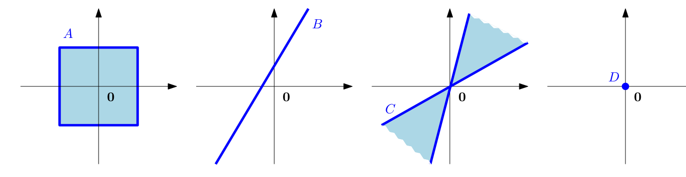

## 2.4 向量空间

到目前为止，我们已经探讨了线性方程组及其求解方法（第 2.3 节）。我们看到线性方程组可以使用矩阵-向量记号进行紧凑的表示 (2.10)。在下文中，我们将更深入地探讨 _向量空间（vector spaces）_ ，即向量所处的一种结构化空间。

在本章开头，我们非正式地将向量描述为可以相加并且可以与标量相乘的对象，而且运算后它们仍然保持为相同类型的对象。现在，我们准备将这一概念形式化。我们首先介绍 _群（group）_ 的概念，群是一个包含若干元素的集合以及定义在这些元素上的运算，该运算保留了集合的某种结构。

### 2.4.1 群

群在计算机科学中扮演着重要角色。除了为集合上的运算提供基础框架之外，群还广泛应用于密码学、编码理论和计算机图形学中。

**定义 2.7**（群）。考虑一个集合 $ G $ 以及定义在 $ G $ 上的运算 $ \otimes: G \times G \to G $。如果满足以下条件，则 $ G := (G, \otimes) $ 称为一个 _群（group）_ ：
1. $ G $ 在 $ \otimes $ 下的 _闭包（closure）_ 性：$ \forall x, y \in G : x \otimes y \in G $
2. _结合律（associativity）_ ：$ \forall x, y, z \in G : (x \otimes y) \otimes z = x \otimes (y \otimes z) $
3. _单位元（neutral element）_ ：$ \exists e \in G \ \forall x \in G : x \otimes e = x $ 且 $ e \otimes x = x $
4. _逆元（inverse element）_ ：$ \forall x \in G \ \exists y \in G : x \otimes y = e $ 且 $ y \otimes x = e $。我们通常记 $ x^{-1} $ 为 $ x $ 的逆元。

_备注_ 。逆元是相对于运算 $ \otimes $ 定义的，并不必然意味着 $ \frac{1}{x} $。

如果还满足 $ \forall x, y \in G : x \otimes y = y \otimes x $，则 $ G = (G, \otimes) $ 称为一个 _阿贝尔群（Abelian group）_ （交换群）。

> **例 2.10（群）**
> 
> 让我们看一些集合及其关联运算的例子，检验它们是否构成群：
> - $ (\mathbb{Z}, +) $ 是一个群。
> - $ (\mathbb{N}_0, +) $ 不是群（其中 $ \mathbb{N}_0 := \mathbb{N} \cup \{0\} $）：尽管 $ (\mathbb{N}_0, +) $ 拥有单位元（$ 0 $），但缺少逆元。
> - $ (\mathbb{Z}, \cdot) $ 不是群：尽管 $ (\mathbb{Z}, \cdot) $ 包含单位元（$ 1 $），但对于任意 $ z \in \mathbb{Z}, z \neq \pm 1 $，都缺少逆元。
> - $ (\mathbb{R}, \cdot) $ 不是群，因为 $ 0 $ 没有逆元。
> - $ (\mathbb{R} \setminus \{0\}, \cdot) $ 是一个阿贝尔群。
> - 若加法按分量定义，即：
>   $$ (x_1, \ldots, x_n) + (y_1, \ldots, y_n) = (x_1 + y_1, \ldots, x_n + y_n) \tag{2.61} $$
>   则对于 $ n \in \mathbb{N} $，$ (\mathbb{R}^n, +) $ 和 $ (\mathbb{Z}^n, +) $ 均为阿贝尔群。此时，逆元为 $ (x_1, \ldots, x_n)^{-1} := (-x_1, \ldots, -x_n) $，单位元为 $ \boldsymbol e = (0, \ldots, 0) $。
> - $ (\mathbb{R}^{m \times n}, +) $（$ m \times n $ 矩阵的集合）是一个阿贝尔群（采用 (2.61) 定义的按元素加法）。
> 
> 让我们仔细考察 $ (\mathbb{R}^{n \times n}, \cdot) $，即采用 (2.13) 所定义的矩阵乘法的 $ n \times n $ 矩阵集合：
> - 封闭性和结合律直接由矩阵乘法的定义得出。
> - 单位元：单位矩阵 $ \boldsymbol I_n $ 是 $ (\mathbb{R}^{n \times n}, \cdot) $ 中关于矩阵乘法“$ \cdot $”的单位元。
> - 逆元：如果逆矩阵存在（即 $ \boldsymbol A $ 为正则/可逆矩阵），则 $ \boldsymbol A^{-1} $ 为 $ \boldsymbol A \in \mathbb{R}^{n \times n} $ 的逆元；且恰好在这种情况下，$ (\mathbb{R}^{n \times n}, \cdot) $ 构成一个群，称为一般线性群。

**定义 2.8**（一般线性群）。所有正则（可逆）矩阵 $ \boldsymbol A \in \mathbb{R}^{n \times n} $ 的集合关于 (2.13) 中定义的矩阵乘法构成一个群，称为 _一般线性群（general linear group）_ $ GL(n, \mathbb{R}) $。然而，由于矩阵乘法不满足交换律，该群不是阿贝尔群。

### 2.4.2 向量空间

在讨论群时，我们关注了集合 $ G $ 以及 $ G $ 上的内部运算（inner operations），即仅对 $ G $ 中元素进行操作的映射 $ G \times G \to G $。在下文中，我们将考虑这样一种集合：除了包含内部运算 $ + $ 之外，还包含一种外部运算（outer operation）$ \cdot $，即向量 $ \boldsymbol x \in G $ 与标量 $ \lambda \in \mathbb{R} $ 的乘法。我们可以将内部运算理解为加法的一种形式，而将外部运算理解为缩放（scaling）的一种形式。需要注意的是，这里的内部/外部运算与内积/外积没有任何关系。

**定义 2.9**（向量空间）。一个实数向量空间 $ V = (V, +, \cdot) $ 是一个配备了两种运算的集合 $ V $：
$$ + : V \times V \to V \tag{2.62} $$
$$ \cdot : \mathbb{R} \times V \to V \tag{2.63} $$
满足：
1. $ (V, +) $ 是一个阿贝尔群；
2. 分配律：
   1. $ \forall \lambda \in \mathbb{R}, \boldsymbol x, \boldsymbol y \in V : \lambda \cdot (\boldsymbol x + \boldsymbol y) = \lambda \cdot \boldsymbol x + \lambda \cdot \boldsymbol y $
   2. $ \forall \lambda, \psi \in \mathbb{R}, \boldsymbol x \in V : (\lambda + \psi) \cdot \boldsymbol x = \lambda \cdot \boldsymbol x + \psi \cdot \boldsymbol x $
3. 结合律（外部运算）：$ \forall \lambda, \psi \in \mathbb{R}, \boldsymbol x \in V : \lambda \cdot (\psi \cdot \boldsymbol x) = (\lambda \psi) \cdot \boldsymbol x $
4. 外部运算的单位元：$ \forall \boldsymbol x \in V : 1 \cdot \boldsymbol x = \boldsymbol x $

集合中的元素 $ \boldsymbol x \in V $ 称为 _向量（vectors）_ 。$ (V, +) $ 的单位元称为 _零向量（zero vector）_ $ \boldsymbol 0 = [0, \ldots, 0]^\top $，内部运算 $ + $ 称为 _向量加法（vector addition）_ 。元素 $ \lambda \in \mathbb{R} $ 称为 _标量（scalars）_ ，外部运算 $ \cdot $ 称为 _标量乘法（multiplication by scalars）_ 。请注意，标量积（内积）是不同的概念，我们将在第 3.2 节中讨论它。

_备注_ 。两个向量之间的“向量乘法” $ \boldsymbol a \boldsymbol b $（$ \boldsymbol a, \boldsymbol b \in \mathbb{R}^n $）是没有定义的。理论上，我们可以定义一种按元素的逐项乘法，例如 $ \boldsymbol c = \boldsymbol a \boldsymbol b $ 且 $ c_j = a_j b_j $。这种“数组乘法（array multiplication）”在许多编程语言中很常见，但在使用矩阵乘法的标准规则时数学意义有限：如果我们将向量视为 $ n \times 1 $ 矩阵（我们通常这样做），我们就可以使用 (2.13) 中定义的矩阵乘法。然而此时两个向量的维度并不匹配。对于向量，只有以下两种乘法是有定义的：$ \boldsymbol a \boldsymbol b^\top \in \mathbb{R}^{n \times n} $（ _外积（outer product）_ ）以及 $ \boldsymbol a^\top \boldsymbol b \in \mathbb{R} $（ _内积/标量积/点积（inner/scalar/dot product）_ ）。

> **例 2.11（向量空间）**
> 
> 让我们看一些重要的例子：
> - $ V = \mathbb{R}^n, n \in \mathbb{N} $ 是一个向量空间，其运算定义如下：
>   - 加法：对所有 $ \boldsymbol x, \boldsymbol y \in \mathbb{R}^n $，$ \boldsymbol x + \boldsymbol y = (x_1, \ldots, x_n) + (y_1, \ldots, y_n) = (x_1 + y_1, \ldots, x_n + y_n) $
>   - 标量乘法：对所有 $ \lambda \in \mathbb{R}, \boldsymbol x \in \mathbb{R}^n $，$ \lambda \boldsymbol x = \lambda (x_1, \ldots, x_n) = (\lambda x_1, \ldots, \lambda x_n) $
> - $ V = \mathbb{R}^{m \times n}, m, n \in \mathbb{N} $ 是一个向量空间：
>   - 加法：对所有 $ \boldsymbol A, \boldsymbol B \in V $，
>     $$ \boldsymbol A + \boldsymbol B = \begin{bmatrix} a_{11} + b_{11} & \cdots & a_{1n} + b_{1n} \\ \vdots & & \vdots \\ a_{m1} + b_{m1} & \cdots & a_{mn} + b_{mn} \end{bmatrix} $$
>     按元素逐项定义。
>   - 标量乘法：
>     $$ \lambda \boldsymbol A = \begin{bmatrix} \lambda a_{11} & \cdots & \lambda a_{1n} \\ \vdots & & \vdots \\ \lambda a_{m1} & \cdots & \lambda a_{mn} \end{bmatrix} $$
>     如第 2.2 节中所定义。请记住，矩阵空间 $ \mathbb{R}^{m \times n} $ 等价于 $ \mathbb{R}^{mn} $。
> - $ V = \mathbb{C} $，采用复数加法的标准定义。

_备注_ 。在下文中，当 $ + $ 和 $ \cdot $ 是标准的向量加法和标量乘法时，我们将向量空间 $ (V, +, \cdot) $ 简记为 $ V $。此外，为简化记号，我们将使用 $ \boldsymbol x \in V $ 来表示 $ V $ 中的向量。

_备注_ 。向量空间 $ \mathbb{R}^n $、$ \mathbb{R}^{n \times 1} $、$ \mathbb{R}^{1 \times n} $ 仅在我们书写向量的方式上有所不同。在下文中，我们不对 $ \mathbb{R}^n $ 和 $ \mathbb{R}^{n \times 1} $ 做区分，这允许我们将 $ n $ 元组写为 _列向量（column vector）_ ：
$$ \boldsymbol x = \begin{bmatrix} x_1 \\ \vdots \\ x_n \end{bmatrix} \tag{2.64} $$
这简化了涉及向量空间运算的记号。然而，为了避免与矩阵乘法混淆，我们确实区分了 $ \mathbb{R}^{n \times 1} $ 和 $ \mathbb{R}^{1 \times n} $（ _行向量（row vector）_ ）。默认情况下，我们用 $ \boldsymbol x $ 表示列向量，而行向量表示为 $ \boldsymbol x^\top $（即 $ \boldsymbol x $ 的 _转置（transpose）_ ）。

### 2.4.3 向量子空间

在下文中，我们将介绍向量子空间。直观地说，它们是包含在原始向量空间中的子集，具有这样一种性质：当我们对该子空间内的元素执行向量空间运算时，结果永远不会离开这个子空间。在这个意义上，它们是“封闭的”。向量子空间是机器学习中的一个核心概念。例如，第 10 章将演示如何利用向量子空间进行数据降维。

**定义 2.10**（向量子空间）。设 $ V = (V, +, \cdot) $ 为一个向量空间，且 $ U \subseteq V, U \neq \emptyset $。如果 $ U $ 在限制于 $ U \times U $ 和 $ \mathbb{R} \times U $ 的向量空间运算 $ + $ 与 $ \cdot $ 下本身也是一个向量空间，则称 $ U = (U, +, \cdot) $ 为 $ V $ 的 _向量子空间（vector subspace）_ （或 _线性子空间（linear subspace）_ ）。我们记作 $ U \subseteq V $ 来表示 $ U $ 是 $ V $ 的子空间。

如果 $ U \subseteq V $ 且 $ V $ 是一个向量空间，那么 $ U $ 自然会直接继承 $ V $ 的许多性质，因为这些性质对所有 $ \boldsymbol x \in V $ 都成立，特别是对所有 $ \boldsymbol x \in U \subseteq V $ 都成立。这包括阿贝尔群性质、分配律、结合律和单位元的存在性。为了判定 $ (U, +, \cdot) $ 是否为 $ V $ 的子空间，我们仅需要证明以下条件：
1. $ U \neq \emptyset $，特别地：$ \boldsymbol 0 \in U $；
2. $ U $ 的闭包性（封闭性）：
   1. 关于外部运算：$ \forall \lambda \in \mathbb{R} \ \forall \boldsymbol x \in U : \lambda \boldsymbol x \in U $；
   2. 关于内部运算：$ \forall \boldsymbol x, \boldsymbol y \in U : \boldsymbol x + \boldsymbol y \in U $。

> **例 2.12（向量子空间）**
> 
> 让我们看一些示例：
> - 对于任意向量空间 $ V $，平凡子空间是 $ V $ 本身以及零子空间 $ \{\boldsymbol 0\} $。
> - 在图 2.6 中，只有示例 D 是 $ \mathbb{R}^2 $ 的子空间（配备通常的内部/外部运算）。在 A 和 C 中，违背了封闭性；B 不包含零向量 $ \boldsymbol 0 $。
> - 具有 $ n $ 个未知数 $ \boldsymbol x = [x_1, \ldots, x_n]^\top $ 的齐次线性方程组 $ \boldsymbol {Ax} = \boldsymbol 0 $ 的解集是 $ \mathbb{R}^n $ 的子空间。
> - 非齐次线性方程组 $ \boldsymbol {Ax} = \boldsymbol b, \boldsymbol b \neq \boldsymbol 0 $ 的解不是 $ \mathbb{R}^n $ 的子空间。
> - 任意多个子空间的交集本身仍然是一个子空间。

   
  <b>图 2.6 并非 R² 的所有子集都是子空间。在 A 和 C 中，违背了封闭性；B 不包含 0。只有 D 是子空间。</b> 

_备注_ 。每个子空间 $ U \subseteq (\mathbb{R}^n, +, \cdot) $ 都是某个关于 $ \boldsymbol x \in \mathbb{R}^n $ 的齐次线性方程组 $ \boldsymbol {Ax} = \boldsymbol 0 $ 的解空间。
