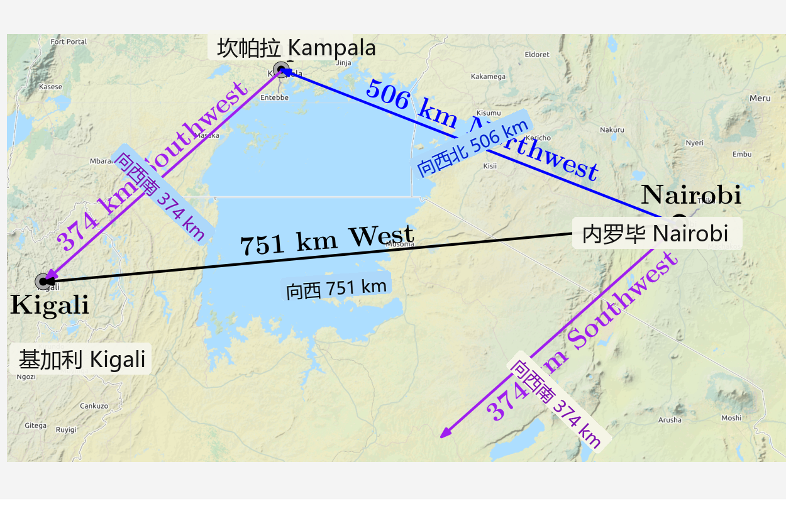

## 2.5 线性无关

在下文中，我们将仔细考察可以对向量（向量空间中的元素）进行哪些操作。具体而言，我们可以将向量相加，也可以将它们乘以标量。封闭性保证了运算的结果仍然是同一向量空间中的另一个向量。我们有可能找到一组向量，使得通过对它们进行加法和缩放运算，能够表示该向量空间中的任意向量。这组向量构成了一组 _基（basis）_ ，我们将在第 2.6.1 节中对此进行详细讨论。在此之前，我们需要首先引入 _线性组合（linear combinations）_ 与 _线性无关（linear independence）_ 的概念。

**定义 2.11**（线性组合）。考虑一个向量空间 $ V $ 以及有限个向量 $ \boldsymbol x_1, \ldots, \boldsymbol x_k \in V $。那么，形式如下的任意向量 $ \boldsymbol v \in V $：
$$ \boldsymbol v = \lambda_1 \boldsymbol x_1 + \cdots + \lambda_k \boldsymbol x_k = \sum_{i=1}^k \lambda_i \boldsymbol x_i \in V \tag{2.65} $$
其中 $ \lambda_1, \ldots, \lambda_k \in \mathbb{R} $，称为向量 $ \boldsymbol x_1, \ldots, \boldsymbol x_k $ 的 _线性组合（linear combination）_ 。

零向量 $ \boldsymbol 0 $ 总是可以表示为 $ k $ 个向量 $ \boldsymbol x_1, \ldots, \boldsymbol x_k $ 的线性组合，因为 $ \boldsymbol 0 = \sum_{i=1}^k 0 \boldsymbol x_i $ 始终成立。在下文中，我们感兴趣的是使用一组向量表示 $ \boldsymbol 0 $ 的 _非平凡线性组合（non-trivial linear combinations）_ ，即系数 $ \lambda_i $ 在 (2.65) 中不全为 0 的线性组合。

**定义 2.12**（线性相关与线性无关）。考虑一个向量空间 $ V $，其中 $ k \in \mathbb{N} $ 且 $ \boldsymbol x_1, \ldots, \boldsymbol x_k \in V $。如果存在非平凡线性组合使得：
$$ \boldsymbol 0 = \sum_{i=1}^k \lambda_i \boldsymbol x_i $$
其中至少有一个 $ \lambda_i \neq 0 $，则称向量 $ \boldsymbol x_1, \ldots, \boldsymbol x_k $ 是 _线性相关（linearly dependent）_ 的。如果只存在平凡解，即：
$$ \lambda_1 = \ldots = \lambda_k = 0 $$
则称向量 $ \boldsymbol x_1, \ldots, \boldsymbol x_k $ 是 _线性无关（linearly independent）_ 的。

线性无关是线性代数中最重要的概念之一。直观地说，一组线性无关的向量所包含的信息没有任何冗余；也就是说，如果我们从这组向量中移除任何一个向量，都会丢失一部分表达能力。在接下来的小节中，我们将进一步形式化这种直觉。

> **例 2.13（线性相关向量）**
> 
> 一个地理位置的例子有助于澄清线性无关的概念。在肯尼亚内罗毕（Nairobi），如果有人向你描述卢旺达基加利（Kigali）的位置，他可能会说：“你可以先向西北走 506 公里到达乌干达坎帕拉（Kampala），然后再向西南走 374 公里即可到达基加利。”这些信息足以描述基加利的位置，因为地理坐标系可以视为一个二维向量空间（忽略海拔高度和地球曲率）。
> 
> 这个人可能还会补充一句：“它就在这里正西方向约 751 公里处。”尽管后一句话是真实的，但在已知前述信息的情况下，它对于找到基加利并不是必需的（见图 2.7 说明）。
> 
> 在这个例子中，“向西北 506 公里”向量（蓝色）与“向西南 374 公里”向量（紫色）是线性无关的。这意味着西南向量无法由西北向量来表示，反之亦然。然而，第三个“向西 751 公里”向量（黑色）是前两个向量的线性组合，这使得这组向量构成了线性相关集。类似地，利用“向西 751 公里”和“向西南 374 公里”也可以线性组合得到“向西北 506 公里”。

   
  <b>图 2.7 二维空间（平面）中线性相关向量的地理示例（粗略近似主要方位基向）。</b> 

_备注_。以下性质对于判断向量是否线性无关非常有用：
- $ k $ 个向量要么线性相关，要么线性无关，不存在第三种情况。
- 如果向量 $ \boldsymbol x_1, \ldots, \boldsymbol x_k $ 中至少有一个是零向量 $ \boldsymbol 0 $，则它们线性相关。如果两个向量完全相同，结论同样成立。
- 向量集合 $ \{\boldsymbol x_1, \ldots, \boldsymbol x_k : \boldsymbol x_i \neq \boldsymbol 0, i = 1, \ldots, k\} $（$ k \geqslant 2 $）线性相关的充要条件是：其中（至少）有一个向量可以表示为其余向量的线性组合。特别地，如果一个向量是另一个向量的倍数（即 $ \boldsymbol x_i = \lambda \boldsymbol x_j, \lambda \in \mathbb{R} $），则该集合是线性相关的。

检验向量 $ \boldsymbol x_1, \ldots, \boldsymbol x_k \in V $ 是否线性无关的一种实用方法是使用高斯消元法：将所有向量作为矩阵 $ \boldsymbol A $ 的列，执行高斯消元直到该矩阵化为行阶梯形（此处不需要化为简化行阶梯形）：
- 主元列（pivot columns）表示与位于其左侧的向量线性无关的向量。请注意，在构建矩阵时向量之间存在先后顺序。
- 非主元列可以表示为位于其左侧的主元列的线性组合。例如，行阶梯形：
  $$ \begin{bmatrix} 1 & 3 & 0 \\ 0 & 0 & 2 \end{bmatrix} \tag{2.66} $$
  告诉我们第一列和第三列是主元列。第二列是非主元列，因为它是第一列的 3 倍。
- 所有列向量线性无关的充要条件是：所有列均为主元列。如果至少存在一个非主元列，则这些列（以及对应的向量）线性相关。

> **例 2.14**
> 
> 考虑 $ \mathbb{R}^4 $ 中的三个向量：
> $$ \boldsymbol x_1 = \begin{bmatrix} 1 \\ 2 \\ -3 \\ 4 \end{bmatrix}, \quad \boldsymbol x_2 = \begin{bmatrix} 1 \\ 1 \\ 0 \\ 2 \end{bmatrix}, \quad \boldsymbol x_3 = \begin{bmatrix} -1 \\ -2 \\ 1 \\ 1 \end{bmatrix} \tag{2.67} $$
> 为了检验它们是否线性相关，我们按照通用方法求解关于 $ \lambda_1, \lambda_2, \lambda_3 $ 的齐次方程：
> $$ \lambda_1 \boldsymbol x_1 + \lambda_2 \boldsymbol x_2 + \lambda_3 \boldsymbol x_3 = \lambda_1 \begin{bmatrix} 1 \\ 2 \\ -3 \\ 4 \end{bmatrix} + \lambda_2 \begin{bmatrix} 1 \\ 1 \\ 0 \\ 2 \end{bmatrix} + \lambda_3 \begin{bmatrix} -1 \\ -2 \\ 1 \\ 1 \end{bmatrix} = \boldsymbol 0 \tag{2.68} $$
> 我们将向量 $ \boldsymbol x_i $（$ i = 1, 2, 3 $）按列拼成一个矩阵，并应用初等行变换，直到确定出主元列：
> $$ \begin{bmatrix} 1 & 1 & -1 \\ 2 & 1 & -2 \\ -3 & 0 & 1 \\ 4 & 2 & 1 \end{bmatrix} \leadsto \cdots \leadsto \begin{bmatrix} 1 & 1 & -1 \\ 0 & 1 & 0 \\ 0 & 0 & 1 \\ 0 & 0 & 0 \end{bmatrix} \tag{2.69} $$
> 这里矩阵的每一列都是主元列。因此不存在非平凡解，解该方程组必须满足 $ \lambda_1 = 0, \lambda_2 = 0, \lambda_3 = 0 $。由此可知，向量 $ \boldsymbol x_1, \boldsymbol x_2, \boldsymbol x_3 $ 是线性无关的。

_备注_。考虑一个具有 $ k $ 个线性无关向量 $ \boldsymbol b_1, \ldots, \boldsymbol b_k $ 的向量空间 $ V $，以及 $ m $ 个线性组合：
$$ \begin{aligned}
  \boldsymbol x_1 &= \sum_{i=1}^k \lambda_{i1} \boldsymbol b_i \\
  &\ \ \vdots \\
  \boldsymbol x_m &= \sum_{i=1}^k \lambda_{im} \boldsymbol b_i
\end{aligned} \tag{2.70} $$
将以这些线性无关向量 $ \boldsymbol b_1, \ldots, \boldsymbol b_k $ 为列的矩阵定义为 $ \boldsymbol B = [\boldsymbol b_1, \ldots, \boldsymbol b_k] $，我们可以将上述线性组合更紧凑地写为：
$$ \boldsymbol x_j = \boldsymbol B \boldsymbol \lambda_j, \quad \boldsymbol \lambda_j = \begin{bmatrix} \lambda_{1j} \\ \vdots \\ \lambda_{kj} \end{bmatrix}, \quad j = 1, \ldots, m \tag{2.71} $$
我们想要检验 $ \boldsymbol x_1, \ldots, \boldsymbol x_m $ 是否线性无关。为此，我们按照通用方法检验何时 $ \sum_{j=1}^m \psi_j \boldsymbol x_j = \boldsymbol 0 $。结合 (2.71)，我们得到：
$$ \sum_{j=1}^m \psi_j \boldsymbol x_j = \sum_{j=1}^m \psi_j \boldsymbol B \boldsymbol \lambda_j = \boldsymbol B \sum_{j=1}^m \psi_j \boldsymbol \lambda_j \tag{2.72} $$
这意味着，向量集合 $ \{\boldsymbol x_1, \ldots, \boldsymbol x_m\} $ 线性无关的充要条件是：列向量集合 $ \{\boldsymbol \lambda_1, \ldots, \boldsymbol \lambda_m\} $ 线性无关。

_备注_。在向量空间 $ V $ 中，$ k $ 个向量 $ \boldsymbol x_1, \ldots, \boldsymbol x_k $ 的 $ m $ 个线性组合在 $ m > k $ 时必定线性相关。

> **例 2.15**
> 
> 考虑一组线性无关的向量 $ \boldsymbol b_1, \boldsymbol b_2, \boldsymbol b_3, \boldsymbol b_4 \in \mathbb{R}^n $，以及：
> $$ \begin{aligned}
>   \boldsymbol x_1 &= \boldsymbol b_1 - 2\boldsymbol b_2 + \boldsymbol b_3 - \boldsymbol b_4 \\
>   \boldsymbol x_2 &= -4\boldsymbol b_1 - 2\boldsymbol b_2 + 4\boldsymbol b_4 \\
>   \boldsymbol x_3 &= 2\boldsymbol b_1 + 3\boldsymbol b_2 - \boldsymbol b_3 - 3\boldsymbol b_4 \\
>   \boldsymbol x_4 &= 17\boldsymbol b_1 - 10\boldsymbol b_2 + 11\boldsymbol b_3 + \boldsymbol b_4
> \end{aligned} \tag{2.73} $$
> 向量 $ \boldsymbol x_1, \ldots, \boldsymbol x_4 \in \mathbb{R}^n $ 是否线性无关？
> 
> 为了回答这个问题，我们研究列向量集合：
> $$ \left\{ \begin{bmatrix} 1 \\ -2 \\ 1 \\ -1 \end{bmatrix}, \begin{bmatrix} -4 \\ -2 \\ 0 \\ 4 \end{bmatrix}, \begin{bmatrix} 2 \\ 3 \\ -1 \\ -3 \end{bmatrix}, \begin{bmatrix} 17 \\ -10 \\ 11 \\ 1 \end{bmatrix} \right\} \tag{2.74} $$
> 是否线性无关。对应线性方程组的系数矩阵为：
> $$ \boldsymbol A = \begin{bmatrix} 1 & -4 & 2 & 17 \\ -2 & -2 & 3 & -10 \\ 1 & 0 & -1 & 11 \\ -1 & 4 & -3 & 1 \end{bmatrix} \tag{2.75} $$
> 将其化为简化行阶梯形矩阵，结果为：
> $$ \begin{bmatrix} 1 & 0 & 0 & -7 \\ 0 & 1 & 0 & -15 \\ 0 & 0 & 1 & -18 \\ 0 & 0 & 0 & 0 \end{bmatrix} \tag{2.76} $$
> 我们看到对应的线性方程组具有非平凡解：最后一列不是主元列，并且 $ \boldsymbol x_4 = -7\boldsymbol x_1 - 15\boldsymbol x_2 - 18\boldsymbol x_3 $。因此，$ \boldsymbol x_1, \ldots, \boldsymbol x_4 $ 是线性相关的，因为 $ \boldsymbol x_4 $ 可以表示为 $ \boldsymbol x_1, \ldots, \boldsymbol x_3 $ 的线性组合。
