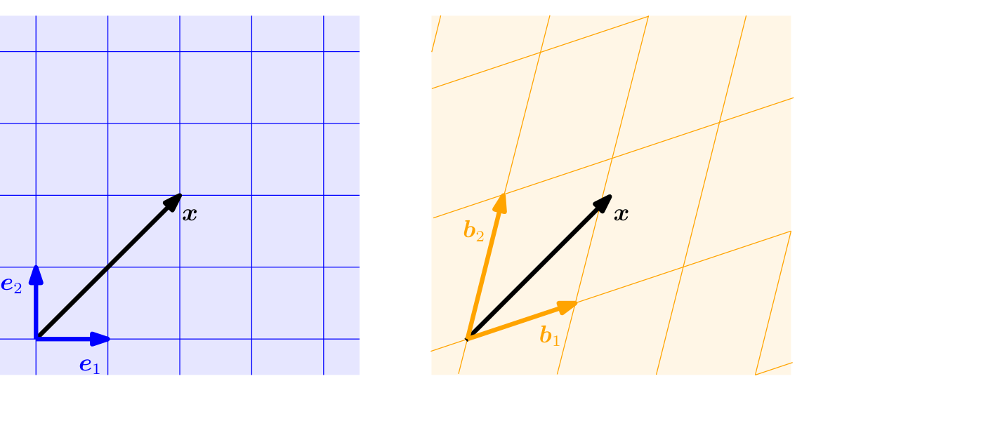
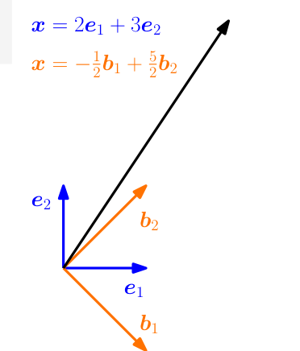
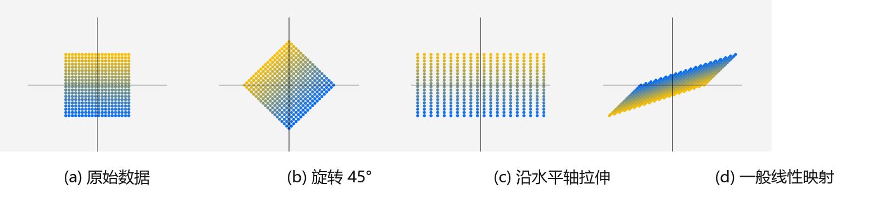
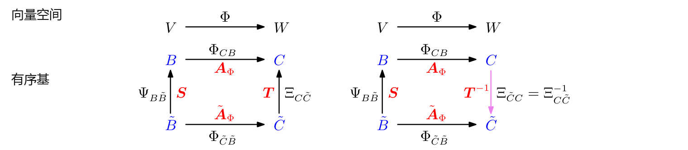
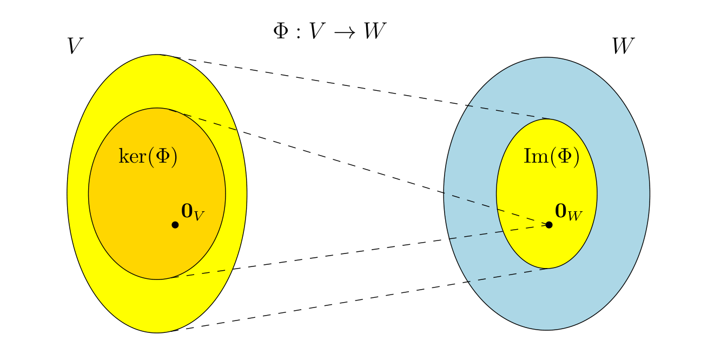

## 2.7 线性映射

在下文中，我们将研究向量空间上保持其结构的映射，这将使我们能够定义坐标的概念。在本章开头，我们说过向量是可以相加并且可以与标量相乘的对象，并且运算的结果仍然是一个向量。我们希望在应用映射时保持这一性质：

考虑两个实数向量空间 $ V, W $。如果一个映射 $ \Phi : V \to W $ 满足：
$$ \Phi(\boldsymbol x + \boldsymbol y) = \Phi(\boldsymbol x) + \Phi(\boldsymbol y) \tag{2.85} $$
$$ \Phi(\lambda \boldsymbol x) = \lambda \Phi(\boldsymbol x) \tag{2.86} $$
对所有 $ \boldsymbol x, \boldsymbol y \in V $ 以及 $ \lambda \in \mathbb{R} $ 均成立，则称其保持了向量空间的结构。我们可以将其总结在以下定义中：

**定义 2.15**（线性映射）。对于向量空间 $ V, W $，一个映射 $ \Phi : V \to W $ 如果满足：
$$ \forall \boldsymbol x, \boldsymbol y \in V \ \forall \lambda, \psi \in \mathbb{R} : \Phi(\lambda \boldsymbol x + \psi \boldsymbol y) = \lambda \Phi(\boldsymbol x) + \psi \Phi(\boldsymbol y) \tag{2.87} $$
则称为 _线性映射（linear mapping）_ （或 _向量空间同态（vector space homomorphism）_ 、 _线性变换（linear transformation）_ ）。

事实证明，我们可以将线性映射表示为矩阵（第 2.7.1 节）。回顾前面，我们也可以将一组向量收集为矩阵的列。在处理矩阵时，我们必须牢记该矩阵所代表的含义：它是一个线性映射，还是一组向量的集合。在第 4 章中，我们将看到更多关于线性映射的内容。在继续之前，我们简要介绍一些特殊的映射类型。

**定义 2.16**（单射、满射、双射）。考虑映射 $ \Phi : V \to W $，其中 $ V, W $ 可以是任意集合。那么，如果满足：
- _单射（injective）_ ：$ \forall \boldsymbol x, \boldsymbol y \in V : \Phi(\boldsymbol x) = \Phi(\boldsymbol y) \implies \boldsymbol x = \boldsymbol y $。
- _满射（surjective）_ ：$ \Phi(V) = W $。
- _双射（bijective）_ ：$ \Phi $ 既是单射又是满射。

如果 $ \Phi $ 是满射，那么 $ W $ 中的每一个元素都可以通过 $ \Phi $ 从 $ V $ 中“到达”。双射映射是可以“撤销”的，即存在一个映射 $ \Psi : W \to V $ 满足 $ \Psi \circ \Phi(\boldsymbol x) = \boldsymbol x $。这个映射 $ \Psi $ 称为 $ \Phi $ 的 _逆映射（inverse）_ ，通常记作 $ \Phi^{-1} $。

基于这些定义，我们引入向量空间 $ V $ 与 $ W $ 之间线性映射的以下特殊情形：
- _同构（isomorphism）_ ：$ \Phi : V \to W $ 是线性的且是双射。
- _自同态（endomorphism）_ ：$ \Phi : V \to V $ 是线性的。
- _自同构（automorphism）_ ：$ \Phi : V \to V $ 是线性的且是双射。
- 我们将 $ \operatorname{id}_V : V \to V, \boldsymbol x \mapsto \boldsymbol x $ 定义为 $ V $ 中的 _恒等映射（identity mapping）_ 或 _恒等自同构（identity automorphism）_ 。

> **例 2.19（同态）**
> 
> 映射 $ \Phi : \mathbb{R}^2 \to \mathbb{C}, \Phi(\boldsymbol x) = x_1 + i x_2 $ 是一个同态：
> $$ \Phi\left( \begin{bmatrix} x_1 \\ x_2 \end{bmatrix} + \begin{bmatrix} y_1 \\ y_2 \end{bmatrix} \right) = (x_1 + y_1) + i(x_2 + y_2) = x_1 + i x_2 + y_1 + i y_2 = \Phi\left( \begin{bmatrix} x_1 \\ x_2 \end{bmatrix} \right) + \Phi\left( \begin{bmatrix} y_1 \\ y_2 \end{bmatrix} \right) $$
> $$ \Phi\left( \lambda \begin{bmatrix} x_1 \\ x_2 \end{bmatrix} \right) = \lambda x_1 + \lambda i x_2 = \lambda (x_1 + i x_2) = \lambda \Phi\left( \begin{bmatrix} x_1 \\ x_2 \end{bmatrix} \right) \tag{2.88} $$
> 这也解释了为什么复数可以表示为 $ \mathbb{R}^2 $ 中的二元元组：存在一个双射线性映射，将 $ \mathbb{R}^2 $ 中元组的按元素加法转化为带有相应加法运算的复数集合。注意这里我们仅展示了线性性质，未证明双射性。

**定理 2.17**（有限维空间同构定理，引自 Axler (2015) 定理 3.59）。有限维向量空间 $ V $ 与 $ W $ 同构当且仅当 $ \operatorname{dim}(V) = \operatorname{dim}(W) $。

定理 2.17 表明，在相同维度的两个向量空间之间存在线性双射映射。直观地说，这意味着相同维度的向量空间本质上是“同一类事物”，因为它们可以在不产生任何信息损失的情况下相互转换。

定理 2.17 也为我们将 $ \mathbb{R}^{m \times n} $（$ m \times n $ 矩阵的向量空间）与 $ \mathbb{R}^{mn} $（长度为 $ mn $ 的向量空间）视为等同提供了理论依据：它们的维度都是 $ mn $，并且存在将二者相互转换的线性双射映射。

_备注_。考虑向量空间 $ V, W, X $，则：
- 对于线性映射 $ \Phi : V \to W $ 与 $ \Psi : W \to X $，复合映射 $ \Psi \circ \Phi : V \to X $ 也是线性的。
- 如果 $ \Phi : V \to W $ 是一个同构，则 $ \Phi^{-1} : W \to V $ 也是一个同构。
- 如果 $ \Phi : V \to W $ 与 $ \Psi : V \to W $ 是线性的，则 $ \Phi + \Psi $ 以及 $ \lambda \Phi $（$ \lambda \in \mathbb{R} $）也是线性的。

---

### 2.7.1 线性映射的矩阵表示

任何 $ n $ 维向量空间都同构于 $ \mathbb{R}^n $（定理 2.17）。我们考虑 $ n $ 维向量空间 $ V $ 的一组基 $ \{\boldsymbol b_1, \ldots, \boldsymbol b_n\} $。在下文中，基向量的顺序将十分重要。因此，我们记：
$$ B = (\boldsymbol b_1, \ldots, \boldsymbol b_n) \tag{2.89} $$
并称这个 $ n $ 元组为 $ V $ 的一组 _有序基（ordered basis）_ 。

_备注_ （记号区分）。我们在记号上做如下明确约定：$ B = (\boldsymbol b_1, \ldots, \boldsymbol b_n) $ 表示有序基，$ B = \{\boldsymbol b_1, \ldots, \boldsymbol b_n\} $ 表示（无序的）基集合，而 $ \boldsymbol B = [\boldsymbol b_1, \ldots, \boldsymbol b_n] $ 表示以向量 $ \boldsymbol b_1, \ldots, \boldsymbol b_n $ 为列构成的矩阵。

**定义 2.18**（坐标）。考虑一个向量空间 $ V $ 以及 $ V $ 的一组有序基 $ B = (\boldsymbol b_1, \ldots, \boldsymbol b_n) $。对于任意 $ \boldsymbol x \in V $，我们都可以得到 $ \boldsymbol x $ 关于 $ B $ 的唯一表示（线性组合）：
$$ \boldsymbol x = \alpha_1 \boldsymbol b_1 + \cdots + \alpha_n \boldsymbol b_n \tag{2.90} $$
此时 $ \alpha_1, \ldots, \alpha_n $ 称为 $ \boldsymbol x $ 关于 $ B $ 的 _坐标（coordinates）_ ，向量：
$$ \boldsymbol \alpha = \begin{bmatrix} \alpha_1 \\ \vdots \\ \alpha_n \end{bmatrix} \in \mathbb{R}^n \tag{2.91} $$
称为 $ \boldsymbol x $ 关于有序基 $ B $ 的 _坐标向量（coordinate vector）_ 或 _坐标表示（coordinate representation）_ 。

一组基实际上定义了一个坐标系。我们所熟知的二维笛卡尔坐标系就是由标准基向量 $ \boldsymbol e_1, \boldsymbol e_2 $ 张成的。在这个坐标系中，向量 $ \boldsymbol x \in \mathbb{R}^2 $ 的表示告诉我们如何线性组合 $ \boldsymbol e_1 $ 和 $ \boldsymbol e_2 $ 来获得 $ \boldsymbol x $。然而，$ \mathbb{R}^2 $ 的任意一组基都定义了一个合法的坐标系，先前同一个向量 $ \boldsymbol x $ 在基 $ (\boldsymbol b_1, \boldsymbol b_2) $ 下可能具有不同的坐标表示。在图 2.8 中，向量 $ \boldsymbol x $ 关于标准基 $ (\boldsymbol e_1, \boldsymbol e_2) $ 的坐标是 $ [2, 2]^\top $；然而，关于基 $ (\boldsymbol b_1, \boldsymbol b_2) $，同一个向量 $ \boldsymbol x $ 的表示为 $ [1.09, 0.72]^\top $，即 $ \boldsymbol x = 1.09 \boldsymbol b_1 + 0.72 \boldsymbol b_2 $。在接下来的小节中，我们将探究如何求得这种表示。

   
  <b>图 2.8 根据基的不同选择，向量 x 的两种不同坐标表示。</b> 

> **例 2.20**
> 
> 让我们考察一个几何向量 $ \boldsymbol x \in \mathbb{R}^2 $，它关于 $ \mathbb{R}^2 $ 的标准基 $ (\boldsymbol e_1, \boldsymbol e_2) $ 的坐标为 $ [2, 3]^\top $。这意味着我们可以写作 $ \boldsymbol x = 2\boldsymbol e_1 + 3\boldsymbol e_2 $。然而，我们并不一定要选择标准基来表示这个向量。如果我们使用基向量 $ \boldsymbol b_1 = [1, -1]^\top, \boldsymbol b_2 = [1, 1]^\top $，我们将得到坐标 $ \frac{1}{2}[-1, 5]^\top $ 来表示基 $ (\boldsymbol b_1, \boldsymbol b_2) $ 下的同一个向量（见图 2.9）。

   
  <b>图 2.9 向量 x 随基的选择而产生的不同坐标表示。</b> 

_备注_。对于 $ n $ 维向量空间 $ V $ 以及 $ V $ 的一组有序基 $ B $，映射 $ \Phi : \mathbb{R}^n \to V, \Phi(\boldsymbol e_i) = \boldsymbol b_i, i = 1, \ldots, n $ 是线性的（且根据定理 2.17 是一个同构），其中 $ (\boldsymbol e_1, \ldots, \boldsymbol e_n) $ 是 $ \mathbb{R}^n $ 的标准基。

现在，我们准备在有限维向量空间之间的矩阵和线性映射之间建立明确的联系。

**定义 2.19**（变换矩阵）。考虑向量空间 $ V, W $ 以及相应的有序基 $ B = (\boldsymbol b_1, \ldots, \boldsymbol b_n) $ 和 $ C = (\boldsymbol c_1, \ldots, \boldsymbol c_m) $。此外，考虑线性映射 $ \Phi : V \to W $。对于 $ j \in \{1, \ldots, n\} $：
$$ \Phi(\boldsymbol b_j) = \alpha_{1j}\boldsymbol c_1 + \cdots + \alpha_{mj}\boldsymbol c_m = \sum_{i=1}^m \alpha_{ij}\boldsymbol c_i \tag{2.92} $$
是 $ \Phi(\boldsymbol b_j) $ 关于 $ C $ 的唯一表示。此时，我们称元素由下式给出的 $ m \times n $ 矩阵 $ \boldsymbol A_\Phi $：
$$ \boldsymbol A_\Phi(i, j) = \alpha_{ij} \tag{2.93} $$
为 $ \Phi $（关于 $ V $ 的有序基 $ B $ 和 $ W $ 的有序基 $ C $ 的） _变换矩阵（transformation matrix）_ 。

$ \Phi(\boldsymbol b_j) $ 关于 $ W $ 的有序基 $ C $ 的坐标正是 $ \boldsymbol A_\Phi $ 的第 $ j $ 列。考虑具有有序基 $ B, C $ 的有限维向量空间 $ V, W $ 以及具有变换矩阵 $ \boldsymbol A_\Phi $ 的线性映射 $ \Phi : V \to W $。若 $ \hat{\boldsymbol x} $ 是 $ \boldsymbol x \in V $ 关于 $ B $ 的坐标向量，且 $ \hat{\boldsymbol y} $ 是 $ \boldsymbol y = \Phi(\boldsymbol x) \in W $ 关于 $ C $ 的坐标向量，则：
$$ \hat{\boldsymbol y} = \boldsymbol A_\Phi \hat{\boldsymbol x} \tag{2.94} $$
这意味着变换矩阵可用于将关于 $ V $ 中有序基的坐标映射到关于 $ W $ 中有序基的坐标。

> **例 2.21（变换矩阵）**
> 
> 考虑同态 $ \Phi : V \to W $ 以及 $ V $ 的有序基 $ B = (\boldsymbol b_1, \ldots, \boldsymbol b_3) $ 和 $ W $ 的有序基 $ C = (\boldsymbol c_1, \ldots, \boldsymbol c_4) $。已知：
> $$ \begin{aligned}
>   \Phi(\boldsymbol b_1) &= \boldsymbol c_1 - \boldsymbol c_2 + 3\boldsymbol c_3 - \boldsymbol c_4 \\
>   \Phi(\boldsymbol b_2) &= 2\boldsymbol c_1 + \boldsymbol c_2 + 7\boldsymbol c_3 + 2\boldsymbol c_4 \\
>   \Phi(\boldsymbol b_3) &= 3\boldsymbol c_2 + \boldsymbol c_3 + 4\boldsymbol c_4
> \end{aligned} \tag{2.95} $$
> 关于基 $ B $ 与 $ C $ 的变换矩阵 $ \boldsymbol A_\Phi $ 满足对 $ k = 1, \ldots, 3 $ 有 $ \Phi(\boldsymbol b_k) = \sum_{i=1}^4 \alpha_{ik}\boldsymbol c_i $，其形式为：
> $$ \boldsymbol A_\Phi = [\boldsymbol \alpha_1, \boldsymbol \alpha_2, \boldsymbol \alpha_3] = \begin{bmatrix} 1 & 2 & 0 \\ -1 & 1 & 3 \\ 3 & 7 & 1 \\ -1 & 2 & 4 \end{bmatrix} \tag{2.96} $$
> 其中 $ \boldsymbol \alpha_j $（$ j = 1, 2, 3 $）是 $ \Phi(\boldsymbol b_j) $ 关于 $ C $ 的坐标向量。

> **例 2.22（向量的线性变换）**
> 
> 我们考虑 $ \mathbb{R}^2 $ 中一组向量的三种线性变换，对应的变换矩阵分别为：
> $$ \boldsymbol A_1 = \begin{bmatrix} \cos(\frac{\pi}{4}) & -\sin(\frac{\pi}{4}) \\ \sin(\frac{\pi}{4}) & \cos(\frac{\pi}{4}) \end{bmatrix}, \quad \boldsymbol A_2 = \begin{bmatrix} 2 & 0 \\ 0 & 1 \end{bmatrix}, \quad \boldsymbol A_3 = \frac{1}{2}\begin{bmatrix} 3 & -1 \\ 1 & -1 \end{bmatrix} \tag{2.97} $$

图 2.10 给出了向量集合经线性变换后的三个示例。图 2.10(a) 展示了 $ \mathbb{R}^2 $ 中的 400 个向量，每个向量在相应的 $ (x_1, x_2) $ 坐标处表示为一个点。这些向量排列成一个正方形。当我们利用 (2.97) 中的矩阵 $ \boldsymbol A_1 $ 对每个向量进行线性变换时，我们在图 2.10(b) 中获得了一个旋转后的正方形。如果我们应用由 $ \boldsymbol A_2 $ 表示的线性映射，我们获得图 2.10(c) 中的矩形，其中每个 $ x_1 $ 坐标被拉伸了 2 倍。图 2.10(d) 展示了使用 $ \boldsymbol A_3 $ 进行线性变换后的原始正方形，该变换是反射、旋转和拉伸的综合复合。

   
  <b>图 2.10 一组向量线性变换的三个示例。</b> 

---

### 2.7.2 基变换

在下文中，我们将更仔细地考察：如果我们改变 $ V $ 和 $ W $ 中的基，线性映射 $ \Phi : V \to W $ 的变换矩阵会如何变化。考虑 $ V $ 的两组有序基：
$$ B = (\boldsymbol b_1, \ldots, \boldsymbol b_n), \quad \tilde{B} = (\tilde{\boldsymbol b}_1, \ldots, \tilde{\boldsymbol b}_n) \tag{2.98} $$
以及 $ W $ 的两组有序基：
$$ C = (\boldsymbol c_1, \ldots, \boldsymbol c_m), \quad \tilde{C} = (\tilde{\boldsymbol c}_1, \ldots, \tilde{\boldsymbol c}_m) \tag{2.99} $$
此外，$ \boldsymbol A_\Phi \in \mathbb{R}^{m \times n} $ 是线性映射 $ \Phi : V \to W $ 关于基 $ B $ 与 $ C $ 的变换矩阵，而 $ \tilde{\boldsymbol A}_\Phi \in \mathbb{R}^{m \times n} $ 是对应于基 $ \tilde{B} $ 与 $ \tilde{C} $ 的变换矩阵。接下来我们将研究 $ \boldsymbol A_\Phi $ 与 $ \tilde{\boldsymbol A}_\Phi $ 之间的联系，即当我们选择从 $ B, C $ 进行基变换到 $ \tilde{B}, \tilde{C} $ 时，能否/如何将 $ \boldsymbol A_\Phi $ 转化为 $ \tilde{\boldsymbol A}_\Phi $。

_备注_。这实际上相当于我们获得了恒等映射 $ \operatorname{id}_V $ 的不同坐标表示。在图 2.9 的背景下，这意味着在不改变向量 $ \boldsymbol x $ 的前提下，将关于 $ (\boldsymbol e_1, \boldsymbol e_2) $ 的坐标映射到关于 $ (\boldsymbol b_1, \boldsymbol b_2) $ 的坐标。通过改变基以及相应地改变向量的表示，变换矩阵在这一新基下可以呈现出一种极其简单的形式（例如对角矩阵），从而大幅简化计算。

> **例 2.23（基变换）**
> 
> 考虑关于 $ \mathbb{R}^2 $ 标准基的变换矩阵：
> $$ \boldsymbol A = \begin{bmatrix} 2 & 1 \\ 1 & 2 \end{bmatrix} \tag{2.100} $$
> 如果我们定义一组新的基：
> $$ B = \left( \begin{bmatrix} 1 \\ 1 \end{bmatrix}, \begin{bmatrix} 1 \\ -1 \end{bmatrix} \right) \tag{2.101} $$
> 我们将获得关于新基 $ B $ 的对角变换矩阵：
> $$ \tilde{\boldsymbol A} = \begin{bmatrix} 3 & 0 \\ 0 & 1 \end{bmatrix} \tag{2.102} $$
> 它显然比 $ \boldsymbol A $ 更容易进行分析与运算。

下面，我们将研究将关于一组基的坐标向量转换为关于另一组基的坐标向量的映射。我们首先陈述核心结论，随后给出解释与证明。

**定理 2.20**（基变换）。对于线性映射 $ \Phi : V \to W $、$ V $ 的有序基：
$$ B = (\boldsymbol b_1, \ldots, \boldsymbol b_n), \quad \tilde{B} = (\tilde{\boldsymbol b}_1, \ldots, \tilde{\boldsymbol b}_n) \tag{2.103} $$
$ W $ 的有序基：
$$ C = (\boldsymbol c_1, \ldots, \boldsymbol c_m), \quad \tilde{C} = (\tilde{\boldsymbol c}_1, \ldots, \tilde{\boldsymbol c}_m) \tag{2.104} $$
以及 $ \Phi $ 关于 $ B $ 与 $ C $ 的变换矩阵 $ \boldsymbol A_\Phi $，其关于新基 $ \tilde{B} $ 与 $ \tilde{C} $ 对应的变换矩阵 $ \tilde{\boldsymbol A}_\Phi $ 为：
$$ \tilde{\boldsymbol A}_\Phi = \boldsymbol T^{-1} \boldsymbol A_\Phi \boldsymbol S \tag{2.105} $$
这里，$ \boldsymbol S \in \mathbb{R}^{n \times n} $ 是将关于 $ \tilde{B} $ 的坐标映射到关于 $ B $ 的坐标的恒等映射 $ \operatorname{id}_V $ 的变换矩阵；$ \boldsymbol T \in \mathbb{R}^{m \times m} $ 是将关于 $ \tilde{C} $ 的坐标映射到关于 $ C $ 的坐标的恒等映射 $ \operatorname{id}_W $ 的变换矩阵。

**证明**：遵循 Drumm 和 Weil (2001) 的思路，我们可以将 $ V $ 的新基 $ \tilde{B} $ 中的向量写成原基 $ B $ 的基向量的线性组合：
$$ \tilde{\boldsymbol b}_j = s_{1j}\boldsymbol b_1 + \cdots + s_{nj}\boldsymbol b_n = \sum_{i=1}^n s_{ij}\boldsymbol b_i, \quad j = 1, \ldots, n \tag{2.106} $$
类似地，我们将 $ W $ 的新基向量 $ \tilde{C} $ 写成原基向量 $ C $ 的线性组合：
$$ \tilde{\boldsymbol c}_k = t_{1k}\boldsymbol c_1 + \cdots + t_{mk}\boldsymbol c_m = \sum_{l=1}^m t_{lk}\boldsymbol c_l, \quad k = 1, \ldots, m \tag{2.107} $$
我们将 $ \boldsymbol S = ((s_{ij})) \in \mathbb{R}^{n \times n} $ 定义为将关于 $ \tilde{B} $ 的坐标映射到关于 $ B $ 的坐标的变换矩阵，将 $ \boldsymbol T = ((t_{lk})) \in \mathbb{R}^{m \times m} $ 定义为将关于 $ \tilde{C} $ 的坐标映射到关于 $ C $ 的坐标的变换矩阵。具体而言，$ \boldsymbol S $ 的第 $ j $ 列是 $ \tilde{\boldsymbol b}_j $ 关于 $ B $ 的坐标表示，而 $ \boldsymbol T $ 的第 $ k $ 列是 $ \tilde{\boldsymbol c}_k $ 关于 $ C $ 的坐标表示。请注意，$ \boldsymbol S $ 和 $ \boldsymbol T $ 都是正则矩阵（可逆方阵）。

我们将从两个视角来考察 $ \Phi(\tilde{\boldsymbol b}_j) $。

首先，根据映射 $ \Phi $ 在新基下的表示，对所有 $ j = 1, \ldots, n $ 有：
$$ \Phi(\tilde{\boldsymbol b}_j) = \sum_{k=1}^m \tilde{a}_{kj} \tilde{\boldsymbol c}_k = \sum_{k=1}^m \tilde{a}_{kj} \sum_{l=1}^m t_{lk}\boldsymbol c_l = \sum_{l=1}^m \left( \sum_{k=1}^m t_{lk} \tilde{a}_{kj} \right) \boldsymbol c_l \tag{2.108} $$
这里我们首先将新基向量 $ \tilde{\boldsymbol c}_k \in W $ 展开为原基向量 $ \boldsymbol c_l \in W $ 的线性组合，然后交换了求和顺序。

另一种视角，当我们将 $ \tilde{\boldsymbol b}_j \in V $ 展开为 $ \boldsymbol b_i \in V $ 的线性组合时，由 $ \Phi $ 的线性性质可得：
$$ \Phi(\tilde{\boldsymbol b}_j) = \Phi\left( \sum_{i=1}^n s_{ij}\boldsymbol b_i \right) = \sum_{i=1}^n s_{ij} \Phi(\boldsymbol b_i) = \sum_{i=1}^n s_{ij} \sum_{l=1}^m a_{li}\boldsymbol c_l \tag{2.109a} $$
$$ = \sum_{l=1}^m \left( \sum_{i=1}^n a_{li}s_{ij} \right) \boldsymbol c_l, \quad j = 1, \ldots, n \tag{2.109b} $$
对比 (2.108) 与 (2.109b)，由基展开的唯一性可知，对所有 $ j = 1, \ldots, n $ 和 $ l = 1, \ldots, m $ 均有：
$$ \sum_{k=1}^m t_{lk} \tilde{a}_{kj} = \sum_{i=1}^n a_{li} s_{ij} \tag{2.110} $$
写成矩阵乘法形式即为：
$$ \boldsymbol T \tilde{\boldsymbol A}_\Phi = \boldsymbol A_\Phi \boldsymbol S \in \mathbb{R}^{m \times n} \tag{2.111} $$
两边左乘 $ \boldsymbol T^{-1} $，即得到：
$$ \tilde{\boldsymbol A}_\Phi = \boldsymbol T^{-1} \boldsymbol A_\Phi \boldsymbol S \tag{2.112} $$
这便完成了定理 2.20 的证明。

定理 2.20 说明，当 $ V $ 经历基变换（$ B $ 替换为 $ \tilde{B} $）且 $ W $ 经历基变换（$ C $ 替换为 $ \tilde{C} $）时，线性映射 $ \Phi : V \to W $ 的变换矩阵 $ \boldsymbol A_\Phi $ 将被替换为一个等价矩阵 $ \tilde{\boldsymbol A}_\Phi $：
$$ \tilde{\boldsymbol A}_\Phi = \boldsymbol T^{-1} \boldsymbol A_\Phi \boldsymbol S \tag{2.113} $$

图 2.11 阐明了这一对应关系：考虑同态 $ \Phi : V \to W $ 以及 $ V $ 的有序基 $ B, \tilde{B} $ 和 $ W $ 的有序基 $ C, \tilde{C} $。映射 $ \Phi_{CB} $ 是 $ \Phi $ 的一个具体实例化，它将 $ B $ 的基向量映射为 $ C $ 的基向量的线性组合。假定我们已知 $ \Phi_{CB} $ 关于有序基 $ B, C $ 的变换矩阵 $ \boldsymbol A_\Phi $。当我们进行基变换时，我们可以通过以下三步确定对应的变换矩阵 $ \tilde{\boldsymbol A}_\Phi $：
1. 首先求出将关于新基 $ \tilde{B} $ 的坐标映射到关于“旧”基 $ B $ 的坐标的线性映射 $ \Psi_{B\tilde{B}} : V \to V $ 的矩阵表示 $ \boldsymbol S $；
2. 随后使用 $ \Phi_{CB} : V \to W $ 的变换矩阵 $ \boldsymbol A_\Phi $ 将这些坐标映射到关于 $ W $ 中基 $ C $ 的坐标；
3. 最后使用线性映射 $ \Xi_{\tilde{C}C} : W \to W $ 将关于 $ C $ 的坐标映射到关于 $ \tilde{C} $ 的坐标。

因此，我们可以将新基下的线性映射 $ \Phi_{\tilde{C}\tilde{B}} $ 表示为包含旧基的映射的复合：
$$ \Phi_{\tilde{C}\tilde{B}} = \Xi_{\tilde{C}C} \circ \Phi_{CB} \circ \Psi_{B\tilde{B}} = \Xi_{C\tilde{C}}^{-1} \circ \Phi_{CB} \circ \Psi_{B\tilde{B}} \tag{2.114} $$
具体而言，这里使用的 $ \Psi_{B\tilde{B}} = \operatorname{id}_V $ 与 $ \Xi_{C\tilde{C}} = \operatorname{id}_W $ 就是恒等映射，它们将向量映射到自身，但对应于不同的基表示。

   
  <b>图 2.11 线性映射的基变换交换图解。</b> 

**定义 2.21**（等价）。如果存在正则矩阵 $ \boldsymbol S \in \mathbb{R}^{n \times n} $ 和 $ \boldsymbol T \in \mathbb{R}^{m \times m} $ 满足：
$$ \tilde{\boldsymbol A} = \boldsymbol T^{-1} \boldsymbol A \boldsymbol S $$
则称两个矩阵 $ \boldsymbol A, \tilde{\boldsymbol A} \in \mathbb{R}^{m \times n} $ 是 _等价（equivalent）_ 的。

**定义 2.22**（相似）。如果存在正则矩阵 $ \boldsymbol S \in \mathbb{R}^{n \times n} $ 满足：
$$ \tilde{\boldsymbol A} = \boldsymbol S^{-1} \boldsymbol A \boldsymbol S $$
则称两个方阵 $ \boldsymbol A, \tilde{\boldsymbol A} \in \mathbb{R}^{n \times n} $ 是 _相似（similar）_ 的。

_备注_。相似的矩阵必定是等价的。然而，等价的矩阵不一定是相似的。

_备注_。考虑向量空间 $ V, W, X $。从定理 2.17 后面的备注我们已知，对于线性映射 $ \Phi : V \to W $ 和 $ \Psi : W \to X $，复合映射 $ \Psi \circ \Phi : V \to X $ 也是线性的。若对应映射的变换矩阵分别为 $ \boldsymbol A_\Phi $ 和 $ \boldsymbol A_\Psi $，则整体复合映射的变换矩阵为 $ \boldsymbol A_{\Psi \circ \Phi} = \boldsymbol A_\Psi \boldsymbol A_\Phi $。

从复合映射的角度，我们可以非常直观地理解基变换：
- $ \boldsymbol A_\Phi $ 是线性映射 $ \Phi_{CB} : V \to W $ 关于基 $ B, C $ 的变换矩阵；
- $ \tilde{\boldsymbol A}_\Phi $ 是线性映射 $ \Phi_{\tilde{C}\tilde{B}} : V \to W $ 关于基 $ \tilde{B}, \tilde{C} $ 的变换矩阵；
- $ \boldsymbol S $ 是用 $ B $ 表示 $ \tilde{B} $ 的自同构 $ \Psi_{B\tilde{B}} : V \to V $ 的变换矩阵（通常 $ \Psi = \operatorname{id}_V $）；
- $ \boldsymbol T $ 是用 $ C $ 表示 $ \tilde{C} $ 的自同构 $ \Xi_{C\tilde{C}} : W \to W $ 的变换矩阵（通常 $ \Xi = \operatorname{id}_W $）；
若非正式地仅从基的视角表示变换过程，则有 $ \boldsymbol A_\Phi : B \to C $、$ \tilde{\boldsymbol A}_\Phi : \tilde{B} \to \tilde{C} $、$ \boldsymbol S : \tilde{B} \to B $、$ \boldsymbol T : \tilde{C} \to C $ 以及 $ \boldsymbol T^{-1} : C \to \tilde{C} $，从而：
$$ \tilde{B} \to \tilde{C} = \tilde{B} \to B \to C \to \tilde{C} \tag{2.115} $$
$$ \tilde{\boldsymbol A}_\Phi = \boldsymbol T^{-1} \boldsymbol A_\Phi \boldsymbol S \tag{2.116} $$
请注意，(2.116) 中的运算执行顺序是从右往左的，因为向量相乘作用在右侧：$ \boldsymbol x \mapsto \boldsymbol S \boldsymbol x \mapsto \boldsymbol A_\Phi(\boldsymbol S \boldsymbol x) \mapsto \boldsymbol T^{-1}\boldsymbol A_\Phi(\boldsymbol S \boldsymbol x) = \tilde{\boldsymbol A}_\Phi \boldsymbol x $。

> **例 2.24（基变换计算）**
> 
> 考虑一个线性映射 $ \Phi : \mathbb{R}^3 \to \mathbb{R}^4 $，其关于标准基 $ B $ 与 $ C $ 的变换矩阵为：
> $$ \boldsymbol A_\Phi = \begin{bmatrix} 1 & 2 & 0 \\ -1 & 1 & 3 \\ 3 & 7 & 1 \\ -1 & 2 & 4 \end{bmatrix} \tag{2.117} $$
> 其中标准基分别为：
> $$ B = \left( \begin{bmatrix} 1 \\ 0 \\ 0 \end{bmatrix}, \begin{bmatrix} 0 \\ 1 \\ 0 \end{bmatrix}, \begin{bmatrix} 0 \\ 0 \\ 1 \end{bmatrix} \right), \quad C = \left( \begin{bmatrix} 1 \\ 0 \\ 0 \\ 0 \end{bmatrix}, \begin{bmatrix} 0 \\ 1 \\ 0 \\ 0 \end{bmatrix}, \begin{bmatrix} 0 \\ 0 \\ 1 \\ 0 \end{bmatrix}, \begin{bmatrix} 0 \\ 0 \\ 0 \\ 1 \end{bmatrix} \right) \tag{2.118} $$
> 我们寻求 $ \Phi $ 关于新基 $ \tilde{B} $ 与 $ \tilde{C} $ 的变换矩阵 $ \tilde{\boldsymbol A}_\Phi $：
> $$ \tilde{B} = \left( \begin{bmatrix} 1 \\ 1 \\ 0 \end{bmatrix}, \begin{bmatrix} 0 \\ 1 \\ 1 \end{bmatrix}, \begin{bmatrix} 1 \\ 0 \\ 1 \end{bmatrix} \right), \quad \tilde{C} = \left( \begin{bmatrix} 1 \\ 1 \\ 0 \\ 0 \end{bmatrix}, \begin{bmatrix} 1 \\ 0 \\ 1 \\ 0 \end{bmatrix}, \begin{bmatrix} 0 \\ 1 \\ 1 \\ 0 \end{bmatrix}, \begin{bmatrix} 1 \\ 0 \\ 0 \\ 1 \end{bmatrix} \right) \tag{2.119} $$
> 此时：
> $$ \boldsymbol S = \begin{bmatrix} 1 & 0 & 1 \\ 1 & 1 & 0 \\ 0 & 1 & 1 \end{bmatrix}, \quad \boldsymbol T = \begin{bmatrix} 1 & 1 & 0 & 1 \\ 1 & 0 & 1 & 0 \\ 0 & 1 & 1 & 0 \\ 0 & 0 & 0 & 1 \end{bmatrix} \tag{2.120} $$
> 其中 $ \boldsymbol S $ 的第 $ i $ 列是 $ \tilde{\boldsymbol b}_i $ 关于基 $ B $ 的坐标表示。由于 $ B $ 是标准基，这一坐标表示可直接读出。对于一般的非标准基 $ B $，我们需要求解线性方程组 $ \sum_{i=1}^3 \lambda_i \boldsymbol b_i = \tilde{\boldsymbol b}_j $ 来确定坐标。类似地，$ \boldsymbol T $ 的第 $ j $ 列是 $ \tilde{\boldsymbol c}_j $ 关于基 $ C $ 的坐标表示。
> 
> 因此，我们计算可得：
> $$ \tilde{\boldsymbol A}_\Phi = \boldsymbol T^{-1} \boldsymbol A_\Phi \boldsymbol S = \frac{1}{2} \begin{bmatrix} 1 & 1 & -1 & -1 \\ 1 & -1 & 1 & -1 \\ -1 & 1 & 1 & 1 \\ 0 & 0 & 0 & 2 \end{bmatrix} \begin{bmatrix} 3 & 2 & 1 \\ 0 & 4 & 2 \\ 10 & 8 & 4 \\ 1 & 6 & 3 \end{bmatrix} \tag{2.121a} $$
> $$ = \begin{bmatrix} -4 & -4 & -2 \\ 6 & 0 & 0 \\ 4 & 8 & 4 \\ 1 & 6 & 3 \end{bmatrix} \tag{2.121b} $$

在第 4 章中，我们将利用基变换的概念来寻找一组特殊的基，使得自同态在该基下的变换矩阵具有特别简洁的对角形。在第 10 章中，我们将研究数据压缩问题，并寻找一组便利的基，以便在将数据投影到该基上时使压缩损失最小化。

---

### 2.7.3 像与核

线性映射的像与核是具有若干重要性质的向量子空间。在下文中，我们将对其进行更细致的刻画。

**定义 2.23**（像与核）。对于线性映射 $ \Phi : V \to W $，我们将 _核（kernel）_ （或 _零空间（null space）_ ）定义为：
$$ \operatorname{ker}(\Phi) := \Phi^{-1}(\boldsymbol 0_W) = \{\boldsymbol v \in V : \Phi(\boldsymbol v) = \boldsymbol 0_W\} \tag{2.122} $$
并将 _像（image）_ （或 _值域（range）_ ）定义为：
$$ \operatorname{Im}(\Phi) := \Phi(V) = \{\boldsymbol w \in W \mid \exists \boldsymbol v \in V : \Phi(\boldsymbol v) = \boldsymbol w\} \tag{2.123} $$
我们分别称 $ V $ 和 $ W $ 为 $ \Phi $ 的 _定义域（domain）_ 与 _到达域（codomain）_ 。

直观地说，核是 $ V $ 中所有被 $ \Phi $ 映射为零向量 $ \boldsymbol 0_W \in W $ 的向量构成的集合。像是 $ W $ 中所有可以由 $ V $ 中向量通过 $ \Phi $ “到达”的向量集合。图 2.12 给出了示意图。

   
  <b>图 2.12 线性映射的核与像。</b> 

_备注_。考虑线性映射 $ \Phi : V \to W $（$ V, W $ 为向量空间）：
- 恒有 $ \Phi(\boldsymbol 0_V) = \boldsymbol 0_W $，因此 $ \boldsymbol 0_V \in \operatorname{ker}(\Phi) $。特别地，零空间永非空集。
- $ \operatorname{Im}(\Phi) \subseteq W $ 是 $ W $ 的子空间，且 $ \operatorname{ker}(\Phi) \subseteq V $ 是 $ V $ 的子空间。
- $ \Phi $ 是单射（一对一映射）当且仅当 $ \operatorname{ker}(\Phi) = \{\boldsymbol 0\} $。

_备注_ （零空间与列空间）。考虑矩阵 $ \boldsymbol A \in \mathbb{R}^{m \times n} $ 以及线性映射 $ \Phi : \mathbb{R}^n \to \mathbb{R}^m, \boldsymbol x \mapsto \boldsymbol A \boldsymbol x $：
- 设 $ \boldsymbol A = [\boldsymbol a_1, \ldots, \boldsymbol a_n] $（其中 $ \boldsymbol a_i $ 是 $ \boldsymbol A $ 的列），则：
  $$ \operatorname{Im}(\Phi) = \{\boldsymbol A \boldsymbol x : \boldsymbol x \in \mathbb{R}^n\} = \left\{ \sum_{i=1}^n x_i \boldsymbol a_i : x_1, \ldots, x_n \in \mathbb{R} \right\} \tag{2.124a} $$
  $$ = \operatorname{span}[\boldsymbol a_1, \ldots, \boldsymbol a_n] \subseteq \mathbb{R}^m \tag{2.124b} $$
  即：像是由矩阵 $ \boldsymbol A $ 的列张成的空间，也称为 _列空间（column space）_ 。因此，列空间（像）是 $ \mathbb{R}^m $ 的子空间，其中 $ m $ 是矩阵的行数（高度）。
- $ \operatorname{rk}(\boldsymbol A) = \operatorname{dim}(\operatorname{Im}(\Phi)) $。
- 核（零空间）$ \operatorname{ker}(\Phi) $ 是齐次线性方程组 $ \boldsymbol A \boldsymbol x = \boldsymbol 0 $ 的通解，捕获了 $ \mathbb{R}^n $ 中生成 $ \boldsymbol 0 \in \mathbb{R}^m $ 的所有可能线性组合。
- 核是 $ \mathbb{R}^n $ 的子空间，其中 $ n $ 是矩阵的列数（宽度）。
- 核关注列之间的相互关系，我们可以利用核来确定能否/如何将某一列表示为其余列的线性组合。

> **例 2.25（线性映射的像与核）**
> 
> 映射：
> $$ \Phi : \mathbb{R}^4 \to \mathbb{R}^2, \quad \begin{bmatrix} x_1 \\ x_2 \\ x_3 \\ x_4 \end{bmatrix} \mapsto \begin{bmatrix} 1 & 2 & -1 & 0 \\ 1 & 0 & 0 & 1 \end{bmatrix} \begin{bmatrix} x_1 \\ x_2 \\ x_3 \\ x_4 \end{bmatrix} = \begin{bmatrix} x_1 + 2x_2 - x_3 \\ x_1 + x_4 \end{bmatrix} \tag{2.125a} $$
> $$ = x_1 \begin{bmatrix} 1 \\ 1 \end{bmatrix} + x_2 \begin{bmatrix} 2 \\ 0 \end{bmatrix} + x_3 \begin{bmatrix} -1 \\ 0 \end{bmatrix} + x_4 \begin{bmatrix} 0 \\ 1 \end{bmatrix} \tag{2.125b} $$
> 是线性的。为了确定 $ \operatorname{Im}(\Phi) $，我们可以取变换矩阵列向量的张成空间，得到：
> $$ \operatorname{Im}(\Phi) = \operatorname{span}\left[ \begin{bmatrix} 1 \\ 1 \end{bmatrix}, \begin{bmatrix} 2 \\ 0 \end{bmatrix}, \begin{bmatrix} -1 \\ 0 \end{bmatrix}, \begin{bmatrix} 0 \\ 1 \end{bmatrix} \right] \tag{2.126} $$
> 为了计算 $ \Phi $ 的核（零空间），我们需要求解 $ \boldsymbol A \boldsymbol x = \boldsymbol 0 $，即求解一个齐次方程组。为此，我们使用高斯消元法将 $ \boldsymbol A $ 化为简化行阶梯形矩阵：
> $$ \begin{bmatrix} 1 & 2 & -1 & 0 \\ 1 & 0 & 0 & 1 \end{bmatrix} \leadsto \cdots \leadsto \begin{bmatrix} 1 & 0 & 0 & 1 \\ 0 & 1 & -\frac{1}{2} & -\frac{1}{2} \end{bmatrix} \tag{2.127} $$
> 该矩阵已呈简化行阶梯形，我们可以使用“减1技巧”直接读出核的一组基（参见第 2.3.3 节）。或者，我们可以将非主元列（第 3、4 列）表示为主元列（第 1、2 列）的线性组合：第三列 $ \boldsymbol a_3 $ 等于 $ -\frac{1}{2} \boldsymbol a_2 $，因此 $ \boldsymbol 0 = \boldsymbol a_3 + \frac{1}{2}\boldsymbol a_2 $；同理可得 $ \boldsymbol a_4 = \boldsymbol a_1 - \frac{1}{2}\boldsymbol a_2 $，即 $ \boldsymbol 0 = \boldsymbol a_1 - \frac{1}{2}\boldsymbol a_2 - \boldsymbol a_4 $。
> 
> 综合起来，我们得到核（零空间）为：
> $$ \operatorname{ker}(\Phi) = \operatorname{span}\left[ \begin{bmatrix} 0 \\ \frac{1}{2} \\ 1 \\ 0 \end{bmatrix}, \begin{bmatrix} -1 \\ \frac{1}{2} \\ 0 \\ 1 \end{bmatrix} \right] \tag{2.128} $$

**定理 2.24**（秩-零化度定理 / 线性映射基本定理）。对于向量空间 $ V, W $ 以及线性映射 $ \Phi : V \to W $，以下关系恒成立：
$$ \operatorname{dim}(\operatorname{ker}(\Phi)) + \operatorname{dim}(\operatorname{Im}(\Phi)) = \operatorname{dim}(V) \tag{2.129} $$

秩-零化度定理（Rank-Nullity Theorem）也被称为 _线性映射基本定理（fundamental theorem of linear mappings）_ （Axler, 2015, 定理 3.22）。以下是定理 2.24 的直接推论：
- 如果 $ \operatorname{dim}(\operatorname{Im}(\Phi)) < \operatorname{dim}(V) $，则 $ \operatorname{ker}(\Phi) $ 是非平凡的，即核不仅包含零向量 $ \boldsymbol 0_V $，且 $ \operatorname{dim}(\operatorname{ker}(\Phi)) \geqslant 1 $。
- 如果 $ \boldsymbol A_\Phi $ 是 $ \Phi $ 关于某组有序基的变换矩阵，且 $ \operatorname{dim}(\operatorname{Im}(\Phi)) < \operatorname{dim}(V) $，则线性方程组 $ \boldsymbol A_\Phi \boldsymbol x = \boldsymbol 0 $ 拥有无穷多解。
- 如果 $ \operatorname{dim}(V) = \operatorname{dim}(W) $，则由于 $ \operatorname{Im}(\Phi) \subseteq W $，以下三者彼此等价：
  - $ \Phi $ 是单射；
  - $ \Phi $ 是满射；
  - $ \Phi $ 是双射。
