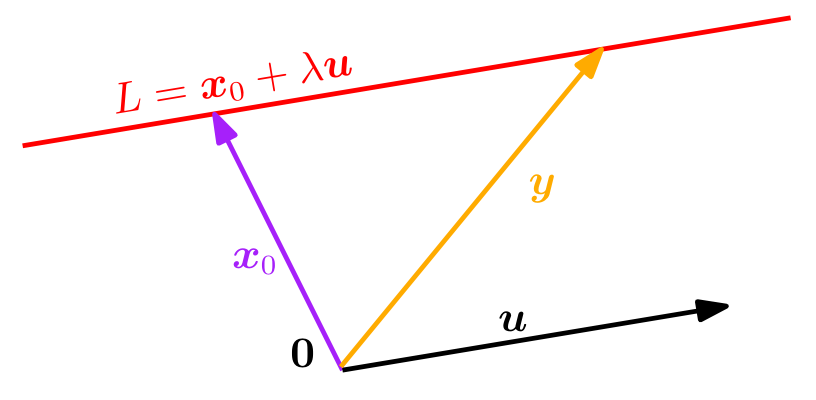

## 2.8 仿射空间

在下文中，我们将仔细研究那些偏离原点的空间，即不再是向量子空间的空间。此外，我们还将简要讨论这些仿射空间之间的映射性质，这些性质类似于线性映射。

_备注_ 。在机器学习文献中，线性与仿射之间的区别有时并不严格分明，因此我们经常会看到将 _仿射空间（affine spaces）_ / _仿射映射（affine mappings）_ 称为 _线性空间（linear spaces）_ / _线性映射（linear mappings）_ 的情况。♦

---

### 2.8.1 仿射子空间

**定义 2.25**（仿射子空间）。设 $ V $ 为向量空间，$ \boldsymbol x_0 \in V $，且 $ U \subseteq V $ 为其子空间。那么子集：
$$ L = \boldsymbol x_0 + U := \{\boldsymbol x_0 + \boldsymbol u : \boldsymbol u \in U\} \tag{2.130a} $$
$$ = \{\boldsymbol v \in V \mid \exists \boldsymbol u \in U : \boldsymbol v = \boldsymbol x_0 + \boldsymbol u\} \subseteq V \tag{2.130b} $$
称为 $ V $ 的 _仿射子空间（affine subspace）_ 或 _线性流形（linear manifold）_ 。$ U $ 称为 _方向（direction）_ 或 _方向空间（direction space）_ ，$ \boldsymbol x_0 $ 称为 _支撑点（support point）_ 。在第 12 章中，我们将此类子空间称为 _超平面（hyperplane）_ 。

注意：若 $ \boldsymbol x_0 \notin U $，则仿射子空间的定义排除了零向量 $ \boldsymbol 0 $。因此，当 $ \boldsymbol x_0 \notin U $ 时，仿射子空间不再是 $ V $ 的（线性）子空间（向量子空间）。

仿射子空间的示例包括 $ \mathbb{R}^3 $ 中（不一定）穿过原点的点、直线和平面。

_备注_ 。考虑向量空间 $ V $ 的两个仿射子空间 $ L = \boldsymbol x_0 + U $ 与 $ \tilde{L} = \tilde{\boldsymbol x}_0 + \tilde{U} $。那么，$ L \subseteq \tilde{L} $ 当且仅当 $ U \subseteq \tilde{U} $ 且 $ \boldsymbol x_0 - \tilde{\boldsymbol x}_0 \in \tilde{U} $。

仿射子空间通常通过参数来描述：考虑 $ V $ 的一个 $ k $ 维仿射空间 $ L = \boldsymbol x_0 + U $。如果 $ (\boldsymbol b_1, \ldots, \boldsymbol b_k) $ 是 $ U $ 的一组有序基，那么 $ L $ 中的每一个元素 $ \boldsymbol x $ 都可以唯一地表示为：
$$ \boldsymbol x = \boldsymbol x_0 + \lambda_1 \boldsymbol b_1 + \cdots + \lambda_k \boldsymbol b_k \tag{2.131} $$
其中 $ \lambda_1, \ldots, \lambda_k \in \mathbb{R} $。该表示形式称为 $ L $ 的 _参数方程（parametric equation）_ ，其中 $ \boldsymbol b_1, \ldots, \boldsymbol b_k $ 称为 _方向向量（directional vectors）_ ，$ \lambda_1, \ldots, \lambda_k $ 称为 _参数（parameters）_ 。♦

> **例 2.26（仿射子空间）**
> 
> $ \mathbb{R}^n $ 中的一维仿射子空间称为 _直线（lines）_ ，可以表示为 $ \boldsymbol y = \boldsymbol x_0 + \lambda \boldsymbol x_1 $，其中 $ \lambda \in \mathbb{R} $，且 $ U = \operatorname{span}[\boldsymbol x_1] \subseteq \mathbb{R}^n $ 是 $ \mathbb{R}^n $ 的一维子空间。这意味着直线由一个支撑点 $ \boldsymbol x_0 $ 和一个确定方向的向量 $ \boldsymbol x_1 $ 所决定。示意图参见图 2.13。
> 
> $ \mathbb{R}^n $ 中的二维仿射子空间称为 _平面（planes）_ 。平面的参数方程为 $ \boldsymbol y = \boldsymbol x_0 + \lambda_1 \boldsymbol x_1 + \lambda_2 \boldsymbol x_2 $，其中 $ \lambda_1, \lambda_2 \in \mathbb{R} $ 且 $ U = \operatorname{span}[\boldsymbol x_1, \boldsymbol x_2] \subseteq \mathbb{R}^n $。这意味着平面由一个支撑点 $ \boldsymbol x_0 $ 和两个张成方向空间的线性无关向量 $ \boldsymbol x_1, \boldsymbol x_2 $ 所决定。
> 
> 在 $ \mathbb{R}^n $ 中，$ (n - 1) $ 维仿射子空间称为 _超平面（hyperplanes）_ ，其对应的参数方程为 $ \boldsymbol y = \boldsymbol x_0 + \sum_{i=1}^{n-1} \lambda_i \boldsymbol x_i $，其中 $ \boldsymbol x_1, \ldots, \boldsymbol x_{n-1} $ 构成 $ \mathbb{R}^n $ 的一个 $ (n - 1) $ 维子空间 $ U $ 的一组基。这意味着超平面由一个支撑点 $ \boldsymbol x_0 $ 和 $ (n - 1) $ 个张成方向空间的线性无关向量 $ \boldsymbol x_1, \ldots, \boldsymbol x_{n-1} $ 所决定。在 $ \mathbb{R}^2 $ 中，直线也是超平面；在 $ \mathbb{R}^3 $ 中，平面也是超平面。

   
  <b>图 2.13 直线上的向量 y 位于以 x₀ 为支撑点、以 u 为方向的仿射子空间 L 中。</b> 

_备注_ （非齐次线性方程组与仿射子空间）。对于 $ \boldsymbol A \in \mathbb{R}^{m \times n} $ 以及 $ \boldsymbol b \in \mathbb{R}^m $，线性方程组 $ \boldsymbol A \boldsymbol x = \boldsymbol b $ 的解集要么是空集，要么是 $ \mathbb{R}^n $ 中维度为 $ n - \operatorname{rk}(\boldsymbol A) $ 的仿射子空间。特别地，线性方程 $ \lambda_1 x_1 + \cdots + \lambda_n x_n = b $（其中 $ (\lambda_1, \ldots, \lambda_n) \neq (0, \ldots, 0) $）的解是 $ \mathbb{R}^n $ 中的一个超平面。
在 $ \mathbb{R}^n $ 中，每一个 $ k $ 维仿射子空间都是某个非齐次线性方程组 $ \boldsymbol A \boldsymbol x = \boldsymbol b $ 的解，其中 $ \boldsymbol A \in \mathbb{R}^{m \times n} $，$ \boldsymbol b \in \mathbb{R}^m $ 且 $ \operatorname{rk}(\boldsymbol A) = n - k $。回想一下，齐次线性方程组 $ \boldsymbol A \boldsymbol x = \boldsymbol 0 $ 的解是一个向量子空间，我们也可以将其视为支撑点为 $ \boldsymbol x_0 = \boldsymbol 0 $ 的特殊仿射空间。♦

---

### 2.8.2 仿射映射

类似于我们在第 2.7 节中讨论的向量空间之间的线性映射，我们也可以定义两个仿射空间之间的仿射映射。线性映射与仿射映射密切相关。因此，我们从线性映射中获知的许多性质（例如线性映射的复合仍然是线性映射）对于仿射映射同样成立。

**定义 2.26**（仿射映射）。对于两个向量空间 $ V, W $、一个线性映射 $ \Phi : V \to W $ 以及 $ \boldsymbol a \in W $，映射：
$$ \phi : V \to W \tag{2.132} $$
$$ \boldsymbol x \mapsto \boldsymbol a + \Phi(\boldsymbol x) \tag{2.133} $$
称为从 $ V $ 到 $ W $ 的 _仿射映射（affine mapping）_ 。向量 $ \boldsymbol a $ 称为 $ \phi $ 的 _平移向量（translation vector）_ 。

每一个仿射映射 $ \phi : V \to W $ 也是一个线性映射 $ \Phi : V \to W $ 与 $ W $ 上的一个 _平移（translation）_ $ \tau : W \to W $ 的复合，满足 $ \phi = \tau \circ \Phi $。映射 $ \Phi $ 与 $ \tau $ 是唯一确定的。

仿射映射 $ \phi : V \to W $ 与 $ \phi' : W \to X $ 的复合映射 $ \phi' \circ \phi $ 也是仿射的。

仿射映射保持几何结构不变。它们还保持维度与平行性（parallelism）。
