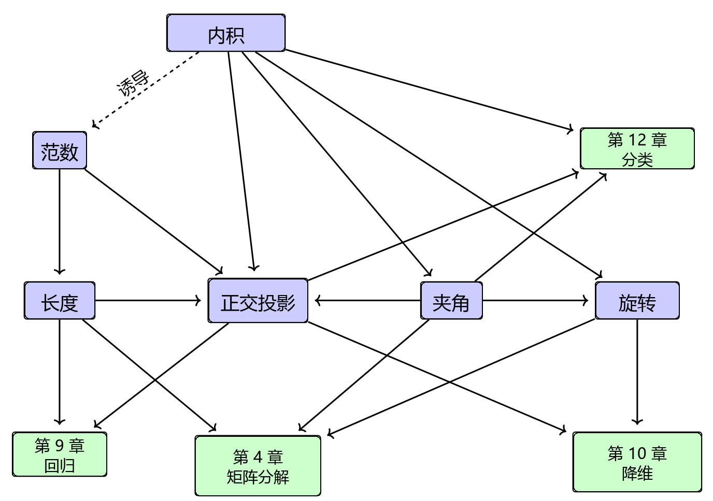

# 3 解析几何

在第 2 章中，我们在较为普遍且抽象的层面上研究了向量、向量空间和线性映射。在本章中，我们将为所有这些概念增添几何解释与几何直觉。特别地，我们将考察几何向量，并计算其长度、距离以及两个向量之间的夹角。为了实现这一点，我们为向量空间赋予一个 _内积（inner product）_ ，从而诱导出向量空间的几何结构。内积及其所对应的范数和度量刻画了相似性与距离的直观概念，我们将在第 12 章中利用这些概念来构建支持向量机。随后，我们将利用向量之间的长度和夹角概念来讨论正交投影，这将在第 10 章的主成分分析以及第 9 章通过极大似然估计进行回归时发挥核心作用。图 3.1 概述了本章各个概念之间的关系，以及它们与本书其他章节的联系。

   
  <b>图 3.1 本章介绍的概念的思维导图，以及它们在本书其他部分中的应用场景。</b> 

