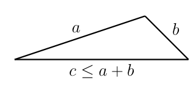
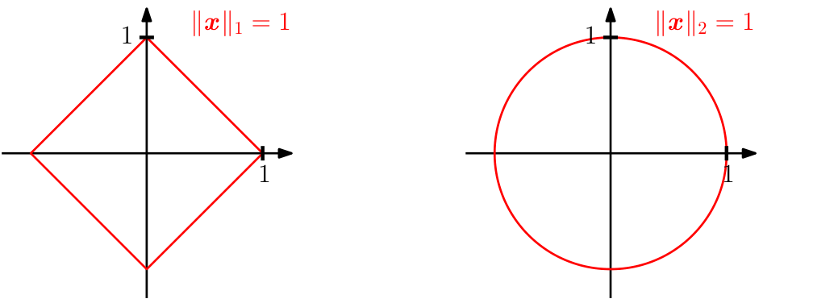

## 3.1 范数

当我们考虑几何向量（即从原点出发的有向线段）时，向量的长度在直观上就是该有向线段的“端点”到原点的距离。下面，我们将利用 _范数（norm）_ 的概念来讨论向量的长度。

**定义 3.1**（范数）。向量空间 $ V $ 上的 _范数（norm）_ 是一个函数：
$$ \|\cdot\| : V \to \mathbb{R} \tag{3.1} $$
$$ \boldsymbol x \mapsto \|\boldsymbol x\| \tag{3.2} $$
它为每个向量 $ \boldsymbol x $ 分配其长度 $ \|\boldsymbol x\| \in \mathbb{R} $，使得对于所有 $ \lambda \in \mathbb{R} $ 以及 $ \boldsymbol x, \boldsymbol y \in V $，满足以下性质：
- _绝对齐次性（absolutely homogeneous）_ ：$ \|\lambda \boldsymbol x\| = |\lambda| \|\boldsymbol x\| $
- _三角不等式（triangle inequality）_ ：$ \|\boldsymbol x + \boldsymbol y\| \leqslant \|\boldsymbol x\| + \|\boldsymbol y\| $
- _正定性（positive definite）_ ：$ \|\boldsymbol x\| \geqslant 0 $ 且 $ \|\boldsymbol x\| = 0 \iff \boldsymbol x = \boldsymbol 0 $

   
  <b>图 3.2 三角不等式。</b> 

从几何意义上讲，三角不等式表明对于任意三角形，任意两边长度之和必须大于或等于第三边的长度；参见图 3.2 的示意说明。

定义 3.1 是针对一般向量空间 $ V $（第 2.4 节）给出的，但在本书中，我们将主要考虑有限维向量空间 $ \mathbb{R}^n $。回想一下，对于向量 $ \boldsymbol x \in \mathbb{R}^n $，我们使用下标表示该向量的分量，即 $ x_i $ 是向量 $ \boldsymbol x $ 的第 $ i $ 个元素。

> **例 3.1（曼哈顿范数）**
> 
> $ \mathbb{R}^n $ 上的 _曼哈顿范数（Manhattan norm）_ 对 $ \boldsymbol x \in \mathbb{R}^n $ 定义为：
> $$ \|\boldsymbol x\|_1 := \sum_{i=1}^n |x_i| \tag{3.3} $$
> 其中 $ |\cdot| $ 表示绝对值。图 3.3 左图显示了 $ \mathbb{R}^2 $ 中所有满足 $ \|\boldsymbol x\|_1 = 1 $ 的向量 $ \boldsymbol x $。曼哈顿范数也被称为 $ \ell_1 $ 范数（$\ell_1$ norm）。

   
  <b>图 3.3 对于不同范数，红线表示范数为 1 的向量集合。左图：曼哈顿范数；右图：欧几里得距离。</b> 

> **例 3.2（欧几里得范数）**
> 
> $ \boldsymbol x \in \mathbb{R}^n $ 的 _欧几里得范数（Euclidean norm）_ 定义为：
> $$ \|\boldsymbol x\|_2 := \sqrt{\sum_{i=1}^n x_i^2} = \sqrt{\boldsymbol x^\top \boldsymbol x} \tag{3.4} $$
> 它计算了 $ \boldsymbol x $ 到原点的 _欧几里得距离（Euclidean distance）_ 。图 3.3 右图显示了 $ \mathbb{R}^2 $ 中所有满足 $ \|\boldsymbol x\|_2 = 1 $ 的向量 $ \boldsymbol x $。欧几里得范数也被称为 $ \ell_2 $ 范数（$\ell_2$ norm）。

_备注_ 。在本书通篇中，若无特殊说明，我们将默认使用欧几里得范数 (3.4)。♦
