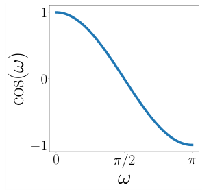
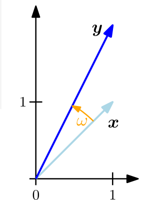
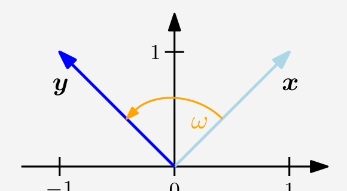

## 3.4 夹角与正交性

内积除了能够定义向量的长度以及两个向量之间的距离外，还可以通过定义两个向量之间的夹角 $ \omega $ 来刻画向量空间的几何性质。我们利用柯西-施瓦茨不等式 (3.17) 来定义内积空间中两个向量 $ \boldsymbol x, \boldsymbol y $ 之间的夹角 $ \omega $，这一概念与我们在 $ \mathbb{R}^2 $ 和 $ \mathbb{R}^3 $ 中的直觉完全一致。假设 $ \boldsymbol x \neq \boldsymbol 0, \boldsymbol y \neq \boldsymbol 0 $。则有：
$$
-1 \leqslant \frac{\langle \boldsymbol x, \boldsymbol y \rangle}{\|\boldsymbol x\| \|\boldsymbol y\|} \leqslant 1
\tag{3.24}
$$
因此，存在唯一的 $ \omega \in [0, \pi] $（如图 3.4 所示），满足：
$$
\cos \omega = \frac{\langle \boldsymbol x, \boldsymbol y \rangle}{\|\boldsymbol x\| \|\boldsymbol y\|}
\tag{3.25}
$$
数值 $ \omega $ 即为向量 $ \boldsymbol x $ 与 $ \boldsymbol y $ 之间的 _夹角（angle）_ 。直观上，两个向量之间的夹角反映了它们的方向有多相似。例如，使用点积时，$ \boldsymbol x $ 与 $ \boldsymbol y = 4\boldsymbol x $（即 $ \boldsymbol y $ 是 $ \boldsymbol x $ 的缩放版本）之间的夹角为 0：它们的方向是相同的。

   
  <b>图 3.4 当限制在 [0, π] 上时，f(ω) = cos(ω) 在区间 [−1, 1] 内返回一个唯一的值。</b> 

> **例 3.6（向量之间的夹角）**
> 
> 让我们计算 $ \boldsymbol x = [1, 1]^\top \in \mathbb{R}^2 $ 与 $ \boldsymbol y = [1, 2]^\top \in \mathbb{R}^2 $ 之间的夹角；参见图 3.5，其中我们采用点积作为内积。由此可得：
> $$
> \cos \omega = \frac{\langle \boldsymbol x, \boldsymbol y \rangle}{\sqrt{\langle \boldsymbol x, \boldsymbol x \rangle \langle \boldsymbol y, \boldsymbol y \rangle}} = \frac{\boldsymbol x^\top \boldsymbol y}{\sqrt{\boldsymbol x^\top \boldsymbol x \boldsymbol y^\top \boldsymbol y}} = \frac{3}{\sqrt{10}}
> \tag{3.26}
> $$
> 这两个向量之间的夹角为 $ \arccos\left(\frac{3}{\sqrt{10}}\right) \approx 0.32\text{ rad} $，约合 $ 18^\circ $。

   
  <b>图 3.5 两个向量 x, y 之间的夹角 ω 是通过内积计算的。</b> 

内积的一个关键特性在于，它还允许我们刻画正交的向量。

**定义 3.7**（正交性）。两个向量 $ \boldsymbol x $ 和 $ \boldsymbol y $ 是 _正交的（orthogonal）_ 当且仅当 $ \langle \boldsymbol x, \boldsymbol y \rangle = 0 $，我们记作 $ \boldsymbol x \perp \boldsymbol y $。如果此外还有 $ \|\boldsymbol x\| = 1 = \|\boldsymbol y\| $，即这两个向量是单位向量，则称 $ \boldsymbol x $ 和 $ \boldsymbol y $ 是 _标准正交的（orthonormal）_ 。

该定义的一个推论是，零向量与向量空间中的每一个向量都是正交的。

_备注_ 。正交性是将垂直概念推广到不一定为点积的双线性形式。在我们的语境中，从几何意义上讲，我们可以将正交向量看作关于特定内积成直角的向量。♦

   
  <b>图 3.6 两个向量 x, y 之间的夹角 ω 会根据所选内积的不同而发生改变。</b> 

> **例 3.7（正交向量）**
> 
> 考虑两个向量 $ \boldsymbol x = [1, 1]^\top, \boldsymbol y = [-1, 1]^\top \in \mathbb{R}^2 $；参见图 3.6。我们希望使用两种不同的内积来确定它们之间的夹角 $ \omega $。以点积作为内积，得到 $ \boldsymbol x $ 与 $ \boldsymbol y $ 之间的夹角 $ \omega $ 为 $ 90^\circ $，从而 $ \boldsymbol x \perp \boldsymbol y $。然而，如果我们选择内积：
> $$
> \langle \boldsymbol x, \boldsymbol y \rangle = \boldsymbol x^\top \begin{bmatrix} 2 & 0 \\ 0 & 1 \end{bmatrix} \boldsymbol y
> \tag{3.27}
> $$
> 则 $ \boldsymbol x $ 与 $ \boldsymbol y $ 之间的夹角 $ \omega $ 由下式给出：
> $$
> \cos \omega = \frac{\langle \boldsymbol x, \boldsymbol y \rangle}{\|\boldsymbol x\| \|\boldsymbol y\|} = -\frac{1}{3} \implies \omega \approx 1.91\text{ rad} \approx 109.5^\circ
> \tag{3.28}
> $$
> 此时 $ \boldsymbol x $ 与 $ \boldsymbol y $ 并不正交。因此，关于某一种内积正交的向量，关于另一种不同的内积并不一定正交。

**定义 3.8**（正交矩阵）。方阵 $ \boldsymbol A \in \mathbb{R}^{n \times n} $ 是 _正交矩阵（orthogonal matrix）_ 当且仅当其列向量是标准正交的，从而满足：
$$
\boldsymbol A \boldsymbol A^\top = \boldsymbol I = \boldsymbol A^\top \boldsymbol A
\tag{3.29}
$$
这蕴含着：
$$
\boldsymbol A^{-1} = \boldsymbol A^\top
\tag{3.30}
$$
即逆矩阵只需通过对该矩阵进行转置即可得到。

> 习惯上称这类矩阵为“正交矩阵”，但更精确的表述应该是“标准正交矩阵”。

由正交矩阵定义的变换十分特殊，因为向量 $ \boldsymbol x $ 在利用正交矩阵 $ \boldsymbol A $ 进行变换时其长度保持不变。对于点积，我们有：
$$
\|\boldsymbol A \boldsymbol x\|^2 = (\boldsymbol A \boldsymbol x)^\top (\boldsymbol A \boldsymbol x) = \boldsymbol x^\top \boldsymbol A^\top \boldsymbol A \boldsymbol x = \boldsymbol x^\top \boldsymbol I \boldsymbol x = \boldsymbol x^\top \boldsymbol x = \|\boldsymbol x\|^2
\tag{3.31}
$$

> 正交矩阵所对应的变换保持距离和夹角不变。

此外，利用内积度量的任意两个向量 $ \boldsymbol x, \boldsymbol y $ 之间的夹角，在同时使用正交矩阵 $ \boldsymbol A $ 对它们进行变换时也保持不变。假设以内积为点积，则像 $ \boldsymbol A \boldsymbol x $ 与 $ \boldsymbol A \boldsymbol y $ 之间的夹角由下式给出：
$$
\cos \omega = \frac{(\boldsymbol A \boldsymbol x)^\top (\boldsymbol A \boldsymbol y)}{\|\boldsymbol A \boldsymbol x\| \|\boldsymbol A \boldsymbol y\|} = \frac{\boldsymbol x^\top \boldsymbol A^\top \boldsymbol A \boldsymbol y}{\sqrt{\boldsymbol x^\top \boldsymbol A^\top \boldsymbol A \boldsymbol x \, \boldsymbol y^\top \boldsymbol A^\top \boldsymbol A \boldsymbol y}} = \frac{\boldsymbol x^\top \boldsymbol y}{\|\boldsymbol x\| \|\boldsymbol y\|}
\tag{3.32}
$$
这正好给出了 $ \boldsymbol x $ 与 $ \boldsymbol y $ 之间的夹角。这意味着满足 $ \boldsymbol A^\top = \boldsymbol A^{-1} $ 的正交矩阵 $ \boldsymbol A $ 既保持夹角不变，也保持距离不变。事实上，正交矩阵所定义的变换是旋转（可能伴随翻转）。在第 3.9 节中，我们将讨论有关旋转的更多细节。
