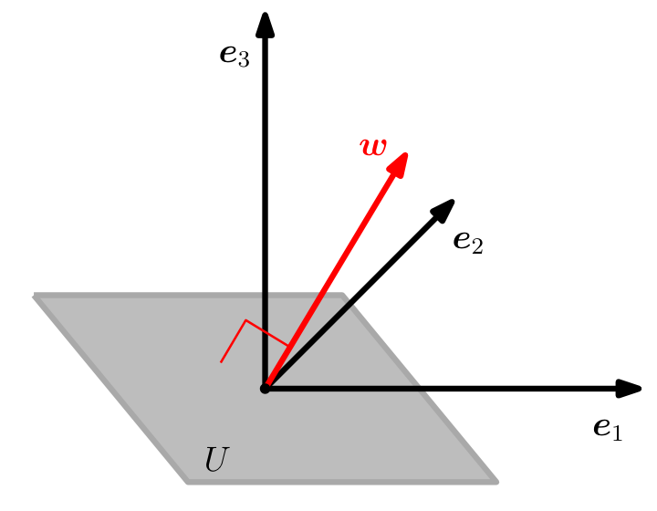

## 3.6 正交补

在定义了正交性之后，我们现在考察相互正交的向量空间。这将在第 10 章从几何视角讨论线性降维时发挥重要作用。

考虑一个 $ D $ 维向量空间 $ V $ 及其一个 $ M $ 维子空间 $ U \subseteq V $。那么它的 _正交补（orthogonal complement）_ $ U^\perp $ 是 $ V $ 的一个 $ (D - M) $ 维子空间，并且包含 $ V $ 中与 $ U $ 中每一个向量都正交的所有向量。此外，$ U \cap U^\perp = \{\boldsymbol 0\} $，使得任意向量 $ \boldsymbol x \in V $ 都可以唯一分解为：
$$
\boldsymbol x = \sum_{m=1}^M \lambda_m \boldsymbol b_m + \sum_{j=1}^{D-M} \psi_j \boldsymbol b_j^\perp, \quad \lambda_m, \psi_j \in \mathbb{R}
\tag{3.36}
$$
其中 $ (\boldsymbol b_1, \ldots, \boldsymbol b_M) $ 是 $ U $ 的一组基，而 $ (\boldsymbol b_1^\perp, \ldots, \boldsymbol b_{D-M}^\perp) $ 是 $ U^\perp $ 的一组基。

因此，正交补也可以用来描述三维向量空间中的平面 $ U $（二维子空间）。更具体地，满足 $ \|\boldsymbol w\| = 1 $ 且与平面 $ U $ 正交的向量 $ \boldsymbol w $ 是 $ U^\perp $ 的基向量。图 3.7 说明了这种设定。所有与 $ \boldsymbol w $ 正交的向量（根据构造）必然落在平面 $ U $ 内。向量 $ \boldsymbol w $ 称为 $ U $ 的 _法向量（normal vector）_ 。

   
  <b>图 3.7 三维向量空间中的平面 U 可以通过其法向量来描述，该法向量张成了其正交补空间 U⊥。</b> 

通常，正交补可以用来描述 $ n $ 维向量空间与仿射空间中的超平面。
