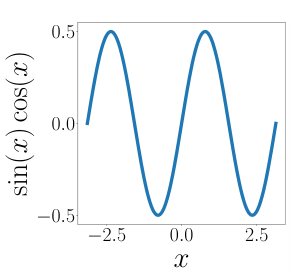

## 3.7 函数的内积

到目前为止，我们考察了内积在计算长度、夹角和距离方面的性质。我们一直聚焦于有限维向量的内积。接下来，我们将看一个不同类型向量的内积示例：函数的内积。

迄今为止我们讨论的内积都是针对具有有限个分量的向量定义的。我们可以将向量 $ \boldsymbol x \in \mathbb{R}^n $ 视为具有 $ n $ 个函数值的函数。内积的概念可以推广到具有无限个分量的向量（可数无穷）以及连续值函数（不可数无穷）。此时，向量各分量的求和（例如参见式 (3.5)）将转变为积分。

两个函数 $ u : \mathbb{R} \to \mathbb{R} $ 和 $ v : \mathbb{R} \to \mathbb{R} $ 的内积可以定义为定积分：
$$
\langle u, v \rangle := \int_a^b u(x) v(x) \, \mathrm{d}x
\tag{3.37}
$$
其中积分下限和上限分别满足 $ a, b < \infty $。与通常的内积一样，我们也可以通过考察内积来定义范数和正交性。如果式 (3.37) 的计算结果为 0，则函数 $ u $ 和 $ v $ 是正交的。为了使上述内积在数学上更加严格，我们需要考虑测度以及积分的定义，这引出了 _希尔伯特空间（Hilbert space）_ 的定义。此外，与有限维向量上的内积不同，函数上的内积可能会发散（具有无穷大的值）。所有这些都需要深入探讨实分析和泛函分析中更错综复杂的细节，本书对此不做展开。

> **例 3.9（函数的内积）**
> 
> 如果我们选择 $ u = \sin(x) $ 和 $ v = \cos(x) $，式 (3.37) 中的被积函数 $ f(x) = u(x)v(x) $ 如图 3.8 所示。我们看到该函数是奇函数，即 $ f(-x) = -f(x) $。因此，在积分限为 $ a = -\pi, b = \pi $ 时，该乘积的积分计算结果为 0。所以，$ \sin $ 和 $ \cos $ 是正交函数。

   
  <b>图 3.8 奇函数 f(x) = sin(x)cos(x)。</b> 

_备注_ 。同样地，如果从 $ -\pi $ 到 $ \pi $ 积分，函数集合：
$$
\{1, \cos(x), \cos(2x), \cos(3x), \ldots\}
\tag{3.38}
$$
也是正交的，即其中任意两个不同的函数之间都相互正交。式 (3.38) 中的函数集合张成了在 $ [-\pi, \pi) $ 上为偶函数且具周期性的函数的一个很大子空间，将函数投影到该子空间上正是 _傅里叶级数（Fourier series）_ 背后的基本思想。♦

在第 6.4.6 节中，我们将考察第二类非常规内积：随机变量的内积。
