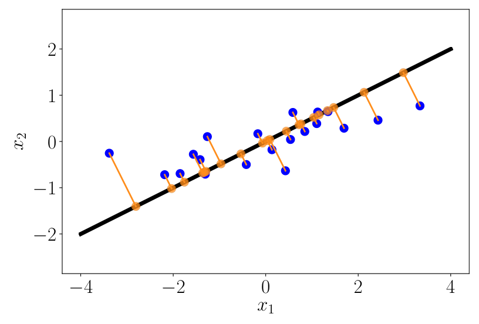
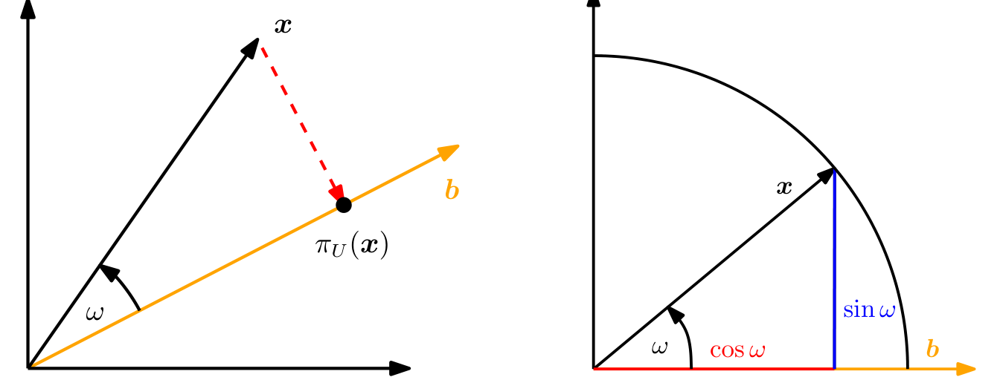
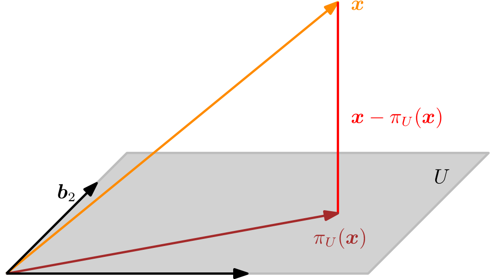
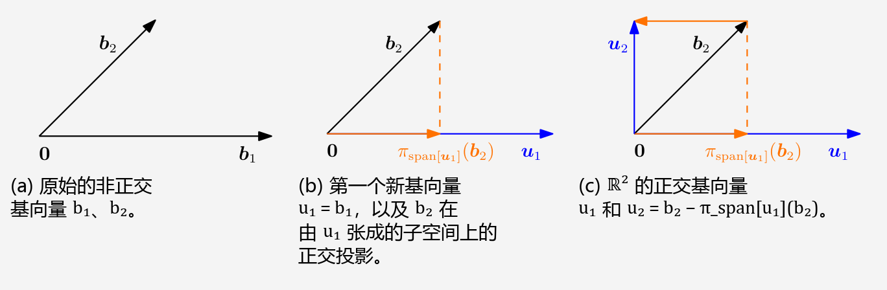
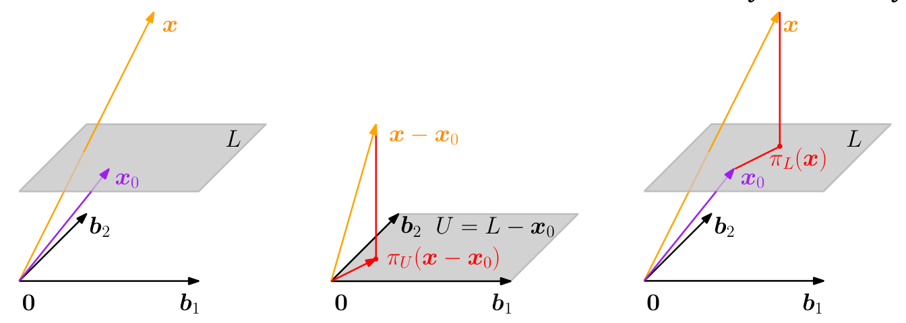

## 3.8 正交投影

投影是一类重要的线性变换（除旋转和翻转之外），在图形学、编码理论、统计学和机器学习中发挥着重要作用。在机器学习中，我们经常处理高维数据。高维数据通常难以分析或可视化。然而，高维数据往往具有这样的性质：只有少数几个维度包含了大部分信息，而大多数其他维度对于描述数据的关键属性并不是必需的。当我们压缩或可视化高维数据时，会丢失信息。为了尽量减少这种压缩损失，我们理想的做法是找到数据中信息量最丰富的维度。正如第 1 章中所讨论的，数据可以表示为向量（“特征（feature）”是数据表示的常用表达），在本章中，我们将讨论一些用于数据压缩的基本工具。更具体地，我们可以将原始高维数据投影到较低维的特征空间中，并在这个较低维空间中开展工作，以了解更多关于数据集的信息并提取相关的模式。例如，机器学习算法，如 Pearson（1901）和 Hotelling（1933）提出的主成分分析（PCA）以及深度神经网络（例如深度自动编码器（Deng et al., 2010）），都大量利用了降维的思想。在下文中，我们将重点讨论正交投影，我们将在第 10 章中将其用于线性降维，在第 12 章中用于分类。甚至我们在第 9 章讨论的线性回归，也可以使用正交投影来解释。对于给定的低维子空间，高维数据的正交投影能够保留尽可能多的信息，并使原始数据与相应投影之间的差异/误差最小化。图 3.9 给出了这种正交投影的示意图。在我们详细介绍如何获得这些投影之前，先来定义什么是投影。

   
  <b>图 3.9 二维数据集（蓝色圆点）到一维子空间（直线）的正交投影（橙色圆点）。</b> 

**定义 3.10**（投影）。设 $ V $ 为向量空间，$ U \subseteq V $ 为 $ V $ 的子空间。如果一个线性映射 $ \pi : V \to U $ 满足：
$$
\pi^2 = \pi \circ \pi = \pi
$$
则称其为 _投影（projection）_ 。

由于线性映射可以用变换矩阵来表示（参见第 2.7 节），上述定义同样适用于一类特殊的变换矩阵—— _投影矩阵（projection matrix）_ $ \boldsymbol P_\pi $，它们具有性质 $ \boldsymbol P_\pi^2 = \boldsymbol P_\pi $。

在下文中，我们将推导内积空间 $ (\mathbb{R}^n, \langle \cdot, \cdot \rangle) $ 中的向量到子空间的正交投影。我们将从一维子空间开始，一维子空间也称为 _直线（line）_ 。若无特别说明，我们默认以内积为点积 $ \langle \boldsymbol x, \boldsymbol y \rangle = \boldsymbol x^\top \boldsymbol y $。

### 3.8.1 投影到一维子空间（直线）

假设给定一条过原点且基向量为 $ \boldsymbol b \in \mathbb{R}^n $ 的直线（一维子空间）。该直线是由 $ \boldsymbol b $ 张成的一维子空间 $ U \subseteq \mathbb{R}^n $。当我们将 $ \boldsymbol x \in \mathbb{R}^n $ 投影到 $ U $ 上时，我们要寻找 $ U $ 中距离 $ \boldsymbol x $ 最近的向量 $ \pi_U(\boldsymbol x) \in U $。利用几何论证，让我们来刻画投影 $ \pi_U(\boldsymbol x) $ 的一些性质（图 3.10(a) 给出了示意说明）：

- 投影 $ \pi_U(\boldsymbol x) $ 距离 $ \boldsymbol x $ 最近，其中“最近”意味着距离 $ \|\boldsymbol x - \pi_U(\boldsymbol x)\| $ 最小。由此可知，从 $ \pi_U(\boldsymbol x) $ 到 $ \boldsymbol x $ 的线段 $ \pi_U(\boldsymbol x) - \boldsymbol x $ 与 $ U $ 正交，因此也与 $ U $ 的基向量 $ \boldsymbol b $ 正交。由于向量之间的夹角是通过内积定义的，正交条件给出 $ \langle \pi_U(\boldsymbol x) - \boldsymbol x, \boldsymbol b \rangle = 0 $。
- $ \boldsymbol x $ 在 $ U $ 上的投影 $ \pi_U(\boldsymbol x) $ 必然是 $ U $ 中的元素，因此它是张成 $ U $ 的基向量 $ \boldsymbol b $ 的倍数。因此，对于某个 $ \lambda \in \mathbb{R} $，有 $ \pi_U(\boldsymbol x) = \lambda \boldsymbol b $（此时 $ \lambda $ 是 $ \pi_U(\boldsymbol x) $ 关于基向量 $ \boldsymbol b $ 的坐标）。

   
  <b>图 3.10 投影到一维子空间的示例。(a) 将 x ∈ ℝ² 投影到具有基向量 b 的子空间 U 上；(b) 将 ∥x∥ = 1 的二维向量 x 投影到由 b 张成的一维子空间上。</b> 

在接下来的三个步骤中，我们确定坐标 $ \lambda $、投影点 $ \pi_U(\boldsymbol x) \in U $ 以及将任意 $ \boldsymbol x \in \mathbb{R}^n $ 映射到 $ U $ 上的投影矩阵 $ \boldsymbol P_\pi $：

1. **求坐标 $ \lambda $**。正交条件给出：
$$
\langle \boldsymbol x - \pi_U(\boldsymbol x), \boldsymbol b \rangle = 0 \stackrel{\pi_U(\boldsymbol x) = \lambda \boldsymbol b}{\iff} \langle \boldsymbol x - \lambda \boldsymbol b, \boldsymbol b \rangle = 0
\tag{3.39}
$$
现在我们可以利用内积的双线性性质，得到：
$$
\langle \boldsymbol x, \boldsymbol b \rangle - \lambda \langle \boldsymbol b, \boldsymbol b \rangle = 0 \iff \lambda = \frac{\langle \boldsymbol x, \boldsymbol b \rangle}{\langle \boldsymbol b, \boldsymbol b \rangle} = \frac{\langle \boldsymbol b, \boldsymbol x \rangle}{\|\boldsymbol b\|^2}
\tag{3.40}
$$
在最后一步中，我们利用了内积是对称的事实。对于一般的内积，若 $ \|\boldsymbol b\| = 1 $，则有 $ \lambda = \langle \boldsymbol x, \boldsymbol b \rangle $。如果我们将 $ \langle \cdot, \cdot \rangle $ 选取为点积，则得到：
$$
\lambda = \frac{\boldsymbol b^\top \boldsymbol x}{\boldsymbol b^\top \boldsymbol b} = \frac{\boldsymbol b^\top \boldsymbol x}{\|\boldsymbol b\|^2}
\tag{3.41}
$$
若 $ \|\boldsymbol b\| = 1 $，则投影的坐标 $ \lambda $ 由 $ \boldsymbol b^\top \boldsymbol x $ 给出。

2. **求投影点 $ \pi_U(\boldsymbol x) \in U $**。由于 $ \pi_U(\boldsymbol x) = \lambda \boldsymbol b $，结合式 (3.40) 我们立即得到：
$$
\pi_U(\boldsymbol x) = \lambda \boldsymbol b = \frac{\langle \boldsymbol x, \boldsymbol b \rangle}{\|\boldsymbol b\|^2} \boldsymbol b = \frac{\boldsymbol b^\top \boldsymbol x}{\|\boldsymbol b\|^2} \boldsymbol b
\tag{3.42}
$$
其中最后一个等号仅对点积成立。我们还可以根据定义 3.1 计算 $ \pi_U(\boldsymbol x) $ 的长度为：
$$
\|\pi_U(\boldsymbol x)\| = \|\lambda \boldsymbol b\| = |\lambda| \|\boldsymbol b\|
\tag{3.43}
$$
因此，投影的长度是 $ |\lambda| $ 乘以 $ \boldsymbol b $ 的长度。这进一步加深了直观理解：$ \lambda $ 是 $ \pi_U(\boldsymbol x) $ 关于张成一维子空间 $ U $ 的基向量 $ \boldsymbol b $ 的坐标。
如果我们使用点积作为内积，可得：
$$
\|\pi_U(\boldsymbol x)\| \stackrel{(3.42)}{=} \frac{|\boldsymbol b^\top \boldsymbol x|}{\|\boldsymbol b\|^2} \|\boldsymbol b\| \stackrel{(3.25)}{=} \frac{|\cos \omega| \|\boldsymbol x\| \|\boldsymbol b\| \|\boldsymbol b\|}{\|\boldsymbol b\|^2} = |\cos \omega| \|\boldsymbol x\|
\tag{3.44}
$$
这里 $ \omega $ 是 $ \boldsymbol x $ 与 $ \boldsymbol b $ 之间的夹角。这个方程应该在三角学中很熟悉：如果 $ \|\boldsymbol x\| = 1 $，则 $ \boldsymbol x $ 落在单位圆上。由此可知，投影到由 $ \boldsymbol b $ 张成的水平轴（水平轴是一个一维子空间）上恰好是 $ \cos \omega $，对应向量的长度为 $ \|\pi_U(\boldsymbol x)\| = |\cos \omega| $。图 3.10(b) 给出了示意说明。

3. **求投影矩阵 $ \boldsymbol P_\pi $**。我们知道投影是一个线性映射（参见定义 3.10）。因此，存在一个投影矩阵 $ \boldsymbol P_\pi $，使得 $ \pi_U(\boldsymbol x) = \boldsymbol P_\pi \boldsymbol x $。以点积为内积，并且根据：
$$
\pi_U(\boldsymbol x) = \lambda \boldsymbol b = \boldsymbol b \lambda = \boldsymbol b \frac{\boldsymbol b^\top \boldsymbol x}{\|\boldsymbol b\|^2} = \frac{\boldsymbol b \boldsymbol b^\top}{\|\boldsymbol b\|^2} \boldsymbol x
\tag{3.45}
$$
我们立即看出：
$$
\boldsymbol P_\pi = \frac{\boldsymbol b \boldsymbol b^\top}{\|\boldsymbol b\|^2}
\tag{3.46}
$$
注意 $ \boldsymbol b \boldsymbol b^\top $（以及随之而来的 $ \boldsymbol P_\pi $）是一个（秩为 1 的）对称矩阵（投影矩阵总是对称的），而 $ \|\boldsymbol b\|^2 = \langle \boldsymbol b, \boldsymbol b \rangle $ 是一个标量。
投影矩阵 $ \boldsymbol P_\pi $ 将任意向量 $ \boldsymbol x \in \mathbb{R}^n $ 投影到过原点且方向为 $ \boldsymbol b $ 的直线上（等价地，投影到由 $ \boldsymbol b $ 张成的子空间 $ U $ 上）。

_备注_ 。投影 $ \pi_U(\boldsymbol x) \in \mathbb{R}^n $ 仍然是一个 $ n $ 维向量，而不是标量。然而，如果我们想关于张成子空间 $ U $ 的基向量 $ \boldsymbol b $ 来表示该投影，则不再需要 $ n $ 个坐标，而只需要一个单独的坐标：$ \lambda $。♦

> **例 3.10（投影到直线上）**
> 
> 求过原点且由 $ \boldsymbol b = [1, 2, 2]^\top $ 张成的直线上的投影矩阵 $ \boldsymbol P_\pi $。$ \boldsymbol b $ 是一维子空间（过原点的直线）的方向和基。
> 利用式 (3.46)，我们得到：
> $$
> \boldsymbol P_\pi = \frac{\boldsymbol b \boldsymbol b^\top}{\boldsymbol b^\top \boldsymbol b} = \frac{1}{9} \begin{bmatrix} 1 \\ 2 \\ 2 \end{bmatrix} \begin{bmatrix} 1 & 2 & 2 \end{bmatrix} = \frac{1}{9} \begin{bmatrix} 1 & 2 & 2 \\ 2 & 4 & 4 \\ 2 & 4 & 4 \end{bmatrix}
> \tag{3.47}
> $$
> 现在让我们选择一个具体的 $ \boldsymbol x $，看看它是否落在由 $ \boldsymbol b $ 张成的子空间中。对于 $ \boldsymbol x = [1, 1, 1]^\top $，投影为：
> $$
> \pi_U(\boldsymbol x) = \boldsymbol P_\pi \boldsymbol x = \frac{1}{9} \begin{bmatrix} 1 & 2 & 2 \\ 2 & 4 & 4 \\ 2 & 4 & 4 \end{bmatrix} \begin{bmatrix} 1 \\ 1 \\ 1 \end{bmatrix} = \frac{1}{9} \begin{bmatrix} 5 \\ 10 \\ 10 \end{bmatrix} \in \text{span}\left[\begin{bmatrix} 1 \\ 2 \\ 2 \end{bmatrix}\right]
> \tag{3.48}
> $$
> 注意，将 $ \boldsymbol P_\pi $ 应用于 $ \pi_U(\boldsymbol x) $ 不会改变任何东西，即 $ \boldsymbol P_\pi \pi_U(\boldsymbol x) = \pi_U(\boldsymbol x) $。这是符合预期的，因为根据定义 3.10，我们知道投影矩阵 $ \boldsymbol P_\pi $ 对所有 $ \boldsymbol x $ 都满足 $ \boldsymbol P_\pi^2 \boldsymbol x = \boldsymbol P_\pi \boldsymbol x $。

_备注_ 。利用第 4 章的结果，我们可以证明 $ \pi_U(\boldsymbol x) $ 是 $ \boldsymbol P_\pi $ 的特征向量，对应的特征值为 1。♦

### 3.8.2 投影到一般子空间

下面我们考察向量 $ \boldsymbol x \in \mathbb{R}^n $ 到更低维子空间 $ U \subseteq \mathbb{R}^n $ 上的正交投影，其中 $ \dim(U) = m \geqslant 1 $。图 3.11 给出了直观示意。

（若 $ U $ 由一组不是基的生成向量给出，请在继续之前务必先确定一组基 $ \boldsymbol b_1, \ldots, \boldsymbol b_m $。）

   
  <b>图 3.11 投影到具有基 b₁, b₂ 的二维子空间 U 上。x ∈ ℝ³ 在 U 上的投影 πU(x) 可以表示为 b₁, b₂ 的线性组合，位移向量 x − πU(x) 同时与 b₁ 和 b₂ 正交。</b> 

假设 $ (\boldsymbol b_1, \ldots, \boldsymbol b_m) $ 是 $ U $ 的一组有序基。$ U $ 上的任何投影 $ \pi_U(\boldsymbol x) $ 必然是 $ U $ 中的元素。因此，它们可以表示为 $ U $ 的基向量 $ \boldsymbol b_1, \ldots, \boldsymbol b_m $ 的线性组合，即 $ \pi_U(\boldsymbol x) = \sum_{i=1}^m \lambda_i \boldsymbol b_i $。基向量构成矩阵 $ \boldsymbol B \in \mathbb{R}^{n \times m} $ 的列，其中 $ \boldsymbol B = [\boldsymbol b_1, \ldots, \boldsymbol b_m] $。

与一维情况类似，我们遵循三步过程来寻找投影 $ \pi_U(\boldsymbol x) $ 和投影矩阵 $ \boldsymbol P_\pi $：

1. **求投影的坐标 $ \lambda_1, \ldots, \lambda_m $**（关于 $ U $ 的基），使得线性组合：
$$
\pi_U(\boldsymbol x) = \sum_{i=1}^m \lambda_i \boldsymbol b_i = \boldsymbol B \boldsymbol \lambda
\tag{3.49}
$$
$$
\boldsymbol B = [\boldsymbol b_1, \ldots, \boldsymbol b_m] \in \mathbb{R}^{n \times m}, \quad \boldsymbol \lambda = [\lambda_1, \ldots, \lambda_m]^\top \in \mathbb{R}^m
\tag{3.50}
$$
距离 $ \boldsymbol x \in \mathbb{R}^n $ 最近。与一维情况相同，“最近”意味着“距离最小”，这意味着连接 $ \pi_U(\boldsymbol x) \in U $ 与 $ \boldsymbol x \in \mathbb{R}^n $ 的向量必须与 $ U $ 的所有基向量都正交。因此，我们得到 $ m $ 个联立条件（假设以内积为点积）：
$$
\langle \boldsymbol b_1, \boldsymbol x - \pi_U(\boldsymbol x) \rangle = \boldsymbol b_1^\top (\boldsymbol x - \pi_U(\boldsymbol x)) = 0
\tag{3.51}
$$
$$
\vdots
$$
$$
\langle \boldsymbol b_m, \boldsymbol x - \pi_U(\boldsymbol x) \rangle = \boldsymbol b_m^\top (\boldsymbol x - \pi_U(\boldsymbol x)) = 0
\tag{3.52}
$$
结合 $ \pi_U(\boldsymbol x) = \boldsymbol B \boldsymbol \lambda $，可以写为：
$$
\boldsymbol b_1^\top (\boldsymbol x - \boldsymbol B \boldsymbol \lambda) = 0
\tag{3.53}
$$
$$
\vdots
$$
$$
\boldsymbol b_m^\top (\boldsymbol x - \boldsymbol B \boldsymbol \lambda) = 0
\tag{3.54}
$$
从而我们得到一个齐次线性方程组：
$$
\begin{bmatrix} \boldsymbol b_1^\top \\ \vdots \\ \boldsymbol b_m^\top \end{bmatrix} (\boldsymbol x - \boldsymbol B \boldsymbol \lambda) = \boldsymbol 0 \iff \boldsymbol B^\top (\boldsymbol x - \boldsymbol B \boldsymbol \lambda) = \boldsymbol 0
\tag{3.55}
$$
$$
\iff \boldsymbol B^\top \boldsymbol B \boldsymbol \lambda = \boldsymbol B^\top \boldsymbol x
\tag{3.56}
$$
最后一个表达式称为 _正规方程（normal equation）_ 。由于 $ \boldsymbol b_1, \ldots, \boldsymbol b_m $ 是 $ U $ 的一组基，因此线性无关，$ \boldsymbol B^\top \boldsymbol B \in \mathbb{R}^{m \times m} $ 是非奇异（正则）的且可逆。这使得我们能够解出系数/坐标：
$$
\boldsymbol \lambda = (\boldsymbol B^\top \boldsymbol B)^{-1} \boldsymbol B^\top \boldsymbol x
\tag{3.57}
$$
矩阵 $ (\boldsymbol B^\top \boldsymbol B)^{-1} \boldsymbol B^\top $ 也称为 $ \boldsymbol B $ 的 _伪逆（pseudo-inverse）_ ，它可以针对非方阵 $ \boldsymbol B $ 进行计算。它仅要求 $ \boldsymbol B^\top \boldsymbol B $ 是正定的，当 $ \boldsymbol B $ 列满秩时便满足此条件。在实际应用中（例如线性回归），我们经常在 $ \boldsymbol B^\top \boldsymbol B $ 上添加一个“微扰项/抖动项（jitter term）” $ \epsilon \boldsymbol I $，以保证提高数值稳定性和正定性。这种“岭（ridge）”可以通过贝叶斯推断严格导出，详见第 9 章。

2. **求投影点 $ \pi_U(\boldsymbol x) \in U $**。我们已经确定 $ \pi_U(\boldsymbol x) = \boldsymbol B \boldsymbol \lambda $。因此，结合式 (3.57)：
$$
\pi_U(\boldsymbol x) = \boldsymbol B (\boldsymbol B^\top \boldsymbol B)^{-1} \boldsymbol B^\top \boldsymbol x
\tag{3.58}
$$

3. **求投影矩阵 $ \boldsymbol P_\pi $**。从式 (3.58) 中，我们可以立即看出求解 $ \boldsymbol P_\pi \boldsymbol x = \pi_U(\boldsymbol x) $ 的投影矩阵必然是：
$$
\boldsymbol P_\pi = \boldsymbol B (\boldsymbol B^\top \boldsymbol B)^{-1} \boldsymbol B^\top
\tag{3.59}
$$

_备注_ 。投影到一般子空间的解将一维情况作为特例包含在内：若 $ \dim(U) = 1 $，则 $ \boldsymbol B^\top \boldsymbol B \in \mathbb{R} $ 是标量，我们可以将式 (3.59) 中的投影矩阵 $ \boldsymbol P_\pi = \boldsymbol B (\boldsymbol B^\top \boldsymbol B)^{-1} \boldsymbol B^\top $ 重写为 $ \boldsymbol P_\pi = \frac{\boldsymbol B \boldsymbol B^\top}{\boldsymbol B^\top \boldsymbol B} $，这正是式 (3.46) 中的投影矩阵。♦

> **例 3.11（投影到二维子空间）**
> 
> 对于子空间 $ U = \text{span}\left[\begin{bmatrix} 1 \\ 1 \\ 1 \end{bmatrix}, \begin{bmatrix} 0 \\ 1 \\ 2 \end{bmatrix}\right] \subseteq \mathbb{R}^3 $ 以及 $ \boldsymbol x = \begin{bmatrix} 6 \\ 0 \\ 0 \end{bmatrix} \in \mathbb{R}^3 $，求 $ \boldsymbol x $ 关于子空间 $ U $ 的坐标 $ \boldsymbol \lambda $、投影点 $ \pi_U(\boldsymbol x) $ 以及投影矩阵 $ \boldsymbol P_\pi $。
> 
> 首先，我们看到 $ U $ 的生成集是一组基（线性无关），并将 $ U $ 的基向量写入矩阵中：
> $$
> \boldsymbol B = \begin{bmatrix} 1 & 0 \\ 1 & 1 \\ 1 & 2 \end{bmatrix}
> $$
> 其次，我们计算矩阵 $ \boldsymbol B^\top \boldsymbol B $ 和向量 $ \boldsymbol B^\top \boldsymbol x $：
> $$
> \boldsymbol B^\top \boldsymbol B = \begin{bmatrix} 1 & 1 & 1 \\ 0 & 1 & 2 \end{bmatrix} \begin{bmatrix} 1 & 0 \\ 1 & 1 \\ 1 & 2 \end{bmatrix} = \begin{bmatrix} 3 & 3 \\ 3 & 5 \end{bmatrix}, \quad \boldsymbol B^\top \boldsymbol x = \begin{bmatrix} 1 & 1 & 1 \\ 0 & 1 & 2 \end{bmatrix} \begin{bmatrix} 6 \\ 0 \\ 0 \end{bmatrix} = \begin{bmatrix} 6 \\ 0 \end{bmatrix}
> \tag{3.60}
> $$
> 第三，我们求解正规方程 $ \boldsymbol B^\top \boldsymbol B \boldsymbol \lambda = \boldsymbol B^\top \boldsymbol x $ 来求 $ \boldsymbol \lambda $：
> $$
> \begin{bmatrix} 3 & 3 \\ 3 & 5 \end{bmatrix} \begin{bmatrix} \lambda_1 \\ \lambda_2 \end{bmatrix} = \begin{bmatrix} 6 \\ 0 \end{bmatrix} \iff \boldsymbol \lambda = \begin{bmatrix} 5 \\ -3 \end{bmatrix}
> \tag{3.61}
> $$
> 第四，$ \boldsymbol x $ 在 $ U $ 上的投影 $ \pi_U(\boldsymbol x) $（即投影到 $ \boldsymbol B $ 的列空间中）可以直接计算为：
> $$
> \pi_U(\boldsymbol x) = \boldsymbol B \boldsymbol \lambda = \begin{bmatrix} 5 \\ 2 \\ -1 \end{bmatrix}
> \tag{3.62}
> $$
> 相应的 _投影误差（projection error）_ 是原始向量与其在 $ U $ 上的投影之间的差向量的范数（投影误差也称为 _重构误差（reconstruction error）_ ），即：
> $$
> \|\boldsymbol x - \pi_U(\boldsymbol x)\| = \left\| \begin{bmatrix} 1 \\ -2 \\ 1 \end{bmatrix} \right\| = \sqrt{6}
> \tag{3.63}
> $$
> 第五，投影矩阵（对于任意 $ \boldsymbol x \in \mathbb{R}^3 $）由下式给出：
> $$
> \boldsymbol P_\pi = \boldsymbol B (\boldsymbol B^\top \boldsymbol B)^{-1} \boldsymbol B^\top = \frac{1}{6} \begin{bmatrix} 5 & 2 & -1 \\ 2 & 2 & 2 \\ -1 & 2 & 5 \end{bmatrix}
> \tag{3.64}
> $$
> 为了验证结果，我们可以：(a) 检查位移向量 $ \pi_U(\boldsymbol x) - \boldsymbol x $ 是否与 $ U $ 的所有基向量都正交；(b) 验证 $ \boldsymbol P_\pi = \boldsymbol P_\pi^2 $（参见定义 3.10）。

_备注_ 。尽管投影 $ \pi_U(\boldsymbol x) $ 落在 $ m $ 维子空间 $ U \subseteq \mathbb{R}^n $ 中，但它们仍然是 $ \mathbb{R}^n $ 中的向量。然而，要表示一个投影向量，我们只需要 $ m $ 个关于 $ U $ 的基向量 $ \boldsymbol b_1, \ldots, \boldsymbol b_m $ 的坐标 $ \lambda_1, \ldots, \lambda_m $。♦

_备注_ 。在具有一般内积的向量空间中，计算由内积定义的夹角和距离时必须格外小心。♦

我们可以利用投影来求解不可解线性方程组的近似解。投影允许我们考察线性系统 $ \boldsymbol A \boldsymbol x = \boldsymbol b $ 无解的情况。回顾一下，无解意味着 $ \boldsymbol b $ 不在 $ \boldsymbol A $ 的张成空间中，即向量 $ \boldsymbol b $ 不在 $ \boldsymbol A $ 的列向量张成的子空间中。鉴于该线性方程无法精确求解，我们可以寻找近似解。其思想是在 $ \boldsymbol A $ 的列向量张成的子空间中寻找距离 $ \boldsymbol b $ 最近的向量，即我们计算 $ \boldsymbol b $ 在 $ \boldsymbol A $ 的列张成子空间上的正交投影。这个问题在实践中经常出现，其解被称为超定方程组的 _最小二乘解（least-squares solution）_ （假设点积为内积）。这将在第 9.4 节中进一步讨论。使用重构误差 (3.63) 是推导主成分分析（第 10.3 节）的一种可能方法。

_备注_ 。我们刚才考察了向量 $ \boldsymbol x $ 到具有基向量 $ \{\boldsymbol b_1, \ldots, \boldsymbol b_k\} $ 的子空间 $ U $ 上的投影。如果该基是一组标准正交基（ONB），即满足式 (3.33) 和 (3.34)，由于 $ \boldsymbol B^\top \boldsymbol B = \boldsymbol I $，投影方程 (3.58) 大大简化为：
$$
\pi_U(\boldsymbol x) = \boldsymbol B \boldsymbol B^\top \boldsymbol x
\tag{3.65}
$$
其坐标为：
$$
\boldsymbol \lambda = \boldsymbol B^\top \boldsymbol x
\tag{3.66}
$$
这意味着我们不再需要计算式 (3.58) 中的逆矩阵，从而节省了计算时间。♦

### 3.8.3 格拉姆-施密特正交化

投影是格拉姆-施密特方法的核心，该方法允许我们构造性地将 $ n $ 维向量空间 $ V $ 的任意一组基 $ (\boldsymbol b_1, \ldots, \boldsymbol b_n) $ 转换为 $ V $ 的一组正交/标准正交基 $ (\boldsymbol u_1, \ldots, \boldsymbol u_n) $。这样的基总是存在的（Liesen and Mehrmann, 2015），并且 $ \text{span}[\boldsymbol b_1, \ldots, \boldsymbol b_n] = \text{span}[\boldsymbol u_1, \ldots, \boldsymbol u_n] $。 _格拉姆-施密特正交化（Gram-Schmidt orthogonalization）_ 方法从 $ V $ 的任意一组基 $ (\boldsymbol b_1, \ldots, \boldsymbol b_n) $ 出发，迭代地构造一组正交基 $ (\boldsymbol u_1, \ldots, \boldsymbol u_n) $，具体步骤如下：
$$
\boldsymbol u_1 := \boldsymbol b_1
\tag{3.67}
$$
$$
\boldsymbol u_k := \boldsymbol b_k - \pi_{\text{span}[\boldsymbol u_1, \ldots, \boldsymbol u_{k-1}]}(\boldsymbol b_k), \quad k = 2, \ldots, n
\tag{3.68}
$$
在式 (3.68) 中，第 $ k $ 个基向量 $ \boldsymbol b_k $ 被投影到由前 $ k-1 $ 个已构造的正交向量 $ \boldsymbol u_1, \ldots, \boldsymbol u_{k-1} $ 张成的子空间上；参见第 3.8.2 节。然后从 $ \boldsymbol b_k $ 中减去该投影，得到一个与由 $ \boldsymbol u_1, \ldots, \boldsymbol u_{k-1} $ 张成的 $ (k-1) $ 维子空间正交的向量 $ \boldsymbol u_k $。对所有 $ n $ 个基向量 $ \boldsymbol b_1, \ldots, \boldsymbol b_n $ 重复此过程，即可得到 $ V $ 的一组正交基 $ (\boldsymbol u_1, \ldots, \boldsymbol u_n) $。如果我们对 $ \boldsymbol u_k $ 进行归一化，即可得到满足 $ \|\boldsymbol u_k\| = 1 $（$ k = 1, \ldots, n $）的标准正交基（ONB）。

> **例 3.12（格拉姆-施密特正交化）**
> 
> 考虑 $ \mathbb{R}^2 $ 的一组基 $ (\boldsymbol b_1, \boldsymbol b_2) $，其中：
> $$
> \boldsymbol b_1 = \begin{bmatrix} 2 \\ 0 \end{bmatrix}, \quad \boldsymbol b_2 = \begin{bmatrix} 1 \\ 1 \end{bmatrix}
> \tag{3.69}
> $$
> 亦参见图 3.12(a)。利用格拉姆-施密特方法，我们构造 $ \mathbb{R}^2 $ 的一组正交基 $ (\boldsymbol u_1, \boldsymbol u_2) $ 如下（假设以内积为点积）：
> $$
> \boldsymbol u_1 := \boldsymbol b_1 = \begin{bmatrix} 2 \\ 0 \end{bmatrix}
> \tag{3.70}
> $$
> $$
> \boldsymbol u_2 := \boldsymbol b_2 - \pi_{\text{span}[\boldsymbol u_1]}(\boldsymbol b_2) \stackrel{(3.45)}{=} \boldsymbol b_2 - \frac{\boldsymbol u_1 \boldsymbol u_1^\top}{\|\boldsymbol u_1\|^2} \boldsymbol b_2 = \begin{bmatrix} 1 \\ 1 \end{bmatrix} - \begin{bmatrix} 1 & 0 \\ 0 & 0 \end{bmatrix} \begin{bmatrix} 1 \\ 1 \end{bmatrix} = \begin{bmatrix} 0 \\ 1 \end{bmatrix}
> \tag{3.71}
> $$
> 这些步骤在图 3.12(b) 和 (c) 中进行了说明。我们立即可见 $ \boldsymbol u_1 $ 和 $ \boldsymbol u_2 $ 正交，即 $ \boldsymbol u_1^\top \boldsymbol u_2 = 0 $。

   
  <b>图 3.12 格拉姆-施密特正交化。(a) ℝ² 的非正交基 (b₁, b₂)；(b) 第一个构造的基向量 u₁ 以及 b₂ 在 span[u₁] 上的正交投影；(c) ℝ² 的正交基 (u₁, u₂)。</b> 

### 3.8.4 投影到仿射子空间

到目前为止，我们讨论了如何将向量投影到低维子空间 $ U $ 上。接下来，我们给出将向量投影到 _仿射子空间（affine subspace）_ 的解决方案。

考虑图 3.13(a) 中的设定。给定一个仿射空间 $ L = \boldsymbol x_0 + U $，其中 $ \boldsymbol b_1, \boldsymbol b_2 $ 是 $ U $ 的基向量。为了确定 $ \boldsymbol x $ 在 $ L $ 上的正交投影 $ \pi_L(\boldsymbol x) $，我们将该问题转化为我们已知如何解决的问题：投影到向量子空间。为了实现这一点，我们从 $ \boldsymbol x $ 和 $ L $ 中减去支撑点 $ \boldsymbol x_0 $，使得 $ L - \boldsymbol x_0 = U $ 恰好是向量子空间 $ U $。现在我们可以使用第 3.8.2 节中讨论的子空间正交投影，得到投影 $ \pi_U(\boldsymbol x - \boldsymbol x_0) $，如图 3.13(b) 所示。现在可以通过加上 $ \boldsymbol x_0 $ 将此投影平移回 $ L $ 中，从而得到在仿射空间 $ L $ 上的正交投影：
$$
\pi_L(\boldsymbol x) = \boldsymbol x_0 + \pi_U(\boldsymbol x - \boldsymbol x_0)
\tag{3.72}
$$
其中 $ \pi_U(\cdot) $ 是在子空间 $ U $（即 $ L $ 的方向空间）上的正交投影；参见图 3.13(c)。

   
  <b>图 3.13 投影到仿射空间。(a) 原始设定；(b) 平移 −x₀ 使得 x − x₀ 可以投影到方向空间 U 上；(c) 将投影平移回 x₀ + πU(x − x₀)，得到最终的正交投影 πL(x)。</b> 

从图 3.13 中还可以明显看出，$ \boldsymbol x $ 到仿射空间 $ L $ 的距离与 $ \boldsymbol x - \boldsymbol x_0 $ 到 $ U $ 的距离相同，即：
$$
d(\boldsymbol x, L) = \|\boldsymbol x - \pi_L(\boldsymbol x)\| = \|\boldsymbol x - (\boldsymbol x_0 + \pi_U(\boldsymbol x - \boldsymbol x_0))\|
\tag{3.73a}
$$
$$
= d(\boldsymbol x - \boldsymbol x_0, \pi_U(\boldsymbol x - \boldsymbol x_0))
\tag{3.73b}
$$

我们将在第 12.1 节中使用投影到仿射子空间的方法来推导分离超平面的概念。
