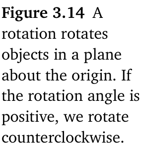
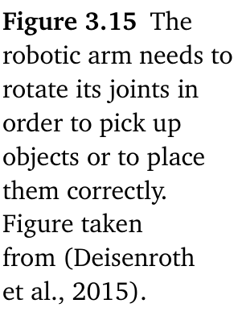
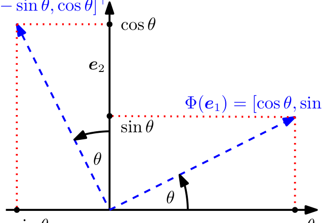
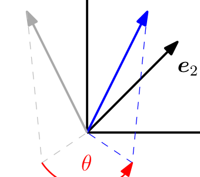

## 3.9 旋转

正如在 3.4 节中所讨论的，保持长度和夹角不变是具有正交变换矩阵的线性映射的两个特征。接下来，我们将仔细研究描述旋转的特定正交变换矩阵。

一个 _旋转（rotation）_ 是一个线性映射（更具体地，是欧氏向量空间的一个自同构），它将平面绕原点旋转角度 $ \theta $，即原点是一个不动点。按照通用约定，对于正角 $ \theta > 0 $，我们按逆时针方向旋转。图 3.14 给出了一个示例，其中的变换矩阵为：
$$
\boldsymbol R = \begin{bmatrix} -0.38 & -0.92 \\ 0.92 & -0.38 \end{bmatrix}
\tag{3.74}
$$

   
  <b>图 3.14 旋转将平面内的物体绕原点旋转。如果旋转角为正，则按逆时针方向旋转。</b> 

旋转的重要应用领域包括计算机图形学和机器人学。例如，在机器人学中，通常需要知道如何旋转机械臂的关节以便抓取或放置物体，参见图 3.15。

   
  <b>图 3.15 机械臂需要旋转其关节以便抓取或准确定位物体。图引自 (Deisenroth et al., 2015)。</b> 

### 3.9.1 $\mathbb{R}^2$ 中的旋转

考虑 $ \mathbb{R}^2 $ 的标准基：
$$
\boldsymbol e_1 = \begin{bmatrix} 1 \\ 0 \end{bmatrix}, \quad \boldsymbol e_2 = \begin{bmatrix} 0 \\ 1 \end{bmatrix}
$$
它定义了 $ \mathbb{R}^2 $ 中的标准坐标系。我们的目标是将该坐标系旋转角度 $ \theta $，如图 3.16 所示。注意，旋转后的向量仍然是线性无关的，因此它们构成了 $ \mathbb{R}^2 $ 的一组基。这意味着旋转执行了一次基变换。

   
  <b>图 3.16 R² 中的标准基旋转角度 θ。</b> 

旋转 $ \Phi $ 是线性映射，因此我们可以用一个 _旋转矩阵（rotation matrix）_ $ \boldsymbol R(\theta) $ 来表示它们。利用三角学知识（见图 3.16），我们可以确定旋转后的坐标轴（即 $ \Phi $ 的像）相对于 $ \mathbb{R}^2 $ 标准基的坐标。我们得到：
$$
\Phi(\boldsymbol e_1) = \begin{bmatrix} \cos\theta \\ \sin\theta \end{bmatrix}, \quad \Phi(\boldsymbol e_2) = \begin{bmatrix} -\sin\theta \\ \cos\theta \end{bmatrix}
\tag{3.75}
$$
因此，执行到旋转后坐标的基变换矩阵 $ \boldsymbol R(\theta) $ 由下式给出：
$$
\boldsymbol R(\theta) = \begin{bmatrix} \Phi(\boldsymbol e_1) & \Phi(\boldsymbol e_2) \end{bmatrix} = \begin{bmatrix} \cos\theta & -\sin\theta \\ \sin\theta & \cos\theta \end{bmatrix}
\tag{3.76}
$$

### 3.9.2 $\mathbb{R}^3$ 中的旋转

与 $ \mathbb{R}^2 $ 的情形不同，在 $ \mathbb{R}^3 $ 中，我们可以将任意二维平面绕一维轴进行旋转。指定一般旋转矩阵的最简单方法是：指定标准基 $ \boldsymbol e_1, \boldsymbol e_2, \boldsymbol e_3 $ 的像应该如何旋转，并确保这些像 $ \boldsymbol R \boldsymbol e_1, \boldsymbol R \boldsymbol e_2, \boldsymbol R \boldsymbol e_3 $ 彼此相互标准正交。然后，我们可以通过组合标准基的像来得到一般的旋转矩阵 $ \boldsymbol R $。

为了使旋转角有明确的几何意义，当在高于两维的空间中操作时，我们必须明确“逆时针”的含义。我们采用如下约定：绕某个轴的“逆时针”（平面）旋转是指当我们从该轴的“末端正对轴向原点看去”时的旋转。因此，在 $ \mathbb{R}^3 $ 中，存在绕三个标准基向量的三个（平面）旋转（见图 3.17）：

   
  <b>图 3.17 R³ 中的向量（灰色）绕 e₃ 轴旋转角度 θ。旋转后的向量显示为蓝色。</b> 

绕 $ \boldsymbol e_1 $ 轴旋转：
$$
\boldsymbol R_1(\theta) = \begin{bmatrix} \Phi(\boldsymbol e_1) & \Phi(\boldsymbol e_2) & \Phi(\boldsymbol e_3) \end{bmatrix} = \begin{bmatrix} 1 & 0 & 0 \\ 0 & \cos\theta & -\sin\theta \\ 0 & \sin\theta & \cos\theta \end{bmatrix}
\tag{3.77}
$$
在此处，$ \boldsymbol e_1 $ 坐标保持固定，逆时针旋转在 $ \boldsymbol e_2\boldsymbol e_3 $ 平面内进行。

绕 $ \boldsymbol e_2 $ 轴旋转：
$$
\boldsymbol R_2(\theta) = \begin{bmatrix} \cos\theta & 0 & \sin\theta \\ 0 & 1 & 0 \\ -\sin\theta & 0 & \cos\theta \end{bmatrix}
\tag{3.78}
$$
如果我们绕 $ \boldsymbol e_2 $ 轴旋转 $ \boldsymbol e_1\boldsymbol e_3 $ 平面，我们需要从 $ \boldsymbol e_2 $ 轴的“尖端”朝向原点看去。

绕 $ \boldsymbol e_3 $ 轴旋转：
$$
\boldsymbol R_3(\theta) = \begin{bmatrix} \cos\theta & -\sin\theta & 0 \\ \sin\theta & \cos\theta & 0 \\ 0 & 0 & 1 \end{bmatrix}
\tag{3.79}
$$
图 3.17 说明了这一旋转。

### 3.9.3 $n$ 维空间中的旋转

将旋转从二维和三维推广到 $ n $ 维欧氏向量空间，可以直观地描述为：固定 $ n - 2 $ 个维度，并将旋转限制在 $ n $ 维空间中的一个二维平面内。正如在三维情形中一样，我们可以旋转任意平面（$ \mathbb{R}^n $ 的二维子空间）。

**定义 3.11**（吉文斯旋转）。设 $ V $ 为一个 $ n $ 维欧氏向量空间，$ \Phi: V \to V $ 为一个自同构，其变换矩阵为：
$$
\boldsymbol R_{ij}(\theta) := \begin{bmatrix} \boldsymbol I_{i-1} & \mathbf{0} & \cdots & \cdots & \mathbf{0} \\ \mathbf{0} & \cos\theta & \mathbf{0} & -\sin\theta & \mathbf{0} \\ \mathbf{0} & \mathbf{0} & \boldsymbol I_{j-i-1} & \mathbf{0} & \mathbf{0} \\ \mathbf{0} & \sin\theta & \mathbf{0} & \cos\theta & \mathbf{0} \\ \mathbf{0} & \cdots & \cdots & \mathbf{0} & \boldsymbol I_{n-j} \end{bmatrix} \in \mathbb{R}^{n \times n}
\tag{3.80}
$$
其中 $ 1 \leqslant i < j \leqslant n $ 且 $ \theta \in \mathbb{R} $。则称 $ \boldsymbol R_{ij}(\theta) $ 为一个 _吉文斯旋转（Givens rotation）_ 。

本质上，$ \boldsymbol R_{ij}(\theta) $ 是满足下列条件的单位矩阵 $ \boldsymbol I_n $：
$$
r_{ii} = \cos\theta, \quad r_{ij} = -\sin\theta, \quad r_{ji} = \sin\theta, \quad r_{jj} = \cos\theta
\tag{3.81}
$$
在二维情况下（即 $ n = 2 $），我们得到式 (3.76) 作为其特例。

### 3.9.4 旋转的性质

旋转表现出一系列有用的性质，这些性质可以通过将它们视为正交矩阵（定义 3.8）来推导得出：

- 旋转保持距离不变，即 $ \|\boldsymbol x - \boldsymbol y\| = \|\boldsymbol R_\theta(\boldsymbol x) - \boldsymbol R_\theta(\boldsymbol y)\| $。换句话说，旋转变换后任意两点之间的距离保持不变。
- 旋转保持夹角不变，即 $ \boldsymbol R_\theta \boldsymbol x $ 与 $ \boldsymbol R_\theta \boldsymbol y $ 之间的夹角等于 $ \boldsymbol x $ 与 $ \boldsymbol y $ 之间的夹角。
- 三维（或更高维）中的旋转通常是不可交换的。因此，即使是绕同一个点旋转，应用旋转的顺序也是至关重要的。只有在二维空间中，向量旋转才是可交换的，即对于所有的 $ \phi, \theta \in [0, 2\pi) $，都有 $ \boldsymbol R(\phi)\boldsymbol R(\theta) = \boldsymbol R(\theta)\boldsymbol R(\phi) $。仅当它们绕同一个点（例如原点）旋转时，才在乘法运算下构成一个 _阿贝尔群（Abelian group）_ 。
