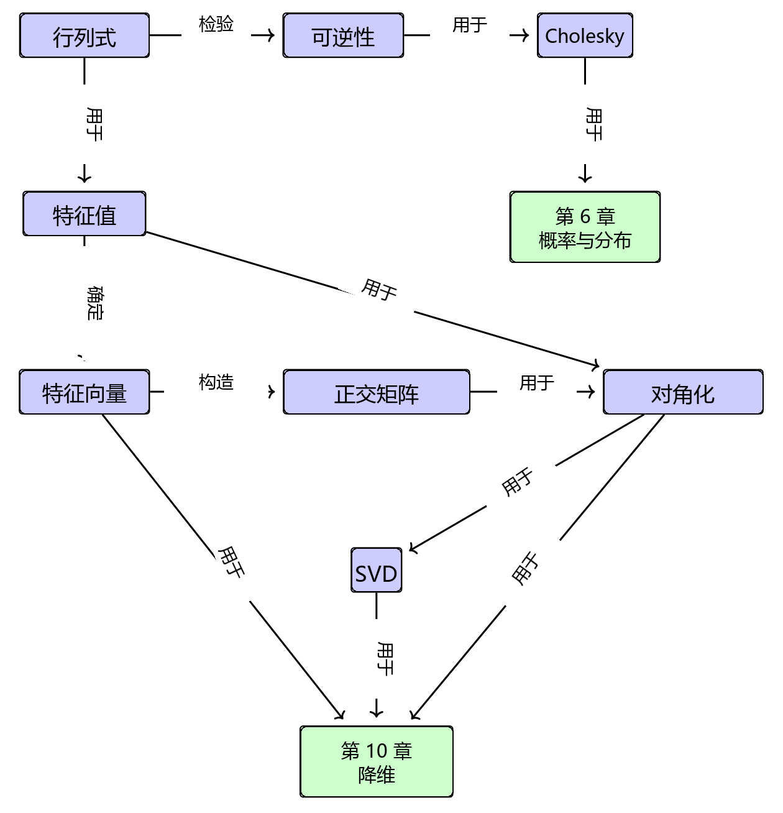

# 4 矩阵分解

在第 2 章和第 3 章中，我们研究了处理和度量向量、向量投影以及线性映射的方法。向量的映射与变换可以方便地描述为矩阵执行的运算。此外，数据通常也以矩阵形式表示，例如矩阵的行表示不同的人，而列描述这些人的不同特征（如体重、身高和社会经济地位等）。在本章中，我们将介绍矩阵的三个方面：如何概括矩阵、如何分解矩阵，以及如何将这些分解用于矩阵近似。

我们首先考虑仅用几个数字来刻画矩阵总体性质的方法。我们将在行列式（第 4.1 节）和特征值（第 4.2 节）中针对方阵这一重要特殊情形进行讨论。这些特征数字具有重要的数学意义，能让我们快速掌握矩阵具备哪些有用性质。在此基础上，我们将进一步讨论矩阵分解方法：矩阵分解的一个类比是数的因数分解，例如将 21 分解为质数 $ 7 \cdot 3 $。出于这个原因，矩阵分解通常也被称为 _矩阵因子分解（matrix factorization）_ 。矩阵分解旨在通过可解释矩阵的因子所构成的一种不同表示来描述矩阵。

我们将首先讨论对称正定矩阵的一种类似于“开方”的运算：Cholesky 分解（第 4.3 节）。随后，我们将介绍将矩阵分解为规范形式的两种相关方法。第一种称为矩阵对角化（第 4.4 节），如果选择适当的基，它允许我们使用对角变换矩阵来表示线性映射。第二种方法是奇异值分解（SVD，第 4.5 节），它将该分解推广到了非方阵情形，被认为是线性代数中最基础的概念之一。这些分解非常有用，因为表示数值数据的矩阵通常非常庞大且难以直接分析。最后，我们将以矩阵分类体系（第 4.7 节）的形式系统概述矩阵的类型及其区分特征，以总结全章。

我们在本章介绍的方法不仅在后续的数学章节（例如第 6 章）中发挥重要作用，而且在应用章节中同样不可或缺，例如第 10 章的降维和第 11 章的密度估计。本章的总体结构如图 4.1 的思维导图所示。

   
  <b>图 4.1 本章介绍的概念的思维导图，以及它们在本书其他部分中的应用场景。</b> 

