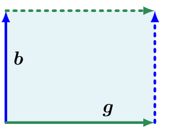
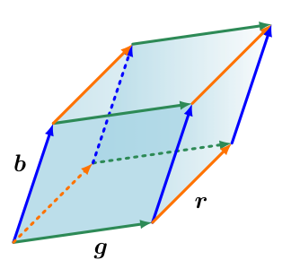

## 4.1 行列式与迹

行列式是线性代数中的重要概念。行列式是线性方程组分析与求解中的一种数学对象。行列式仅对方阵 $ \boldsymbol A \in \mathbb{R}^{n \times n} $（即行数与列数相等的矩阵）有定义。在本书中，我们将行列式记为 $ \det(\boldsymbol A) $，有时也记作 $ |\boldsymbol A| $，因此：
$$ \det(\boldsymbol A) = \begin{vmatrix} a_{11} & a_{12} & \cdots & a_{1n} \\ a_{21} & a_{22} & \cdots & a_{2n} \\ \vdots & \vdots & \ddots & \vdots \\ a_{n1} & a_{n2} & \cdots & a_{nn} \end{vmatrix} \tag{4.1} $$

_备注_ 。行列式记号 $ |\boldsymbol A| $ 切勿与绝对值混淆。♦

方阵 $ \boldsymbol A \in \mathbb{R}^{n \times n} $ 的 _行列式（determinant）_ 是一个将 $ \boldsymbol A $ 映射到实数的函数。在给出一般 $ n \times n $ 矩阵的行列式定义之前，我们先来看一些具有启发性的示例，并定义一些特殊矩阵的行列式。

> **例 4.1（检验矩阵的可逆性）**
> 
> 我们首先探讨方阵 $ \boldsymbol A $ 是否可逆（参见第 2.2.2 节）。对于最小维度的情形，我们已经知道矩阵何时可逆。如果 $ \boldsymbol A $ 是 $ 1 \times 1 $ 矩阵（即一个标量），那么 $ \boldsymbol A = a \implies \boldsymbol A^{-1} = \frac{1}{a} $。因此，$ a \cdot \frac{1}{a} = 1 $ 成立当且仅当 $ a \neq 0 $。
> 
> 对于 $ 2 \times 2 $ 矩阵，由逆矩阵的定义（定义 2.3），我们知道 $ \boldsymbol A \boldsymbol A^{-1} = \boldsymbol I $。结合式 (2.24)，$ \boldsymbol A $ 的逆矩阵为：
> $$ \boldsymbol A^{-1} = \frac{1}{a_{11}a_{22} - a_{12}a_{21}} \begin{bmatrix} a_{22} & -a_{12} \\ -a_{21} & a_{11} \end{bmatrix} \tag{4.2} $$
> 因此，$ \boldsymbol A $ 可逆当且仅当：
> $$ a_{11}a_{22} - a_{12}a_{21} \neq 0 \tag{4.3} $$
> 该量即为 $ \boldsymbol A \in \mathbb{R}^{2 \times 2} $ 的行列式，即：
> $$ \det(\boldsymbol A) = \begin{vmatrix} a_{11} & a_{12} \\ a_{21} & a_{22} \end{vmatrix} = a_{11}a_{22} - a_{12}a_{21} \tag{4.4} $$

例 4.1 已经指出了行列式与逆矩阵存在性之间的关系。下面的定理将这一结论推广到一般 $ n \times n $ 矩阵。

**定理 4.1**。对于任意方阵 $ \boldsymbol A \in \mathbb{R}^{n \times n} $，$ \boldsymbol A $ 可逆当且仅当 $ \det(\boldsymbol A) \neq 0 $。

对于小型矩阵，我们可以根据矩阵元素给出行列式的显式（闭式）表达式。对于 $ n = 1 $：
$$ \det(\boldsymbol A) = \det(a_{11}) = a_{11} \tag{4.5} $$
对于 $ n = 2 $：
$$ \det(\boldsymbol A) = \begin{vmatrix} a_{11} & a_{12} \\ a_{21} & a_{22} \end{vmatrix} = a_{11}a_{22} - a_{12}a_{21} \tag{4.6} $$
这正是我们在前一个示例中观察到的结果。

对于 $ n = 3 $，对应的计算法则称为 _萨鲁斯法则（Sarrus' rule）_ ：
$$ \begin{vmatrix} a_{11} & a_{12} & a_{13} \\ a_{21} & a_{22} & a_{23} \\ a_{31} & a_{32} & a_{33} \end{vmatrix} = a_{11}a_{22}a_{33} + a_{21}a_{32}a_{13} + a_{31}a_{12}a_{23} - a_{31}a_{22}a_{13} - a_{11}a_{32}a_{23} - a_{21}a_{12}a_{33} \tag{4.7} $$

为了便于记忆萨鲁斯法则中的乘积项，可以尝试在矩阵中画出对角线乘积元素。

如果方阵 $ \boldsymbol T $ 满足当 $ i > j $ 时 $ T_{ij} = 0 $（即主对角线下方元素全为 0），我们称其为 _上三角矩阵（upper-triangular matrix）_ 。类似地，如果主对角线上方元素全为 0，我们定义其为 _下三角矩阵（lower-triangular matrix）_ 。对于三角矩阵 $ \boldsymbol T \in \mathbb{R}^{n \times n} $，其行列式是对角线元素的乘积，即：
$$ \det(\boldsymbol T) = \prod_{i=1}^n T_{ii} \tag{4.8} $$

   
  <b>图 4.2 由向量 b 和 g 张成的平行四边形（阴影区域）面积为 |det([b, g])|。</b> 

   
  <b>图 4.3 由向量 r, b, g 张成的平行六面体（阴影体积）体积为 |det([r, b, g])|。</b> 

> **例 4.2（行列式作为体积的度量）**
> 
> 当我们将行列式视为从张成 $ \mathbb{R}^n $ 中几何对象的 $ n $ 个向量集合出发的映射时，行列式的概念是非常自然的。事实表明，行列式 $ \det(\boldsymbol A) $ 是由矩阵 $ \boldsymbol A $ 的列向量构成的 $ n $ 维平行多面体的 _有向体积（signed volume）_ 。
> 
> 对于 $ n = 2 $，矩阵的列向量构成一个平行四边形；参见图 4.2。随着向量之间的夹角变小，平行四边形的面积也会缩小。考虑构成矩阵 $ \boldsymbol A = [\boldsymbol b, \boldsymbol g] $ 列向量的两个向量 $ \boldsymbol b, \boldsymbol g $。那么，$ \boldsymbol A $ 的行列式绝对值等于以 $ \boldsymbol 0, \boldsymbol b, \boldsymbol g, \boldsymbol b + \boldsymbol g $ 为顶点的平行四边形的面积。特别地，如果 $ \boldsymbol b, \boldsymbol g $ 线性相关（即对某个 $ \lambda \in \mathbb{R} $ 有 $ \boldsymbol b = \lambda \boldsymbol g $），它们便不再构成二维平行四边形，因此对应面积为 0。相反，若 $ \boldsymbol b, \boldsymbol g $ 线性无关且是标准基向量 $ \boldsymbol e_1, \boldsymbol e_2 $ 的倍数，则它们可以写为 $ \boldsymbol b = \begin{bmatrix} b \\ 0 \end{bmatrix} $ 和 $ \boldsymbol g = \begin{bmatrix} 0 \\ g \end{bmatrix} $，行列式为：
> $$ \begin{vmatrix} b & 0 \\ 0 & g \end{vmatrix} = bg - 0 = bg $$
> 行列式的符号表示张成向量 $ \boldsymbol b, \boldsymbol g $ 相对于标准基 $ (\boldsymbol e_1, \boldsymbol e_2) $ 的 _定向（orientation）_ 。在图 4.2 中，若将顺序翻转为 $ \boldsymbol g, \boldsymbol b $，则交换了 $ \boldsymbol A $ 的列，并反转了阴影区域的定向。这就转化为了我们熟悉的公式：$ \text{面积} = \text{底} \times \text{高} $。
> 
> 这种直觉可以推广到更高维度。在 $ \mathbb{R}^3 $ 中，考虑三个向量 $ \boldsymbol r, \boldsymbol b, \boldsymbol g \in \mathbb{R}^3 $ 张成平行六面体的棱，即各个面均为平行四边形的多面体（参见图 4.3）。$ 3 \times 3 $ 矩阵 $ [\boldsymbol r, \boldsymbol b, \boldsymbol g] $ 行列式的绝对值就是该立体的体积。因此，行列式充当了度量由矩阵各列向量组合构成的有向体积的函数。
> 
> 考虑如下给出的三个线性无关向量 $ \boldsymbol r, \boldsymbol g, \boldsymbol b \in \mathbb{R}^3 $：
> $$ \boldsymbol r = \begin{bmatrix} 2 \\ 0 \\ -8 \end{bmatrix}, \quad \boldsymbol g = \begin{bmatrix} 6 \\ 1 \\ 0 \end{bmatrix}, \quad \boldsymbol b = \begin{bmatrix} 1 \\ 4 \\ -1 \end{bmatrix} \tag{4.9} $$
> 将这些向量写为矩阵的列：
> $$ \boldsymbol A = [\boldsymbol r, \boldsymbol g, \boldsymbol b] = \begin{bmatrix} 2 & 6 & 1 \\ 0 & 1 & 4 \\ -8 & 0 & -1 \end{bmatrix} \tag{4.10} $$
> 这允许我们计算所需的体积：
> $$ V = |\det(\boldsymbol A)| = 186 \tag{4.11} $$

计算 $ n \times n $ 矩阵的行列式需要一般的算法来求解 $ n > 3 $ 的情形，我们将在下文中进行探讨。下面的定理 4.2 将计算 $ n \times n $ 矩阵行列式的问题归结为计算 $ (n - 1) \times (n - 1) $ 矩阵的行列式。通过递归应用拉普拉斯展开（定理 4.2），我们可以通过最终计算 $ 2 \times 2 $ 矩阵的行列式来计算任意 $ n \times n $ 矩阵的行列式。

**定理 4.2**（拉普拉斯展开 / Laplace Expansion）。考虑矩阵 $ \boldsymbol A \in \mathbb{R}^{n \times n} $。那么对于所有的 $ j = 1, \ldots, n $：
1. 沿第 $ j $ 列展开：
$$ \det(\boldsymbol A) = \sum_{k=1}^n (-1)^{k+j} a_{kj} \det(\boldsymbol A_{k,j}) \tag{4.12} $$
2. 沿第 $ j $ 行展开：
$$ \det(\boldsymbol A) = \sum_{k=1}^n (-1)^{k+j} a_{jk} \det(\boldsymbol A_{j,k}) \tag{4.13} $$
这里 $ \boldsymbol A_{k,j} \in \mathbb{R}^{(n-1) \times (n-1)} $ 是从 $ \boldsymbol A $ 中划去第 $ k $ 行与第 $ j $ 列后得到的子矩阵。$ \det(\boldsymbol A_{k,j}) $ 称为 _余子式（minor）_ ，而 $ (-1)^{k+j}\det(\boldsymbol A_{k,j}) $ 称为 _代数余子式（cofactor）_ 。

> **例 4.3（拉普拉斯展开）**
> 
> 我们使用沿第一行的拉普拉斯展开来计算矩阵：
> $$ \boldsymbol A = \begin{bmatrix} 1 & 2 & 3 \\ 3 & 1 & 2 \\ 0 & 0 & 1 \end{bmatrix} \tag{4.14} $$
> 的行列式。应用式 (4.13) 得到：
> $$ \begin{vmatrix} 1 & 2 & 3 \\ 3 & 1 & 2 \\ 0 & 0 & 1 \end{vmatrix} = (-1)^{1+1} \cdot 1 \begin{vmatrix} 1 & 2 \\ 0 & 1 \end{vmatrix} + (-1)^{1+2} \cdot 2 \begin{vmatrix} 3 & 2 \\ 0 & 1 \end{vmatrix} + (-1)^{1+3} \cdot 3 \begin{vmatrix} 3 & 1 \\ 0 & 0 \end{vmatrix} \tag{4.15} $$
> 利用式 (4.6) 计算所有 $ 2 \times 2 $ 矩阵的行列式，得到：
> $$ \det(\boldsymbol A) = 1(1 - 0) - 2(3 - 0) + 3(0 - 0) = -5 \tag{4.16} $$
> 为了完整起见，我们可以将此结果与利用萨鲁斯法则 (4.7) 计算的结果进行比对：
> $$ \det(\boldsymbol A) = 1 \cdot 1 \cdot 1 + 3 \cdot 0 \cdot 3 + 0 \cdot 2 \cdot 2 - 0 \cdot 1 \cdot 3 - 1 \cdot 0 \cdot 2 - 3 \cdot 2 \cdot 1 = 1 - 6 = -5 \tag{4.17} $$

对于 $ \boldsymbol A \in \mathbb{R}^{n \times n} $，行列式具备以下性质：
- 矩阵乘积的行列式等于对应行列式的乘积：$ \det(\boldsymbol A \boldsymbol B) = \det(\boldsymbol A)\det(\boldsymbol B) $。
- 行列式关于转置不变，即 $ \det(\boldsymbol A) = \det(\boldsymbol A^\top) $。
- 若 $ \boldsymbol A $ 正则（可逆），则 $ \det(\boldsymbol A^{-1}) = \frac{1}{\det(\boldsymbol A)} $。
- 相似矩阵（定义 2.22）拥有相同的行列式。因此，对于线性映射 $ \Phi : V \to V $，$ \Phi $ 的所有变换矩阵 $ \boldsymbol A_\Phi $ 具有相同的行列式。换言之，行列式与线性映射基的选择无关。
- 将某一列/行乘上标量后加到另一列/行，不改变 $ \det(\boldsymbol A) $。
- 将某一列/行乘以 $ \lambda \in \mathbb{R} $，使得 $ \det(\boldsymbol A) $ 缩放 $ \lambda $ 倍。特别地，$ \det(\lambda \boldsymbol A) = \lambda^n \det(\boldsymbol A) $。
- 交换两行/列会改变 $ \det(\boldsymbol A) $ 的符号。

由于最后三条性质，我们可以使用高斯消元法（参见第 2.1 节）将 $ \boldsymbol A $ 化为行阶梯形来计算 $ \det(\boldsymbol A) $。当我们将 $ \boldsymbol A $ 化为对角线下方全为 0 的三角形式时，便可终止高斯消元。回顾式 (4.8)，三角矩阵的行列式等于对角线元素的乘积。

**定理 4.3**。方阵 $ \boldsymbol A \in \mathbb{R}^{n \times n} $ 满足 $ \det(\boldsymbol A) \neq 0 $ 当且仅当 $ \operatorname{rk}(\boldsymbol A) = n $。换言之，$ \boldsymbol A $ 可逆当且仅当它是满秩的。

在数学主要依靠手工计算的时代，计算行列式被认为是分析矩阵可逆性的重要途径。然而，现代机器学习方法使用直接数值方法取代了显式行列式计算。例如在第 2 章中，我们学习了逆矩阵可以通过高斯消元法计算。因此，高斯消元法同样可用于计算矩阵的行列式。

行列式在后续章节中具有重要的理论作用，尤其是当我们通过特征多项式学习特征值和特征向量（第 4.2 节）时。

---

### 4.1.1 迹

**定义 4.4**（迹）。方阵 $ \boldsymbol A \in \mathbb{R}^{n \times n} $ 的 _迹（trace）_ 定义为：
$$ \operatorname{tr}(\boldsymbol A) := \sum_{i=1}^n a_{ii} \tag{4.18} $$
即迹是 $ \boldsymbol A $ 主对角线上各元素的和。

迹满足以下性质：
- 对于 $ \boldsymbol A, \boldsymbol B \in \mathbb{R}^{n \times n} $：$ \operatorname{tr}(\boldsymbol A + \boldsymbol B) = \operatorname{tr}(\boldsymbol A) + \operatorname{tr}(\boldsymbol B) $
- 对于 $ \alpha \in \mathbb{R}, \boldsymbol A \in \mathbb{R}^{n \times n} $：$ \operatorname{tr}(\alpha \boldsymbol A) = \alpha \operatorname{tr}(\boldsymbol A) $
- $ \operatorname{tr}(\boldsymbol I_n) = n $
- 对于 $ \boldsymbol A \in \mathbb{R}^{n \times k}, \boldsymbol B \in \mathbb{R}^{k \times n} $：$ \operatorname{tr}(\boldsymbol A \boldsymbol B) = \operatorname{tr}(\boldsymbol B \boldsymbol A) $

可以证明，同时满足这四个性质的函数是唯一的——即迹函数（Gohberg et al., 2012）。

矩阵乘积的迹具有更一般的性质。特别地，迹在循环排列下保持不变，即：
$$ \operatorname{tr}(\boldsymbol A \boldsymbol K \boldsymbol L) = \operatorname{tr}(\boldsymbol K \boldsymbol L \boldsymbol A) \tag{4.19} $$
其中 $ \boldsymbol A \in \mathbb{R}^{a \times k}, \boldsymbol K \in \mathbb{R}^{k \times l}, \boldsymbol L \in \mathbb{R}^{l \times a} $。该性质可推广至任意多个矩阵的乘积。作为式 (4.19) 的特例，对于两个向量 $ \boldsymbol x, \boldsymbol y \in \mathbb{R}^n $，有：
$$ \operatorname{tr}(\boldsymbol x \boldsymbol y^\top) = \operatorname{tr}(\boldsymbol y^\top \boldsymbol x) = \boldsymbol y^\top \boldsymbol x \in \mathbb{R} \tag{4.20} $$

给定向量空间 $ V $ 上的线性映射 $ \Phi : V \to V $，我们利用 $ \Phi $ 的矩阵表示的迹来定义该映射的迹。对于 $ V $ 的一组给定基，我们可以通过变换矩阵 $ \boldsymbol A $ 描述 $ \Phi $，那么 $ \Phi $ 的迹就是 $ \boldsymbol A $ 的迹。对于 $ V $ 的另一组基，对应的变换矩阵 $ \boldsymbol B $ 可以通过形如 $ \boldsymbol S^{-1}\boldsymbol A\boldsymbol S $ 的基变换获得（对于某个适当的 $ \boldsymbol S $，参见第 2.7.2 节）。对于 $ \Phi $ 对应的迹，这意味着：
$$ \operatorname{tr}(\boldsymbol B) = \operatorname{tr}(\boldsymbol S^{-1}\boldsymbol A\boldsymbol S) = \operatorname{tr}(\boldsymbol A\boldsymbol S\boldsymbol S^{-1}) = \operatorname{tr}(\boldsymbol A) \tag{4.21} $$
因此，尽管线性映射的矩阵表示依赖于基的选择，但线性映射 $ \Phi $ 的迹与基的选择无关。

---

### 4.1.2 特征多项式

在本节中，我们介绍了作为刻画方阵函数的行列式与迹。综合我们对行列式与迹的理解，我们现在可以定义一个用多项式描述矩阵 $ \boldsymbol A $ 的重要方程，我们将在后续小节中广泛使用它。

**定义 4.5**（特征多项式）。对于 $ \lambda \in \mathbb{R} $ 和方阵 $ \boldsymbol A \in \mathbb{R}^{n \times n} $：
$$ p_{\boldsymbol A}(\lambda) := \det(\boldsymbol A - \lambda \boldsymbol I) \tag{4.22a} $$
$$ = c_0 + c_1\lambda + c_2\lambda^2 + \cdots + c_{n-1}\lambda^{n-1} + (-1)^n\lambda^n \tag{4.22b} $$
（其中 $ c_0, \ldots, c_{n-1} \in \mathbb{R} $）称为 $ \boldsymbol A $ 的 _特征多项式（characteristic polynomial）_ 。特别地：
$$ c_0 = \det(\boldsymbol A) \tag{4.23} $$
$$ c_{n-1} = (-1)^{n-1}\operatorname{tr}(\boldsymbol A) \tag{4.24} $$

特征多项式 (4.22a) 将允许我们计算特征值和特征向量，我们将在下一节中进行讨论。
