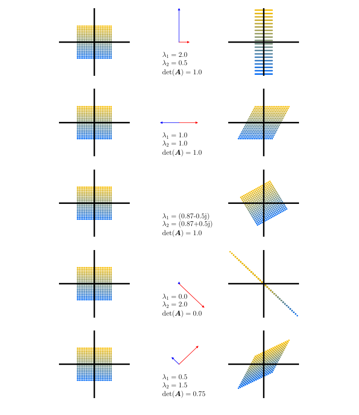
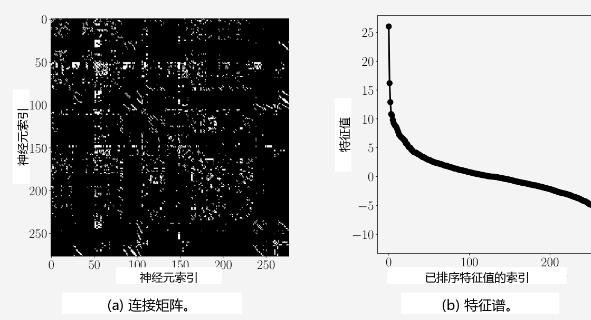
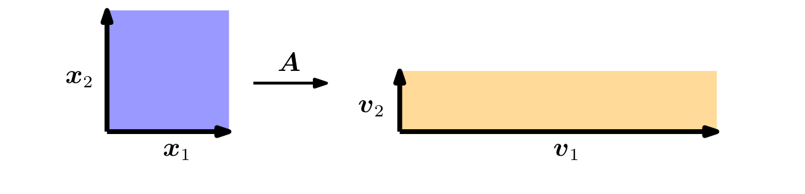

## 4.2 特征值与特征向量

现在我们将了解一种表征矩阵及其相关线性映射的新方法。回顾第 2.7.1 节，在给定有序基的情况下，每个线性映射都有一个唯一的变换矩阵。我们可以通过进行“特征（eigen）”分析来解释线性映射及其相关的变换矩阵（“eigen”是一个德语词，意为“特征的”、“自身的”或“特有的”）。正如我们将看到的，线性映射的特征值将告诉我们一组特殊的向量——特征向量——是如何被该线性映射变换的。

**定义 4.6**（特征值与特征向量）。设 $ \boldsymbol A \in \mathbb{R}^{n \times n} $ 为方阵。若满足：
$$
\boldsymbol A \boldsymbol x = \lambda \boldsymbol x
\tag{4.25}
$$
则称 $ \lambda \in \mathbb{R} $ 为 $ \boldsymbol A $ 的一个 _特征值（eigenvalue）_ ，$ \boldsymbol x \in \mathbb{R}^n \setminus \{\boldsymbol 0\} $ 为 $ \boldsymbol A $ 对应于 $ \lambda $ 的 _特征向量（eigenvector）_ 。我们称式 (4.25) 为 _特征值方程（eigenvalue equation）_ 。

_备注_ 。在线性代数文献和软件中，通常的惯例是将特征值按降序排列，使得最大的特征值及相关特征向量称为第一特征值及其相关特征向量，次大的特征值称为第二特征值及其相关特征向量，依此类推。然而，不同的教科书和出版物可能有不同甚至没有排序概念。若无明确说明，本书不预设任何排序。♦

以下命题是等价的：
- $ \lambda $ 是 $ \boldsymbol A \in \mathbb{R}^{n \times n} $ 的特征值。
- 存在 $ \boldsymbol x \in \mathbb{R}^n \setminus \{\boldsymbol 0\} $ 满足 $ \boldsymbol A \boldsymbol x = \lambda \boldsymbol x $，或者等价地，$ (\boldsymbol A - \lambda \boldsymbol I_n)\boldsymbol x = \boldsymbol 0 $ 存在非平凡解（即 $ \boldsymbol x \neq \boldsymbol 0 $）。
- $ \operatorname{rk}(\boldsymbol A - \lambda \boldsymbol I_n) < n $。
- $ \det(\boldsymbol A - \lambda \boldsymbol I_n) = 0 $。

**定义 4.7**（共线与同向）。指向相同方向的两个向量称为 _同向（codirected）_ 。如果两个向量指向相同或相反的方向，则称它们 _共线（collinear）_ 。

_备注_ （特征向量的非唯一性）。若 $ \boldsymbol x $ 是 $ \boldsymbol A $ 对应于特征值 $ \lambda $ 的特征向量，则对于任意 $ c \in \mathbb{R} \setminus \{0\} $，$ c\boldsymbol x $ 也是 $ \boldsymbol A $ 对应于相同特征值的特征向量，因为：
$$
\boldsymbol A(c\boldsymbol x) = c\boldsymbol A\boldsymbol x = c\lambda\boldsymbol x = \lambda(c\boldsymbol x)
\tag{4.26}
$$
因此，所有与 $ \boldsymbol x $ 共线的向量也都是 $ \boldsymbol A $ 的特征向量。♦

**定理 4.8**。$ \lambda \in \mathbb{R} $ 是 $ \boldsymbol A \in \mathbb{R}^{n \times n} $ 的特征值，当且仅当 $ \lambda $ 是 $ \boldsymbol A $ 的特征多项式 $ p_{\boldsymbol A}(\lambda) $ 的根。

**定义 4.9**（代数重数）。设方阵 $ \boldsymbol A $ 有一个特征值 $ \lambda_i $。$ \lambda_i $ 的 _代数重数（algebraic multiplicity）_ 是该根在特征多项式中出现的次数。

**定义 4.10**（特征空间与特征谱）。对于 $ \boldsymbol A \in \mathbb{R}^{n \times n} $，$ \boldsymbol A $ 对应于特征值 $ \lambda $ 的所有特征向量集合张成 $ \mathbb{R}^n $ 的一个子空间，称为 $ \boldsymbol A $ 关于 $ \lambda $ 的 _特征空间（eigenspace）_ ，记为 $ E_\lambda $。$ \boldsymbol A $ 的所有特征值的集合称为 $ \boldsymbol A $ 的 _特征谱（eigenspectrum）_ ，或简称为 _谱（spectrum）_ 。

若 $ \lambda $ 是 $ \boldsymbol A \in \mathbb{R}^{n \times n} $ 的特征值，则对应的特征空间 $ E_\lambda $ 是齐次线性方程组 $ (\boldsymbol A - \lambda \boldsymbol I)\boldsymbol x = \boldsymbol 0 $ 的解空间。几何上，对应于非零特征值的特征向量指向一个被该线性映射拉伸的方向。特征值就是其被拉伸的比例因子。如果特征值为负，则拉伸的方向发生反转。

> **例 4.4（单位矩阵的情形）**
> 
> 单位矩阵 $ \boldsymbol I \in \mathbb{R}^{n \times n} $ 的特征多项式为 $ p_{\boldsymbol I}(\lambda) = \det(\boldsymbol I - \lambda \boldsymbol I) = (1 - \lambda)^n = 0 $，它只有一个出现 $ n $ 次的特征值 $ \lambda = 1 $。此外，对所有向量 $ \boldsymbol x \in \mathbb{R}^n \setminus \{\boldsymbol 0\} $，均有 $ \boldsymbol I \boldsymbol x = \lambda \boldsymbol x = 1 \boldsymbol x $ 成立。正因如此，单位矩阵唯一的特征空间 $ E_1 $ 具有 $ n $ 维，且 $ \mathbb{R}^n $ 的所有 $ n $ 个标准基向量都是 $ \boldsymbol I $ 的特征向量。

关于特征值和特征向量的一些有用性质包括：
- 矩阵 $ \boldsymbol A $ 及其转置 $ \boldsymbol A^\top $ 拥有相同的特征值，但不一定拥有相同的特征向量。
- 特征空间 $ E_\lambda $ 是 $ \boldsymbol A - \lambda \boldsymbol I $ 的零空间，因为：
$$
\boldsymbol A \boldsymbol x = \lambda \boldsymbol x \iff \boldsymbol A \boldsymbol x - \lambda \boldsymbol x = \boldsymbol 0
\tag{4.27a}
$$
$$
\iff (\boldsymbol A - \lambda \boldsymbol I)\boldsymbol x = \boldsymbol 0 \iff \boldsymbol x \in \ker(\boldsymbol A - \lambda \boldsymbol I)
\tag{4.27b}
$$
- 相似矩阵（参见定义 2.22）具有相同的特征值。因此，线性映射 $ \Phi $ 的特征值与其变换矩阵的基的选择无关。这使得特征值与行列式及迹一样，成为线性映射的关键特征参数，因为它们在基变换下均保持不变。
- 对称正定矩阵总是具有正的实特征值。

> **例 4.5（计算特征值、特征向量与特征空间）**
> 
> 让我们求 $ 2 \times 2 $ 矩阵：
> $$
> \boldsymbol A = \begin{bmatrix} 4 & 2 \\ 1 & 3 \end{bmatrix}
> \tag{4.28}
> $$
> 的特征值与特征向量。
> 
> **步骤 1：特征多项式**。根据对特征向量 $ \boldsymbol x \neq \boldsymbol 0 $ 与特征值 $ \lambda $ 的定义，存在向量使得 $ \boldsymbol A \boldsymbol x = \lambda \boldsymbol x $，即 $ (\boldsymbol A - \lambda \boldsymbol I)\boldsymbol x = \boldsymbol 0 $。由于 $ \boldsymbol x \neq \boldsymbol 0 $，这要求 $ \boldsymbol A - \lambda \boldsymbol I $ 的核（零空间）包含除 $ \boldsymbol 0 $ 之外的其他元素。这意味着 $ \boldsymbol A - \lambda \boldsymbol I $ 不可逆，因此 $ \det(\boldsymbol A - \lambda \boldsymbol I) = 0 $。因此，我们需要计算特征多项式 (4.22a) 的根来求解特征值。
> 
> **步骤 2：特征值**。特征多项式为：
> $$
> p_{\boldsymbol A}(\lambda) = \det(\boldsymbol A - \lambda \boldsymbol I)
> \tag{4.29a}
> $$
> $$
> = \det\left(\begin{bmatrix} 4 & 2 \\ 1 & 3 \end{bmatrix} - \begin{bmatrix} \lambda & 0 \\ 0 & \lambda \end{bmatrix}\right) = \begin{vmatrix} 4 - \lambda & 2 \\ 1 & 3 - \lambda \end{vmatrix}
> \tag{4.29b}
> $$
> $$
> = (4 - \lambda)(3 - \lambda) - 2 \cdot 1
> \tag{4.29c}
> $$
> 对特征多项式进行因式分解，得到：
> $$
> p(\lambda) = (4 - \lambda)(3 - \lambda) - 2 \cdot 1 = 10 - 7\lambda + \lambda^2 = (2 - \lambda)(5 - \lambda)
> \tag{4.30}
> $$
> 由此求得特征根为 $ \lambda_1 = 2 $ 和 $ \lambda_2 = 5 $。
> 
> **步骤 3：特征向量与特征空间**。我们通过寻找满足如下条件的向量 $ \boldsymbol x $ 来求对应于这些特征值的特征向量：
> $$
> \begin{bmatrix} 4 - \lambda & 2 \\ 1 & 3 - \lambda \end{bmatrix} \boldsymbol x = \boldsymbol 0
> \tag{4.31}
> $$
> 对于 $ \lambda = 5 $，我们得到：
> $$
> \begin{bmatrix} 4 - 5 & 2 \\ 1 & 3 - 5 \end{bmatrix} \begin{bmatrix} x_1 \\ x_2 \end{bmatrix} = \begin{bmatrix} -1 & 2 \\ 1 & -2 \end{bmatrix} \begin{bmatrix} x_1 \\ x_2 \end{bmatrix} = \boldsymbol 0
> \tag{4.32}
> $$
> 求解该齐次线性方程组，得到解空间：
> $$
> E_5 = \operatorname{span}\left[\begin{bmatrix} 2 \\ 1 \end{bmatrix}\right]
> \tag{4.33}
> $$
> 该特征空间是一维的，因为它只包含一个基向量。
> 
> 类似地，我们通过求解齐次方程组来求 $ \lambda = 2 $ 对应的特征向量：
> $$
> \begin{bmatrix} 4 - 2 & 2 \\ 1 & 3 - 2 \end{bmatrix} \boldsymbol x = \begin{bmatrix} 2 & 2 \\ 1 & 1 \end{bmatrix} \boldsymbol x = \boldsymbol 0
> \tag{4.34}
> $$
> 这意味着满足 $ x_2 = -x_1 $ 的任意向量 $ \boldsymbol x = \begin{bmatrix} x_1 \\ x_2 \end{bmatrix} $（例如 $ \begin{bmatrix} 1 \\ -1 \end{bmatrix} $）都是对应于特征值 2 的特征向量。对应的特征空间为：
> $$
> E_2 = \operatorname{span}\left[\begin{bmatrix} 1 \\ -1 \end{bmatrix}\right]
> \tag{4.35}
> $$

例 4.5 中的两个特征空间 $ E_5 $ 和 $ E_2 $ 都是一维的，因为它们各自仅由一个向量张成。然而，在其他情况下，我们可能会遇到多个相同的特征值（参见定义 4.9），此时特征空间的维数可能大于一。

**定义 4.11**（几何重数）。设 $ \lambda_i $ 为方阵 $ \boldsymbol A $ 的一个特征值。则 $ \lambda_i $ 的 _几何重数（geometric multiplicity）_ 是对应于 $ \lambda_i $ 的线性无关特征向量的数量。换言之，它是由对应于 $ \lambda_i $ 的特征向量所张成的特征空间的维数。

_备注_ 。特定特征值的几何重数必须至少为 1，因为每个特征值都至少有一个相关的特征向量。特征值的几何重数不能超过其代数重数，但可以小于代数重数。♦

> **例 4.6**
> 
> 矩阵：
> $$
> \boldsymbol A = \begin{bmatrix} 2 & 1 \\ 0 & 2 \end{bmatrix}
> $$
> 具有两个重根特征值 $ \lambda_1 = \lambda_2 = 2 $，代数重数为 2。然而，该特征值仅有一个独立的单位特征向量 $ \boldsymbol x_1 = \begin{bmatrix} 1 \\ 0 \end{bmatrix} $，因此其几何重数为 1。

### 二维下的几何直觉

让我们通过不同的线性映射来建立对行列式、特征向量和特征值的直观认识。图 4.4 展示了五个变换矩阵 $ \boldsymbol A_1, \ldots, \boldsymbol A_5 $ 以及它们对以原点为中心的正方形点阵网格的影响：

- $ \boldsymbol A_1 = \begin{bmatrix} \frac{1}{2} & 0 \\ 0 & 2 \end{bmatrix} $。两个特征向量的方向对应于 $ \mathbb{R}^2 $ 中的标准基向量，即两个坐标轴。垂直轴被拉伸了 2 倍（特征值 $ \lambda_1 = 2 $），水平轴被压缩了 $ \frac{1}{2} $ 倍（特征值 $ \lambda_2 = \frac{1}{2} $）。该映射是保面积的（$ \det(\boldsymbol A_1) = 1 = 2 \cdot \frac{1}{2} $）。
- $ \boldsymbol A_2 = \begin{bmatrix} 1 & \frac{1}{2} \\ 0 & 1 \end{bmatrix} $ 对应于剪切映射（在几何学中，这种平行于坐标轴的剪切所具有的保面积性质也被称为卡瓦列里平行四边形等面积原理（Cavalieri's principle of equal areas for parallelograms, Katz, 2004））。也就是说，如果点位于垂直轴的正半轴上，则将其沿水平轴向右剪切，反之如果位于负半轴上则向左剪切。该映射是保面积的（$ \det(\boldsymbol A_2) = 1 $）。特征值 $ \lambda_1 = 1 = \lambda_2 $ 是重根，且特征向量共线（在此为了强调而在两个相反方向上绘制）。这表明该映射仅沿一个方向（水平轴）起作用。
- $ \boldsymbol A_3 = \begin{bmatrix} \cos(\frac{\pi}{6}) & -\sin(\frac{\pi}{6}) \\ \sin(\frac{\pi}{6}) & \cos(\frac{\pi}{6}) \end{bmatrix} = \frac{1}{2} \begin{bmatrix} \sqrt{3} & -1 \\ 1 & \sqrt{3} \end{bmatrix} $。矩阵 $ \boldsymbol A_3 $ 将所有点逆时针旋转 $ \frac{\pi}{6} \text{ rad} = 30^\circ $，且仅具有复特征值，这反映了该映射是一个旋转（因此未画出特征向量）。旋转必须是保体积（保面积）的，因此行列式为 1。有关旋转的更多细节，请参见第 3.9 节。
- $ \boldsymbol A_4 = \begin{bmatrix} 1 & -1 \\ -1 & 1 \end{bmatrix} $ 表示在标准基下将二维区域压缩降维到一维的映射。由于其中一个特征值为 0，沿对应于 $ \lambda_1 = 0 $ 的（蓝色）特征向量方向的空间坍缩，而正交的（红色）特征向量将空间拉伸了 $ \lambda_2 = 2 $ 倍。因此，映射像的面积为 0。
- $ \boldsymbol A_5 = \begin{bmatrix} 1 & \frac{1}{2} \\ \frac{1}{2} & 1 \end{bmatrix} $ 是一个剪切加拉伸映射，它将空间缩小了 75%，因为 $ |\det(\boldsymbol A_5)| = \frac{3}{4} $。它沿对应于 $ \lambda_2 $ 的（蓝色）特征向量将空间拉伸了 1.5 倍，并沿正交的（蓝色）特征向量将空间压缩了 0.5 倍。

   
  <b>图 4.4 行列式与特征空间。五种线性映射及其对应的变换矩阵 Aᵢ ∈ R²ˣ² 的总览，将 400 个以颜色编码的点 x ∈ R²（左列）投射到目标点 Aᵢx（右列）。中间列描绘了由其对应的特征值 λ₁ 拉伸的第一个特征向量，以及由其特征值 λ₂ 拉伸的第二个特征向量。每一行描绘了相对于标准基的五个变换矩阵 Aᵢ 之一的作用效果。</b> 

> **例 4.7（生物神经网络的特征谱）**
> 
> 分析网络数据并从中学习的方法是机器学习方法的重要组成部分。理解网络的关键是网络节点之间的连接性，特别是两个节点之间是否相互连接。在数据科学应用中，研究能够捕捉这种连接数据的矩阵通常非常有用。
> 
> 我们构建了秀丽隐杆线虫（*C. elegans*）整个神经网络的连接/邻接矩阵 $ \boldsymbol A \in \mathbb{R}^{277 \times 277} $。每一行/列代表该线虫大脑中 277 个神经元之一。如果神经元 $ i $ 通过突触与神经元 $ j $ 进行通信，则连接矩阵 $ \boldsymbol A $ 的元素值为 $ a_{ij} = 1 $，否则 $ a_{ij} = 0 $。该连接矩阵不是对称矩阵，这意味着特征值可能不是实数。因此，我们计算连接矩阵的对称化版本 $ \boldsymbol A_{\text{sym}} := \boldsymbol A + \boldsymbol A^\top $。这个新矩阵 $ \boldsymbol A_{\text{sym}} $ 如图 4.5(a) 所示，当且仅当两个神经元相连时具有非零值 $ a_{ij} $（白色像素），无论连接的方向如何。在图 4.5(b) 中，我们展示了 $ \boldsymbol A_{\text{sym}} $ 对应的特征谱。横轴表示按降序排列的特征值的索引。纵轴表示对应的特征值。这种特征谱的 S 形曲线是许多生物神经网络的典型特征。导致这一现象的潜在机制是目前神经科学活跃的研究领域。

   
  <b>图 4.5 秀丽隐杆线虫（Caenorhabditis elegans）神经网络（Kaiser and Hilgetag, 2006）。(a) 对称化连接矩阵；(b) 特征谱。</b> 

**定理 4.12**。具有 $ n $ 个互不相同特征值 $ \lambda_1, \ldots, \lambda_n $ 的矩阵 $ \boldsymbol A \in \mathbb{R}^{n \times n} $ 的特征向量 $ \boldsymbol x_1, \ldots, \boldsymbol x_n $ 是线性无关的。

该定理表明，具有 $ n $ 个互不相同特征值的矩阵的特征向量构成了 $ \mathbb{R}^n $ 的一组基。

**定义 4.13**（亏损矩阵）。若方阵 $ \boldsymbol A \in \mathbb{R}^{n \times n} $ 拥有的线性无关特征向量少于 $ n $ 个，则称其为 _亏损矩阵（defective matrix）_ 。

非亏损矩阵 $ \boldsymbol A \in \mathbb{R}^{n \times n} $ 并不一定需要 $ n $ 个互不相同的特征值，但它确实要求特征向量构成 $ \mathbb{R}^n $ 的一组基。从亏损矩阵的特征空间来看，亏损矩阵的特征空间维数之和小于 $ n $。具体而言，亏损矩阵至少有一个代数重数 $ m > 1 $ 的特征值 $ \lambda_i $，其几何重数小于 $ m $。

_备注_ 。亏损矩阵不可能拥有 $ n $ 个互不相同的特征值，因为互不相同的特征值对应线性无关的特征向量（定理 4.12）。♦

**定理 4.14**。给定矩阵 $ \boldsymbol A \in \mathbb{R}^{m \times n} $，我们总是可以通过定义：
$$
\boldsymbol S := \boldsymbol A^\top \boldsymbol A
\tag{4.36}
$$
获得一个对称半正定矩阵 $ \boldsymbol S \in \mathbb{R}^{n \times n} $。

_备注_ 。若 $ \operatorname{rk}(\boldsymbol A) = n $，则 $ \boldsymbol S := \boldsymbol A^\top \boldsymbol A $ 是对称正定的。♦

理解定理 4.14 成立的原因有助于我们认识如何利用对称化矩阵：对称性要求 $ \boldsymbol S = \boldsymbol S^\top $，代入式 (4.36) 得到 $ \boldsymbol S = \boldsymbol A^\top \boldsymbol A = \boldsymbol A^\top (\boldsymbol A^\top)^\top = (\boldsymbol A^\top \boldsymbol A)^\top = \boldsymbol S^\top $。此外，半正定性（第 3.2.3 节）要求 $ \boldsymbol x^\top \boldsymbol S \boldsymbol x \ge 0 $，代入式 (4.36) 得到 $ \boldsymbol x^\top \boldsymbol S \boldsymbol x = \boldsymbol x^\top \boldsymbol A^\top \boldsymbol A \boldsymbol x = (\boldsymbol x^\top \boldsymbol A^\top)(\boldsymbol A \boldsymbol x) = (\boldsymbol A \boldsymbol x)^\top (\boldsymbol A \boldsymbol x) \ge 0 $，因为点积计算的是平方和（其本身非负）。

**定理 4.15**（谱定理 / Spectral Theorem）。若 $ \boldsymbol A \in \mathbb{R}^{n \times n} $ 是对称的，则存在由 $ \boldsymbol A $ 的特征向量构成的对应向量空间 $ V $ 的标准正交基，且每个特征值均为实数。

谱定理的一个直接推论是：对称矩阵 $ \boldsymbol A $ 的特征分解存在（具有实特征值），并且我们可以找到由特征向量构成的标准正交基，使得 $ \boldsymbol A = \boldsymbol P \boldsymbol D \boldsymbol P^\top $，其中 $ \boldsymbol D $ 为对角矩阵，而 $ \boldsymbol P $ 的各列包含这些特征向量。

> **例 4.8**
> 
> 考虑矩阵：
> $$
> \boldsymbol A = \begin{bmatrix} 3 & 2 & 2 \\ 2 & 3 & 2 \\ 2 & 2 & 3 \end{bmatrix}
> \tag{4.37}
> $$
> $ \boldsymbol A $ 的特征多项式为：
> $$
> p_{\boldsymbol A}(\lambda) = -(\lambda - 1)^2(\lambda - 7)
> \tag{4.38}
> $$
> 由此我们得到特征值 $ \lambda_1 = 1 $ 和 $ \lambda_2 = 7 $，其中 $ \lambda_1 $ 是重特征值。按照我们计算特征向量的标准步骤，得到特征空间：
> $$
> E_1 = \operatorname{span}\left[\underbrace{\begin{bmatrix} -1 \\ 1 \\ 0 \end{bmatrix}}_{=: \boldsymbol x_1}, \underbrace{\begin{bmatrix} -1 \\ 0 \\ 1 \end{bmatrix}}_{=: \boldsymbol x_2}\right], \quad E_7 = \operatorname{span}\left[\underbrace{\begin{bmatrix} 1 \\ 1 \\ 1 \end{bmatrix}}_{=: \boldsymbol x_3}\right]
> \tag{4.39}
> $$
> 我们看到 $ \boldsymbol x_3 $ 与 $ \boldsymbol x_1 $ 和 $ \boldsymbol x_2 $ 都正交。然而，由于 $ \boldsymbol x_1^\top \boldsymbol x_2 = 1 \neq 0 $，它们彼此不正交。谱定理（定理 4.15）指出存在正交基，但我们现有的这组基并不是正交的。不过，我们可以构造出一组正交基。
> 
> 为了构造这样的基，我们利用 $ \boldsymbol x_1, \boldsymbol x_2 $ 是对应于相同特征值 $ \lambda $ 的特征向量这一事实。因此，对于任意 $ \alpha, \beta \in \mathbb{R} $，都有：
> $$
> \boldsymbol A(\alpha \boldsymbol x_1 + \beta \boldsymbol x_2) = \boldsymbol A \boldsymbol x_1 \alpha + \boldsymbol A \boldsymbol x_2 \beta = \lambda(\alpha \boldsymbol x_1 + \beta \boldsymbol x_2)
> \tag{4.40}
> $$
> 即 $ \boldsymbol x_1 $ 和 $ \boldsymbol x_2 $ 的任意线性组合也是 $ \boldsymbol A $ 对应于 $ \lambda $ 的特征向量。格拉姆-施密特算法（Gram-Schmidt algorithm，第 3.8.3 节）是一种利用此类线性组合从一组基向量中迭代构造正交/标准正交基的方法。因此，即使 $ \boldsymbol x_1 $ 和 $ \boldsymbol x_2 $ 不正交，我们也可以应用格拉姆-施密特算法，找到对应于 $ \lambda_1 = 1 $ 且彼此正交（并与 $ \boldsymbol x_3 $ 正交）的特征向量。在我们的示例中，我们将得到：
> $$
> \boldsymbol x_1' = \begin{bmatrix} -1 \\ 1 \\ 0 \end{bmatrix}, \quad \boldsymbol x_2' = \frac{1}{2} \begin{bmatrix} -1 \\ -1 \\ 2 \end{bmatrix}
> \tag{4.41}
> $$
> 它们彼此正交，与 $ \boldsymbol x_3 $ 正交，并且是 $ \boldsymbol A $ 对应于 $ \lambda_1 = 1 $ 的特征向量。

在我们结束对特征值和特征向量的讨论之前，将这些矩阵特征与行列式和迹的概念联系起来是有益的。

**定理 4.16**。矩阵 $ \boldsymbol A \in \mathbb{R}^{n \times n} $ 的行列式是其特征值的乘积，即：
$$
\det(\boldsymbol A) = \prod_{i=1}^n \lambda_i
\tag{4.42}
$$
其中 $ \lambda_i $ 是 $ \boldsymbol A $ 的特征值（计入重数）。

**定理 4.17**。矩阵 $ \boldsymbol A \in \mathbb{R}^{n \times n} $ 的迹是其特征值的和，即：
$$
\operatorname{tr}(\boldsymbol A) = \sum_{i=1}^n \lambda_i
\tag{4.43}
$$
其中 $ \lambda_i $ 是 $ \boldsymbol A $ 的特征值（计入重数）。

   
  <b>图 4.6 特征值的几何解释。A 的特征向量被对应的特征值拉伸。单位正方形的面积改变了 |λ₁λ₂| 倍，周长改变了 2(|λ₁| + |λ₂|) 倍。</b> 

让我们为这两个定理提供一种几何直觉。考虑一个拥有两个线性无关特征向量 $ \boldsymbol x_1, \boldsymbol x_2 $ 的矩阵 $ \boldsymbol A \in \mathbb{R}^{2 \times 2} $。对于本例，我们假设 $ (\boldsymbol x_1, \boldsymbol x_2) $ 是 $ \mathbb{R}^2 $ 的一组标准正交基，因此它们相互正交，且它们所张成的正方形面积为 1；参见图 4.6。由第 4.1 节可知，行列式计算了在变换 $ \boldsymbol A $ 作用下单位正方形面积的变化。在本例中，我们可以显式计算面积的变化：使用 $ \boldsymbol A $ 映射特征向量得到向量 $ \boldsymbol v_1 = \boldsymbol A \boldsymbol x_1 = \lambda_1 \boldsymbol x_1 $ 和 $ \boldsymbol v_2 = \boldsymbol A \boldsymbol x_2 = \lambda_2 \boldsymbol x_2 $，即新向量 $ \boldsymbol v_i $ 是特征向量 $ \boldsymbol x_i $ 的缩放版本，缩放比例因子就是对应的特征值 $ \lambda_i $。$ \boldsymbol v_1, \boldsymbol v_2 $ 仍然正交，并且它们张成的矩形面积为 $ |\lambda_1 \lambda_2| $。

鉴于 $ \boldsymbol x_1, \boldsymbol x_2 $（在我们的示例中）是标准正交的，我们可以直接计算出单位正方形的周长为 $ 2(1 + 1) $。使用 $ \boldsymbol A $ 映射特征向量后得到的矩形周长为 $ 2(|\lambda_1| + |\lambda_2|) $。因此，特征值绝对值的和告诉我们，在变换矩阵 $ \boldsymbol A $ 的作用下，单位正方形的周长发生了怎样的变化。

> **例 4.9（谷歌的 PageRank——作为特征向量的网页）**
> 
> 谷歌使用矩阵 $ \boldsymbol A $ 最大特征值对应的特征向量来确定用于搜索的网页排名。1996 年由拉里·佩奇（Larry Page）和谢尔盖·布林（Sergey Brin）在斯坦福大学开发的 _PageRank_ 算法的核心思想是：任何网页的重要性都可以通过链接到它的网页的重要性来近似。为此，他们将所有网站写成一个巨大的有向图，展示哪个网页链接到哪个网页。PageRank 通过统计指向网站 $ a_i $ 的网页数量来计算网站 $ a_i $ 的权重（重要性）$ x_i \ge 0 $。此外，PageRank 还考虑了链接到 $ a_i $ 的网站自身的重要性。用户的浏览行为随后由该图的状态转移矩阵 $ \boldsymbol A $ 建模，该矩阵告诉我们用户最终跳转到另一个网站的（点击）概率是多少。矩阵 $ \boldsymbol A $ 具有这样的性质：对于任意给定的网站初始排名/重要性向量 $ \boldsymbol x $，序列 $ \boldsymbol x, \boldsymbol A\boldsymbol x, \boldsymbol A^2\boldsymbol x, \ldots $ 都会收敛到一个向量 $ \boldsymbol x^* $。这个向量被称为 PageRank，且满足 $ \boldsymbol A \boldsymbol x^* = \boldsymbol x^* $，即它是 $ \boldsymbol A $ 的特征向量（对应特征值为 1）。将 $ \boldsymbol x^* $ 归一化使得 $ \|\boldsymbol x^*\| = 1 $ 后，我们可以将其各分量解释为概率。关于 PageRank 的更多细节和不同视角，可参见原始技术报告（Page et al., 1999）。
