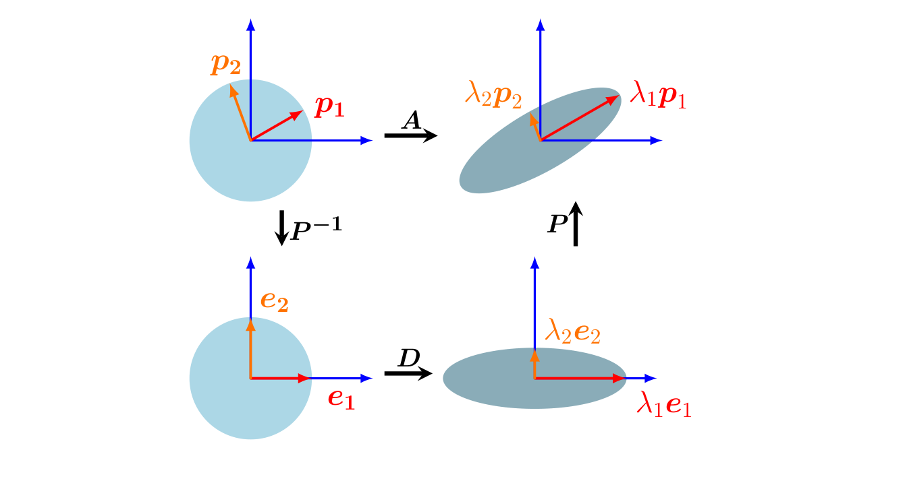

## 4.4 特征分解与对角化

_对角矩阵（diagonal matrix）_ 是指所有非主对角线元素均为零的矩阵，即它们具有如下形式：
$$
\boldsymbol D = \begin{bmatrix} c_1 & \cdots & 0 \\ \vdots & \ddots & \vdots \\ 0 & \cdots & c_n \end{bmatrix} \tag{4.49}
$$
对角矩阵允许我们快速计算行列式、幂以及逆矩阵。其行列式是对角线上各元素的乘积，矩阵的幂 $ \boldsymbol D^k $ 是通过将每个对角线元素取 $ k $ 次幂得到的，而当对角线元素均非零时，其逆矩阵 $ \boldsymbol D^{-1} $ 的对角线元素即为原对角线元素的倒数。在本节中，我们将讨论如何将矩阵转换为对角形式。这是我们在第 2.7.2 节中讨论的基变换以及第 4.2 节中讨论的特征值的一个重要应用。

回顾一下，如果存在可逆矩阵 $ \boldsymbol P $ 使得 $ \boldsymbol D = \boldsymbol P^{-1} \boldsymbol A \boldsymbol P $，则称两个矩阵 $ \boldsymbol A, \boldsymbol D $ 是相似的（定义 2.22）。更具体地说，我们将研究与对角矩阵 $ \boldsymbol D $ 相似的矩阵 $ \boldsymbol A $，其中 $ \boldsymbol D $ 的对角线上包含 $ \boldsymbol A $ 的特征值。

**定义 4.19**（可对角化 / Diagonalizable）。如果方阵 $ \boldsymbol A \in \mathbb{R}^{n \times n} $ 与某个对角矩阵相似，即存在可逆矩阵 $ \boldsymbol P \in \mathbb{R}^{n \times n} $ 使得 $ \boldsymbol D = \boldsymbol P^{-1} \boldsymbol A \boldsymbol P $，则称 $ \boldsymbol A $ 是 _可对角化的（diagonalizable）_ 。

在下文中，我们将看到对矩阵 $ \boldsymbol A \in \mathbb{R}^{n \times n} $ 进行对角化是在另一组基下表示同一线性映射的一种方式（参见第 2.6.1 节），并且事实表明这组基由 $ \boldsymbol A $ 的特征向量组成。

设 $ \boldsymbol A \in \mathbb{R}^{n \times n} $，设 $ \lambda_1, \ldots, \lambda_n $ 是一组标量，并设 $ \boldsymbol p_1, \ldots, \boldsymbol p_n $ 是 $ \mathbb{R}^n $ 中的一组向量。我们定义 $ \boldsymbol P := [\boldsymbol p_1, \ldots, \boldsymbol p_n] $，并设 $ \boldsymbol D \in \mathbb{R}^{n \times n} $ 是对角线元素为 $ \lambda_1, \ldots, \lambda_n $ 的对角矩阵。那么我们可以证明：
$$
\boldsymbol A \boldsymbol P = \boldsymbol P \boldsymbol D \tag{4.50}
$$
当且仅当 $ \lambda_1, \ldots, \lambda_n $ 是 $ \boldsymbol A $ 的特征值，且 $ \boldsymbol p_1, \ldots, \boldsymbol p_n $ 是 $ \boldsymbol A $ 对应的特征向量。

我们可以看到该命题成立，因为：
$$
\boldsymbol A \boldsymbol P = \boldsymbol A [\boldsymbol p_1, \ldots, \boldsymbol p_n] = [\boldsymbol A \boldsymbol p_1, \ldots, \boldsymbol A \boldsymbol p_n] \tag{4.51}
$$
$$
\boldsymbol P \boldsymbol D = [\boldsymbol p_1, \ldots, \boldsymbol p_n] \begin{bmatrix} \lambda_1 & & 0 \\ & \ddots & \\ 0 & & \lambda_n \end{bmatrix} = [\lambda_1 \boldsymbol p_1, \ldots, \lambda_n \boldsymbol p_n] \tag{4.52}
$$
因此，式 (4.50) 意味着：
$$
\boldsymbol A \boldsymbol p_1 = \lambda_1 \boldsymbol p_1 \tag{4.53}
$$
$$
\vdots
$$
$$
\boldsymbol A \boldsymbol p_n = \lambda_n \boldsymbol p_n \tag{4.54}
$$
所以，$ \boldsymbol P $ 的各列必须是 $ \boldsymbol A $ 的特征向量。

我们对对角化的定义要求 $ \boldsymbol P \in \mathbb{R}^{n \times n} $ 是可逆的，即 $ \boldsymbol P $ 具有满秩（定理 4.3）。这要求我们拥有 $ n $ 个线性无关的特征向量 $ \boldsymbol p_1, \ldots, \boldsymbol p_n $，即 $ \boldsymbol p_i $ 构成 $ \mathbb{R}^n $ 的一组基。

**定理 4.20**（特征分解 / Eigendecomposition）。方阵 $ \boldsymbol A \in \mathbb{R}^{n \times n} $ 可以分解为
$$
\boldsymbol A = \boldsymbol P \boldsymbol D \boldsymbol P^{-1} \tag{4.55}
$$
其中 $ \boldsymbol P \in \mathbb{R}^{n \times n} $，且 $ \boldsymbol D $ 是对角线元素为 $ \boldsymbol A $ 的特征值的对角矩阵，当且仅当 $ \boldsymbol A $ 的特征向量构成 $ \mathbb{R}^n $ 的一组基。

   
  <b>图 4.7 将特征分解理解为一系列连续变换的几何直观。左上到左下：P⁻¹ 执行基变换（此处在 R² 中绘制，表示为类似旋转的操作），将特征向量映射到标准基。左下到右下：D 沿着重新映射的正交特征向量进行缩放，此处由圆拉伸为椭圆来表示。右下到右上：P 撤销基变换（表示为反向旋转）并恢复原始坐标系。</b> 

定理 4.20 表明只有非亏损矩阵才可以对角化，并且 $ \boldsymbol P $ 的各列是 $ \boldsymbol A $ 的 $ n $ 个特征向量。对于对称矩阵，我们可以在特征值分解方面获得更强的结论。

**定理 4.21**。对称矩阵 $ \boldsymbol S \in \mathbb{R}^{n \times n} $ 总是可以对角化的。

定理 4.21 直接由谱定理（定理 4.15）得出。此外，谱定理指出我们可以找到由 $ \mathbb{R}^n $ 的特征向量构成的标准正交基（ONB）。这使得 $ \boldsymbol P $ 成为正交矩阵，从而 $ \boldsymbol D = \boldsymbol P^\top \boldsymbol A \boldsymbol P $。

_备注_ 。矩阵的若尔当标准形（Jordan normal form）提供了一种适用于亏损矩阵的分解方法（Lang, 1987），但这超出了本书的讨论范围。♦

### 特征分解的几何直观

我们可以将矩阵的特征分解解释如下（亦见图 4.7）：设 $ \boldsymbol A $ 为关于标准基的线性映射的变换矩阵。$ \boldsymbol P^{-1} $ 执行从标准基到特征基的基变换。这把特征向量 $ \boldsymbol p_i $（图 4.7 中的红色和橙色箭头）映射到标准基向量 $ \boldsymbol e_i $ 上。然后，对角矩阵 $ \boldsymbol D $ 沿着这些坐标轴按特征值 $ \lambda_i $ 对向量进行缩放。最后，$ \boldsymbol P $ 将这些缩放后的向量变换回标准/规范坐标系，得到 $ \lambda_i \boldsymbol p_i $。

> **例 4.11（特征分解）**
> 
> 我们来计算矩阵
> $$ \boldsymbol A = \begin{bmatrix} 2 & 1 \\ 1 & 2 \end{bmatrix} $$
> 的特征分解。
> 
> **步骤 1：计算特征值和特征向量。** $ \boldsymbol A $ 的特征多项式为：
> $$ \det(\boldsymbol A - \lambda \boldsymbol I) = \det\begin{bmatrix} 2 - \lambda & 1 \\ 1 & 2 - \lambda \end{bmatrix} \tag{4.56a} $$
> $$ = (2 - \lambda)^2 - 1 = \lambda^2 - 4\lambda + 3 = (\lambda - 3)(\lambda - 1) \tag{4.56b} $$
> 因此，$ \boldsymbol A $ 的特征值为 $ \lambda_1 = 1 $ 和 $ \lambda_2 = 3 $（特征多项式的根），对应的（归一化）特征向量通过下式求得：
> $$ \begin{bmatrix} 2 & 1 \\ 1 & 2 \end{bmatrix} \boldsymbol p_1 = 1 \boldsymbol p_1, \quad \begin{bmatrix} 2 & 1 \\ 1 & 2 \end{bmatrix} \boldsymbol p_2 = 3 \boldsymbol p_2 \tag{4.57} $$
> 由此解得：
> $$ \boldsymbol p_1 = \frac{1}{\sqrt{2}} \begin{bmatrix} 1 \\ -1 \end{bmatrix}, \quad \boldsymbol p_2 = \frac{1}{\sqrt{2}} \begin{bmatrix} 1 \\ 1 \end{bmatrix} \tag{4.58} $$
> 
> **步骤 2：检验存在性。** 特征向量 $ \boldsymbol p_1, \boldsymbol p_2 $ 构成 $ \mathbb{R}^2 $ 的一组基。因此，$ \boldsymbol A $ 可以对角化。
> 
> **步骤 3：构造对角化 $ \boldsymbol A $ 的矩阵 $ \boldsymbol P $。** 我们将 $ \boldsymbol A $ 的特征向量组合在 $ \boldsymbol P $ 中，使得：
> $$ \boldsymbol P = [\boldsymbol p_1, \boldsymbol p_2] = \frac{1}{\sqrt{2}} \begin{bmatrix} 1 & 1 \\ -1 & 1 \end{bmatrix} \tag{4.59} $$
> 接着我们得到：
> $$ \boldsymbol P^{-1} \boldsymbol A \boldsymbol P = \begin{bmatrix} 1 & 0 \\ 0 & 3 \end{bmatrix} = \boldsymbol D \tag{4.60} $$
> 等价地，我们得到（利用在本例中特征向量 $ \boldsymbol p_1 $ 和 $ \boldsymbol p_2 $ 构成一组标准正交基，从而 $ \boldsymbol P^{-1} = \boldsymbol P^\top $）：
> $$ \underbrace{\begin{bmatrix} 2 & 1 \\ 1 & 2 \end{bmatrix}}_{\boldsymbol A} = \underbrace{\frac{1}{\sqrt{2}} \begin{bmatrix} 1 & 1 \\ -1 & 1 \end{bmatrix}}_{\boldsymbol P} \underbrace{\begin{bmatrix} 1 & 0 \\ 0 & 3 \end{bmatrix}}_{\boldsymbol D} \underbrace{\frac{1}{\sqrt{2}} \begin{bmatrix} 1 & -1 \\ 1 & 1 \end{bmatrix}}_{\boldsymbol P^\top} \tag{4.61} $$

对角矩阵 $ \boldsymbol D $ 可以非常高效地进行求幂运算。因此，我们可以通过特征值分解（如果存在）来计算矩阵 $ \boldsymbol A \in \mathbb{R}^{n \times n} $ 的幂，使得：
$$
\boldsymbol A^k = (\boldsymbol P \boldsymbol D \boldsymbol P^{-1})^k = \boldsymbol P \boldsymbol D^k \boldsymbol P^{-1} \tag{4.62}
$$
计算 $ \boldsymbol D^k $ 是高效的，因为我们只需对每个对角线元素分别进行该操作。

假设特征分解 $ \boldsymbol A = \boldsymbol P \boldsymbol D \boldsymbol P^{-1} $ 存在。那么：
$$
\det(\boldsymbol A) = \det(\boldsymbol P \boldsymbol D \boldsymbol P^{-1}) = \det(\boldsymbol P) \det(\boldsymbol D) \det(\boldsymbol P^{-1}) \tag{4.63a}
$$
$$
= \det(\boldsymbol D) = \prod_{i=1}^n d_{ii} \tag{4.63b}
$$
这使得我们可以高效地计算 $ \boldsymbol A $ 的行列式。

特征值分解要求矩阵是方阵。若能对一般矩阵执行分解将会非常有用。在下一节中，我们将介绍一种更一般的矩阵分解技术：奇异值分解。
