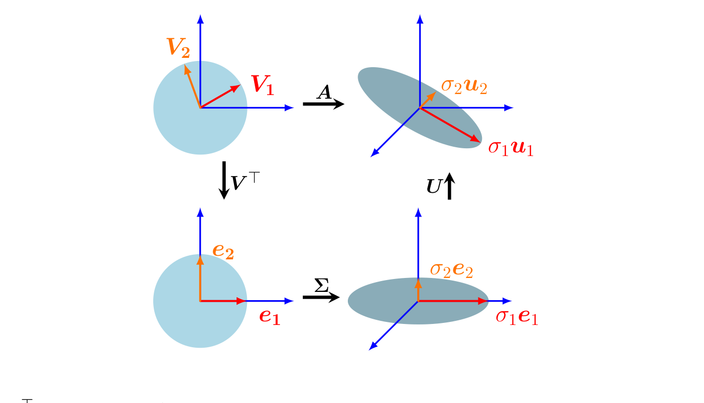
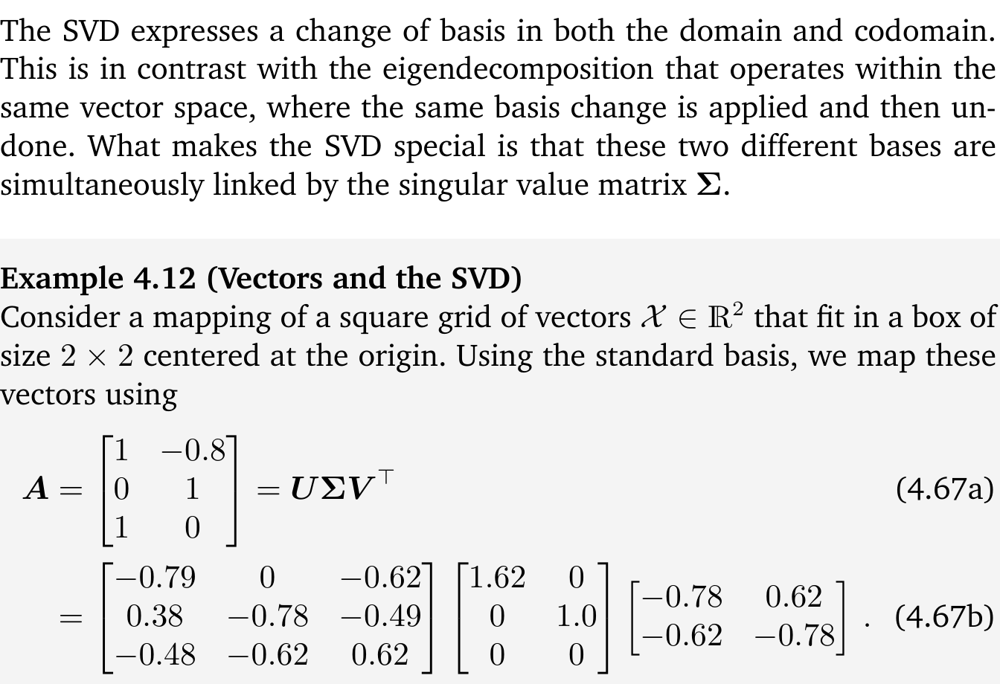
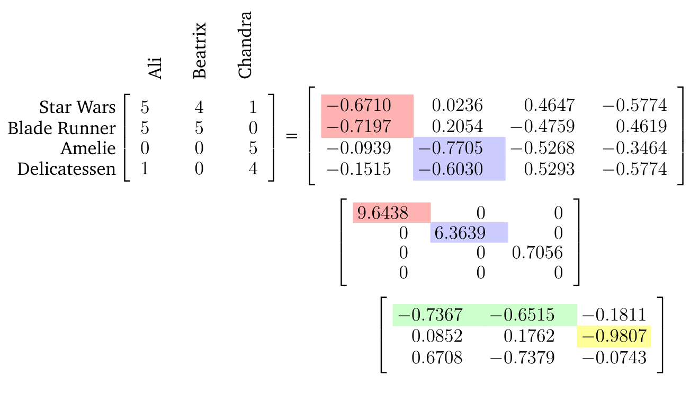

## 4.5 奇异值分解

矩阵的 _奇异值分解（singular value decomposition，简称 SVD）_ 是线性代数中的核心矩阵分解方法之一。它被称为“线性代数的基本定理”（Strang, 1993），因为它可以应用于所有矩阵，而不仅仅是方阵，并且它总是存在的。此外，正如我们将在下文中探讨的那样，表示线性映射 $ \Phi : V \to W $ 的矩阵 $ \boldsymbol A $ 的 SVD，量化了这两个向量空间底层几何之间的变化。我们推荐阅读 Kalman (1996) 以及 Roy 和 Banerjee (2014) 的著作，以更深入地了解 SVD 的数学理论。

**定理 4.22**（奇异值分解定理 / SVD Theorem）。设 $ \boldsymbol A \in \mathbb{R}^{m \times n} $ 是秩为 $ r \in [0, \min(m, n)] $ 的长方矩阵。$ \boldsymbol A $ 的 SVD 是具有如下形式的分解：
$$
\underbrace{\boldsymbol A}_{m \times n} = \underbrace{\boldsymbol U}_{m \times m} \underbrace{\boldsymbol \Sigma}_{m \times n} \underbrace{\boldsymbol V^\top}_{n \times n} \tag{4.64}
$$
其中 $ \boldsymbol U \in \mathbb{R}^{m \times m} $ 是列向量为 $ \boldsymbol u_i $（$ i = 1, \ldots, m $）的正交矩阵，$ \boldsymbol V \in \mathbb{R}^{n \times n} $ 是列向量为 $ \boldsymbol v_j $（$ j = 1, \ldots, n $）的正交矩阵。此外，$ \boldsymbol \Sigma $ 是一个 $ m \times n $ 矩阵，满足 $ \Sigma_{ii} = \sigma_i \ge 0 $，且当 $ i \neq j $ 时 $ \Sigma_{ij} = 0 $。

$ \boldsymbol \Sigma $ 的对角线元素 $ \sigma_i $（$ i = 1, \ldots, r $）称为 _奇异值（singular values）_ ，$ \boldsymbol u_i $ 称为 _左奇异向量（left-singular vectors）_ ，$ \boldsymbol v_j $ 称为 _右奇异向量（right-singular vectors）_ 。按照惯例，奇异值是有序排列的，即 $ \sigma_1 \ge \sigma_2 \ge \cdots \ge \sigma_r \ge 0 $。

_奇异值矩阵（singular value matrix）_ $ \boldsymbol \Sigma $ 是唯一的，但需要注意其结构。请注意 $ \boldsymbol \Sigma \in \mathbb{R}^{m \times n} $ 是长方形的。特别地，$ \boldsymbol \Sigma $ 与 $ \boldsymbol A $ 具有相同的尺寸。这意味着 $ \boldsymbol \Sigma $ 包含一个存放奇异值的对角子矩阵，并且需要额外的零填充。具体而言，如果 $ m > n $，则矩阵 $ \boldsymbol \Sigma $ 在前 $ n $ 行具有对角结构，从第 $ n + 1 $ 行到第 $ m $ 行由行向量 $ \boldsymbol 0^\top $ 填充，即：
$$
\boldsymbol \Sigma = \begin{bmatrix} \sigma_1 & 0 & \cdots & 0 \\ 0 & \sigma_2 & \cdots & 0 \\ \vdots & \vdots & \ddots & \vdots \\ 0 & 0 & \cdots & \sigma_n \\ 0 & 0 & \cdots & 0 \\ \vdots & \vdots & \ddots & \vdots \\ 0 & 0 & \cdots & 0 \end{bmatrix} \tag{4.65}
$$
如果 $ m < n $，矩阵 $ \boldsymbol \Sigma $ 在前 $ m $ 列具有对角结构，从第 $ m + 1 $ 列到第 $ n $ 列由全 0 列向量构成：
$$
\boldsymbol \Sigma = \begin{bmatrix} \sigma_1 & 0 & \cdots & 0 & 0 & \cdots & 0 \\ 0 & \sigma_2 & \cdots & 0 & 0 & \cdots & 0 \\ \vdots & \vdots & \ddots & \vdots & \vdots & \ddots & \vdots \\ 0 & 0 & \cdots & \sigma_m & 0 & \cdots & 0 \end{bmatrix} \tag{4.66}
$$

_备注_ 。SVD 对任意矩阵 $ \boldsymbol A \in \mathbb{R}^{m \times n} $ 都存在。♦

   
  <b>图 4.8 将矩阵 A ∈ R³ˣ² 的 SVD 理解为一系列连续变换的几何直观。左上到左下：Vᵀ 在 R² 中执行基变换。左下到右下：Σ 进行缩放并从 R² 映射到 R³。右下方的椭圆位于 R³ 中，第三个维度正交于该椭圆盘的表面。右下到右上：U 在 R³ 内部执行基变换。</b> 

### 4.5.1 SVD 的几何直观

SVD 为描述变换矩阵 $ \boldsymbol A $ 提供了直观的几何解释。在下文中，我们将把 SVD 讨论为在基上执行的一系列连续线性变换。在例 4.12 中，我们将把 SVD 的变换矩阵应用于 $ \mathbb{R}^2 $ 中的一组向量，这使我们能够更清晰地可视化每次变换的效果。

矩阵的 SVD 可以解释为将对应的线性映射（回顾第 2.7.1 节）$ \Phi : \mathbb{R}^n \to \mathbb{R}^m $ 分解为三个运算；参见图 4.8。表面上看，SVD 的几何直观遵循与特征分解直观相似的结构（参见图 4.7）：大体而言，SVD 首先通过 $ \boldsymbol V^\top $ 执行基变换，然后通过奇异值矩阵 $ \boldsymbol \Sigma $ 进行缩放以及维度的增加（或减少）。最后，它通过 $ \boldsymbol U $ 执行第二次基变换。SVD 包含许多重要的细节和注意事项，这就是为什么我们将更详细地回顾这一几何直观。（温习第 2.7.2 节的基变换、定义 3.8 的正交矩阵以及第 3.5 节的标准正交基将很有帮助。）

假设给定线性映射 $ \Phi : \mathbb{R}^n \to \mathbb{R}^m $ 分别关于 $ \mathbb{R}^n $ 和 $ \mathbb{R}^m $ 的标准基 $ \mathcal{B} $ 和 $ \mathcal{C} $ 的变换矩阵。此外，假设 $ \mathbb{R}^n $ 的另一组基为 $ \tilde{\mathcal{B}} $，$ \mathbb{R}^m $ 的另一组基为 $ \tilde{\mathcal{C}} $。那么：
1. 矩阵 $ \boldsymbol V $ 在定义域 $ \mathbb{R}^n $ 中执行从 $ \tilde{\mathcal{B}} $（由图 4.8 左上方的红色和橙色向量 $ \boldsymbol v_1 $ 和 $ \boldsymbol v_2 $ 表示）到标准基 $ \mathcal{B} $ 的基变换。$ \boldsymbol V^\top = \boldsymbol V^{-1} $ 执行从 $ \mathcal{B} $ 到 $ \tilde{\mathcal{B}} $ 的基变换。在图 4.8 的左下方，红色和橙色向量现在与规范基对齐。
2. 将坐标系变换为 $ \tilde{\mathcal{B}} $ 后，$ \boldsymbol \Sigma $ 按奇异值 $ \sigma_i $ 对新坐标进行缩放（并增加或删除维度），即 $ \boldsymbol \Sigma $ 是 $ \Phi $ 关于 $ \tilde{\mathcal{B}} $ 和 $ \tilde{\mathcal{C}} $ 的变换矩阵，在图 4.8 的右下方表现为红色和橙色向量被拉伸并位于 $ \boldsymbol e_1\text{-}\boldsymbol e_2 $ 平面上，该平面现在嵌入到了第三个维度中。
3. $ \boldsymbol U $ 在到达域 $ \mathbb{R}^m $ 中执行从 $ \tilde{\mathcal{C}} $ 到 $ \mathbb{R}^m $ 规范基的基变换，表现为红色和橙色向量旋转脱离 $ \boldsymbol e_1\text{-}\boldsymbol e_2 $ 平面。这显示在图 4.8 的右上角。

SVD 同时表达了定义域和到达域中的基变换。这与特征分解形成鲜明对比：特征分解在同一个向量空间内进行，应用相同的基变换然后再将其撤销。SVD 的独特之处在于这两个不同的基通过奇异值矩阵 $ \boldsymbol \Sigma $ 同时联系在一起。

> **例 4.12（向量与 SVD）**
> 
> 考虑将以原点为中心、尺寸为 $ 2 \times 2 $ 的盒子中的 $ \mathbb{R}^2 $ 向量构成的正方形网格 $ \mathcal{X} $ 进行映射。使用标准基，我们通过下式映射这些向量：
> $$ \boldsymbol A = \begin{bmatrix} 1 & -0.8 \\ 0 & 1 \\ 1 & 0 \end{bmatrix} = \boldsymbol U \boldsymbol \Sigma \boldsymbol V^\top \tag{4.67a} $$
> $$ = \begin{bmatrix} -0.79 & 0 & -0.62 \\ 0.38 & -0.78 & -0.49 \\ -0.48 & -0.62 & 0.62 \end{bmatrix} \begin{bmatrix} 1.62 & 0 \\ 0 & 1.0 \\ 0 & 0 \end{bmatrix} \begin{bmatrix} -0.78 & 0.62 \\ -0.62 & -0.78 \end{bmatrix} \tag{4.67b} $$
> 我们从排列在网格中的一组向量 $ \mathcal{X} $（彩色点；参见图 4.9 的左上图）开始。接着我们应用 $ \boldsymbol V^\top \in \mathbb{R}^{2 \times 2} $，它对 $ \mathcal{X} $ 进行旋转。旋转后的向量显示在图 4.9 的左下图中。我们现在使用奇异值矩阵 $ \boldsymbol \Sigma $ 将这些向量映射到达达域 $ \mathbb{R}^3 $（参见图 4.9 的右下图）。请注意，所有向量都位于 $ x_1\text{-}x_2 $ 平面上，第三个坐标始终为 0。在 $ x_1\text{-}x_2 $ 平面内的向量已经被奇异值进行了拉伸。
> 
> 向量 $ \mathcal{X} $ 经由 $ \boldsymbol A $ 直接映射到达达域 $ \mathbb{R}^3 $，等价于通过 $ \boldsymbol U \boldsymbol \Sigma \boldsymbol V^\top $ 对 $ \mathcal{X} $ 进行变换，其中 $ \boldsymbol U $ 在到达域 $ \mathbb{R}^3 $ 内执行旋转，使得映射后的向量不再局限于 $ x_1\text{-}x_2 $ 平面；但如图 4.9 右上图所示，它们仍然位于同一个平面上。

   
  <b>图 4.9 SVD 与向量的映射（用圆点表示）。各子图遵循与图 4.8 相同的逆时针结构。</b> 

### 4.5.2 SVD 的构造

接下来我们将讨论 SVD 为什么存在，并详细说明如何计算它。一般矩阵的 SVD 与方阵的特征分解有一些相似之处。

_备注_ 。将对称正定（SPD）矩阵的特征分解：
$$
\boldsymbol S = \boldsymbol S^\top = \boldsymbol P \boldsymbol D \boldsymbol P^\top \tag{4.68}
$$
与对应的 SVD 进行比较：
$$
\boldsymbol S = \boldsymbol U \boldsymbol \Sigma \boldsymbol V^\top \tag{4.69}
$$
如果令：
$$
\boldsymbol U = \boldsymbol P = \boldsymbol V, \quad \boldsymbol D = \boldsymbol \Sigma \tag{4.70}
$$
我们可以看到 SPD 矩阵的 SVD 就是其特征分解。♦

在下文中，我们将探讨定理 4.22 成立的原因以及 SVD 是如何构造的。计算 $ \boldsymbol A \in \mathbb{R}^{m \times n} $ 的 SVD 等价于分别寻找到达域 $ \mathbb{R}^m $ 和定义域 $ \mathbb{R}^n $ 的两组标准正交基 $ \mathcal{U} = (\boldsymbol u_1, \ldots, \boldsymbol u_m) $ 与 $ \mathcal{V} = (\boldsymbol v_1, \ldots, \boldsymbol v_n) $。我们将从这些有序基构造出矩阵 $ \boldsymbol U $ 和 $ \boldsymbol V $。

我们的方案是首先构造右奇异向量的标准正交集 $ \boldsymbol v_1, \ldots, \boldsymbol v_n \in \mathbb{R}^n $。然后构造左奇异向量的标准正交集 $ \boldsymbol u_1, \ldots, \boldsymbol u_m \in \mathbb{R}^m $。此后，我们将两者联系起来，并要求在 $ \boldsymbol A $ 的变换下保持 $ \boldsymbol v_i $ 的正交性。这很重要，因为我们知道像 $ \boldsymbol A \boldsymbol v_i $ 构成了一组正交向量。然后我们将这些像用标量因子归一化，这些因子就是奇异值。

让我们从构造右奇异向量开始。谱定理（定理 4.15）告诉我们对称矩阵拥有一组由特征向量构成的标准正交基（ONB），这也意味着它是可以对角化的。此外，由定理 4.14，我们总能从任意长方矩阵 $ \boldsymbol A \in \mathbb{R}^{m \times n} $ 构造出对称半正定矩阵 $ \boldsymbol A^\top \boldsymbol A \in \mathbb{R}^{n \times n} $。因此，我们总是可以对 $ \boldsymbol A^\top \boldsymbol A $ 进行对角化并得到：
$$
\boldsymbol A^\top \boldsymbol A = \boldsymbol P \boldsymbol D \boldsymbol P^\top = \boldsymbol P \begin{bmatrix} \lambda_1 & \cdots & 0 \\ \vdots & \ddots & \vdots \\ 0 & \cdots & \lambda_n \end{bmatrix} \boldsymbol P^\top \tag{4.71}
$$
其中 $ \boldsymbol P $ 是由标准正交特征基构成的正交矩阵。$ \lambda_i \ge 0 $ 是 $ \boldsymbol A^\top \boldsymbol A $ 的特征值。假设 $ \boldsymbol A $ 的 SVD 存在，并将式 (4.64) 代入式 (4.71)。得到：
$$
\boldsymbol A^\top \boldsymbol A = (\boldsymbol U \boldsymbol \Sigma \boldsymbol V^\top)^\top (\boldsymbol U \boldsymbol \Sigma \boldsymbol V^\top) = \boldsymbol V \boldsymbol \Sigma^\top \boldsymbol U^\top \boldsymbol U \boldsymbol \Sigma \boldsymbol V^\top \tag{4.72}
$$
其中 $ \boldsymbol U, \boldsymbol V $ 是正交矩阵。因此，由于 $ \boldsymbol U^\top \boldsymbol U = \boldsymbol I $，我们得到：
$$
\boldsymbol A^\top \boldsymbol A = \boldsymbol V \boldsymbol \Sigma^\top \boldsymbol \Sigma \boldsymbol V^\top = \boldsymbol V \begin{bmatrix} \sigma_1^2 & 0 & \cdots & 0 \\ 0 & \ddots & \ddots & \vdots \\ \vdots & \ddots & \sigma_n^2 & 0 \\ 0 & \cdots & 0 & 0 \end{bmatrix} \boldsymbol V^\top \tag{4.73}
$$
现在比较式 (4.71) 和式 (4.73)，我们可以对应识别出：
$$
\boldsymbol V^\top = \boldsymbol P^\top \tag{4.74}
$$
$$
\sigma_i^2 = \lambda_i \tag{4.75}
$$
因此，构成 $ \boldsymbol P $ 的 $ \boldsymbol A^\top \boldsymbol A $ 的特征向量就是 $ \boldsymbol A $ 的右奇异向量 $ \boldsymbol V $（参见式 (4.74)）。$ \boldsymbol A^\top \boldsymbol A $ 的特征值是 $ \boldsymbol \Sigma $ 的奇异值的平方（参见式 (4.75)）。

为了获得左奇异向量 $ \boldsymbol U $，我们遵循类似的步骤。我们首先计算对称矩阵 $ \boldsymbol A \boldsymbol A^\top \in \mathbb{R}^{m \times m} $ 的 SVD（而不是之前的 $ \boldsymbol A^\top \boldsymbol A \in \mathbb{R}^{n \times n} $）。由 $ \boldsymbol A $ 的 SVD 得到：
$$
\boldsymbol A \boldsymbol A^\top = (\boldsymbol U \boldsymbol \Sigma \boldsymbol V^\top)(\boldsymbol U \boldsymbol \Sigma \boldsymbol V^\top)^\top = \boldsymbol U \boldsymbol \Sigma \boldsymbol V^\top \boldsymbol V \boldsymbol \Sigma^\top \boldsymbol U^\top \tag{4.76a}
$$
$$
= \boldsymbol U \begin{bmatrix} \sigma_1^2 & 0 & \cdots & 0 \\ 0 & \ddots & \ddots & \vdots \\ \vdots & \ddots & \sigma_m^2 & 0 \\ 0 & \cdots & 0 & 0 \end{bmatrix} \boldsymbol U^\top \tag{4.76b}
$$
谱定理表明 $ \boldsymbol A \boldsymbol A^\top = \boldsymbol S \boldsymbol D \boldsymbol S^\top $ 可以对角化，并且我们可以找到 $ \boldsymbol A \boldsymbol A^\top $ 的一组由特征向量构成的标准正交基，收集在 $ \boldsymbol S $ 中。$ \boldsymbol A \boldsymbol A^\top $ 的标准正交特征向量即为左奇异向量 $ \boldsymbol U $，并在 SVD 的到达域中构成一组标准正交基。

这留下了矩阵 $ \boldsymbol \Sigma $ 的结构问题。由于 $ \boldsymbol A \boldsymbol A^\top $ 和 $ \boldsymbol A^\top \boldsymbol A $ 具有相同的非零特征值（参见第 106 页），在这两种情况下 SVD 的 $ \boldsymbol \Sigma $ 矩阵的非零元素必须相同。

最后一步是将我们到目前为止涉及的所有部分联系起来。我们在 $ \boldsymbol V $ 中拥有一组标准正交的右奇异向量。为了完成 SVD 的构造，我们需要将它们与标准正交向量 $ \boldsymbol U $ 连接起来。为了达到这一目标，我们利用 $ \boldsymbol v_i $ 在 $ \boldsymbol A $ 映射下的像也必须是正交的这一事实。我们可以使用第 3.4 节的结果来证明这一点。

我们要求当 $ i \neq j $ 时，$ \boldsymbol A \boldsymbol v_i $ 和 $ \boldsymbol A \boldsymbol v_j $ 之间的内积必须为 0。对于任意两个正交特征向量 $ \boldsymbol v_i, \boldsymbol v_j $（$ i \neq j $），有：
$$
(\boldsymbol A \boldsymbol v_i)^\top (\boldsymbol A \boldsymbol v_j) = \boldsymbol v_i^\top (\boldsymbol A^\top \boldsymbol A) \boldsymbol v_j = \boldsymbol v_i^\top (\lambda_j \boldsymbol v_j) = \lambda_j \boldsymbol v_i^\top \boldsymbol v_j = 0 \tag{4.77}
$$
对于 $ m \ge r $ 的情形，$ \{\boldsymbol A \boldsymbol v_1, \ldots, \boldsymbol A \boldsymbol v_r\} $ 是 $ \mathbb{R}^m $ 的一个 $ r $ 维子空间的基。

为了完成 SVD 的构造，我们需要标准正交的左奇异向量：我们对右奇异向量的像 $ \boldsymbol A \boldsymbol v_i $ 进行归一化，得到：
$$
\boldsymbol u_i := \frac{\boldsymbol A \boldsymbol v_i}{\|\boldsymbol A \boldsymbol v_i\|} = \frac{1}{\sqrt{\lambda_i}} \boldsymbol A \boldsymbol v_i = \frac{1}{\sigma_i} \boldsymbol A \boldsymbol v_i \tag{4.78}
$$
其中最后一个等号由式 (4.75) 和式 (4.76b) 得到，表明 $ \boldsymbol A \boldsymbol A^\top $ 的特征值满足 $ \sigma_i^2 = \lambda_i $。

因此，$ \boldsymbol A^\top \boldsymbol A $ 的特征向量（即右奇异向量 $ \boldsymbol v_i $）与其在 $ \boldsymbol A $ 映射下的归一化像（即左奇异向量 $ \boldsymbol u_i $），构成了通过奇异值矩阵 $ \boldsymbol \Sigma $ 连接起来的两组自洽的标准正交基。

我们将式 (4.78) 重新整理，得到 _奇异值方程（singular value equation）_ ：
$$
\boldsymbol A \boldsymbol v_i = \sigma_i \boldsymbol u_i, \quad i = 1, \ldots, r \tag{4.79}
$$
该方程与特征值方程 (4.25) 非常相似，但等式左侧和右侧的向量并不相同。

对于 $ n > m $，式 (4.79) 仅对 $ i \le m $ 成立，且式 (4.79) 没有涉及 $ i > m $ 时的 $ \boldsymbol u_i $。但是，根据构造我们知道它们是标准正交的。相反，对于 $ m > n $，式 (4.79) 仅对 $ i \le n $ 成立。对于 $ i > n $，有 $ \boldsymbol A \boldsymbol v_i = \boldsymbol 0 $，并且我们仍然知道 $ \boldsymbol v_i $ 构成标准正交集。这意味着 SVD 还提供了 $ \boldsymbol A $ 的核（零空间，即满足 $ \boldsymbol A \boldsymbol x = \boldsymbol 0 $ 的向量 $ \boldsymbol x $ 的集合，参见第 2.7.3 节）的一组标准正交基。

此外，将 $ \boldsymbol v_i $ 拼接为 $ \boldsymbol V $ 的各列，将 $ \boldsymbol u_i $ 拼接为 $ \boldsymbol U $ 的各列，得到：
$$
\boldsymbol A \boldsymbol V = \boldsymbol U \boldsymbol \Sigma \tag{4.80}
$$
其中 $ \boldsymbol \Sigma $ 与 $ \boldsymbol A $ 具有相同的维度，且在第 $ 1, \ldots, r $ 行具有对角结构。因此，右乘 $ \boldsymbol V^\top $ 得到 $ \boldsymbol A = \boldsymbol U \boldsymbol \Sigma \boldsymbol V^\top $，这正是 $ \boldsymbol A $ 的 SVD。

> **例 4.13（计算 SVD）**
> 
> 我们来求矩阵
> $$ \boldsymbol A = \begin{bmatrix} 1 & 0 & 1 \\ -2 & 1 & 0 \end{bmatrix} \tag{4.81} $$
> 的奇异值分解。SVD 要求我们计算右奇异向量 $ \boldsymbol v_j $、奇异值 $ \sigma_k $ 以及左奇异向量 $ \boldsymbol u_i $。
> 
> **步骤 1：右奇异向量作为 $ \boldsymbol A^\top \boldsymbol A $ 的特征基。**
> 
> 我们首先计算：
> $$ \boldsymbol A^\top \boldsymbol A = \begin{bmatrix} 1 & -2 \\ 0 & 1 \\ 1 & 0 \end{bmatrix} \begin{bmatrix} 1 & 0 & 1 \\ -2 & 1 & 0 \end{bmatrix} = \begin{bmatrix} 5 & -2 & 1 \\ -2 & 1 & 0 \\ 1 & 0 & 1 \end{bmatrix} \tag{4.82} $$
> 我们通过 $ \boldsymbol A^\top \boldsymbol A $ 的特征值分解来计算奇异值和右奇异向量 $ \boldsymbol v_j $，特征值分解为：
> $$ \boldsymbol A^\top \boldsymbol A = \begin{bmatrix} \frac{5}{\sqrt{30}} & 0 & -\frac{1}{\sqrt{6}} \\ -\frac{2}{\sqrt{30}} & \frac{1}{\sqrt{5}} & -\frac{2}{\sqrt{6}} \\ \frac{1}{\sqrt{30}} & \frac{2}{\sqrt{5}} & \frac{1}{\sqrt{6}} \end{bmatrix} \begin{bmatrix} 6 & 0 & 0 \\ 0 & 1 & 0 \\ 0 & 0 & 0 \end{bmatrix} \begin{bmatrix} \frac{5}{\sqrt{30}} & -\frac{2}{\sqrt{30}} & \frac{1}{\sqrt{30}} \\ 0 & \frac{1}{\sqrt{5}} & \frac{2}{\sqrt{5}} \\ -\frac{1}{\sqrt{6}} & -\frac{2}{\sqrt{6}} & \frac{1}{\sqrt{6}} \end{bmatrix} = \boldsymbol P \boldsymbol D \boldsymbol P^\top \tag{4.83} $$
> 我们将 $ \boldsymbol P $ 的各列作为右奇异向量，从而：
> $$ \boldsymbol V = \boldsymbol P = \begin{bmatrix} \frac{5}{\sqrt{30}} & 0 & -\frac{1}{\sqrt{6}} \\ -\frac{2}{\sqrt{30}} & \frac{1}{\sqrt{5}} & -\frac{2}{\sqrt{6}} \\ \frac{1}{\sqrt{30}} & \frac{2}{\sqrt{5}} & \frac{1}{\sqrt{6}} \end{bmatrix} \tag{4.84} $$
> 
> **步骤 2：奇异值矩阵。**
> 
> 由于奇异值 $ \sigma_i $ 是 $ \boldsymbol A^\top \boldsymbol A $ 特征值的平方根，我们直接从 $ \boldsymbol D $ 中获得它们。因为 $ \text{rk}(\boldsymbol A) = 2 $，所以只有两个非零奇异值：$ \sigma_1 = \sqrt{6} $ 和 $ \sigma_2 = 1 $。奇异值矩阵必须与 $ \boldsymbol A $ 的尺寸相同，我们得到：
> $$ \boldsymbol \Sigma = \begin{bmatrix} \sqrt{6} & 0 & 0 \\ 0 & 1 & 0 \end{bmatrix} \tag{4.85} $$
> 
> **步骤 3：左奇异向量作为右奇异向量的归一化像。**
> 
> 我们通过计算右奇异向量在 $ \boldsymbol A $ 映射下的像，并将其除以相应的奇异值进行归一化，从而求得左奇异向量：
> $$ \boldsymbol u_1 = \frac{1}{\sigma_1} \boldsymbol A \boldsymbol v_1 = \frac{1}{\sqrt{6}} \begin{bmatrix} 1 & 0 & 1 \\ -2 & 1 & 0 \end{bmatrix} \begin{bmatrix} \frac{5}{\sqrt{30}} \\ -\frac{2}{\sqrt{30}} \\ \frac{1}{\sqrt{30}} \end{bmatrix} = \begin{bmatrix} \frac{1}{\sqrt{5}} \\ -\frac{2}{\sqrt{5}} \end{bmatrix} \tag{4.86} $$
> $$ \boldsymbol u_2 = \frac{1}{\sigma_2} \boldsymbol A \boldsymbol v_2 = \frac{1}{1} \begin{bmatrix} 1 & 0 & 1 \\ -2 & 1 & 0 \end{bmatrix} \begin{bmatrix} 0 \\ \frac{1}{\sqrt{5}} \\ \frac{2}{\sqrt{5}} \end{bmatrix} = \begin{bmatrix} \frac{2}{\sqrt{5}} \\ \frac{1}{\sqrt{5}} \end{bmatrix} \tag{4.87} $$
> $$ \boldsymbol U = [\boldsymbol u_1, \boldsymbol u_2] = \frac{1}{\sqrt{5}} \begin{bmatrix} 1 & 2 \\ -2 & 1 \end{bmatrix} \tag{4.88} $$
> 
> 需要注意的是，在计算机上，这里演示的方法数值稳定性较差，实际中 $ \boldsymbol A $ 的 SVD 通常是在不借助 $ \boldsymbol A^\top \boldsymbol A $ 的特征值分解的情况下直接计算的。

### 4.5.3 特征值分解与奇异值分解的比较

让我们考虑特征分解 $ \boldsymbol A = \boldsymbol P \boldsymbol D \boldsymbol P^{-1} $ 和 SVD $ \boldsymbol A = \boldsymbol U \boldsymbol \Sigma \boldsymbol V^\top $，并回顾前面各节的核心要点。

- 对任意矩阵 $ \boldsymbol A \in \mathbb{R}^{m \times n} $，SVD 总是存在的。特征分解仅对方阵 $ \boldsymbol A \in \mathbb{R}^{n \times n} $ 有定义，且仅当我们能够找到 $ \mathbb{R}^n $ 的一组特征向量基时才存在。
- 特征分解矩阵 $ \boldsymbol P $ 中的向量不一定是正交的，即基变换不是简单的旋转和缩放。另一方面，SVD 中的矩阵 $ \boldsymbol U $ 和 $ \boldsymbol V $ 中的向量是标准正交的，因此它们确实表示旋转。
- 特征分解和 SVD 都是三个线性映射的复合：
  1. 定义域中的基变换
  2. 对每个新基向量进行独立缩放，并从定义域映射到到达域
  3. 到达域中的基变换
- 特征分解与 SVD 的一个关键区别在于：在 SVD 中，定义域和到达域可以是不同维度的向量空间。
- 在 SVD 中，左奇异向量矩阵 $ \boldsymbol U $ 和右奇异向量矩阵 $ \boldsymbol V $ 通常互不为逆（它们在不同的向量空间中执行基变换）。在特征分解中，基变换矩阵 $ \boldsymbol P $ 和 $ \boldsymbol P^{-1} $ 互为逆矩阵。
- 在 SVD 中，对角矩阵 $ \boldsymbol \Sigma $ 中的元素均为非负实数，这在特征分解的对角矩阵中通常并不成立。
- SVD 和特征分解通过投影密切相关：
  - $ \boldsymbol A $ 的左奇异向量是 $ \boldsymbol A \boldsymbol A^\top $ 的特征向量。
  - $ \boldsymbol A $ 的右奇异向量是 $ \boldsymbol A^\top \boldsymbol A $ 的特征向量。
  - $ \boldsymbol A $ 的非零奇异值是 $ \boldsymbol A \boldsymbol A^\top $ 非零特征值的平方根，同时也等于 $ \boldsymbol A^\top \boldsymbol A $ 非零特征值的平方根。
- 对于对称矩阵 $ \boldsymbol A \in \mathbb{R}^{n \times n} $，由谱定理（定理 4.15）可知，特征值分解与 SVD 是完全相同的。

   
  <b>图 4.10 三个人对四部电影的评分及其对应的 SVD 分解。</b> 

> **例 4.14（在电影评分与消费者中发现结构）**
> 
> 我们通过分析人群及其偏好电影的数据，来为 SVD 补充一个实际的解释。考虑三位观众（Ali、Beatrix、Chandra）对四部不同电影（《星球大战》/ Star Wars、《银翼杀手》/ Blade Runner、《天使爱美丽》/ Amelie、《黑店狂想曲》/ Delicatessen）进行评分。他们的评分取值为 0（最差）到 5（最好）之间，并编码在数据矩阵 $ \boldsymbol A \in \mathbb{R}^{4 \times 3} $ 中，如图 4.10 所示。每一行代表一部电影，每一列代表一位用户。因此，电影评分的列向量（每位观众一个）为 $ \boldsymbol x_{\text{Ali}}, \boldsymbol x_{\text{Beatrix}}, \boldsymbol x_{\text{Chandra}} $。
> 
> 利用 SVD 分解 $ \boldsymbol A $ 为我们提供了一种捕捉人们如何对电影进行评分的关系的方法，尤其是是否存在某种结构将哪些人喜欢哪些电影联系起来。将 SVD 应用于我们的数据矩阵 $ \boldsymbol A $ 基于若干假设：
> 1. 所有观众都使用相同的线性映射一致地对电影进行评分。
> 2. 评分中不存在误差或噪声。
> 3. 我们将左奇异向量 $ \boldsymbol u_i $ 解释为典型电影（stereotypical movies），将右奇异向量 $ \boldsymbol v_j $ 解释为典型观众（stereotypical viewers）。
> 
> 然后我们假设，任何观众的具体电影偏好都可以表示为 $ \boldsymbol v_j $ 的线性组合。类似地，任何电影的受欢迎程度都可以表示为 $ \boldsymbol u_i $ 的线性组合。因此，SVD 定义域中的一个向量可以解释为典型观众“空间”中的一位观众，而 SVD 到达域中的一个向量相应地可以解释为典型电影“空间”中的一部电影。（ _边注_ ：只有当数据本身涵盖了足够多样的观众和电影时，由相应观众和电影数据张成的这两个“空间”才具有实际意义。）让我们来考察电影-用户矩阵的 SVD 分解。第一个左奇异向量 $ \boldsymbol u_1 $ 在两部科幻电影上具有较大的绝对值，并且对应一个较大的第一奇异值（图 4.10 中的红色阴影）。因此，这把一类用户与一组特定的电影（科幻主题）关联起来。类似地，第一个右奇异向量 $ \boldsymbol v_1 $ 在 Ali 和 Beatrix 上的绝对值较大，这两位观众对科幻电影给出了很高的评分（图 4.10 中的绿色阴影）。这表明 $ \boldsymbol v_1 $ 反映了“科幻电影爱好者”的概念。
> 
> 类似地，$ \boldsymbol u_2 $ 似乎捕捉到了法国艺术电影的主题，而 $ \boldsymbol v_2 $ 表明 Chandra 接近此类电影的理想化爱好者。理想化的科幻电影爱好者是一位纯粹主义者，只喜欢科幻电影，因此科幻电影爱好者 $ \boldsymbol v_1 $ 对除了科幻主题之外的所有事物给出的评分均为零——这种逻辑由奇异值矩阵 $ \boldsymbol \Sigma $ 的对角子结构所体现。因此，一部具体的电影由它如何（线性地）分解为典型电影来表示。同样，一个人将由他们如何（通过线性组合）分解为电影主题来表示。

值得简要讨论一下 SVD 的术语和约定，因为文献中使用了不同的版本。数学原理在这些差异下保持不变，但这些差异可能会令人困惑。

为了在符号表示和抽象上带来便利，我们使用的 SVD 记号将 SVD 描述为具有两个方阵形式的左、右奇异向量矩阵，但具有一个长方形的奇异值矩阵。我们关于 SVD 的定义 (4.64) 有时被称为 _完全 SVD（full SVD）_ 。

一些作者对 SVD 的定义略有不同，并侧重于方阵形式的奇异矩阵。此时对于 $ \boldsymbol A \in \mathbb{R}^{m \times n} $ 且 $ m \ge n $：
$$
\boldsymbol A_{m \times n} = \boldsymbol U_{m \times n} \boldsymbol \Sigma_{n \times n} \boldsymbol V^\top_{n \times n} \tag{4.89}
$$
有时该表述被称为 _简约 SVD（reduced SVD）_ （例如 Datta (2010)）或直接称为 SVD（例如 Press et al. (2007)）。这种替代格式仅仅改变了矩阵的构建方式，但保持了 SVD 的数学结构不变。这种替代形式的便利之处在于 $ \boldsymbol \Sigma $ 是对角的，就像在特征值分解中一样。

在第 4.6 节中，我们将学习使用 SVD 的矩阵近似技术，这也被称为 _截断 SVD（truncated SVD）_ 。

我们可以对秩为 $ r $ 的矩阵 $ \boldsymbol A $ 定义 SVD，使得 $ \boldsymbol U $ 是 $ m \times r $ 矩阵，$ \boldsymbol \Sigma $ 是 $ r \times r $ 对角矩阵，而 $ \boldsymbol V $ 是 $ r \times n $ 矩阵。这种构造与我们的定义非常相似，并确保对角矩阵 $ \boldsymbol \Sigma $ 仅在对角线上具有非零元素。这种替代记号的主要便利之处在于 $ \boldsymbol \Sigma $ 是对角的，就像在特征值分解中一样。

要求 $ \boldsymbol A $ 的 SVD 仅适用于 $ m > n $ 的 $ m \times n $ 矩阵这一限制在实践中是不必要的。当 $ m < n $ 时，SVD 分解将产生列零向量多于行零向量的 $ \boldsymbol \Sigma $，因此奇异值 $ \sigma_{m+1}, \ldots, \sigma_n $ 均为 0。

SVD 在机器学习中具有广泛的应用，从曲线拟合中的最小二乘问题到求解线性方程组。这些应用利用了 SVD 的各种重要性质：它与矩阵秩的关系，以及它用较低秩的矩阵来近似给定秩矩阵的能力。用 SVD 替代矩阵通常具有使计算对数值舍入误差更加稳健的优点。正如我们将在下一节中探讨的那样，SVD 以原则性方式用“更简单”的矩阵来近似矩阵的能力，开启了从降维、主题建模到数据压缩和聚类等诸多机器学习应用的大门。
