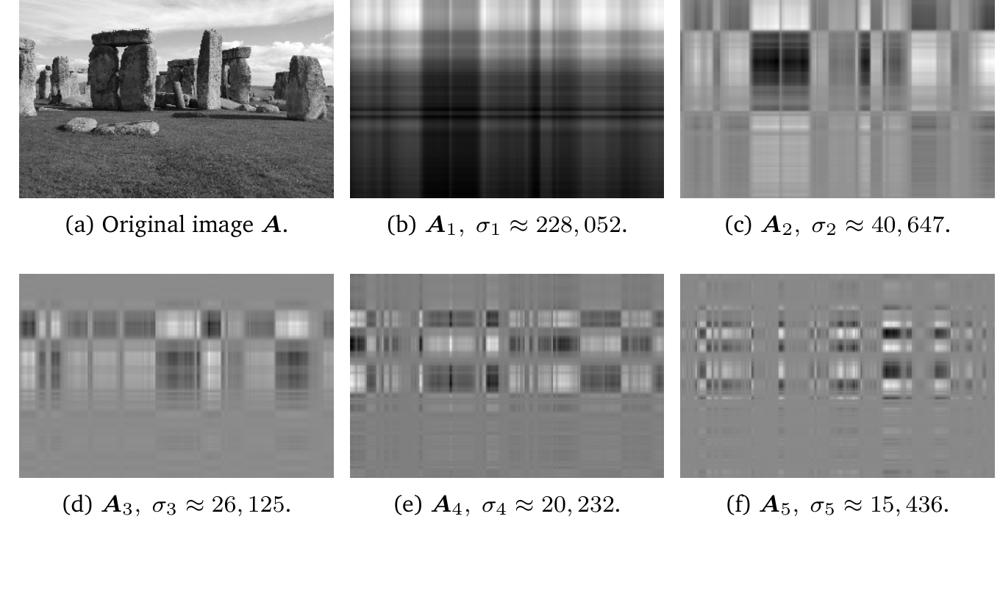
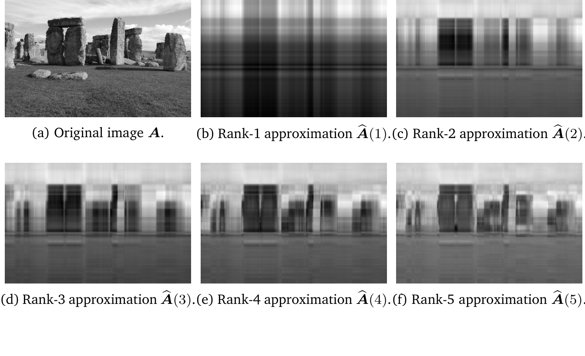

## 4.6 矩阵近似

在第 4.5 节中，我们将 SVD 视为将矩阵 $ \boldsymbol A = \boldsymbol U \boldsymbol \Sigma \boldsymbol V^\top \in \mathbb{R}^{m \times n} $ 分解为三个矩阵的乘积的一种方法，其中 $ \boldsymbol U \in \mathbb{R}^{m \times m} $ 和 $ \boldsymbol V \in \mathbb{R}^{n \times n} $ 是正交矩阵，而 $ \boldsymbol \Sigma $ 的主对角线上包含奇异值。现在，我们不再进行完整的 SVD 分解，而是研究 SVD 如何使我们能够将矩阵 $ \boldsymbol A $ 表示为更简单的（低秩）矩阵 $ \boldsymbol A_i $ 之和，这自然引出了一种计算成本低于完整 SVD 的矩阵近似方案。

我们构造秩 1 矩阵 $ \boldsymbol A_i \in \mathbb{R}^{m \times n} $ 为
$$
\boldsymbol A_i := \boldsymbol u_i \boldsymbol v_i^\top
\tag{4.90}
$$
它由 $ \boldsymbol U $ 和 $ \boldsymbol V $ 的第 $ i $ 个正交列向量的外积构成。图 4.11 展示了巨石阵（Stonehenge）的图像，该图像可以用矩阵 $ \boldsymbol A \in \mathbb{R}^{1432 \times 1910} $ 表示，并给出了如式 (4.90) 中定义的若干外积 $ \boldsymbol A_i $。

   
  <b>图 4.11 使用 SVD 进行图像处理。(a) 原始灰度图像是一个取值在 0（黑）到 1（白）之间的 1432 × 1910 矩阵。(b)–(f) 秩 1 矩阵 A₁ 至 A₅ 及其对应的奇异值 σ₁ 至 σ₅。每个秩 1 矩阵的网格状结构是由左奇异向量与右奇异向量的外积决定的。</b> 

秩为 $ r $ 的矩阵 $ \boldsymbol A \in \mathbb{R}^{m \times n} $ 可以写为秩 1 矩阵 $ \boldsymbol A_i $ 之和：
$$
\boldsymbol A = \sum_{i=1}^r \sigma_i \boldsymbol u_i \boldsymbol v_i^\top = \sum_{i=1}^r \sigma_i \boldsymbol A_i
\tag{4.91}
$$
其中外积矩阵 $ \boldsymbol A_i $ 由第 $ i $ 个奇异值 $ \sigma_i $ 进行加权。我们可以看出为什么式 (4.91) 成立：奇异值矩阵 $ \boldsymbol \Sigma $ 的对角结构仅将相匹配的左、右奇异向量 $ \boldsymbol u_i \boldsymbol v_i^\top $ 相乘，并乘以相应的奇异值 $ \sigma_i $ 进行缩放。当 $ i \neq j $ 时，由于 $ \boldsymbol \Sigma $ 是对角矩阵，所有项 $ \Sigma_{ij} \boldsymbol u_i \boldsymbol v_j^\top $ 都为零。当 $ i > r $ 时，由于对应的奇异值均为 0，所有项也都为零。

在式 (4.90) 中，我们引入了秩 1 矩阵 $ \boldsymbol A_i $。我们将 $ r $ 个独立的秩 1 矩阵相加得到了秩为 $ r $ 的矩阵 $ \boldsymbol A $；参见式 (4.91)。如果求和不遍历所有矩阵 $ \boldsymbol A_i $（$ i = 1, \ldots, r $），而是仅累加到某个中间值 $ k < r $，我们就得到了 $ \boldsymbol A $ 的一个 _秩 $ k $ 近似（rank-$ k $ approximation）_ ：
$$
\widehat{\boldsymbol A}(k) := \sum_{i=1}^k \sigma_i \boldsymbol u_i \boldsymbol v_i^\top = \sum_{i=1}^k \sigma_i \boldsymbol A_i
\tag{4.92}
$$
满足 $ \text{rk}(\widehat{\boldsymbol A}(k)) = k $。图 4.12 展示了巨石阵原始图像 $ \boldsymbol A $ 的低秩近似 $ \widehat{\boldsymbol A}(k) $。在秩 5 近似中，巨石的形状变得越来越清晰且容易辨认。原始图像需要存储 $ 1432 \times 1910 = 2735120 $ 个数值，而秩 5 近似仅需我们存储 5 个奇异值以及 5 个左、右奇异向量（维度分别为 1432 和 1910），总共只需 $ 5 \times (1432 + 1910 + 1) = 16715 $ 个数值——仅略高于原始数据的 0.6%。

   
  <b>图 4.12 使用 SVD 进行图像重构。(a) 原始图像。(b)–(f) 使用 SVD 的低秩近似进行图像重构，其中秩 k 近似由 Â(k) = ∑_{i=1}^k σᵢ Aᵢ 给出。</b> 

为了度量 $ \boldsymbol A $ 与其秩 $ k $ 近似 $ \widehat{\boldsymbol A}(k) $ 之间的差异（误差），我们需要范数的概念。在第 3.1 节中，我们已经使用了用于度量向量长度的向量范数。类似地，我们也可以在矩阵上定义范数。

**定义 4.23**（矩阵的谱范数）。对于 $ \boldsymbol x \in \mathbb{R}^n \setminus \{\boldsymbol 0\} $，矩阵 $ \boldsymbol A \in \mathbb{R}^{m \times n} $ 的 _谱范数（spectral norm）_ 定义为：
$$
\|\boldsymbol A\|_2 := \max_{\boldsymbol x} \frac{\|\boldsymbol A \boldsymbol x\|_2}{\|\boldsymbol x\|_2}
\tag{4.93}
$$
我们在矩阵范数（左侧）中引入了下标记号，类似于具有下标 2 的向量欧几里得范数（右侧）。谱范数 (4.93) 决定了任意向量 $ \boldsymbol x $ 在与 $ \boldsymbol A $ 相乘后所能达到的最大长度。

**定理 4.24**。矩阵 $ \boldsymbol A $ 的谱范数是其最大奇异值 $ \sigma_1 $。

我们将该定理的证明留作练习。

**定理 4.25**（Eckart-Young 定理（Eckart and Young, 1936））。考虑秩为 $ r $ 的矩阵 $ \boldsymbol A \in \mathbb{R}^{m \times n} $，并设 $ \boldsymbol B \in \mathbb{R}^{m \times n} $ 为秩为 $ k $ 的矩阵。对于任意 $ k \leqslant r $，记 $ \widehat{\boldsymbol A}(k) = \sum_{i=1}^k \sigma_i \boldsymbol u_i \boldsymbol v_i^\top $，则有：
$$
\widehat{\boldsymbol A}(k) = \arg\min_{\text{rk}(\boldsymbol B) = k} \|\boldsymbol A - \boldsymbol B\|_2
\tag{4.94}
$$
$$
\|\boldsymbol A - \widehat{\boldsymbol A}(k)\|_2 = \sigma_{k+1}
\tag{4.95}
$$

Eckart-Young 定理明确给出了利用秩 $ k $ 近似来近似 $ \boldsymbol A $ 所引入的误差大小。我们可以将通过 SVD 获得的秩 $ k $ 近似解释为将满秩矩阵 $ \boldsymbol A $ 投影到由秩至多为 $ k $ 的矩阵所构成的低维空间上。在所有可能的投影中，SVD 使得 $ \boldsymbol A $ 与任意秩 $ k $ 近似之间的误差（关于谱范数）达到最小。

我们可以回顾一些推导步骤以理解式 (4.95) 为什么成立。我们注意到差值 $ \boldsymbol A - \widehat{\boldsymbol A}(k) $ 是包含剩余秩 1 矩阵之和的矩阵：
$$
\boldsymbol A - \widehat{\boldsymbol A}(k) = \sum_{i=k+1}^r \sigma_i \boldsymbol u_i \boldsymbol v_i^\top
\tag{4.96}
$$
根据定理 4.24，我们立即得到差值矩阵的谱范数为 $ \sigma_{k+1} $。现在我们更仔细地考察式 (4.94)。假设存在另一个秩满足 $ \text{rk}(\boldsymbol B) \leqslant k $ 的矩阵 $ \boldsymbol B $，使得：
$$
\|\boldsymbol A - \boldsymbol B\|_2 < \|\boldsymbol A - \widehat{\boldsymbol A}(k)\|_2
\tag{4.97}
$$
则存在一个至少为 $ (n - k) $ 维的零空间 $ Z \subseteq \mathbb{R}^n $，使得对任意 $ \boldsymbol x \in Z $ 均有 $ \boldsymbol B \boldsymbol x = \boldsymbol 0 $。由此可得：
$$
\|\boldsymbol A \boldsymbol x\|_2 = \|(\boldsymbol A - \boldsymbol B)\boldsymbol x\|_2
\tag{4.98}
$$
再利用包含矩阵范数形式的柯西-施瓦茨不等式（式 (3.17)），我们得到：
$$
\|\boldsymbol A \boldsymbol x\|_2 \leqslant \|\boldsymbol A - \boldsymbol B\|_2 \|\boldsymbol x\|_2 < \sigma_{k+1} \|\boldsymbol x\|_2
\tag{4.99}
$$
然而，存在一个由 $ \boldsymbol A $ 的右奇异向量 $ \boldsymbol v_j $（$ j \leqslant k + 1 $）张成的 $ (k + 1) $ 维子空间，在该子空间上满足 $ \|\boldsymbol A \boldsymbol x\|_2 \geqslant \sigma_{k+1} \|\boldsymbol x\|_2 $。将这两个空间的维度相加得到的数值大于 $ n $，因此这两个空间中必然存在一个非零公共向量。这与第 2.7.3 节中的秩-零度定理（定理 2.24）相矛盾。

Eckart-Young 定理表明，我们可以利用 SVD 以一种有原则且最优（在谱范数意义下）的方式将秩为 $ r $ 的矩阵 $ \boldsymbol A $ 降至秩为 $ k $ 的矩阵 $ \widehat{\boldsymbol A} $。我们可以将由秩 $ k $ 矩阵对 $ \boldsymbol A $ 的近似解释为一种有损压缩形式。因此，矩阵的低秩近似出现在许多机器学习应用中，例如图像处理、噪声滤波以及病态问题的正则化。此外，正如我们将在第 10 章中看到的，它在降维和主成分分析中也发挥着关键作用。

> **例 4.15（在电影评分与消费者中寻找结构（续））**
> 
> 回到我们的电影评分示例，我们现在可以应用低秩近似的概念来近似原始数据矩阵。回顾可知，我们的第一个奇异值刻画了电影中的科幻主题和科幻迷的概念。因此，在电影评分矩阵的秩 1 分解中仅使用第一个奇异值项，我们得到预测评分：
> $$
> \boldsymbol A_1 = \boldsymbol u_1 \boldsymbol v_1^\top = \begin{bmatrix} -0.6710 \\ -0.7197 \\ -0.0939 \\ -0.1515 \end{bmatrix} \begin{bmatrix} -0.7367 & -0.6515 & -0.1811 \end{bmatrix}
> \tag{4.100a}
> $$
> $$
> = \begin{bmatrix} 0.4943 & 0.4372 & 0.1215 \\ 0.5302 & 0.4689 & 0.1303 \\ 0.0692 & 0.0612 & 0.0170 \\ 0.1116 & 0.0987 & 0.0274 \end{bmatrix}
> \tag{4.100b}
> $$
> 这一秩 1 近似 $ \boldsymbol A_1 $ 非常富有启发性：它告诉我们 Ali 和 Beatrix 喜欢科幻电影，如《星球大战》（Star Wars）和《银翼杀手》（Blade Runner）（各项数值大于 4），但未能刻画 Chandra 对其他电影的评分。这并不奇怪，因为 Chandra 喜欢的电影类型并未被第一个奇异值所捕获。第二个奇异值则为这些电影主题的爱好者提供了更好的秩 1 近似：
> $$
> \boldsymbol A_2 = \boldsymbol u_2 \boldsymbol v_2^\top = \begin{bmatrix} 0.0236 \\ 0.2054 \\ -0.7705 \\ -0.6030 \end{bmatrix} \begin{bmatrix} 0.0852 & 0.1762 & -0.9807 \end{bmatrix}
> \tag{4.101a}
> $$
> $$
> = \begin{bmatrix} -0.0154 & 0.0042 & -0.0174 \\ -0.1338 & 0.0362 & -0.1516 \\ 0.5019 & -0.1358 & 0.5686 \\ 0.3928 & -0.1063 & 0.4450 \end{bmatrix}
> \tag{4.101b}
> $$
> 在这第二个秩 1 近似 $ \boldsymbol A_2 $ 中，我们很好地捕获了 Chandra 的评分和电影类型，但没有捕获科幻电影。这促使我们考虑秩 2 近似 $ \widehat{\boldsymbol A}(2) $，我们将前两个秩 1 近似组合起来：
> $$
> \widehat{\boldsymbol A}(2) = \sigma_1 \boldsymbol A_1 + \sigma_2 \boldsymbol A_2 = \begin{bmatrix} 4.7801 & 4.2419 & 1.0244 \\ 5.2252 & 4.7522 & -0.0250 \\ 0.2493 & -0.2743 & 4.9724 \\ 0.7495 & 0.2756 & 4.0278 \end{bmatrix}
> \tag{4.102}
> $$
> $ \widehat{\boldsymbol A}(2) $ 与原始电影评分表非常相似：
> $$
> \boldsymbol A = \begin{bmatrix} 5 & 4 & 1 \\ 5 & 5 & 0 \\ 0 & 0 & 5 \\ 1 & 0 & 4 \end{bmatrix}
> \tag{4.103}
> $$
> 这表明我们可以忽略 $ \boldsymbol A_3 $ 的贡献。我们可以将其解释为：在数据表中没有证据表明存在第三种电影主题/电影爱好者类别。这也意味着在我们的示例中，电影主题/电影爱好者的整个空间是一个由科幻电影和法国艺术电影及其爱好者张成的二维空间。
