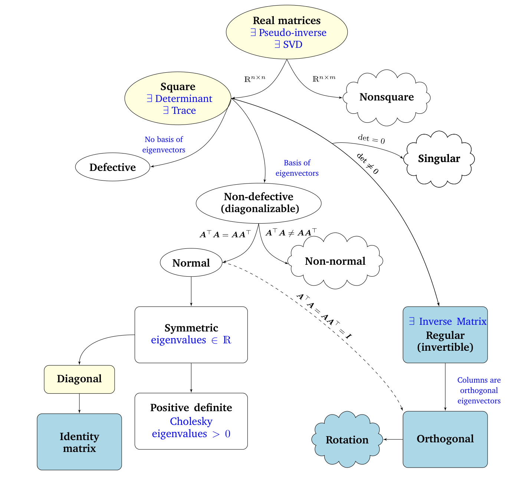

## 4.7 矩阵谱系

_备注_ 。“系统发育/谱系（phylogenetic）”一词描述了我们如何刻画个体或群体之间的亲缘关系，源自希腊语中表示“部族”和“来源”的词汇。♦

在第 2 章和第 3 章中，我们介绍了线性代数和解析几何的基础知识。在本章中，我们探讨了矩阵和线性映射的基本特征。图 4.13 描绘了不同类型矩阵之间关系的谱系树（黑色箭头表示“是……的子集”），以及我们可以对它们执行的各项讨论过的运算（蓝色表示）。我们考虑所有实矩阵 $ \boldsymbol A \in \mathbb{R}^{n \times m} $。对于非方阵（其中 $ n \neq m $），正如我们在本章中所见，SVD 总是存在的。聚焦于方阵 $ \boldsymbol A \in \mathbb{R}^{n \times n} $，行列式可以告诉我们方阵是否拥有逆矩阵，即它是否属于正则、可逆矩阵类。如果该 $ n \times n $ 方阵拥有 $ n $ 个线性无关的特征向量，则该矩阵是非亏损的，并且存在特征分解（定理 4.12）。我们知道，重特征值可能导致亏损矩阵，而亏损矩阵是无法对角化的。

非奇异矩阵与非亏损矩阵并不相同。例如，旋转矩阵是可逆的（行列式非零），但在实数范围内不可对角化（其特征值不能保证是实数）。

   
  <b>图 4.13 机器学习中遇到的矩阵的功能分类谱系树。</b> 

我们进一步深入非亏损 $ n \times n $ 方阵的分支。如果条件 $ \boldsymbol A^\top \boldsymbol A = \boldsymbol A \boldsymbol A^\top $ 成立，则 $ \boldsymbol A $ 是 _正规（normal）_ 矩阵。此外，如果满足更严格的条件 $ \boldsymbol A^\top \boldsymbol A = \boldsymbol A \boldsymbol A^\top = \boldsymbol I $，则称 $ \boldsymbol A $ 为 _正交（orthogonal）_ 矩阵（参见定义 3.8）。正交矩阵的集合是正则（可逆）矩阵的子集，且满足 $ \boldsymbol A^\top = \boldsymbol A^{-1} $。

正规矩阵包含一个经常遇到的子集——对称矩阵 $ \boldsymbol S \in \mathbb{R}^{n \times n} $，其满足 $ \boldsymbol S = \boldsymbol S^\top $。对称矩阵只有实特征值。对称矩阵的一个子集由正定矩阵 $ \boldsymbol P $ 组成，满足对于所有 $ \boldsymbol x \in \mathbb{R}^n \setminus \{\boldsymbol 0\} $ 都有 $ \boldsymbol x^\top \boldsymbol P \boldsymbol x > 0 $。在这种情形下，存在唯一的 Cholesky 分解（定理 4.18）。正定矩阵只有正特征值，并且总是可逆的（即具有非零行列式）。

对称矩阵的另一个子集是对角矩阵 $ \boldsymbol D $。对角矩阵在乘法和加法下是封闭的，但不一定构成群（仅当所有对角元素均非零使得矩阵可逆时才构成群）。一个特殊的对角矩阵是单位矩阵 $ \boldsymbol I $。
