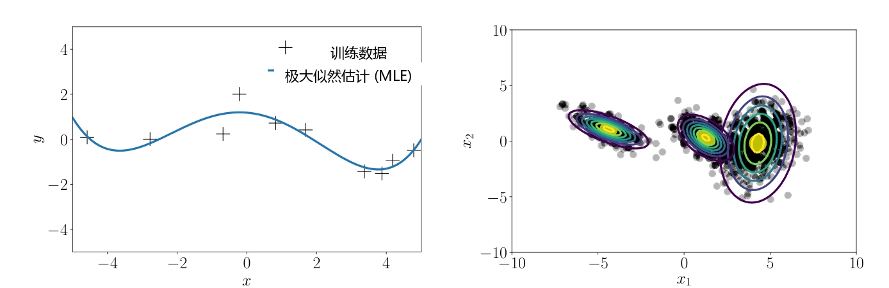
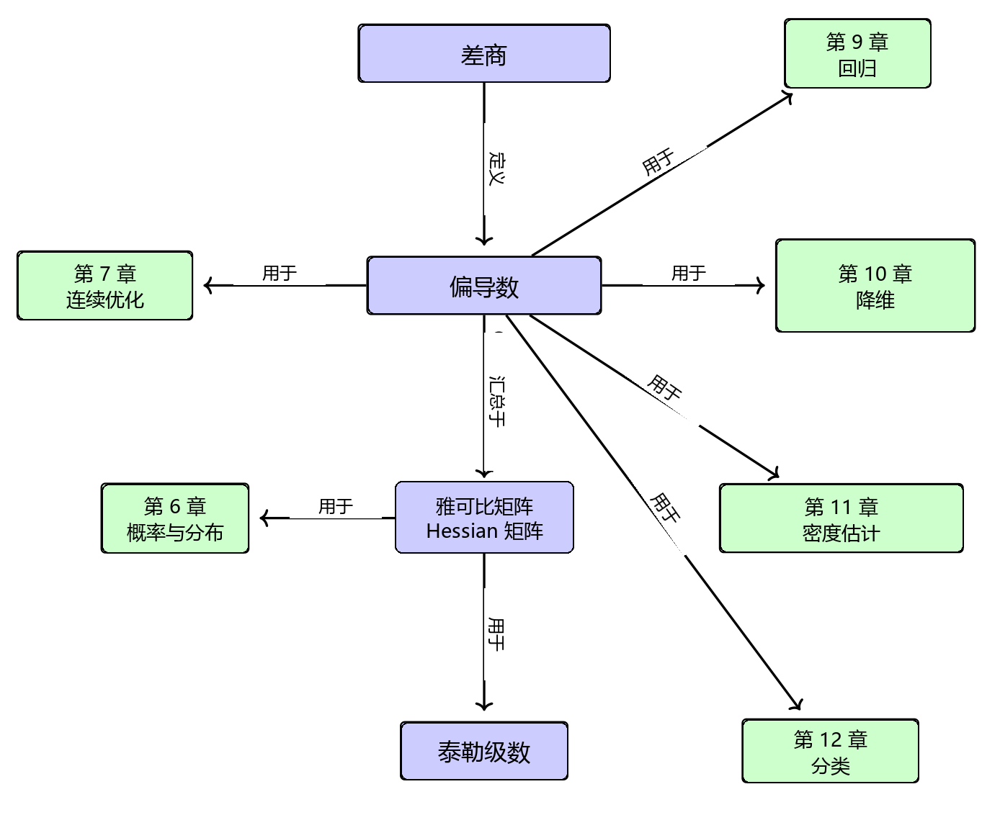

# 5 向量微积分

机器学习中的许多算法都通过针对一组期望的模型参数优化目标函数来控制模型对数据的解释程度：寻找良好参数的过程可以表述为一个优化问题（参见第 8.2 节和第 8.3 节）。示例包括：(i) 线性回归（参见第 9 章），其中我们研究曲线拟合问题，并通过优化线性权重参数来最大化似然；(ii) 用于降维和数据压缩的神经网络自编码器，其中的参数是每一层的权重与偏置，我们通过反复应用链式法则来最小化重构误差；(iii) 用于对数据分布进行建模的高斯混合模型（参见第 11 章），其中我们优化每个混合分量的位置与形状参数以最大化模型的似然。图 5.1 说明了其中的一些问题，我们通常利用利用梯度信息的优化算法（第 7.1 节）来求解这些问题。图 5.2 概述了本章各个概念之间的关系，以及它们与本书其他章节的联系。

   
  <b>图 5.1 向量微积分在 (a) 回归（曲线拟合）和 (b) 密度估计（即数据分布建模）中起着核心作用。</b> 

本章的核心是函数的概念。函数 $ f $ 是将两个量联系起来的量。在本书中，这些量通常是输入 $ \boldsymbol x \in \mathbb{R}^D $ 和目标（函数值）$ f(\boldsymbol x) $，若无特殊说明，我们假定它们是实值的。这里 $ \mathbb{R}^D $ 是 $ f $ 的 _定义域（domain）_ ，而函数值 $ f(\boldsymbol x) $ 是 $ f $ 的 _像/到达域（image/codomain）_ 。第 2.7.3 节在线性函数背景下提供了更详细的讨论。我们经常写作：
$$ f : \mathbb{R}^D \to \mathbb{R} \tag{5.1a} $$
$$ \boldsymbol x \mapsto f(\boldsymbol x) \tag{5.1b} $$
来指明一个函数，其中式 (5.1a) 指定 $ f $ 是从 $ \mathbb{R}^D $ 到 $ \mathbb{R} $ 的映射，而式 (5.1b) 指定了将输入 $ \boldsymbol x $ 显式对应到函数值 $ f(\boldsymbol x) $。函数 $ f $ 为每个输入 $ \boldsymbol x $ 分配唯一的函数值 $ f(\boldsymbol x) $。

> **例 5.1**
> 
> 回想作为内积特例的点积（第 3.2 节）。在上述记号下，函数 $ f(\boldsymbol x) = \boldsymbol x^\top \boldsymbol x $（$ \boldsymbol x \in \mathbb{R}^2 $）可表示为：
> $$ f : \mathbb{R}^2 \to \mathbb{R} \tag{5.2a} $$
> $$ \boldsymbol x \mapsto x_1^2 + x_2^2 \tag{5.2b} $$

   
  <b>图 5.2 本章介绍的概念的思维导图，以及它们在本书其他部分中的应用场景。</b> 

在本章中，我们将讨论如何计算函数的梯度。梯度计算对于促进机器学习模型的学习通常是不可或缺的，因为梯度指向函数最陡上升的方向。因此，向量微积分是我们在机器学习中需要的基础数学工具之一。在本书通篇中，我们假设函数是可微的。借助一些额外的技术性定义（此处不予展开），所介绍的许多方法都可以扩展到次微分（在某些点连续但不可微的函数）。我们将在第 7 章中探讨对带约束函数情形的拓展。
