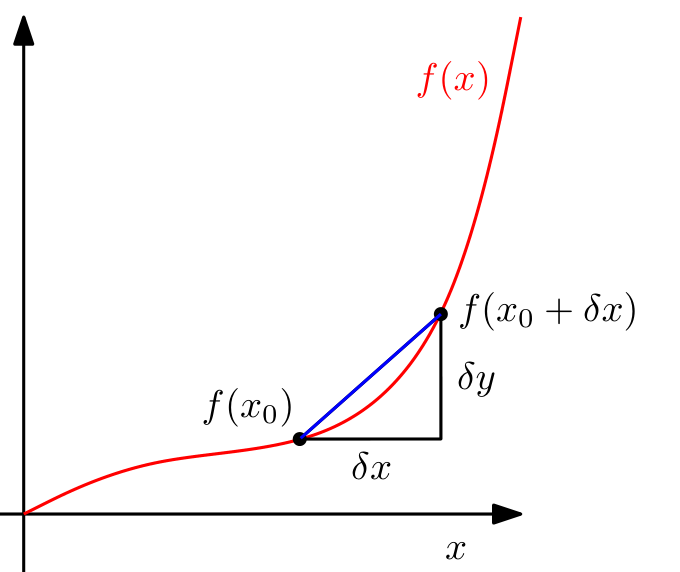
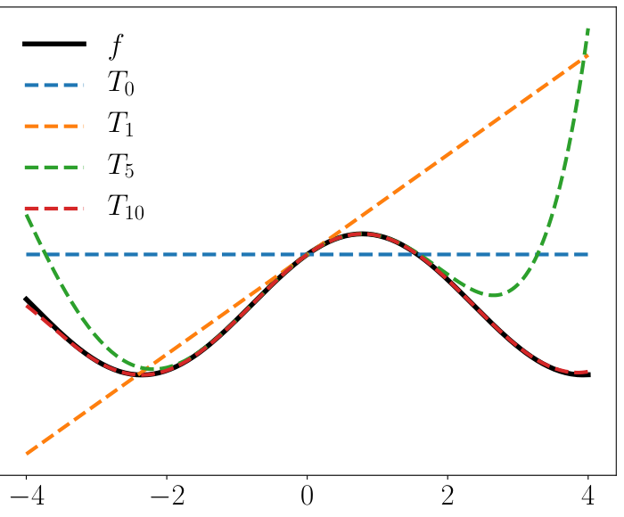

## 5.1 单变量函数微分

下面，我们简要回顾单变量函数的微分，这在高中数学中可能已经很熟悉。我们首先从单变量函数 $ y = f(x) $（$ x, y \in \mathbb{R} $）的差商出发，随后利用它来定义导数。

**定义 5.1**（差商）。 _差商（difference quotient）_ ：
$$ \frac{\delta y}{\delta x} := \frac{f(x + \delta x) - f(x)}{\delta x} \tag{5.3} $$
用于计算经过函数 $ f $ 图形上两点的割线斜率。在图 5.3 中，这两个点的 $ x $ 坐标分别为 $ x_0 $ 和 $ x_0 + \delta x $。

   
  <b>图 5.3 函数 f 在 x₀ 与 x₀ + δx 之间的平均倾斜度是通过 f(x₀) 和 f(x₀ + δx) 的割线（蓝色）的斜率，由 δy/δx 给出。</b> 

如果假定 $ f $ 为线性函数，差商也可以看作是 $ f $ 在 $ x $ 与 $ x + \delta x $ 之间的平均斜率。当 $ \delta x \to 0 $ 时，若 $ f $ 可微，极限即为 $ f $ 在 $ x $ 处的切线斜率。该切线即为 $ f $ 在 $ x $ 处的导数。

**定义 5.2**（导数）。更正式地，对于 $ h > 0 $，函数 $ f $ 在 $ x $ 处的 _导数（derivative）_ 定义为极限：
$$ \frac{\mathrm{d}f}{\mathrm{d}x} := \lim_{h \to 0} \frac{f(x + h) - f(x)}{h} \tag{5.4} $$
此时图 5.3 中的割线收敛为切线。函数 $ f $ 的导数指向 $ f $ 最陡上升的方向。

> **例 5.2（多项式的导数）**
> 
> 我们希望计算 $ f(x) = x^n $（$ n \in \mathbb{N} $）的导数。我们可能已经知道结果是 $ n x^{n-1} $，但我们希望利用导数作为差商极限的定义来推导这一结果。
> 
> 利用式 (5.4) 中导数的定义，我们有：
> $$ \frac{\mathrm{d}f}{\mathrm{d}x} = \lim_{h \to 0} \frac{f(x + h) - f(x)}{h} \tag{5.5a} $$
> $$ = \lim_{h \to 0} \frac{(x + h)^n - x^n}{h} \tag{5.5b} $$
> $$ = \lim_{h \to 0} \frac{\sum_{i=0}^n \binom{n}{i} x^{n-i} h^i - x^n}{h} \tag{5.5c} $$
> 注意到 $ x^n = \binom{n}{0} x^{n-0} h^0 $。通过从 $ i = 1 $ 开始求和，常数项 $ x^n $ 相互抵消，从而得到：
> $$ \frac{\mathrm{d}f}{\mathrm{d}x} = \lim_{h \to 0} \frac{\sum_{i=1}^n \binom{n}{i} x^{n-i} h^i}{h} \tag{5.6a} $$
> $$ = \lim_{h \to 0} \sum_{i=1}^n \binom{n}{i} x^{n-i} h^{i-1} \tag{5.6b} $$
> $$ = \lim_{h \to 0} \left[ \binom{n}{1} x^{n-1} + \sum_{i=2}^n \binom{n}{i} x^{n-i} h^{i-1} \right] \tag{5.6c} $$
> 在式 (5.6c) 中，当 $ h \to 0 $ 时第二项趋向于 0，因此：
> $$ \frac{\mathrm{d}f}{\mathrm{d}x} = \frac{n!}{1!(n - 1)!} x^{n-1} = n x^{n-1} \tag{5.6d} $$

---

### 5.1.1 泰勒级数

泰勒级数是将函数 $ f $ 表示为无限项之和的一种形式。这些项由在 $ x_0 $ 处求值的 $ f $ 的各阶导数所决定。

**定义 5.3**（泰勒多项式）。函数 $ f : \mathbb{R} \to \mathbb{R} $ 在 $ x_0 $ 处的 $ n $ 阶 _泰勒多项式（Taylor polynomial）_ 定义为：
$$ T_n(x) := \sum_{k=0}^n \frac{f^{(k)}(x_0)}{k!} (x - x_0)^k \tag{5.7} $$
其中 $ f^{(k)}(x_0) $ 是 $ f $ 在 $ x_0 $ 处的 $ k $ 阶导数（假定其存在），而 $ \frac{f^{(k)}(x_0)}{k!} $ 是多项式的系数。我们对所有 $ t \in \mathbb{R} $ 约定 $ t^0 := 1 $。

**定义 5.4**（泰勒级数）。对于光滑函数 $ f \in C^\infty $（$ f : \mathbb{R} \to \mathbb{R} $），$ f $ 在 $ x_0 $ 处的 _泰勒级数（Taylor series）_ 定义为：
$$ T_\infty(x) = \sum_{k=0}^\infty \frac{f^{(k)}(x_0)}{k!} (x - x_0)^k \tag{5.8} $$
当 $ x_0 = 0 $ 时，我们获得作为泰勒级数特例的 _麦克劳林级数（Maclaurin series）_ 。如果 $ f(x) = T_\infty(x) $，则称 $ f $ 是 _解析的（analytic）_ 。这里 $ f \in C^\infty $ 表示 $ f $ 是无穷次连续可微的。

_备注_ 。一般而言，$ n $ 阶泰勒多项式是对函数的逼近，该函数本身不一定是多项式。泰勒多项式在 $ x_0 $ 的邻域内与 $ f $ 相似。然而，对于次数 $ k \leqslant n $ 的多项式 $ f $，$ n $ 阶泰勒多项式是该多项式的精确表示，因为所有阶数 $ i > k $ 的导数 $ f^{(i)} $ 全为 0。♦

> **例 5.3（泰勒多项式）**
> 
> 考虑多项式：
> $$ f(x) = x^4 \tag{5.9} $$
> 我们求在 $ x_0 = 1 $ 处求值的泰勒多项式 $ T_6 $。首先计算各阶导数系数 $ f^{(k)}(1) $（$ k = 0, \ldots, 6 $）：
> $$ f(1) = 1 \tag{5.10} $$
> $$ f'(1) = 4 \tag{5.11} $$
> $$ f''(1) = 12 \tag{5.12} $$
> $$ f^{(3)}(1) = 24 \tag{5.13} $$
> $$ f^{(4)}(1) = 24 \tag{5.14} $$
> $$ f^{(5)}(1) = 0 \tag{5.15} $$
> $$ f^{(6)}(1) = 0 \tag{5.16} $$
> 因此，所需的泰勒多项式为：
> $$ T_6(x) = \sum_{k=0}^6 \frac{f^{(k)}(x_0)}{k!} (x - x_0)^k \tag{5.17a} $$
> $$ = 1 + 4(x - 1) + 6(x - 1)^2 + 4(x - 1)^3 + (x - 1)^4 + 0 \tag{5.17b} $$
> 展开并整理各项得到：
> $$ T_6(x) = (1 - 4 + 6 - 4 + 1) + x(4 - 12 + 12 - 4) + x^2(6 - 12 + 6) + x^3(4 - 4) + x^4 \tag{5.18a} $$
> $$ = x^4 = f(x) \tag{5.18b} $$
> 即我们得到了原函数的精确表示。

   
  <b>图 5.4 泰勒多项式。原函数 f(x) = sin(x) + cos(x)（黑色实线）在 x₀ = 0 处由各阶泰勒多项式（虚线）逼近。高阶泰勒多项式能更好地在更大全局范围内逼近函数 f。T₁₀ 在 [-4, 4] 区间内已经与 f 高度吻合。</b> 

> **例 5.4（泰勒级数）**
> 
> 考虑图 5.4 中给出的函数：
> $$ f(x) = \sin(x) + \cos(x) \in C^\infty \tag{5.19} $$
> 我们求 $ f $ 在 $ x_0 = 0 $ 处的泰勒级数展开（即麦克劳林级数展开）。我们得到以下导数：
> $$ f(0) = \sin(0) + \cos(0) = 1 \tag{5.20} $$
> $$ f'(0) = \cos(0) - \sin(0) = 1 \tag{5.21} $$
> $$ f''(0) = -\sin(0) - \cos(0) = -1 \tag{5.22} $$
> $$ f^{(3)}(0) = -\cos(0) + \sin(0) = -1 \tag{5.23} $$
> $$ f^{(4)}(0) = \sin(0) + \cos(0) = f(0) = 1 \tag{5.24} $$
> 此处存在规律：泰勒级数中的系数仅为 $ \pm 1 $（因为 $ \sin(0) = 0 $），每两个相同符号后切换到另一个符号。此外，$ f^{(k+4)}(0) = f^{(k)}(0) $。
> 
> 因此，$ f $ 在 $ x_0 = 0 $ 处的完整泰勒级数展开为：
> $$ T_\infty(x) = \sum_{k=0}^\infty \frac{f^{(k)}(x_0)}{k!} (x - x_0)^k \tag{5.25a} $$
> $$ = 1 + x - \frac{1}{2!} x^2 - \frac{1}{3!} x^3 + \frac{1}{4!} x^4 + \frac{1}{5!} x^5 - \cdots \tag{5.25b} $$
> $$ = \left( 1 - \frac{1}{2!} x^2 + \frac{1}{4!} x^4 \mp \cdots \right) + \left( x - \frac{1}{3!} x^3 + \frac{1}{5!} x^5 \mp \cdots \right) \tag{5.25c} $$
> $$ = \sum_{k=0}^\infty \frac{(-1)^k}{(2k)!} x^{2k} + \sum_{k=0}^\infty \frac{(-1)^k}{(2k + 1)!} x^{2k+1} \tag{5.25d} $$
> $$ = \cos(x) + \sin(x) \tag{5.25e} $$
> 其中我们使用了三角函数的幂级数表示：
> $$ \cos(x) = \sum_{k=0}^\infty \frac{(-1)^k}{(2k)!} x^{2k} \tag{5.26} $$
> $$ \sin(x) = \sum_{k=0}^\infty \frac{(-1)^k}{(2k + 1)!} x^{2k+1} \tag{5.27} $$
> 图 5.4 展示了 $ n = 0, 1, 5, 10 $ 时对应的泰勒多项式 $ T_n $。

_备注_ 。泰勒级数是 _幂级数（power series）_ ：
$$ f(x) = \sum_{k=0}^\infty a_k (x - c)^k \tag{5.28} $$
的特例，其中 $ a_k $ 为系数，$ c $ 为常数，在定义 5.4 中具有特定的求值形式。♦

---

### 5.1.2 微分法则

下面我们简要列出基本的微分法则，其中我们将 $ f $ 的导数记为 $ f' $：
- 乘积法则（Product rule）：
$$ (f(x)g(x))' = f'(x)g(x) + f(x)g'(x) \tag{5.29} $$
- 商法则（Quotient rule）：
$$ \left( \frac{f(x)}{g(x)} \right)' = \frac{f'(x)g(x) - f(x)g'(x)}{(g(x))^2} \tag{5.30} $$
- 求和法则（Sum rule）：
$$ (f(x) + g(x))' = f'(x) + g'(x) \tag{5.31} $$
- 链式法则（Chain rule）：
$$ (g(f(x)))' = (g \circ f)'(x) = g'(f(x))f'(x) \tag{5.32} $$
这里 $ g \circ f $ 表示复合函数 $ x \mapsto f(x) \mapsto g(f(x)) $。

> **例 5.5（链式法则）**
> 
> 我们使用链式法则计算函数 $ h(x) = (2x + 1)^4 $ 的导数。令：
> $$ h(x) = (2x + 1)^4 = g(f(x)) \tag{5.33} $$
> $$ f(x) = 2x + 1 \tag{5.34} $$
> $$ g(f) = f^4 \tag{5.35} $$
> 我们得到 $ f $ 和 $ g $ 的导数分别为：
> $$ f'(x) = 2 \tag{5.36} $$
> $$ g'(f) = 4f^3 \tag{5.37} $$
> 从而 $ h $ 的导数为：
> $$ h'(x) = g'(f)f'(x) = (4f^3) \cdot 2 = 4(2x + 1)^3 \cdot 2 = 8(2x + 1)^3 \tag{5.38} $$
> 其中我们应用了链式法则 (5.32)，并将式 (5.34) 中 $ f $ 的定义代入了 $ g'(f) $。
