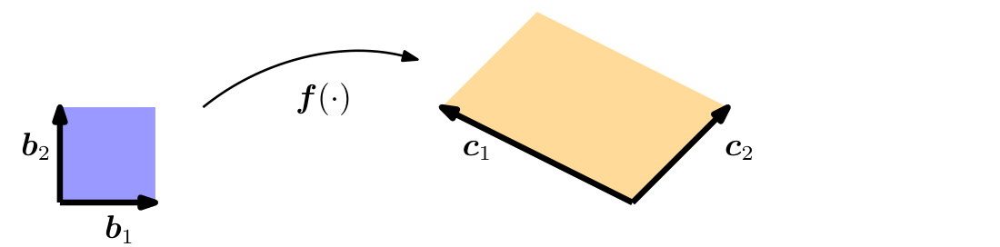
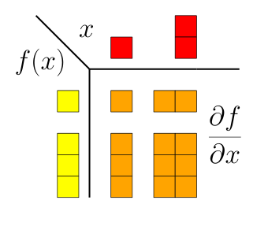

## 5.3 向量值函数的梯度

到目前为止，我们讨论了映射到实数的函数 $ f : \mathbb{R}^n \to \mathbb{R} $ 的偏导数与梯度。下面，我们将梯度的概念推广到向量值函数（或称为 _向量场（vector fields）_ ）$ \boldsymbol f : \mathbb{R}^n \to \mathbb{R}^m $，其中 $ n \geqslant 1 $ 且 $ m > 1 $。

对于函数 $ \boldsymbol f : \mathbb{R}^n \to \mathbb{R}^m $ 和向量 $ \boldsymbol x = [x_1, \ldots, x_n]^\top \in \mathbb{R}^n $，对应的函数值向量由下式给出：
$$
\boldsymbol f(\boldsymbol x) = \begin{bmatrix} f_1(\boldsymbol x) \\ \vdots \\ f_m(\boldsymbol x) \end{bmatrix} \in \mathbb{R}^m \tag{5.54}
$$
将向量值函数写成这种形式，使我们能够将向量值函数 $ \boldsymbol f : \mathbb{R}^n \to \mathbb{R}^m $ 视为映射到 $ \mathbb{R} $ 的函数向量 $ [f_1, \ldots, f_m]^\top $（其中 $ f_i : \mathbb{R}^n \to \mathbb{R} $）。每个 $ f_i $ 的微分法则正是我们在第 5.2 节中讨论过的法则。

因此，向量值函数 $ \boldsymbol f : \mathbb{R}^n \to \mathbb{R}^m $ 关于 $ x_i \in \mathbb{R} $（$ i = 1, \ldots, n $）的偏导数由如下向量给出：
$$
\frac{\partial \boldsymbol f}{\partial x_i} = \begin{bmatrix} \frac{\partial f_1}{\partial x_i} \\ \vdots \\ \frac{\partial f_m}{\partial x_i} \end{bmatrix} = \begin{bmatrix} \lim_{h \to 0} \frac{f_1(x_1, \ldots, x_{i-1}, x_i + h, x_{i+1}, \ldots, x_n) - f_1(\boldsymbol x)}{h} \\ \vdots \\ \lim_{h \to 0} \frac{f_m(x_1, \ldots, x_{i-1}, x_i + h, x_{i+1}, \ldots, x_n) - f_m(\boldsymbol x)}{h} \end{bmatrix} \in \mathbb{R}^m \tag{5.55}
$$

由式 (5.40) 可知，$ f $ 关于一个向量的梯度是偏导数的行向量。在式 (5.55) 中，每个偏导数 $ \partial \boldsymbol f / \partial x_i $ 都是一个列向量。因此，通过收集这些偏导数，我们得到 $ \boldsymbol f : \mathbb{R}^n \to \mathbb{R}^m $ 关于 $ \boldsymbol x \in \mathbb{R}^n $ 的梯度：
$$
\frac{\mathrm{d}\boldsymbol f(\boldsymbol x)}{\mathrm{d}\boldsymbol x} = \begin{bmatrix} \frac{\partial \boldsymbol f(\boldsymbol x)}{\partial x_1} & \cdots & \frac{\partial \boldsymbol f(\boldsymbol x)}{\partial x_n} \end{bmatrix} \tag{5.56a}
$$
$$
= \begin{bmatrix} \frac{\partial f_1(\boldsymbol x)}{\partial x_1} & \cdots & \frac{\partial f_1(\boldsymbol x)}{\partial x_n} \\ \vdots & & \vdots \\ \frac{\partial f_m(\boldsymbol x)}{\partial x_1} & \cdots & \frac{\partial f_m(\boldsymbol x)}{\partial x_n} \end{bmatrix} \in \mathbb{R}^{m \times n} \tag{5.56b}
$$

**定义 5.6**（雅可比矩阵）。向量值函数 $ \boldsymbol f : \mathbb{R}^n \to \mathbb{R}^m $ 的所有一阶偏导数的集合称为 _雅可比矩阵（Jacobian）_ 。雅可比矩阵 $ \boldsymbol J $ 是一个 $ m \times n $ 矩阵，我们将其定义并排列如下（ _边注_ ：函数 $ \boldsymbol f : \mathbb{R}^n \to \mathbb{R}^m $ 的梯度是一个大小为 $ m \times n $ 的矩阵）：
$$
\boldsymbol J = \nabla_{\boldsymbol x} \boldsymbol f = \frac{\mathrm{d}\boldsymbol f(\boldsymbol x)}{\mathrm{d}\boldsymbol x} = \begin{bmatrix} \frac{\partial \boldsymbol f(\boldsymbol x)}{\partial x_1} & \cdots & \frac{\partial \boldsymbol f(\boldsymbol x)}{\partial x_n} \end{bmatrix} \tag{5.57}
$$
$$
= \begin{bmatrix} \frac{\partial f_1(\boldsymbol x)}{\partial x_1} & \cdots & \frac{\partial f_1(\boldsymbol x)}{\partial x_n} \\ \vdots & & \vdots \\ \frac{\partial f_m(\boldsymbol x)}{\partial x_1} & \cdots & \frac{\partial f_m(\boldsymbol x)}{\partial x_n} \end{bmatrix} \tag{5.58}
$$
$$
\boldsymbol x = \begin{bmatrix} x_1 \\ \vdots \\ x_n \end{bmatrix}, \quad \boldsymbol J(i, j) = \frac{\partial f_i}{\partial x_j} \tag{5.59}
$$

作为式 (5.58) 的特例，将向量 $ \boldsymbol x \in \mathbb{R}^n $ 映射到标量的函数 $ f : \mathbb{R}^n \to \mathbb{R}^1 $（例如 $ f(\boldsymbol x) = \sum_{i=1}^n x_i $）的雅可比矩阵是一个行向量（维度为 $ 1 \times n $ 的矩阵）；参见式 (5.40)。

_备注_ 。在本书中，我们使用导数的 _分子布局（numerator layout）_ ，即 $ \boldsymbol f \in \mathbb{R}^m $ 关于 $ \boldsymbol x \in \mathbb{R}^n $ 的导数 $ \mathrm{d}\boldsymbol f / \mathrm{d}\boldsymbol x $ 是一个 $ m \times n $ 矩阵，其中 $ \boldsymbol f $ 的元素定义行，$ \boldsymbol x $ 的元素定义相应雅可比矩阵的列；参见式 (5.58)。此外还存在 _分母布局（denominator layout）_ ，它是分子布局的转置。在本书中，我们将统一采用分子布局。♦

我们将在第 6.7 节看到如何将雅可比矩阵用于概率分布的变量替换法中。由变量变换导致的缩放程度由行列式给出。

在第 4.1 节中，我们看到行列式可用于计算平行四边形的面积。如果给定两个向量 $ \boldsymbol b_1 = [1, 0]^\top, \boldsymbol b_2 = [0, 1]^\top $ 作为单位正方形的边（图 5.5 中的蓝色区域），该正方形的面积为：
$$
\left| \det \begin{bmatrix} 1 & 0 \\ 0 & 1 \end{bmatrix} \right| = 1 \tag{5.60}
$$
如果我们取边为 $ \boldsymbol c_1 = [-2, 1]^\top, \boldsymbol c_2 = [1, 1]^\top $ 的平行四边形（图 5.5 中的橙色区域），其面积由行列式的绝对值给出（参见第 4.1 节）：
$$
\left| \det \begin{bmatrix} -2 & 1 \\ 1 & 1 \end{bmatrix} \right| = |-3| = 3 \tag{5.61}
$$
即该平行四边形的面积恰好是单位正方形面积的三倍。我们可以通过寻找将单位正方形变换为该平行四边形的映射来求出该缩放因子。用线性代数的语言来说，我们实际上执行了从 $ (\boldsymbol b_1, \boldsymbol b_2) $ 到 $ (\boldsymbol c_1, \boldsymbol c_2) $ 的变量变换。在我们的示例中，该映射是线性的，并且该映射的行列式绝对值恰好给出了我们所寻找的缩放因子。

   
  <b>图 5.5 f 的雅可比行列式可用于计算蓝色区域与橙色区域之间的放大倍数。</b> 

我们将介绍确定该映射的两种方法。首先，我们利用该映射是线性的这一事实，借助第 2 章中的工具来确定该映射。其次，我们将使用本章讨论的偏导数工具来寻找该映射。

**方法 1**。为了从线性代数方法入手，我们将 $ \{\boldsymbol b_1, \boldsymbol b_2\} $ 和 $ \{\boldsymbol c_1, \boldsymbol c_2\} $ 都视为 $ \mathbb{R}^2 $ 的基（参见第 2.6.1 节的回顾）。我们实际执行的是从 $ (\boldsymbol b_1, \boldsymbol b_2) $ 到 $ (\boldsymbol c_1, \boldsymbol c_2) $ 的基变换，并且正在寻找实现该基变换的变换矩阵。利用第 2.7.2 节的结果，我们将所需的基变换矩阵确定为：
$$
\boldsymbol J = \begin{bmatrix} -2 & 1 \\ 1 & 1 \end{bmatrix} \tag{5.62}
$$
使得 $ \boldsymbol J \boldsymbol b_1 = \boldsymbol c_1 $ 且 $ \boldsymbol J \boldsymbol b_2 = \boldsymbol c_2 $。给出我们所寻求的缩放因子的 $ \boldsymbol J $ 的行列式绝对值为 $ |\det(\boldsymbol J)| = 3 $，即由 $ (\boldsymbol c_1, \boldsymbol c_2) $ 张成的面积是由 $ (\boldsymbol b_1, \boldsymbol b_2) $ 张成的面积的三倍。

**方法 2**。线性代数方法适用于线性变换；对于非线性变换（这在第 6.7 节中会变得很重要），我们采用基于偏导数的更通用方法。对于这种方法，我们考虑执行变量变换的函数 $ \boldsymbol f : \mathbb{R}^2 \to \mathbb{R}^2 $。在我们的示例中，$ \boldsymbol f $ 将任何向量 $ \boldsymbol x \in \mathbb{R}^2 $ 关于 $ (\boldsymbol b_1, \boldsymbol b_2) $ 的坐标表示映射到关于 $ (\boldsymbol c_1, \boldsymbol c_2) $ 的坐标表示 $ \boldsymbol y \in \mathbb{R}^2 $。我们希望确定该映射，以便计算当面积（或体积）被 $ \boldsymbol f $ 变换时是如何改变的。为此，我们需要弄清楚如果对 $ \boldsymbol x $ 进行微小修改，$ \boldsymbol f(\boldsymbol x) $ 会如何改变。这个问题正是由雅可比矩阵 $ \frac{\mathrm{d}\boldsymbol f}{\mathrm{d}\boldsymbol x} \in \mathbb{R}^{2 \times 2} $ 所回答的。因为我们可以写出：
$$
y_1 = -2x_1 + x_2 \tag{5.63}
$$
$$
y_2 = x_1 + x_2 \tag{5.64}
$$
从而获得了 $ \boldsymbol x $ 和 $ \boldsymbol y $ 之间的函数关系，由此可以求得偏导数：
$$
\frac{\partial y_1}{\partial x_1} = -2, \quad \frac{\partial y_1}{\partial x_2} = 1, \quad \frac{\partial y_2}{\partial x_1} = 1, \quad \frac{\partial y_2}{\partial x_2} = 1 \tag{5.65}
$$
并构成雅可比矩阵：
$$
\boldsymbol J = \begin{bmatrix} \frac{\partial y_1}{\partial x_1} & \frac{\partial y_1}{\partial x_2} \\ \frac{\partial y_2}{\partial x_1} & \frac{\partial y_2}{\partial x_2} \end{bmatrix} = \begin{bmatrix} -2 & 1 \\ 1 & 1 \end{bmatrix} \tag{5.66}
$$

该雅可比矩阵表示我们正在寻找的坐标变换。如果坐标变换是线性的（如我们的示例），该变换是精确的，且式 (5.66) 精确地恢复了式 (5.62) 中的基变换矩阵。如果坐标变换是非线性的，雅可比矩阵在局部用线性变换来逼近该非线性变换。 _雅可比行列式（Jacobian determinant）_ 的绝对值 $ |\det(\boldsymbol J)| $ 是坐标变换时面积或体积缩放的因子。（ _边注_ ：从几何上看，当我们变换面积或体积时，雅可比行列式给出了放大/缩放因子。）在我们的示例中，$ |\det(\boldsymbol J)| = 3 $。

雅可比行列式和变量变换在第 6.7 节变换随机变量和概率分布时将变得非常重要。在机器学习中，在使用 _重参数化技巧（reparametrization trick）_ （也称为 _无穷小微扰分析（infinite perturbation analysis）_ ）训练深度神经网络的背景下，这些变换极其重要。

   
  <b>图 5.6 （偏）导数的维度总结。</b> 

在本章中，我们遇到了各种函数的导数。图 5.6 总结了这些导数的维度。若 $ f : \mathbb{R} \to \mathbb{R} $，梯度就是一个标量（左上角）；对于 $ f : \mathbb{R}^D \to \mathbb{R} $，梯度是一个 $ 1 \times D $ 的行向量（右上角）；对于 $ \boldsymbol f : \mathbb{R} \to \mathbb{R}^E $，梯度是一个 $ E \times 1 $ 的列向量（左下角）；对于 $ \boldsymbol f : \mathbb{R}^D \to \mathbb{R}^E $，梯度是一个 $ E \times D $ 的矩阵（右下角）。

> **例 5.9（向量值函数的梯度）**
> 
> 设给定：
> $$
> \boldsymbol f(\boldsymbol x) = \boldsymbol A \boldsymbol x, \quad \boldsymbol f(\boldsymbol x) \in \mathbb{R}^M, \quad \boldsymbol A \in \mathbb{R}^{M \times N}, \quad \boldsymbol x \in \mathbb{R}^N
> $$
> 为了计算梯度 $ \mathrm{d}\boldsymbol f / \mathrm{d}\boldsymbol x $，首先确定 $ \mathrm{d}\boldsymbol f / \mathrm{d}\boldsymbol x $ 的维度：由于 $ \boldsymbol f : \mathbb{R}^N \to \mathbb{R}^M $，因此 $ \mathrm{d}\boldsymbol f / \mathrm{d}\boldsymbol x \in \mathbb{R}^{M \times N} $。其次，为了计算梯度，我们确定 $ \boldsymbol f $ 关于每个 $ x_j $ 的偏导数：
> $$
> f_i(\boldsymbol x) = \sum_{j=1}^N A_{ij} x_j \implies \frac{\partial f_i}{\partial x_j} = A_{ij} \tag{5.67}
> $$
> 我们将这些偏导数汇集到雅可比矩阵中，从而得到梯度：
> $$
> \frac{\mathrm{d}\boldsymbol f}{\mathrm{d}\boldsymbol x} = \begin{bmatrix} \frac{\partial f_1}{\partial x_1} & \cdots & \frac{\partial f_1}{\partial x_N} \\ \vdots & & \vdots \\ \frac{\partial f_M}{\partial x_1} & \cdots & \frac{\partial f_M}{\partial x_N} \end{bmatrix} = \begin{bmatrix} A_{11} & \cdots & A_{1N} \\ \vdots & & \vdots \\ A_{M1} & \cdots & A_{MN} \end{bmatrix} = \boldsymbol A \in \mathbb{R}^{M \times N} \tag{5.68}
> $$

> **例 5.10（链式法则）**
> 
> 考虑函数 $ h : \mathbb{R} \to \mathbb{R} $，$ h(t) = (f \circ \boldsymbol g)(t) $，其中：
> $$
> f : \mathbb{R}^2 \to \mathbb{R} \tag{5.69}
> $$
> $$
> \boldsymbol g : \mathbb{R} \to \mathbb{R}^2 \tag{5.70}
> $$
> $$
> f(\boldsymbol x) = \exp(x_1 x_2^2) \tag{5.71}
> $$
> $$
> \boldsymbol x = \begin{bmatrix} x_1 \\ x_2 \end{bmatrix} = \boldsymbol g(t) = \begin{bmatrix} t \cos t \\ t \sin t \end{bmatrix} \tag{5.72}
> $$
> 我们计算 $ h $ 关于 $ t $ 的梯度。由于 $ f : \mathbb{R}^2 \to \mathbb{R} $ 且 $ \boldsymbol g : \mathbb{R} \to \mathbb{R}^2 $，我们注意到：
> $$
> \frac{\partial f}{\partial \boldsymbol x} \in \mathbb{R}^{1 \times 2}, \quad \frac{\partial \boldsymbol g}{\partial t} \in \mathbb{R}^{2 \times 1} \tag{5.73}
> $$
> 所求梯度通过应用链式法则计算：
> $$
> \frac{\mathrm{d}h}{\mathrm{d}t} = \frac{\partial f}{\partial \boldsymbol x}\frac{\partial \boldsymbol x}{\partial t} = \begin{bmatrix} \frac{\partial f}{\partial x_1} & \frac{\partial f}{\partial x_2} \end{bmatrix} \begin{bmatrix} \frac{\partial x_1}{\partial t} \\ \frac{\partial x_2}{\partial t} \end{bmatrix} \tag{5.74a}
> $$
> $$
> = \begin{bmatrix} \exp(x_1 x_2^2) x_2^2 & 2\exp(x_1 x_2^2) x_1 x_2 \end{bmatrix} \begin{bmatrix} \cos t - t\sin t \\ \sin t + t\cos t \end{bmatrix} \tag{5.74b}
> $$
> $$
> = \exp(x_1 x_2^2) \left( x_2^2(\cos t - t\sin t) + 2x_1 x_2(\sin t + t\cos t) \right) \tag{5.74c}
> $$
> 其中 $ x_1 = t \cos t $ 且 $ x_2 = t \sin t $；参见式 (5.72)。

> **例 5.11（线性模型中最小二乘损失的梯度）**
> 
> 考虑线性模型：
> $$
> \boldsymbol y = \boldsymbol \Phi \boldsymbol \theta \tag{5.75}
> $$
> 其中 $ \boldsymbol \theta \in \mathbb{R}^D $ 是参数向量，$ \boldsymbol \Phi \in \mathbb{R}^{N \times D} $ 是输入特征，而 $ \boldsymbol y \in \mathbb{R}^N $ 是对应的观测值。（ _边注_ ：我们将在第 9 章线性回归的背景下更详细地讨论该模型，在那里我们需要最小二乘损失 $ L $ 关于参数 $ \boldsymbol \theta $ 的导数。）我们定义函数：
> $$
> L(\boldsymbol e) := \|\boldsymbol e\|^2 \tag{5.76}
> $$
> $$
> \boldsymbol e(\boldsymbol \theta) := \boldsymbol y - \boldsymbol \Phi \boldsymbol \theta \tag{5.77}
> $$
> 我们求解 $ \frac{\partial L}{\partial \boldsymbol \theta} $，并将为此应用链式法则。$ L $ 称为 _最小二乘损失函数（least-squares loss function）_ 。
> 
> 在开始计算之前，我们确定梯度的维度为：
> $$
> \frac{\partial L}{\partial \boldsymbol \theta} \in \mathbb{R}^{1 \times D} \tag{5.78}
> $$
> 链式法则允许我们将梯度计算为：
> $$
> \frac{\partial L}{\partial \boldsymbol \theta} = \frac{\partial L}{\partial \boldsymbol e} \frac{\partial \boldsymbol e}{\partial \boldsymbol \theta} \tag{5.79}
> $$
> 其中第 $ d $ 个元素由下式给出：
> $$
> \frac{\partial L}{\partial \boldsymbol \theta}[1, d] = \sum_{n=1}^N \frac{\partial L}{\partial \boldsymbol e}[n] \frac{\partial \boldsymbol e}{\partial \boldsymbol \theta}[n, d] \tag{5.80}
> $$
> （在 Python 中对应为 `dLdtheta = np.einsum('n,nd', dLde, dedtheta)`。）
> 我们知道 $ \|\boldsymbol e\|^2 = \boldsymbol e^\top \boldsymbol e $（参见第 3.2 节），由此确定：
> $$
> \frac{\partial L}{\partial \boldsymbol e} = 2\boldsymbol e^\top \in \mathbb{R}^{1 \times N} \tag{5.81}
> $$
> 此外，我们得到：
> $$
> \frac{\partial \boldsymbol e}{\partial \boldsymbol \theta} = -\boldsymbol \Phi \in \mathbb{R}^{N \times D} \tag{5.82}
> $$
> 从而所求的导数为：
> $$
> \frac{\partial L}{\partial \boldsymbol \theta} = -2\boldsymbol e^\top \boldsymbol \Phi \stackrel{(5.77)}{=} \underbrace{-2(\boldsymbol y^\top - \boldsymbol \theta^\top \boldsymbol \Phi^\top)}_{1 \times N} \underbrace{\boldsymbol \Phi}_{N \times D} \in \mathbb{R}^{1 \times D} \tag{5.83}
> $$

_备注_ 。如果不使用链式法则，而是直接考察函数：
$$
L_2(\boldsymbol \theta) := \|\boldsymbol y - \boldsymbol \Phi \boldsymbol \theta\|^2 = (\boldsymbol y - \boldsymbol \Phi \boldsymbol \theta)^\top (\boldsymbol y - \boldsymbol \Phi \boldsymbol \theta) \tag{5.84}
$$
我们也会得到相同的结果。对于像 $ L_2 $ 这样的简单函数，这种直接方法仍然是可行的，但对于深层复合函数而言，这种方法就变得不切实际了。♦
