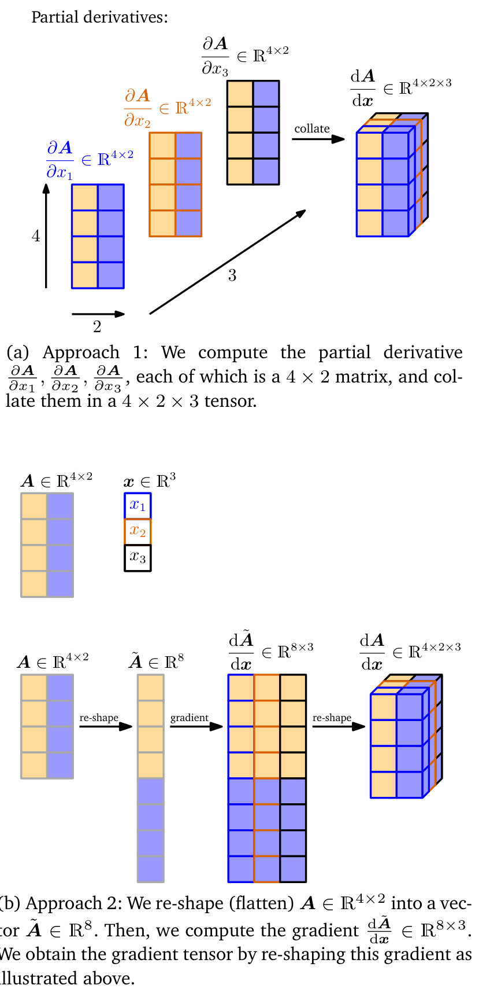

## 5.4 矩阵的梯度

我们会遇到需要计算矩阵关于向量（或其他矩阵）的梯度的情形，这会导致产生多维 _张量（tensor）_ 。我们可以将这种张量视为收集偏导数的多维数组。（ _边注_ ：我们可以将张量视为多维数组。）例如，如果我们计算一个 $ m \times n $ 矩阵 $ \boldsymbol A $ 关于一个 $ p \times q $ 矩阵 $ \boldsymbol B $ 的梯度，所得的雅可比对象将是 $ (m \times n) \times (p \times q) $ 维的，即一个四维张量 $ \boldsymbol J $，其元素由 $ J_{ijkl} = \partial A_{ij} / \partial B_{kl} $ 给出。

由于矩阵表示线性映射，我们可以利用这样一个事实：$ m \times n $ 矩阵空间 $ \mathbb{R}^{m \times n} $ 与 $ mn $ 维向量空间 $ \mathbb{R}^{mn} $ 之间存在 _向量空间同构（vector-space isomorphism）_ （线性可逆映射）。因此，我们可以将矩阵分别重塑为长度为 $ mn $ 和 $ pq $ 的向量。使用这些向量进行求导将产生一个大小为 $ mn \times pq $ 的雅可比矩阵。图 5.7 对这两种方法进行了可视化展示。在实际应用中，通常更希望将矩阵重塑为向量并继续使用这个雅可比矩阵：（ _边注_ ：可以通过按列堆叠矩阵的元素将矩阵转换为向量，即“展平”。）链式法则 (5.48) 简化为普通的矩阵乘法，而对于雅可比张量的情形，我们将需要更多地注意对哪些维度进行求和消除。

   
  <b>图 5.7 矩阵关于向量的梯度计算可视化。我们关注计算矩阵 A ∈ ℝ^(4×2) 关于向量 x ∈ ℝ^3 的梯度。已知梯度 dA/dx ∈ ℝ^(4×2×3)。我们采用两种等价方法得出结果：(a) 将偏导数整理为雅可比张量；(b) 将矩阵展平为向量，计算雅可比矩阵，再重塑为雅可比张量。</b> 

> **例 5.12（向量关于矩阵的梯度）**
> 
> 考虑以下示例：
> $$
> \boldsymbol f = \boldsymbol A \boldsymbol x, \quad \boldsymbol f \in \mathbb{R}^M, \quad \boldsymbol A \in \mathbb{R}^{M \times N}, \quad \boldsymbol x \in \mathbb{R}^N \tag{5.85}
> $$
> 我们希望求梯度 $ \mathrm{d}\boldsymbol f / \mathrm{d}\boldsymbol A $。首先再次确定梯度的维度：
> $$
> \frac{\mathrm{d}\boldsymbol f}{\mathrm{d}\boldsymbol A} \in \mathbb{R}^{M \times (M \times N)} \tag{5.86}
> $$
> 根据定义，梯度是偏导数的集合：
> $$
> \frac{\mathrm{d}\boldsymbol f}{\mathrm{d}\boldsymbol A} = \begin{bmatrix} \frac{\partial f_1}{\partial \boldsymbol A} \\ \vdots \\ \frac{\partial f_M}{\partial \boldsymbol A} \end{bmatrix}, \quad \frac{\partial f_i}{\partial \boldsymbol A} \in \mathbb{R}^{1 \times (M \times N)} \tag{5.87}
> $$
> 为了计算偏导数，显式写出矩阵-向量乘法会有所帮助：
> $$
> f_i = \sum_{j=1}^N A_{ij} x_j, \quad i = 1, \ldots, M \tag{5.88}
> $$
> 偏导数由下式给出：
> $$
> \frac{\partial f_i}{\partial A_{iq}} = x_q \tag{5.89}
> $$
> 这使我们能够计算 $ f_i $ 关于 $ \boldsymbol A $ 的某一行 $ \boldsymbol A_{i,:} $ 的偏导数：
> $$
> \frac{\partial f_i}{\partial \boldsymbol A_{i,:}} = \boldsymbol x^\top \in \mathbb{R}^{1 \times 1 \times N} \tag{5.90}
> $$
> $$
> \frac{\partial f_i}{\partial \boldsymbol A_{k \neq i,:}} = \boldsymbol 0^\top \in \mathbb{R}^{1 \times 1 \times N} \tag{5.91}
> $$
> 这里我们必须注意正确的维度。由于 $ f_i $ 映射到 $ \mathbb{R} $，且 $ \boldsymbol A $ 的每一行大小为 $ 1 \times N $，因此 $ f_i $ 关于 $ \boldsymbol A $ 的一行的偏导数是一个大小为 $ 1 \times 1 \times N $ 的张量。
> 我们堆叠偏导数 (5.91)，通过下式得到式 (5.87) 中所需的偏导数：
> $$
> \frac{\partial f_i}{\partial \boldsymbol A} = \begin{bmatrix} \boldsymbol 0^\top \\ \vdots \\ \boldsymbol 0^\top \\ \boldsymbol x^\top \\ \boldsymbol 0^\top \\ \vdots \\ \boldsymbol 0^\top \end{bmatrix} \in \mathbb{R}^{1 \times (M \times N)} \tag{5.92}
> $$

> **例 5.13（矩阵关于矩阵的梯度）**
> 
> 考虑矩阵 $ \boldsymbol R \in \mathbb{R}^{M \times N} $ 以及 $ \boldsymbol f : \mathbb{R}^{M \times N} \to \mathbb{R}^{N \times N} $，满足：
> $$
> \boldsymbol f(\boldsymbol R) = \boldsymbol R^\top \boldsymbol R =: \boldsymbol K \in \mathbb{R}^{N \times N} \tag{5.93}
> $$
> 我们求梯度 $ \mathrm{d}\boldsymbol K / \mathrm{d}\boldsymbol R $。
> 
> 为了解决这个难题，我们首先写出已知的信息：该梯度的维度为：
> $$
> \frac{\mathrm{d}\boldsymbol K}{\mathrm{d}\boldsymbol R} \in \mathbb{R}^{(N \times N) \times (M \times N)} \tag{5.94}
> $$
> 它是一个张量。此外，对于 $ p, q = 1, \ldots, N $：
> $$
> \frac{\mathrm{d}K_{pq}}{\mathrm{d}\boldsymbol R} \in \mathbb{R}^{1 \times M \times N} \tag{5.95}
> $$
> 其中 $ K_{pq} $ 是 $ \boldsymbol K = \boldsymbol f(\boldsymbol R) $ 的第 $ (p, q) $ 个元素。将 $ \boldsymbol R $ 的第 $ i $ 列记为 $ \boldsymbol r_i $，则 $ \boldsymbol K $ 的每个元素由 $ \boldsymbol R $ 的两列的点积给出，即：
> $$
> K_{pq} = \boldsymbol r_p^\top \boldsymbol r_q = \sum_{m=1}^M R_{mp} R_{mq} \tag{5.96}
> $$
> 现在计算偏导数 $ \frac{\partial K_{pq}}{\partial R_{ij}} $，得到：
> $$
> \frac{\partial K_{pq}}{\partial R_{ij}} = \sum_{m=1}^M \frac{\partial}{\partial R_{ij}} R_{mp} R_{mq} = \partial_{pqij} \tag{5.97}
> $$
> $$
> \partial_{pqij} = \begin{cases} R_{iq} & \text{若 } j = p, p \neq q \\ R_{ip} & \text{若 } j = q, p \neq q \\ 2R_{iq} & \text{若 } j = p, p = q \\ 0 & \text{其他情形} \end{cases} \tag{5.98}
> $$
> 由式 (5.94) 可知，所求梯度的维度为 $ (N \times N) \times (M \times N) $，并且该张量的每个元素都由式 (5.98) 中的 $ \partial_{pqij} $ 给出，其中 $ p, q, j = 1, \ldots, N $ 且 $ i = 1, \ldots, M $。
