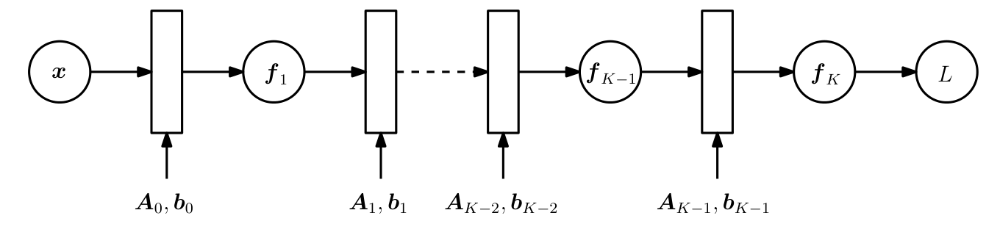
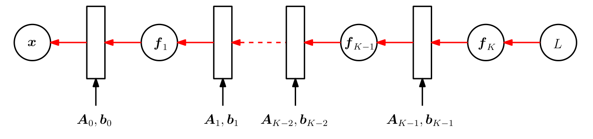
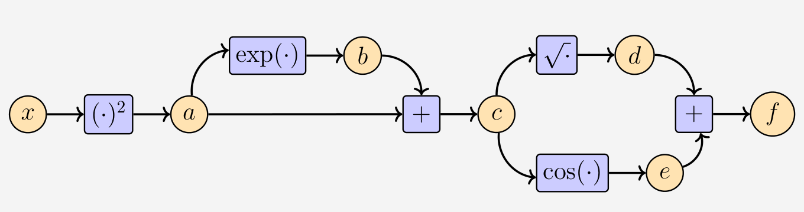

## 5.6 反向传播与自动微分

在许多机器学习应用中，我们通过执行梯度下降（第 7.1 节）来寻找良好的模型参数，这依赖于我们能够计算学习目标相对于模型参数的梯度这一事实。对于给定的目标函数，我们可以利用微积分并应用链式法则（参见第 5.2.2 节）来获得相对于模型参数的梯度。在第 5.3 节中，当考察平方损失相对于线性回归模型参数的梯度时，我们已经初步体会到了这一点。

_备注_ 。关于反向传播与链式法则的讨论，亦可参阅 Tim Vieira 的博文：[https://tinyurl.com/ycfm2yrw](https://tinyurl.com/ycfm2yrw)。♦

考虑函数：
$$
f(x) = \sqrt{x^2 + \exp(x^2)} + \cos(x^2 + \exp(x^2))
\tag{5.109}
$$
通过应用链式法则，并注意到微分是线性的，我们计算梯度：
$$
\begin{aligned}
\frac{\mathrm{d}f}{\mathrm{d}x} &= \frac{2x + 2x \exp(x^2)}{2\sqrt{x^2 + \exp(x^2)}} - \sin(x^2 + \exp(x^2))(2x + 2x \exp(x^2)) \\
&= 2x \left( \frac{1}{2\sqrt{x^2 + \exp(x^2)}} - \sin(x^2 + \exp(x^2)) \right) (1 + \exp(x^2))
\end{aligned}
\tag{5.110}
$$
以这种显式方式写出梯度通常是不切实际的，因为它往往会导致非常冗长的导数表达式。在实践中，这意味着如果我们不够谨慎，梯度的实现开销可能会显著高于计算函数本身的开销，从而带来不必要的计算负担。对于训练深度神经网络模型， _反向传播（backpropagation）_ 算法（Kelley, 1960; Bryson, 1961; Dreyfus, 1962; Rumelhart et al., 1986）是一种计算误差函数相对于模型参数梯度的有效方法。

---

### 5.6.1 深度网络中的梯度

链式法则被发挥到极致的一个领域是深度学习，其中函数值 $ \boldsymbol y $ 是通过多层函数复合计算得到的：
$$
\boldsymbol y = (f_K \circ f_{K-1} \circ \cdots \circ f_1)(\boldsymbol x) = f_K(f_{K-1}(\cdots (f_1(\boldsymbol x)) \cdots )) ,
\tag{5.111}
$$
其中 $ \boldsymbol x $ 是输入（例如图像），$ \boldsymbol y $ 是观测值（例如类别标签），每个函数 $ f_i $（$ i = 1, \ldots, K $）都拥有其自身的参数。

   
  <b>图 5.8 多层神经网络中的前向传播，用于将损失 L 计算为输入 x 和参数 Aᵢ, bᵢ 的函数。</b> 

在多层神经网络中，我们在第 $ i $ 层拥有函数 $ f_i(\boldsymbol x_{i-1}) = \sigma(\boldsymbol A_{i-1}\boldsymbol x_{i-1} + \boldsymbol b_{i-1}) $（为了使记号更简洁，我们假定各层的激活函数相同）。这里 $ \boldsymbol x_{i-1} $ 是第 $ i-1 $ 层的输出，$ \sigma $ 是 _激活函数（activation function）_ ，例如逻辑 S 形函数（logistic sigmoid）$ \frac{1}{1 + \mathrm{e}^{-x}} $、双曲正切函数（$ \tanh $）或整流线性单元（rectified linear unit, ReLU）。为了训练这些模型，我们需要损失函数 $ L $ 相对于所有模型参数 $ \boldsymbol A_j, \boldsymbol b_j $（$ j = 0, \ldots, K-1 $）的梯度。这也要求我们计算 $ L $ 相对于每一层输入的梯度。例如，如果我们有输入 $ \boldsymbol x $ 和观测值 $ \boldsymbol y $，以及由以下公式定义的网络结构：
$$
\boldsymbol f_0 := \boldsymbol x
\tag{5.112}
$$
$$
\boldsymbol f_i := \sigma_i(\boldsymbol A_{i-1}\boldsymbol f_{i-1} + \boldsymbol b_{i-1}) , \quad i = 1, \ldots, K ,
\tag{5.113}
$$
（参见图 5.8 的可视化），我们可能希望找到参数 $ \boldsymbol A_j, \boldsymbol b_j $（$ j = 0, \ldots, K-1 $），使得平方损失：
$$
L(\boldsymbol \theta) = \|\boldsymbol y - \boldsymbol f_K(\boldsymbol \theta, \boldsymbol x)\|^2
\tag{5.114}
$$
最小化，其中 $ \boldsymbol \theta = \{\boldsymbol A_0, \boldsymbol b_0, \ldots, \boldsymbol A_{K-1}, \boldsymbol b_{K-1}\} $。

为了获得相对于参数集 $ \boldsymbol \theta $ 的梯度，我们需要 $ L $ 相对于每一层参数 $ \boldsymbol \theta_j = \{\boldsymbol A_j, \boldsymbol b_j\} $（$ j = 0, \ldots, K-1 $）的偏导数。链式法则允许我们将这些偏导数确定为：
$$
\frac{\partial L}{\partial \boldsymbol \theta_{K-1}} = \frac{\partial L}{\partial \boldsymbol f_K} {\color{blue}\frac{\partial \boldsymbol f_K}{\partial \boldsymbol \theta_{K-1}}}
\tag{5.115}
$$
$$
\frac{\partial L}{\partial \boldsymbol \theta_{K-2}} = \frac{\partial L}{\partial \boldsymbol f_K} \boxed{{\color{orange}\frac{\partial \boldsymbol f_K}{\partial \boldsymbol f_{K-1}}} {\color{blue}\frac{\partial \boldsymbol f_{K-1}}{\partial \boldsymbol \theta_{K-2}}}}
\tag{5.116}
$$
$$
\frac{\partial L}{\partial \boldsymbol \theta_{K-3}} = \frac{\partial L}{\partial \boldsymbol f_K} {\color{orange}\frac{\partial \boldsymbol f_K}{\partial \boldsymbol f_{K-1}}} \boxed{{\color{orange}\frac{\partial \boldsymbol f_{K-1}}{\partial \boldsymbol f_{K-2}}} {\color{blue}\frac{\partial \boldsymbol f_{K-2}}{\partial \boldsymbol \theta_{K-3}}}}
\tag{5.117}
$$
$$
\frac{\partial L}{\partial \boldsymbol \theta_i} = \frac{\partial L}{\partial \boldsymbol f_K} {\color{orange}\frac{\partial \boldsymbol f_K}{\partial \boldsymbol f_{K-1}}} \cdots \boxed{{\color{orange}\frac{\partial \boldsymbol f_{i+2}}{\partial \boldsymbol f_{i+1}}} {\color{blue}\frac{\partial \boldsymbol f_{i+1}}{\partial \boldsymbol \theta_i}}}
\tag{5.118}
$$
其中橙色项是某一层输出相对于其输入的偏导数，而蓝色项是某一层输出相对于其参数的偏导数。假设我们已经计算了偏导数 $ \partial L / \partial \boldsymbol \theta_{i+1} $，那么大部分计算都可以复用于计算 $ \partial L / \partial \boldsymbol \theta_i $。我们需要额外计算的项由方框标出。图 5.9 直观展示了梯度是如何在网络中反向传递的。

_备注_ 。关于神经网络梯度的更深入讨论可参见 Justin Domke 的讲义：[https://tinyurl.com/yalcxgtv](https://tinyurl.com/yalcxgtv)。♦

   
  <b>图 5.9 多层神经网络中的反向传播，用于计算损失函数的梯度。</b> 

---

### 5.6.2 自动微分

事实证明，反向传播是数值分析中一种称为 _自动微分（automatic differentiation）_ 的通用技术的特例。我们可以将自动微分视为一组通过处理中间变量并应用链式法则，在数值上（与符号微分相对）评估函数精确（达到机器精度）梯度的技术。自动微分应用一系列基本算术运算（如加法和乘法）以及初等函数（如 $ \sin, \cos, \exp, \log $）。通过对这些运算应用链式法则，可以自动计算相当复杂的函数的梯度。自动微分适用于通用计算机程序，并且具有前向模式和反向模式。Baydin 等人（Baydin et al., 2018）对机器学习中的自动微分给出了精彩的综述。

_备注_ 。自动微分不同于符号微分以及梯度的数值近似（例如使用有限差分）。♦

   
  <b>图 5.10 说明数据通过一些中间变量 a, b 从 x 流向 y 的简单计算图。</b> 

图 5.10 展示了一个简单的计算图，表示数据通过一些中间变量 $ a, b $ 从输入 $ x $ 流向输出 $ y $。如果我们要计算导数 $ \mathrm{d}y/\mathrm{d}x $，我们将应用链式法则并得到：
$$
\frac{\mathrm{d}y}{\mathrm{d}x} = \frac{\mathrm{d}y}{\mathrm{d}b} \frac{\mathrm{d}b}{\mathrm{d}a} \frac{\mathrm{d}a}{\mathrm{d}x} .
\tag{5.119}
$$
直观上，前向模式与反向模式的区别在于乘法的计算顺序（在一般情况下，我们处理的是雅可比矩阵，它们可以是向量、矩阵或张量）。由于矩阵乘法的结合律，我们可以在以下两者之间进行选择：
$$
\frac{\mathrm{d}y}{\mathrm{d}x} = \left( \frac{\mathrm{d}y}{\mathrm{d}b} \frac{\mathrm{d}b}{\mathrm{d}a} \right) \frac{\mathrm{d}a}{\mathrm{d}x} ,
\tag{5.120}
$$
$$
\frac{\mathrm{d}y}{\mathrm{d}x} = \frac{\mathrm{d}y}{\mathrm{d}b} \left( \frac{\mathrm{d}b}{\mathrm{d}a} \frac{\mathrm{d}a}{\mathrm{d}x} \right) .
\tag{5.121}
$$
式 (5.120) 即为 _反向模式（reverse mode）_ ，因为梯度在计算图中反向传播，即与数据流的方向相反。式 (5.121) 则为 _前向模式（forward mode）_ ，其中梯度随着数据从左到右流经计算图。

在下文中，我们将重点关注反向模式自动微分，即反向传播。在神经网络的背景下，输入的维度往往远高于标签的维度，因此反向模式在计算上要比前向模式经济得多。让我们从一个启发性的示例开始。

> **例 5.14**
> 
> 考虑来自式 (5.109) 的函数：
> $$
> f(x) = \sqrt{x^2 + \exp(x^2)} + \cos(x^2 + \exp(x^2))
> \tag{5.122}
> $$
> 如果我们在计算机上实现函数 $ f $，可以通过引入 _中间变量（intermediate variables）_ 来节省部分计算：
> $$
> a = x^2 ,
> \tag{5.123}
> $$
> $$
> b = \exp(a) ,
> \tag{5.124}
> $$
> $$
> c = a + b ,
> \tag{5.125}
> $$
> $$
> d = \sqrt{c} ,
> \tag{5.126}
> $$
> $$
> e = \cos(c) ,
> \tag{5.127}
> $$
> $$
> f = d + e .
> \tag{5.128}
> $$
> 
> 

>    
>   <b>图 5.11 包含输入 x、函数值 f 以及中间变量 a, b, c, d, e 的计算图。</b> 
> 

> 
> 这与应用链式法则时的思维过程完全相同。请注意，上述方程组所需的运算次数少于直接实现式 (5.109) 中定义的函数 $ f(x) $ 所需的运算次数。图 5.11 中对应的计算图展示了获得函数值 $ f $ 所需的数据流与计算过程。
> 
> 包含中间变量的方程组可以被视为一个计算图，这种表示形式在神经网络软件库的实现中得到了广泛应用。通过回顾初等函数导数的定义，我们可以直接计算中间变量相对于其对应输入的导数。我们得到以下结果：
> $$
> \frac{\partial a}{\partial x} = 2x
> \tag{5.129}
> $$
> $$
> \frac{\partial b}{\partial a} = \exp(a)
> \tag{5.130}
> $$
> $$
> \frac{\partial c}{\partial a} = 1 = \frac{\partial c}{\partial b}
> \tag{5.131}
> $$
> $$
> \frac{\partial d}{\partial c} = \frac{1}{2\sqrt{c}}
> \tag{5.132}
> $$
> $$
> \frac{\partial e}{\partial c} = -\sin(c)
> \tag{5.133}
> $$
> $$
> \frac{\partial f}{\partial d} = 1 = \frac{\partial f}{\partial e} .
> \tag{5.134}
> $$
> 通过观察图 5.11 中的计算图，我们可以从输出端向后推导来计算 $ \partial f/\partial x $，并得到：
> $$
> \frac{\partial f}{\partial c} = \frac{\partial f}{\partial d} \frac{\partial d}{\partial c} + \frac{\partial f}{\partial e} \frac{\partial e}{\partial c}
> \tag{5.135}
> $$
> $$
> \frac{\partial f}{\partial b} = \frac{\partial f}{\partial c} \frac{\partial c}{\partial b}
> \tag{5.136}
> $$
> $$
> \frac{\partial f}{\partial a} = \frac{\partial f}{\partial b} \frac{\partial b}{\partial a} + \frac{\partial f}{\partial c} \frac{\partial c}{\partial a}
> \tag{5.137}
> $$
> $$
> \frac{\partial f}{\partial x} = \frac{\partial f}{\partial a} \frac{\partial a}{\partial x} .
> \tag{5.138}
> $$
> 请注意，我们隐式地应用了链式法则来求得 $ \partial f/\partial x $。通过代入初等函数导数的结果，我们得到：
> $$
> \frac{\partial f}{\partial c} = 1 \cdot \frac{1}{2\sqrt{c}} + 1 \cdot (-\sin(c))
> \tag{5.139}
> $$
> $$
> \frac{\partial f}{\partial b} = \frac{\partial f}{\partial c} \cdot 1
> \tag{5.140}
> $$
> $$
> \frac{\partial f}{\partial a} = \frac{\partial f}{\partial b} \exp(a) + \frac{\partial f}{\partial c} \cdot 1
> \tag{5.141}
> $$
> $$
> \frac{\partial f}{\partial x} = \frac{\partial f}{\partial a} \cdot 2x .
> \tag{5.142}
> $$
> 将上述每个导数视为一个变量，我们发现计算导数所需的计算复杂度与计算函数本身的复杂度相当。这是相当反直觉的，因为导数 $ \partial f/\partial x $ 的数学表达式 (5.110) 显著比式 (5.109) 中函数 $ f(x) $ 的数学表达式要复杂得多。

自动微分是例 5.14 的形式化推广。设 $ x_1, \ldots, x_d $ 为函数的输入变量，$ x_{d+1}, \ldots, x_{D-1} $ 为中间变量，而 $ x_D $ 为输出变量。则计算图可表示如下：

对于 $ i = d + 1, \ldots, D $：
$$
x_i = g_i(\boldsymbol x_{\mathrm{Pa}(x_i)}) ,
\tag{5.143}
$$
其中 $ g_i(\cdot) $ 为初等函数，而 $ \boldsymbol x_{\mathrm{Pa}(x_i)} $ 是变量 $ x_i $ 在图中的父节点集合。给定以此种方式定义的函数，我们可以逐步应用链式法则来计算函数的导数。回顾根据定义 $ f = x_D $，因此：
$$
\frac{\partial f}{\partial x_D} = 1 .
\tag{5.144}
$$
对于其他变量 $ x_i $，我们应用链式法则：
$$
\frac{\partial f}{\partial x_i} = \sum_{x_j : x_i \in \mathrm{Pa}(x_j)} \frac{\partial f}{\partial x_j} \frac{\partial x_j}{\partial x_i} = \sum_{x_j : x_i \in \mathrm{Pa}(x_j)} \frac{\partial f}{\partial x_j} \frac{\partial g_j}{\partial x_i} ,
\tag{5.145}
$$
其中 $ \mathrm{Pa}(x_j) $ 是计算图中 $ x_j $ 的父节点集合。式 (5.143) 是函数的前向传播，而式 (5.145) 则是梯度在计算图中的反向传播（反向模式的自动微分需要一棵解析树）。在神经网络训练中，我们反向传播预测相对于标签的误差。

上述自动微分方法在函数可以表示为初等函数可微的计算图时均适用。事实上，该函数甚至不必是纯数学函数，也可以是一个计算机程序。然而，并非所有计算机程序都可以进行自动微分，例如当我们无法找到可微的初等函数时。诸如 for 循环和 if 条件语句等编程结构也需要格外小心处理。
