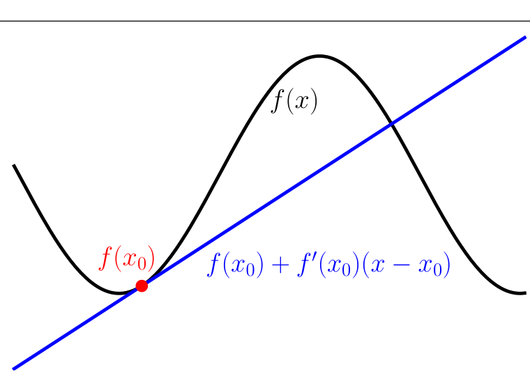
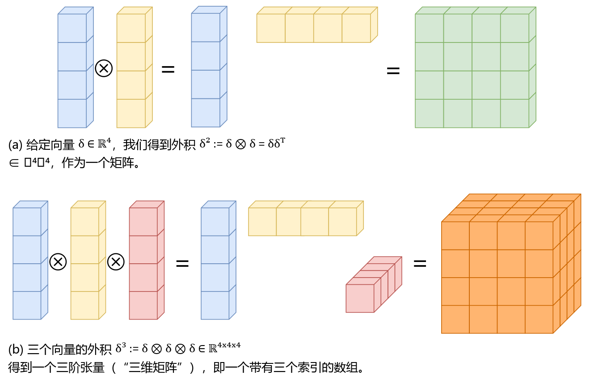

## 5.8 线性化与多元泰勒级数

函数 $ f $ 的梯度 $ \nabla f $ 经常用于在 $ \boldsymbol x_0 $ 附近对 $ f $ 进行局部线性逼近：
$$
f(\boldsymbol x) \approx f(\boldsymbol x_0) + (\nabla_{\boldsymbol x} f)(\boldsymbol x_0)(\boldsymbol x - \boldsymbol x_0)
\tag{5.148}
$$
这里 $ (\nabla_{\boldsymbol x} f)(\boldsymbol x_0) $ 是 $ f $ 关于 $ \boldsymbol x $ 在 $ \boldsymbol x_0 $ 处求值的梯度。

   
  <b>图 5.12 函数的线性逼近。原函数 f 在 x₀ = -2 处使用一阶泰勒级数展开进行线性化。</b> 

图 5.12 说明了函数 $ f $ 在输入 $ \boldsymbol x_0 $ 处的线性逼近。原函数由一条直线逼近。这种逼近在局部是精确的，但随着我们离 $ \boldsymbol x_0 $ 越来越远，逼近效果会变差。式 (5.148) 是 $ f $ 在 $ \boldsymbol x_0 $ 处的多元泰勒级数展开的特例，其中我们仅考虑了前两项。下面我们将讨论更一般的情形，这将实现更好的逼近。

   
  <b>图 5.13 外积的可视化。向量的外积使数组的维度每项增加 1。(a) 两个向量的外积得到一个矩阵；(b) 三个向量的外积产生一个三阶张量。(a) 给定向量 δ ∈ ℝ⁴，我们获得外积 δ² := δ ⊗ δ = δδᵀ ∈ ℝ⁴ˣ⁴ 作为矩阵。(b) 外积 δ³ := δ ⊗ δ ⊗ δ ∈ ℝ⁴ˣ⁴ˣ⁴ 得到一个三阶张量（“三维矩阵”），即带有三个索引的数组。</b> 

**定义 5.7**（多元泰勒级数）。考虑一个在 $ \boldsymbol x_0 $ 处光滑的函数：
$$
f : \mathbb{R}^D \to \mathbb{R}
\tag{5.149}
$$
$$
\boldsymbol x \mapsto f(\boldsymbol x), \quad \boldsymbol x \in \mathbb{R}^D
\tag{5.150}
$$
当我们定义差向量 $ \boldsymbol \delta := \boldsymbol x - \boldsymbol x_0 $ 时，$ f $ 在 $ \boldsymbol x_0 $ 处的 _多元泰勒级数（multivariate Taylor series）_ 定义为：
$$
f(\boldsymbol x) = \sum_{k=0}^\infty \frac{D_{\boldsymbol x}^k f(\boldsymbol x_0)}{k!} \boldsymbol \delta^k
\tag{5.151}
$$
其中 $ D_{\boldsymbol x}^k f(\boldsymbol x_0) $ 是 $ f $ 关于 $ \boldsymbol x $ 在 $ \boldsymbol x_0 $ 处的 $ k $ 阶（全）导数。

**定义 5.8**（泰勒多项式）。$ f $ 在 $ \boldsymbol x_0 $ 处的 $ n $ 次 _泰勒多项式（Taylor polynomial）_ 包含式 (5.151) 级数中的前 $ n + 1 $ 项，定义为：
$$
T_n(\boldsymbol x) = \sum_{k=0}^n \frac{D_{\boldsymbol x}^k f(\boldsymbol x_0)}{k!} \boldsymbol \delta^k
\tag{5.152}
$$

在式 (5.151) 和式 (5.152) 中，我们使用了稍微不够严谨的记号 $ \boldsymbol \delta^k $，这对于向量 $ \boldsymbol x \in \mathbb{R}^D $（$ D > 1 $ 且 $ k > 1 $）本未定义。请注意，$ D_{\boldsymbol x}^k f $ 和 $ \boldsymbol \delta^k $ 都是 $ k $ 阶张量，即 $ k $ 维数组（向量可实现为一维数组，矩阵可实现为二维数组）。$ k $ 阶张量 $ \boldsymbol \delta^k \in \mathbb{R}^{\overbrace{D \times D \times \cdots \times D}^{k\text{ 次}}} $ 是通过向量 $ \boldsymbol \delta \in \mathbb{R}^D $ 的 $ k $ 重 _外积（outer product）_ （记为 $ \otimes $）获得的。例如：
$$
\boldsymbol \delta^2 := \boldsymbol \delta \otimes \boldsymbol \delta = \boldsymbol \delta \boldsymbol \delta^\top, \quad \boldsymbol \delta^2[i, j] = \boldsymbol \delta[i]\boldsymbol \delta[j]
\tag{5.153}
$$
$$
\boldsymbol \delta^3 := \boldsymbol \delta \otimes \boldsymbol \delta \otimes \boldsymbol \delta, \quad \boldsymbol \delta^3[i, j, k] = \boldsymbol \delta[i]\boldsymbol \delta[j]\boldsymbol \delta[k]
\tag{5.154}
$$

图 5.13 直观展示了这两个外积。一般地，我们在泰勒级数中得到如下项：
$$
D_{\boldsymbol x}^k f(\boldsymbol x_0)\boldsymbol \delta^k = \sum_{i_1=1}^D \cdots \sum_{i_k=1}^D D_{\boldsymbol x}^k f(\boldsymbol x_0)[i_1, \ldots, i_k] \boldsymbol \delta[i_1] \cdots \boldsymbol \delta[i_k]
\tag{5.155}
$$
其中 $ D_{\boldsymbol x}^k f(\boldsymbol x_0)\boldsymbol \delta^k $ 包含 $ k $ 次多项式。

既然我们已经定义了多元函数的泰勒级数，下面我们显式写出当 $ k = 0, \ldots, 3 $ 且 $ \boldsymbol \delta := \boldsymbol x - \boldsymbol x_0 $ 时泰勒级数展开的前几项 $ D_{\boldsymbol x}^k f(\boldsymbol x_0)\boldsymbol \delta^k $（在实现中可分别通过调用 NumPy 的 `np.einsum('i,i', Df1, d)`、`np.einsum('ij,i,j', Df2, d, d)` 以及 `np.einsum('ijk,i,j,k', Df3, d, d, d)` 高效计算张量缩并）：
$$
k = 0 : D_{\boldsymbol x}^0 f(\boldsymbol x_0)\boldsymbol \delta^0 = f(\boldsymbol x_0) \in \mathbb{R}
\tag{5.156}
$$
$$
k = 1 : D_{\boldsymbol x}^1 f(\boldsymbol x_0)\boldsymbol \delta^1 = \underbrace{\nabla_{\boldsymbol x} f(\boldsymbol x_0)}_{1 \times D} \underbrace{\boldsymbol \delta}_{D \times 1} = \sum_{i=1}^D \nabla_{\boldsymbol x} f(\boldsymbol x_0)[i]\boldsymbol \delta[i] \in \mathbb{R}
\tag{5.157}
$$
$$
k = 2 : D_{\boldsymbol x}^2 f(\boldsymbol x_0)\boldsymbol \delta^2 = \operatorname{tr}\left( \underbrace{\boldsymbol H(\boldsymbol x_0)}_{D \times D} \underbrace{\boldsymbol \delta}_{D \times 1} \underbrace{\boldsymbol \delta^\top}_{1 \times D} \right) = \boldsymbol \delta^\top \boldsymbol H(\boldsymbol x_0)\boldsymbol \delta
\tag{5.158}
$$
$$
= \sum_{i=1}^D \sum_{j=1}^D \boldsymbol H[i, j]\boldsymbol \delta[i]\boldsymbol \delta[j] \in \mathbb{R}
\tag{5.159}
$$
$$
k = 3 : D_{\boldsymbol x}^3 f(\boldsymbol x_0)\boldsymbol \delta^3 = \sum_{i=1}^D \sum_{j=1}^D \sum_{k=1}^D D_{\boldsymbol x}^3 f(\boldsymbol x_0)[i, j, k]\boldsymbol \delta[i]\boldsymbol \delta[j]\boldsymbol \delta[k] \in \mathbb{R}
\tag{5.160}
$$
这里，$ \boldsymbol H(\boldsymbol x_0) $ 是 $ f $ 在 $ \boldsymbol x_0 $ 处求值的黑塞矩阵（Hessian matrix）。

> **例 5.15（二元函数的泰勒级数展开）**
> 
> 考虑函数：
> $$
> f(x, y) = x^2 + 2xy + y^3
> \tag{5.161}
> $$
> 我们希望计算 $ f $ 在 $ (x_0, y_0) = (1, 2) $ 处的泰勒级数展开。
> 
> 在开始之前，让我们先探讨一下预期结果：式 (5.161) 中的函数是一个 3 次多项式。我们正在寻找泰勒级数展开，而泰勒级数本身是多项式的线性组合。因此，我们预期泰勒级数展开中不需要包含四阶或更高阶的项来表示一个三次多项式。这意味着确定式 (5.151) 的前四项就足以获得式 (5.161) 的精确替代表示。
> 
> 为了确定泰勒级数展开，我们首先从常数项和一阶导数开始，它们由下式给出：
> $$
> f(1, 2) = 13
> \tag{5.162}
> $$
> $$
> \frac{\partial f}{\partial x} = 2x + 2y \implies \frac{\partial f}{\partial x}(1, 2) = 6
> \tag{5.163}
> $$
> $$
> \frac{\partial f}{\partial y} = 2x + 3y^2 \implies \frac{\partial f}{\partial y}(1, 2) = 14
> \tag{5.164}
> $$
> 因此，我们获得：
> $$
> D_{x,y}^1 f(1, 2) = \nabla_{x,y} f(1, 2) = \begin{bmatrix} \frac{\partial f}{\partial x}(1, 2) & \frac{\partial f}{\partial y}(1, 2) \end{bmatrix} = \begin{bmatrix} 6 & 14 \end{bmatrix} \in \mathbb{R}^{1 \times 2}
> \tag{5.165}
> $$
> 从而：
> $$
> \frac{D_{x,y}^1 f(1, 2)}{1!} \boldsymbol \delta = \begin{bmatrix} 6 & 14 \end{bmatrix} \begin{bmatrix} x - 1 \\ y - 2 \end{bmatrix} = 6(x - 1) + 14(y - 2)
> \tag{5.166}
> $$
> 注意 $ D_{x,y}^1 f(1, 2)\boldsymbol \delta $ 仅包含线性项，即一阶多项式。
> 
> 二阶偏导数由下式给出：
> $$
> \frac{\partial^2 f}{\partial x^2} = 2 \implies \frac{\partial^2 f}{\partial x^2}(1, 2) = 2
> \tag{5.167}
> $$
> $$
> \frac{\partial^2 f}{\partial y^2} = 6y \implies \frac{\partial^2 f}{\partial y^2}(1, 2) = 12
> \tag{5.168}
> $$
> $$
> \frac{\partial^2 f}{\partial y \partial x} = 2 \implies \frac{\partial^2 f}{\partial y \partial x}(1, 2) = 2
> \tag{5.169}
> $$
> $$
> \frac{\partial^2 f}{\partial x \partial y} = 2 \implies \frac{\partial^2 f}{\partial x \partial y}(1, 2) = 2
> \tag{5.170}
> $$
> 当我们收集这些二阶偏导数时，获得黑塞矩阵（Hessian matrix）：
> $$
> \boldsymbol H = \begin{bmatrix} \frac{\partial^2 f}{\partial x^2} & \frac{\partial^2 f}{\partial x \partial y} \\ \frac{\partial^2 f}{\partial y \partial x} & \frac{\partial^2 f}{\partial y^2} \end{bmatrix} = \begin{bmatrix} 2 & 2 \\ 2 & 6y \end{bmatrix}
> \tag{5.171}
> $$
> 从而：
> $$
> \boldsymbol H(1, 2) = \begin{bmatrix} 2 & 2 \\ 2 & 12 \end{bmatrix} \in \mathbb{R}^{2 \times 2}
> \tag{5.172}
> $$
> 因此，泰勒级数展开的下一项为：
> $$
> \frac{D_{x,y}^2 f(1, 2)}{2!} \boldsymbol \delta^2 = \frac{1}{2} \boldsymbol \delta^\top \boldsymbol H(1, 2) \boldsymbol \delta
> \tag{5.173a}
> $$
> $$
> = \frac{1}{2} \begin{bmatrix} x - 1 \\ y - 2 \end{bmatrix}^\top \begin{bmatrix} 2 & 2 \\ 2 & 12 \end{bmatrix} \begin{bmatrix} x - 1 \\ y - 2 \end{bmatrix}
> \tag{5.173b}
> $$
> $$
> = (x - 1)^2 + 2(x - 1)(y - 2) + 6(y - 2)^2
> \tag{5.173c}
> $$
> 这里，$ D_{x,y}^2 f(1, 2)\boldsymbol \delta^2 $ 仅包含二次项，即二阶多项式。
> 
> 三阶导数由下式获得：
> $$
> D_{x,y}^3 f = \begin{bmatrix} \frac{\partial \boldsymbol H}{\partial x} & \frac{\partial \boldsymbol H}{\partial y} \end{bmatrix} \in \mathbb{R}^{2 \times 2 \times 2}
> \tag{5.174}
> $$
> $$
> D_{x,y}^3 f[:, :, 1] = \frac{\partial \boldsymbol H}{\partial x} = \begin{bmatrix} \frac{\partial^3 f}{\partial x^3} & \frac{\partial^3 f}{\partial x^2 \partial y} \\ \frac{\partial^3 f}{\partial x \partial y \partial x} & \frac{\partial^3 f}{\partial x \partial y^2} \end{bmatrix}
> \tag{5.175}
> $$
> $$
> D_{x,y}^3 f[:, :, 2] = \frac{\partial \boldsymbol H}{\partial y} = \begin{bmatrix} \frac{\partial^3 f}{\partial y \partial x^2} & \frac{\partial^3 f}{\partial y \partial x \partial y} \\ \frac{\partial^3 f}{\partial y^2 \partial x} & \frac{\partial^3 f}{\partial y^3} \end{bmatrix}
> \tag{5.176}
> $$
> 由于式 (5.171) 中 Hessian 矩阵的大多数二阶偏导数都是常数，唯一的非零三阶偏导数为：
> $$
> \frac{\partial^3 f}{\partial y^3} = 6 \implies \frac{\partial^3 f}{\partial y^3}(1, 2) = 6
> \tag{5.177}
> $$
> 更高阶导数以及 3 阶混合导数（例如 $ \frac{\partial^3 f}{\partial x^2 \partial y} $）均为零，因此：
> $$
> D_{x,y}^3 f[:, :, 1] = \begin{bmatrix} 0 & 0 \\ 0 & 0 \end{bmatrix}, \quad D_{x,y}^3 f[:, :, 2] = \begin{bmatrix} 0 & 0 \\ 0 & 6 \end{bmatrix}
> \tag{5.178}
> $$
> 且：
> $$
> \frac{D_{x,y}^3 f(1, 2)}{3!} \boldsymbol \delta^3 = (y - 2)^3
> \tag{5.179}
> $$
> 它收集了泰勒级数中的所有三次项。
> 
> 综合起来，$ f $ 在 $ (x_0, y_0) = (1, 2) $ 处的（精确）泰勒级数展开为：
> $$
> f(\boldsymbol x) = f(1, 2) + D_{x,y}^1 f(1, 2)\boldsymbol \delta + \frac{D_{x,y}^2 f(1, 2)}{2!} \boldsymbol \delta^2 + \frac{D_{x,y}^3 f(1, 2)}{3!} \boldsymbol \delta^3
> \tag{5.180a}
> $$
> $$
> = f(1, 2) + \frac{\partial f(1, 2)}{\partial x}(x - 1) + \frac{\partial f(1, 2)}{\partial y}(y - 2) + \frac{1}{2!} \left[ \frac{\partial^2 f(1, 2)}{\partial x^2}(x - 1)^2 + \frac{\partial^2 f(1, 2)}{\partial y^2}(y - 2)^2 + 2\frac{\partial^2 f(1, 2)}{\partial x \partial y}(x - 1)(y - 2) \right] + \frac{1}{6} \frac{\partial^3 f(1, 2)}{\partial y^3}(y - 2)^3
> \tag{5.180b}
> $$
> $$
> = 13 + 6(x - 1) + 14(y - 2) + (x - 1)^2 + 6(y - 2)^2 + 2(x - 1)(y - 2) + (y - 2)^3
> \tag{5.180c}
> $$
> 在本例中，我们获得了式 (5.161) 中多项式的精确泰勒级数展开，即式 (5.180c) 中的多项式与式 (5.161) 中的原多项式完全相同。在这个具体例子中，这一结果并不令人意外，因为原函数就是一个三次多项式，我们在式 (5.180c) 中将其表示为常数项、一阶、二阶和三阶多项式的线性组合。
