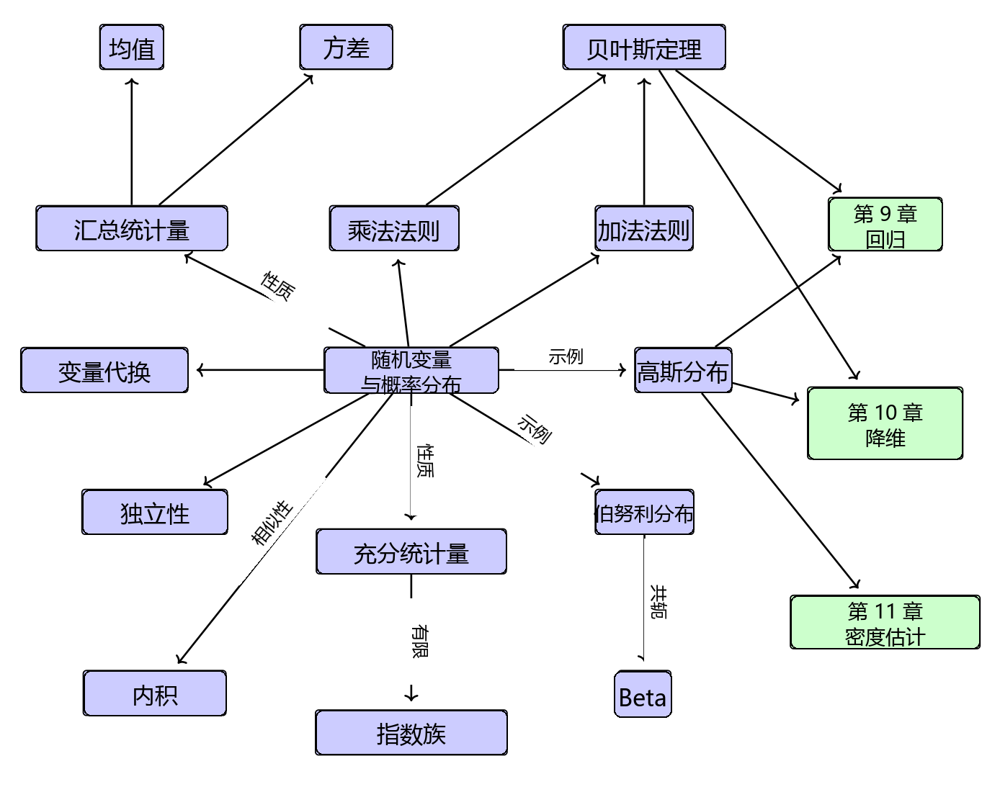

# 6 概率与分布

通俗地说，概率研究的是不确定性。概率可以被视为事件发生的频率比例，也可以被视为对某个事件的置信程度。随后，我们希望利用这种概率来度量实验中某件事情发生的可能性。正如第 1 章所提到的，我们经常需要量化数据中的不确定性、机器学习模型中的不确定性，以及模型所产生的预测中的不确定性。量化不确定性需要引入 _随机变量（random variable）_ 的概念，它是一个将随机实验的结果映射到我们感兴趣的一组性质的函数。与随机变量相关联的是一个度量特定结果（或结果集合）发生概率的函数，这被称为 _概率分布（probability distribution）_ 。

概率分布被用作构建其他概念的基石，例如概率建模（第 8.4 节）、概率图模型（第 8.5 节）和模型选择（第 8.6 节）。在下一节中，我们将介绍定义概率空间的三个概念（样本空间、事件以及事件的概率），以及它们如何与第四个概念——随机变量相联系。这里的叙述故意采用稍显通俗的方式，因为过于严格的数学表述可能会掩盖这些概念背后的几何与直觉。本章所介绍概念的大纲如图 6.1 所示。

   
  <b>图 6.1 本章所描述的与随机变量和概率分布相关的概念思维导图。</b> 

