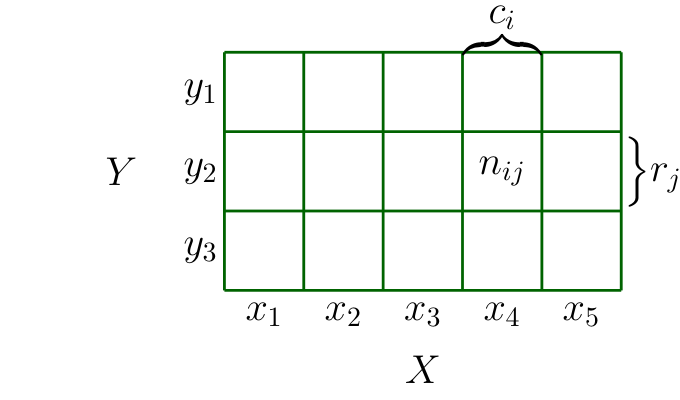
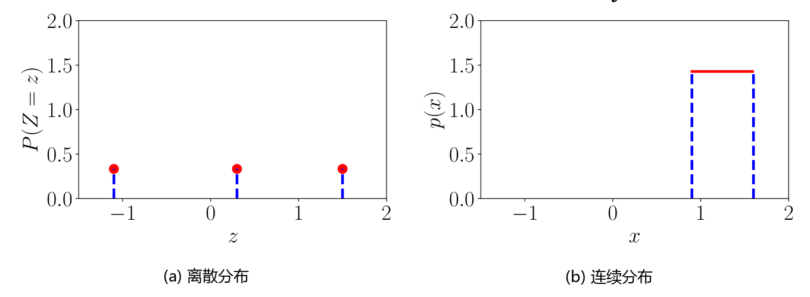

## 6.2 离散与连续概率

现在让我们将注意力聚焦在如何描述事件的概率上。根据目标空间是离散的还是连续的，指代概率分布的自然方式有所不同：
- 当目标空间 $ \mathcal{T} $ 是离散的时，我们可以明确指定随机变量 $ X $ 取特定值 $ x \in \mathcal{T} $ 的概率，记为 $ P(X = x) $。对于离散随机变量 $ X $，表达式 $ P(X = x) $ 称为 _概率质量函数（probability mass function, pmf）_ 。
- 当目标空间 $ \mathcal{T} $ 是连续的时（例如实数线 $ \mathbb{R} $），更自然的方式是指定随机变量 $ X $ 落在某个区间内的概率，对于 $ a < b $ 记为 $ P(a \leqslant X \leqslant b) $。按照惯例，我们通常指定随机变量 $ X $ 小于或等于特定值 $ x $ 的概率，记为 $ P(X \leqslant x) $。对于连续随机变量 $ X $，表达式 $ P(X \leqslant x) $ 称为 _累积分布函数（cumulative distribution function, cdf）_ 。

_备注_ 。我们使用短语 _单变量分布（univariate distribution）_ 来指代单个随机变量的分布（其状态用非粗体 $ x $ 表示）；使用 _多元分布（multivariate distribution）_ 指代多个随机变量的联合分布，通常考虑随机变量构成的向量（其状态用粗体 $ \boldsymbol x $ 表示）。♦

---

### 6.2.1 离散概率

当目标空间是离散的时，我们可以将多个随机变量的联合概率分布想象为填满一个多维数值数组。图 6.2 给出了一个示例。联合概率的目标空间是各个随机变量目标空间的笛卡尔积。我们定义联合概率为两个值联合出现的概率：
$$ P(X = x_i, Y = y_j) = \frac{n_{ij}}{N} \tag{6.9} $$
其中 $ n_{ij} $ 是处于状态 $ x_i $ 和 $ y_j $ 的事件数，而 $ N $ 是事件总数。联合概率即为两个事件交集的概率，即 $ P(X = x_i, Y = y_j) = P(X = x_i \cap Y = y_j) $。

   
  <b>图 6.2 随机变量 X 和 Y 的离散二元概率质量函数的可视化。</b> 

图 6.2 说明了离散概率分布的概率质量函数（pmf）。对于两个随机变量 $ X $ 和 $ Y $，$ X = x $ 且 $ Y = y $ 的概率常简记为 $ p(x, y) $，称为 _联合概率（joint probability）_ 。我们可以将概率视为以状态 $ x $ 和 $ y $ 为自变量并返回实数的函数，这也是我们写作 $ p(x, y) $ 的原因。无论随机变量 $ Y $ 取何值，$ X $ 取值 $ x $ 的 _边缘概率（marginal probability）_ 简记为 $ p(x) $。我们写作 $ X \sim p(x) $ 来表示随机变量 $ X $ 服从分布 $ p(x) $。如果我们仅考虑 $ X = x $ 的样本，那么其中 $ Y = y $ 所占的比例（ _条件概率（conditional probability）_ ）简记为 $ p(y \mid x) $。

> **例 6.2**
> 
> 考虑两个随机变量 $ X $ 和 $ Y $，其中 $ X $ 有 5 个可能状态，$ Y $ 有 3 个可能状态，如图 6.2 所示。我们用 $ n_{ij} $ 表示处于状态 $ X = x_i $ 且 $ Y = y_j $ 的事件数，用 $ N $ 表示事件总数。数值 $ c_i $ 是第 $ i $ 列各频数之和，即 $ c_i = \sum_{j=1}^3 n_{ij} $；类似地，$ r_j $ 是行和，即 $ r_j = \sum_{i=1}^5 n_{ij} $。利用这些定义，我们可以紧凑地表示 $ X $ 和 $ Y $ 的分布。
> 
> 每个随机变量的概率分布（即边缘概率）可以视为对某一行或某一列求和：
> $$ P(X = x_i) = \frac{c_i}{N} = \frac{\sum_{j=1}^3 n_{ij}}{N} \tag{6.10} $$
> $$ P(Y = y_j) = \frac{r_j}{N} = \frac{\sum_{i=1}^5 n_{ij}}{N} \tag{6.11} $$
> 其中 $ c_i $ 和 $ r_j $ 分别是概率表格的第 $ i $ 列和第 $ j $ 行的和。对于具有有限个事件的离散随机变量，所有概率之和为 1：
> $$ \sum_{i=1}^5 P(X = x_i) = 1 \quad \text{且} \quad \sum_{j=1}^3 P(Y = y_j) = 1 \tag{6.12} $$
> 条件概率是特定单元格在某一行或某一列中所占的比例。例如，给定 $ X $ 时 $ Y $ 的条件概率为：
> $$ P(Y = y_j \mid X = x_i) = \frac{n_{ij}}{c_i} \tag{6.13} $$
> 给定 $ Y $ 时 $ X $ 的条件概率为：
> $$ P(X = x_i \mid Y = y_j) = \frac{n_{ij}}{r_j} \tag{6.14} $$

在机器学习中，我们使用离散概率分布对类别变量（categorical variables，即取有限个无序值的变量）进行建模。它们可以是类别特征（如预测薪资时所用的大学专业），也可以是类别标签（如手写识别中的字母）。离散分布也常用于构建混合了有限个连续分布的概率模型（第 11 章）。

---

### 6.2.2 连续概率

在本节中，我们考虑实值随机变量，即目标空间为实数线 $ \mathbb{R} $ 上的区间。在本书中，我们可以大致像处理有限状态离散空间一样对实值随机变量执行操作。但在两种情况下这种简化不够严谨：当重复某事无限次时，以及当我们希望从一个区间中随机抽取一个点时。第一种情形出现在讨论机器学习的泛化误差时（第 8 章）；第二种情形出现在讨论连续分布（如高斯分布，第 6.5 节）时。

_备注_ 。在连续空间中存在两个与直觉相悖的技术细节。首先，所有子集的集合（第 6.1 节中用于定义事件空间 $ \mathcal{A} $ 的幂集）性质不够良好，必须限制 $ \mathcal{A} $ 在补集、交集和并集运算下保持封闭。其次，集合的“大小”（测度，measure）在连续空间中不能简单通过计数得到。例如离散集合的势（元素个数）、$ \mathbb{R} $ 中区间的长度以及 $ \mathbb{R}^d $ 中区域的体积都是测度的例子。在集合运算下封闭且具有拓扑结构的集合系称为 _Borel $ \sigma $-代数（Borel $\sigma$-algebra）_ 。在本书中，我们考虑实值随机变量及其对应的 Borel $ \sigma $-代数，并将取值于 $ \mathbb{R}^D $ 的随机变量视为实值随机变量构成的向量。♦

**定义 6.1**（概率密度函数）。如果函数 $ f : \mathbb{R}^D \to \mathbb{R} $ 满足：
1. $ \forall \boldsymbol x \in \mathbb{R}^D : f(\boldsymbol x) \geqslant 0 $
2. 其积分存在且：
$$ \int_{\mathbb{R}^D} f(\boldsymbol x)\,\mathrm{d}\boldsymbol x = 1 \tag{6.15} $$
则称 $ f $ 为 _概率密度函数（probability density function, pdf）_ 。

对于离散随机变量的概率质量函数（pmf），式 (6.15) 中的积分替换为求和 (6.12)。

概率密度函数是任何非负且在全空间积分为 1 的函数 $ f $。我们将随机变量 $ X $ 与该函数 $ f $ 通过如下方式相关联：
$$ P(a \leqslant X \leqslant b) = \int_a^b f(x)\,\mathrm{d}x \tag{6.16} $$
其中 $ a, b \in \mathbb{R} $ 且 $ x \in \mathbb{R} $ 是连续随机变量 $ X $ 的可能结果。状态 $ \boldsymbol x \in \mathbb{R}^D $ 可类似地通过考虑向量形式给出。这种关联 (6.16) 称为随机变量 $ X $ 的 _概率律（law）_ 或 _分布（distribution）_ 。

_备注_ 。与离散随机变量形成鲜明对比的是，连续随机变量 $ X $ 取某一具体单点数值的概率恒为零：$ P(X = x) = 0 $。这相当于在式 (6.16) 中指定区间端点 $ a = b $。单点集是测度为零的集合。♦

**定义 6.2**（累积分布函数）。状态为 $ \boldsymbol x \in \mathbb{R}^D $ 的多元实值随机变量 $ \boldsymbol X $ 的 _累积分布函数（cumulative distribution function, cdf）_ 定义为：
$$ F_{\boldsymbol X}(\boldsymbol x) = P(X_1 \leqslant x_1, \ldots, X_D \leqslant x_D) \tag{6.17} $$
其中 $ \boldsymbol X = [X_1, \ldots, X_D]^\top $，$ \boldsymbol x = [x_1, \ldots, x_D]^\top $，等号右侧表示随机变量 $ X_i $ 取小于或等于 $ x_i $ 的值的概率。

累积分布函数也可以表示为概率密度函数 $ f(\boldsymbol x) $ 的多重积分：
$$ F_{\boldsymbol X}(\boldsymbol x) = \int_{-\infty}^{x_1} \cdots \int_{-\infty}^{x_D} f(z_1, \ldots, z_D)\,\mathrm{d}z_1 \cdots \mathrm{d}z_D \tag{6.18} $$

_提示_ ：存在不具备对应概率密度函数的累积分布函数。

_备注_ 。我们再次强调，在讨论分布时实际上包含两个截然不同的概念：其一是 pdf（记为 $ f(x) $），它是一个积分为 1 的非负函数；其二是随机变量 $ X $ 的概率律，即随机变量 $ X $ 与 pdf $ f(x) $ 之间的映射关联。♦

---

### 6.2.3 离散与连续分布的对比

回顾第 6.1.2 节，概率是非负的，且总概率之和为 1。对于离散随机变量（见式 (6.12)），这意味着每个状态的概率必须位于区间 $ [0, 1] $ 内。然而，对于连续随机变量，归一化条件 (6.15) 并不意味着密度函数的值在所有点都小于或等于 1。我们在图 6.3 中使用离散与连续均匀分布对此进行说明。

   
  <b>图 6.3 (a) 离散与 (b) 连续均匀分布的示例。</b> 

> **例 6.3**
> 
> 我们考虑两个均匀分布的示例，其中每个状态发生的可能性均等。
> 
> 设 $ Z $ 为具有三个状态 $ \{z = -1.1, z = 0.3, z = 1.5\} $ 的离散均匀随机变量。其概率质量函数可表示为概率数值表：
> 
> | $ z $ | $ P(Z = z) $ |
> | :---: | :---: |
> | $-1.1$ | $ \frac{1}{3} $ |
> | $0.3$ | $ \frac{1}{3} $ |
> | $1.5$ | $ \frac{1}{3} $ |
> 
> 或者，我们可以将其表示为一个图（图 6.3(a)），其中状态位于横轴，纵轴表示特定状态的概率。
> 
> 设 $ X $ 为在区间 $ 0.9 \leqslant X \leqslant 1.6 $ 内取值的连续随机变量，如图 6.3(b) 所示。注意到概率密度的高度大于 1（高度为 $ \frac{1}{1.6 - 0.9} = \frac{1}{0.7} \approx 1.43 > 1 $）。然而，整个密度函数的积分必须为 1：
> $$ \int_{0.9}^{1.6} p(x)\,\mathrm{d}x = 1 \tag{6.19} $$

_备注_ 。关于离散概率分布还有一个细微之处：状态 $ z_1, \ldots, z_d $ 原则上不需要具备任何序结构（例如 $ z_1 = \text{红}, z_2 = \text{绿}, z_3 = \text{蓝} $）。但在许多机器学习应用中，离散状态通常取数值（例如 $ z_1 = -1.1, z_2 = 0.3, z_3 = 1.5 $），此时可以定义顺序 $ z_1 < z_2 < z_3 $。取数值的离散状态尤其实用，因为我们经常需要计算随机变量的期望值（第 6.4.1 节）。♦

机器学习文献中的符号常常掩盖了样本空间 $ \Omega $、目标空间 $ \mathcal{T} $ 与随机变量 $ X $ 之间的区别。对于随机变量 $ X $ 的可能结果值 $ x \in \mathcal{T} $，$ p(x) $ 表示随机变量 $ X $ 产生结果 $ x $ 的概率。对于离散随机变量，这写作 $ P(X = x) $，称为概率质量函数（通常直接称为“分布”）。对于连续变量，$ p(x) $ 称为概率密度函数（常简称为“密度”）。更为混淆的是，累积分布函数 $ P(X \leqslant x) $ 也常被称为“分布”。我们在表 6.1 中总结了这些术语规范。

| 类型 | “单点概率” | “区间概率” |
| :---: | :---: | :---: |
| **离散** | $ P(X = x) $   概率质量函数（pmf） | 不适用 |
| **连续** | $ p(x) $   概率密度函数（pdf） | $ P(X \leqslant x) $   累积分布函数（cdf） |

_备注_ 。在本书中，尽管在严格数学上并不严谨，我们仍将跟随绝大多数机器学习文献的惯例，不仅对离散概率质量函数，而且对连续概率密度函数也使用“概率分布”这一统称，读者可结合上下文轻松分辨其确切含义。♦
