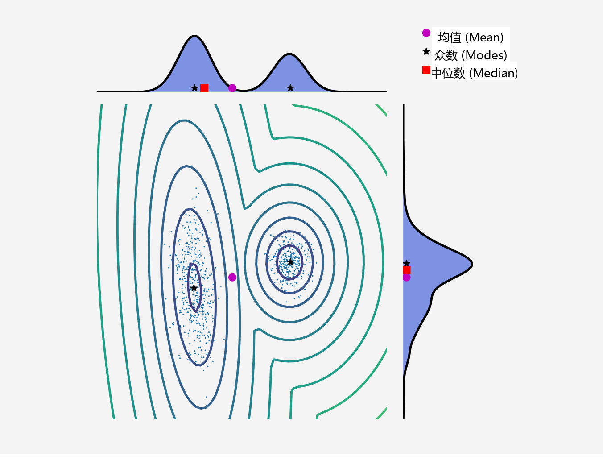
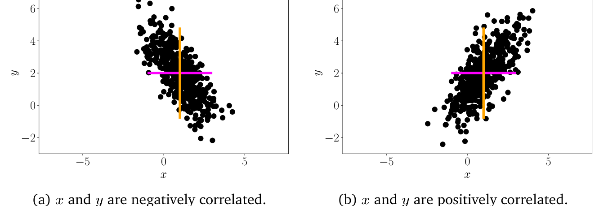
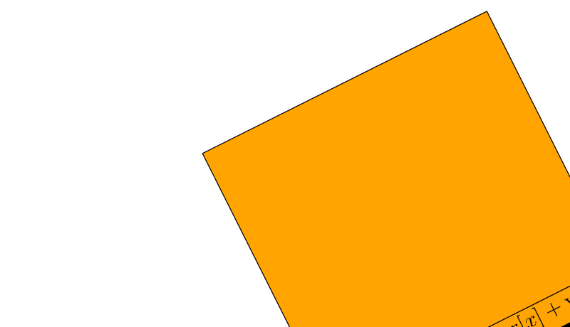

## 6.4 统计量与独立性

我们经常需要对一组随机变量进行概括汇总，并对成对的随机变量进行比较。随机变量的 _统计量（statistic）_ 是该随机变量的确定性函数。分布的 _汇总统计量（summary statistics）_ 为我们观察随机变量的行为提供了一个有用的视角，顾名思义，它提供了一组用于概括和刻画分布特征的数值。我们将介绍均值和方差这两个著名的汇总统计量。随后，我们将讨论比较一对随机变量的两种方法：第一，如何定义两个随机变量是独立的；第二，如何计算它们之间的内积。

---

### 6.4.1 均值与协方差

均值和（协）方差通常用于描述概率分布的性质（期望值与分散程度）。我们将在第 6.6 节中看到一个非常有用的分布族（称为指数族），其中随机变量的统计量能够捕获所有可能的信息。

期望值的概念在机器学习中处于核心地位，概率本身的基本概念也可以从期望值推导出来（Whittle, 2000）。

**定义 6.3**（期望值）。单变量连续随机变量 $ X \sim p(x) $ 的函数 $ g : \mathbb{R} \to \mathbb{R} $ 的 _期望值（expected value）_ 给出为：
$$
\mathbb{E}_X[g(x)] = \int_{\mathcal{X}} g(x)p(x)\,\mathrm{d}x \tag{6.28}
$$
相应地，离散随机变量 $ X \sim p(x) $ 的函数 $ g $ 的期望值给出为：
$$
\mathbb{E}_X[g(x)] = \sum_{x \in \mathcal{X}} g(x)p(x) \tag{6.29}
$$
其中 $ \mathcal{X} $ 是随机变量 $ X $ 的可能结果集合（目标空间）。

在本节中，我们考虑取数值结果的离散随机变量。这可以通过观察到函数 $ g $ 以实数作为输入看出。随机变量函数的期望值有时被称为“无意识统计学家法则”（law of the unconscious statistician，Casella and Berger, 2002，第 2.2 节）。

_备注_ 。我们将多元随机变量 $ \boldsymbol X $ 视为单变量随机变量构成的有限向量 $ [X_1, \ldots, X_D]^\top $。对于多元随机变量，我们按元素逐项定义其期望值：
$$
\mathbb{E}_{\boldsymbol X}[g(\boldsymbol x)] = \begin{bmatrix} \mathbb{E}_{X_1}[g(x_1)] \\ \vdots \\ \mathbb{E}_{X_D}[g(x_D)] \end{bmatrix} \in \mathbb{R}^D \tag{6.30}
$$
其中下标 $ \mathbb{E}_{X_d} $ 表示我们关于向量 $ \boldsymbol x $ 的第 $ d $ 个分量取期望值。♦

定义 6.3 定义了记号 $ \mathbb{E}_X $ 作为算子的含义，指示我们应当关于概率密度取积分（对于连续分布）或对所有状态求和（对于离散分布）。均值的定义（定义 6.4）是期望值的一个特例，只需选取 $ g $ 为恒等函数即可得到。

**定义 6.4**（均值）。状态为 $ \boldsymbol x \in \mathbb{R}^D $ 的随机变量 $ \boldsymbol X $ 的 _均值（mean）_ 是一种平均值，定义为：
$$
\mathbb{E}_{\boldsymbol X}[\boldsymbol x] = \begin{bmatrix} \mathbb{E}_{X_1}[x_1] \\ \vdots \\ \mathbb{E}_{X_D}[x_D] \end{bmatrix} \in \mathbb{R}^D \tag{6.31}
$$
其中对于 $ d = 1, \ldots, D $：
$$
\mathbb{E}_{X_d}[x_d] :=
\begin{cases}
\int_{\mathcal{X}} x_d p(x_d)\,\mathrm{d}x_d & \text{若 } X \text{ 是连续随机变量} \\
\sum_{x_i \in \mathcal{X}} x_i p(x_d = x_i) & \text{若 } X \text{ 是离散随机变量}
\end{cases}
\tag{6.32}
$$
其中下标 $ d $ 表示 $ \boldsymbol x $ 的相应维度。积分和求和遍历随机变量 $ X $ 的目标空间状态集 $ \mathcal{X} $。

在一维情况下，还有另外两种直观的“平均值”概念，即中位数和众数。 _中位数（median）_ 是我们将所有数值排序后的“中间”值，即 50% 的数值大于中位数，50% 的数值小于中位数。这一概念可以通过考虑累积分布函数（定义 6.2）等于 0.5 处的值推广到连续变量。对于不对称或具有长尾的分布，中位数给出的典型值估计比均值更符合人类的直觉。此外，中位数对异常值的鲁棒性高于均值。将中位数推广到更高维度并非易事，因为在多于一个维度时并不存在显而易见的“排序”方式（Hallin et al., 2010; Kong and Mizera, 2012）。 _众数（mode）_ 是出现频率最高的值。对于离散随机变量，众数定义为具有最高出现频率的 $ x $ 值。对于连续随机变量，众数定义为概率密度 $ p(x) $ 的峰值。特定密度 $ p(x) $ 可能具有不止一个众数，而且在高维分布中可能存在数量极其庞大的众数。因此，寻找分布的所有众数在计算上极具挑战性。

> **例 6.4**
> 
> 考虑图 6.4 所示的二维分布：
> $$ p(\boldsymbol x) = 0.4 \mathcal{N}\left(\boldsymbol x \;\middle|\; \begin{bmatrix} 10 \\ 2 \end{bmatrix}, \begin{bmatrix} 1 & 0 \\ 0 & 1 \end{bmatrix}\right) + 0.6 \mathcal{N}\left(\boldsymbol x \;\middle|\; \begin{bmatrix} 0 \\ 0 \end{bmatrix}, \begin{bmatrix} 8.4 & 2.0 \\ 2.0 & 1.7 \end{bmatrix}\right) \tag{6.33} $$
> 我们将在第 6.5 节中定义高斯分布 $ \mathcal{N}(\boldsymbol \mu, \boldsymbol \Sigma) $。图中同时显示了各个维度上对应的边缘分布。可以观察到，该分布是双峰的（具有两个众数），但其中一个边缘分布是单峰的（具有一个众数）。横向的双峰单变量分布说明了均值和中位数彼此可以不同。虽然我们很容易直观地将二维中位数定义为各维度中位数的拼接，但由于我们无法定义二维点的排序，这使得该定义变得很困难。当我们说“无法定义排序”时，意思是存在不止一种方式来定义偏序关系 $ < $ 使得 $ \begin{bmatrix} 3 \\ 0 \end{bmatrix} < \begin{bmatrix} 2 \\ 3 \end{bmatrix} $。

   
  <b>图 6.4 二维数据集的均值、众数与中位数，以及其边缘密度的示意图。</b> 

_备注_ 。期望值（定义 6.3）是一个线性算子。例如，给定实值函数 $ f(\boldsymbol x) = a g(\boldsymbol x) + b h(\boldsymbol x) $，其中 $ a, b \in \mathbb{R} $ 且 $ \boldsymbol x \in \mathbb{R}^D $，我们得到：
$$ \mathbb{E}_{\boldsymbol X}[f(\boldsymbol x)] = \int f(\boldsymbol x) p(\boldsymbol x)\,\mathrm{d}\boldsymbol x \tag{6.34a} $$
$$ = \int [a g(\boldsymbol x) + b h(\boldsymbol x)] p(\boldsymbol x)\,\mathrm{d}\boldsymbol x \tag{6.34b} $$
$$ = a \int g(\boldsymbol x) p(\boldsymbol x)\,\mathrm{d}\boldsymbol x + b \int h(\boldsymbol x) p(\boldsymbol x)\,\mathrm{d}\boldsymbol x \tag{6.34c} $$
$$ = a \mathbb{E}_{\boldsymbol X}[g(\boldsymbol x)] + b \mathbb{E}_{\boldsymbol X}[h(\boldsymbol x)] \tag{6.34d} $$
♦

对于两个随机变量，我们可能希望刻画它们之间的对应关联。协方差直观地表示了随机变量之间相互依赖程度的概念。

**定义 6.5**（单变量协方差）。两个单变量随机变量 $ X, Y \in \mathbb{R} $ 之间的 _协方差（covariance）_ 给出为它们各自偏离其均值的偏差乘积的期望值，即：
$$ \mathrm{Cov}_{X,Y}[x, y] := \mathbb{E}_{X,Y}\big[(x - \mathbb{E}_X[x])(y - \mathbb{E}_Y[y])\big] \tag{6.35} $$

术语说明：多元随机变量的协方差 $ \mathrm{Cov}[\boldsymbol x, \boldsymbol y] $ 有时被称为互协方差（cross-covariance），而协方差特指 $ \mathrm{Cov}[\boldsymbol x, \boldsymbol x] $。

_备注_ 。当与期望或协方差相关联的随机变量通过其自变量可以明确分辨时，通常省略下标（例如 $ \mathbb{E}_X[x] $ 常简记为 $ \mathbb{E}[x] $）。♦

利用期望的线性性质，定义 6.5 中的表达式可以重写为乘积的期望减去期望的乘积，即：
$$ \mathrm{Cov}[x, y] = \mathbb{E}[xy] - \mathbb{E}[x]\mathbb{E}[y] \tag{6.36} $$

变量与其自身的协方差 $ \mathrm{Cov}[x, x] $ 称为 _方差（variance）_ ，记为 $ \mathbb{V}_X[x] $。方差的平方根称为 _标准差（standard deviation）_ ，通常记为 $ \sigma(x) $。协方差的概念可以推广到多元随机变量。

**定义 6.6**（多元协方差）。如果我们考虑两个多元随机变量 $ \boldsymbol X $ 和 $ \boldsymbol Y $，其状态分别处于 $ \boldsymbol x \in \mathbb{R}^D $ 和 $ \boldsymbol y \in \mathbb{R}^E $，则 $ \boldsymbol X $ 与 $ \boldsymbol Y $ 之间的 _协方差（covariance）_ 定义为：
$$ \mathrm{Cov}[\boldsymbol x, \boldsymbol y] = \mathbb{E}[\boldsymbol x \boldsymbol y^\top] - \mathbb{E}[\boldsymbol x]\mathbb{E}[\boldsymbol y]^\top = \mathrm{Cov}[\boldsymbol y, \boldsymbol x]^\top \in \mathbb{R}^{D \times E} \tag{6.37} $$

定义 6.6 可以将相同的多元随机变量同时作为两个自变量输入，由此产生了一个直观捕获随机变量“分散程度（spread）”的有用概念。对于多元随机变量，方差描述了随机变量各维度之间的关系。

**定义 6.7**（方差）。状态为 $ \boldsymbol x \in \mathbb{R}^D $ 且均值向量为 $ \boldsymbol \mu \in \mathbb{R}^D $ 的随机变量 $ \boldsymbol X $ 的 _方差（variance）_ 定义为：
$$ \mathbb{V}_{\boldsymbol X}[\boldsymbol x] = \mathrm{Cov}_{\boldsymbol X}[\boldsymbol x, \boldsymbol x] \tag{6.38a} $$
$$ = \mathbb{E}_{\boldsymbol X}\big[(\boldsymbol x - \boldsymbol \mu)(\boldsymbol x - \boldsymbol \mu)^\top\big] = \mathbb{E}_{\boldsymbol X}[\boldsymbol x \boldsymbol x^\top] - \mathbb{E}_{\boldsymbol X}[\boldsymbol x]\mathbb{E}_{\boldsymbol X}[\boldsymbol x]^\top \tag{6.38b} $$
$$ = \begin{bmatrix} \mathrm{Cov}[x_1, x_1] & \mathrm{Cov}[x_1, x_2] & \cdots & \mathrm{Cov}[x_1, x_D] \\ \mathrm{Cov}[x_2, x_1] & \mathrm{Cov}[x_2, x_2] & \cdots & \mathrm{Cov}[x_2, x_D] \\ \vdots & \vdots & \ddots & \vdots \\ \mathrm{Cov}[x_D, x_1] & \cdots & \cdots & \mathrm{Cov}[x_D, x_D] \end{bmatrix} \tag{6.38c} $$

式 (6.38c) 中的 $ D \times D $ 矩阵称为多元随机变量 $ \boldsymbol X $ 的 _协方差矩阵（covariance matrix）_ 。协方差矩阵是对称且半正定的，它反映了数据的分散特征。在其对角线上，协方差矩阵包含边缘分布的方差：
$$ p(x_i) = \int p(x_1, \ldots, x_D)\,\mathrm{d}\boldsymbol x_{\backslash i} \tag{6.39} $$
其中“$ \backslash i $”表示“除 $ i $ 以外的所有变量”。非对角线元素则是 _互协方差（cross-covariance）_ 项 $ \mathrm{Cov}[x_i, x_j] $（其中 $ i, j = 1, \ldots, D $ 且 $ i \ne j $）。

   
  <b>图 6.5 沿各轴具有相同均值和方差（彩色线所示）但具有不同协方差的二维数据集。(a) x 与 y 负相关；(b) x 与 y 正相关。</b> 

_备注_ 。在本书中，为了提供更好的几何直觉，我们通常假设协方差矩阵是正定的。因此我们不深入探讨导致半正定（低秩）协方差矩阵的极端边界情形。♦

当我们需要比较不同随机变量对之间的协方差时，每个随机变量自身的方差都会影响协方差的取值大小。协方差的归一化版本称为相关系数。

**定义 6.8**（相关系数）。两个随机变量 $ X, Y $ 之间的 _相关系数（correlation）_ 给出为：
$$ \operatorname{corr}[x, y] = \frac{\mathrm{Cov}[x, y]}{\sqrt{\mathbb{V}[x]\mathbb{V}[y]}} \in [-1, 1] \tag{6.40} $$

相关矩阵是标准化随机变量 $ x / \sigma(x) $ 的协方差矩阵。换言之，在相关矩阵中，每个随机变量都被除以其自身的标准差（方差的平方根）。

协方差（与相关系数）表明了两个随机变量之间的关联方式；参见图 6.5。正相关 $ \operatorname{corr}[x, y] > 0 $ 意味着当 $ x $ 增长时，$ y $ 预计也会随之增长。负相关意味着随着 $ x $ 增加，$ y $ 会减少。

---

### 6.4.2 经验均值与经验协方差

第 6.4.1 节中的定义通常也称为 _总体均值（population mean）_ 和 _总体协方差（population covariance）_ ，因为它们指代的是总体的真实统计量。在机器学习中，我们需要从经验数据观测中进行学习。考虑一个随机变量 $ X $。从总体统计量到经验统计量的实现存在两个概念步骤。首先，利用我们拥有有限数据集（大小为 $ N $）这一事实，构建一个作为有限个同分布独立随机变量 $ X_1, \ldots, X_N $ 之函数的经验统计量。其次，我们观测数据，即观察每个随机变量的具体实现值 $ x_1, \ldots, x_N $ 并应用该经验统计量。

具体而言，对于均值（定义 6.4），给定一个具体的数据集，我们可以获得均值的一个估计，称为 _经验均值（empirical mean）_ 或 _样本均值（sample mean）_ 。经验协方差也是同理。

**定义 6.9**（经验均值与经验协方差）。经验均值向量是每个变量观测值的算术平均值，定义为：
$$ \bar{\boldsymbol x} := \frac{1}{N} \sum_{n=1}^N \boldsymbol x_n \tag{6.41} $$
其中 $ \boldsymbol x_n \in \mathbb{R}^D $。

与经验均值类似， _经验协方差矩阵（empirical covariance matrix）_ 是一个 $ D \times D $ 矩阵：
$$ \boldsymbol \Sigma := \frac{1}{N} \sum_{n=1}^N (\boldsymbol x_n - \bar{\boldsymbol x})(\boldsymbol x_n - \bar{\boldsymbol x})^\top \tag{6.42} $$

在全书中，我们使用经验协方差，它是一个有偏估计。无偏（有时称为校正后的）协方差在分母中使用因子 $ N - 1 $ 而不是 $ N $。

为了计算具体数据集的统计量，我们将使用具体实现（观测值）$ \boldsymbol x_1, \ldots, \boldsymbol x_N $ 并应用式 (6.41) 和式 (6.42)。经验协方差矩阵是对称且半正定的（见第 3.2.3 节）。

---

### 6.4.3 方差的三种表达式

我们现在聚焦于单个随机变量 $ X $，并利用前述经验公式推导出方差的三种可能表达式。以下推导同样适用于总体方差，只需注意将求和替换为积分。这些推导构成本章末尾的习题。

方差的标准定义对应于协方差的定义（定义 6.5），是随机变量 $ X $ 偏离其期望值 $ \mu $ 的偏差平方的期望，即：
$$ \mathbb{V}_X[x] := \mathbb{E}_X\big[(x - \mu)^2\big] \tag{6.43} $$
式 (6.43) 中的期望和均值 $ \mu = \mathbb{E}_X[x] $ 依据 $ X $ 是离散还是连续随机变量，分别使用式 (6.32) 计算。式 (6.43) 所表示的方差即为新随机变量 $ Z := (X - \mu)^2 $ 的均值。

当通过经验数据估计式 (6.43) 中的方差时，我们需要采用双遍（two-pass）算法：第一遍遍历数据利用式 (6.41) 计算均值 $ \mu $，然后利用此估计值 $ \hat{\mu} $ 进行第二遍遍历以计算方差。事实证明，我们可以通过重新整理各项来避免双遍扫描。式 (6.43) 中的公式可以转换为所谓的 _方差的原始得分公式（raw-score formula for variance）_ ：
$$ \mathbb{V}_X[x] = \mathbb{E}_X[x^2] - \big(\mathbb{E}_X[x]\big)^2 \tag{6.44} $$
式 (6.44) 中的表达式可以通俗地记为“平方的均值减去均值的平方”。由于我们可以同时累加 $ x_i $（用于计算均值）和 $ x_i^2 $（其中 $ x_i $ 是第 $ i $ 个观测值），因此它可以在单遍（one pass）数据扫描中以经验方式计算。然而，如果以这种方式实现，可能会在数值上不稳定。如果式 (6.44) 中的两项数值巨大且近似相等，我们在浮点运算中可能会遭受不必要的数值精度损失（巨灾抵消）。方差的原始得分版本在机器学习中非常有用，例如在推导偏差-方差分解时（Bishop, 2006）。

理解方差的第三种方式是将其视为所有观测对之间成对差值的平方和。考虑随机变量 $ X $ 的一组观测样本 $ x_1, \ldots, x_N $，我们计算 $ x_i $ 与 $ x_j $ 对之间的差值平方。通过展开平方项，我们可以证明 $ N^2 $ 个成对差值之和即为观测值的经验方差：
$$ \frac{1}{N^2} \sum_{i,j=1}^N (x_i - x_j)^2 = 2 \left[ \frac{1}{N} \sum_{i=1}^N x_i^2 - \left( \frac{1}{N} \sum_{i=1}^N x_i \right)^2 \right] \tag{6.45} $$
我们看到式 (6.45) 是原始得分表达式 (6.44) 的两倍。这意味着我们可以将成对距离之和（共有 $ N^2 $ 项）表示为偏离均值的偏差之和（共有 $ N $ 项）。从几何上看，这意味着点集内部的成对距离与各点到点集中心的距离之间存在等价性。从计算角度来看，这意味着通过先计算均值（求和包含 $ N $ 项），然后再计算方差（求和同样包含 $ N $ 项），我们可以计算出包含 $ N^2 $ 项的表达式（式 (6.45) 的左侧）。

---

### 6.4.4 随机变量的和与变换

我们可能希望对教科书标准分布（我们在第 6.5 节和第 6.6 节中会介绍一些）无法良好解释的现象进行建模，因此可能对随机变量执行简单操作（例如将两个随机变量相加）。

考虑两个状态为 $ \boldsymbol x, \boldsymbol y \in \mathbb{R}^D $ 的随机变量 $ \boldsymbol X, \boldsymbol Y $，则有：
$$ \mathbb{E}[\boldsymbol x + \boldsymbol y] = \mathbb{E}[\boldsymbol x] + \mathbb{E}[\boldsymbol y] \tag{6.46} $$
$$ \mathbb{E}[\boldsymbol x - \boldsymbol y] = \mathbb{E}[\boldsymbol x] - \mathbb{E}[\boldsymbol y] \tag{6.47} $$
$$ \mathbb{V}[\boldsymbol x + \boldsymbol y] = \mathbb{V}[\boldsymbol x] + \mathbb{V}[\boldsymbol y] + \mathrm{Cov}[\boldsymbol x, \boldsymbol y] + \mathrm{Cov}[\boldsymbol y, \boldsymbol x] \tag{6.48} $$
$$ \mathbb{V}[\boldsymbol x - \boldsymbol y] = \mathbb{V}[\boldsymbol x] + \mathbb{V}[\boldsymbol y] - \mathrm{Cov}[\boldsymbol x, \boldsymbol y] - \mathrm{Cov}[\boldsymbol y, \boldsymbol x] \tag{6.49} $$

当涉及随机变量的仿射变换时，均值和（协）方差展现出一些有用的性质。考虑具有均值 $ \boldsymbol \mu $ 和协方差矩阵 $ \boldsymbol \Sigma $ 的随机变量 $ \boldsymbol X $，以及 $ \boldsymbol x $ 的（确定性）仿射变换 $ \boldsymbol y = \boldsymbol A\boldsymbol x + \boldsymbol b $。那么 $ \boldsymbol y $ 本身也是一个随机变量，其均值向量和协方差矩阵分别给出为：
$$ \mathbb{E}_{\boldsymbol Y}[\boldsymbol y] = \mathbb{E}_{\boldsymbol X}[\boldsymbol A\boldsymbol x + \boldsymbol b] = \boldsymbol A\mathbb{E}_{\boldsymbol X}[\boldsymbol x] + \boldsymbol b = \boldsymbol A\boldsymbol \mu + \boldsymbol b \tag{6.50} $$
$$ \mathbb{V}_{\boldsymbol Y}[\boldsymbol y] = \mathbb{V}_{\boldsymbol X}[\boldsymbol A\boldsymbol x + \boldsymbol b] = \mathbb{V}_{\boldsymbol X}[\boldsymbol A\boldsymbol x] = \boldsymbol A\mathbb{V}_{\boldsymbol X}[\boldsymbol x]\boldsymbol A^\top = \boldsymbol A\boldsymbol \Sigma\boldsymbol A^\top \tag{6.51} $$
此外，直接利用均值和协方差的定义可以证明：
$$ \mathrm{Cov}[\boldsymbol x, \boldsymbol y] = \mathbb{E}\big[\boldsymbol x(\boldsymbol A\boldsymbol x + \boldsymbol b)^\top\big] - \mathbb{E}[\boldsymbol x]\mathbb{E}[\boldsymbol A\boldsymbol x + \boldsymbol b]^\top \tag{6.52a} $$
$$ = \mathbb{E}[\boldsymbol x]\boldsymbol b^\top + \mathbb{E}[\boldsymbol x\boldsymbol x^\top]\boldsymbol A^\top - \boldsymbol \mu\boldsymbol b^\top - \boldsymbol \mu\boldsymbol \mu^\top\boldsymbol A^\top \tag{6.52b} $$
$$ = \boldsymbol \mu\boldsymbol b^\top - \boldsymbol \mu\boldsymbol b^\top + \big(\mathbb{E}[\boldsymbol x\boldsymbol x^\top] - \boldsymbol \mu\boldsymbol \mu^\top\big)\boldsymbol A^\top \tag{6.52c} $$
$$ \stackrel{(6.38\mathrm{b})}{=} \boldsymbol \Sigma\boldsymbol A^\top \tag{6.52d} $$
其中 $ \boldsymbol \Sigma = \mathbb{E}[\boldsymbol x\boldsymbol x^\top] - \boldsymbol \mu\boldsymbol \mu^\top $ 是 $ \boldsymbol X $ 的协方差。

---

### 6.4.5 统计独立性

**定义 6.10**（独立性）。两个随机变量 $ X, Y $ 是 _统计独立（statistically independent）_ 的，当且仅当：
$$ p(x, y) = p(x)p(y) \tag{6.53} $$

直观上，如果知道 $ y $ 的值不会为我们提供关于 $ x $ 的任何额外信息（反之亦然），则两个随机变量 $ X $ 和 $ Y $ 是独立的。若 $ X, Y $（统计）独立，则满足：
- $ p(y \mid x) = p(y) $
- $ p(x \mid y) = p(x) $
- $ \mathbb{V}_{X,Y}[x + y] = \mathbb{V}_X[x] + \mathbb{V}_Y[y] $
- $ \mathrm{Cov}_{X,Y}[x, y] = 0 $

后一点反过来并不一定成立，即两个随机变量的协方差可以为零，但它们并不是统计独立的。为了理解其中的原因，请回想协方差仅度量线性相关性。因此，存在非线性依赖关系的随机变量其协方差完全可能为零。

> **例 6.5**
> 
> 考虑一个零均值（$ \mathbb{E}_X[x] = 0 $）且满足 $ \mathbb{E}_X[x^3] = 0 $ 的随机变量 $ X $。令 $ y = x^2 $（因此 $ Y $ 依赖于 $ X $），并考虑 $ X $ 与 $ Y $ 之间的协方差 (6.36)。由此可得：
> $$ \mathrm{Cov}[x, y] = \mathbb{E}[xy] - \mathbb{E}[x]\mathbb{E}[y] = \mathbb{E}[x^3] = 0 \tag{6.54} $$

在机器学习中，我们经常考虑可以建模为 _独立同分布（independent and identically distributed, i.i.d.）_ 随机变量 $ X_1, \ldots, X_N $ 的问题。对于多于两个随机变量的情况，“独立”（定义 6.10）通常指代 _相互独立（mutually independent）_ 的随机变量，即其所有子集都是相互独立的（参见 Pollard (2002, 第 4 章) 和 Jacod and Protter (2004, 第 3 章)）。短语“同分布”意味着所有随机变量都来自同一个分布。

机器学习中另一个重要的概念是条件独立性。

**定义 6.11**（条件独立性）。在给定 $ Z $ 的条件下，两个随机变量 $ X $ 和 $ Y $ 是 _条件独立（conditionally independent）_ 的，当且仅当：
$$ p(x, y \mid z) = p(x \mid z)p(y \mid z) \quad \text{对所有 } z \in \mathcal{Z} \tag{6.55} $$
其中 $ \mathcal{Z} $ 是随机变量 $ Z $ 的状态集。我们记作 $ X \perp\!\!\!\perp Y \mid Z $ 表示在给定 $ Z $ 时 $ X $ 与 $ Y $ 条件独立。

定义 6.11 要求式 (6.55) 中的关系必须对 $ z $ 的每一个取值都成立。式 (6.55) 可以解释为：“在获知关于 $ z $ 的知识后，$ x $ 和 $ y $ 的联合分布发生因子分解”。若写作 $ X \perp\!\!\!\perp Y \mid \emptyset $，无条件独立性可以被视为条件独立性的特例。利用概率的乘法法则 (6.22)，我们可以展开式 (6.55) 的左边得到：
$$ p(x, y \mid z) = p(x \mid y, z)p(y \mid z) \tag{6.56} $$
比较式 (6.55) 的右侧与式 (6.56)，我们发现两式均出现 $ p(y \mid z) $，从而有：
$$ p(x \mid y, z) = p(x \mid z) \tag{6.57} $$
式 (6.57) 提供了条件独立性（即 $ X \perp\!\!\!\perp Y \mid Z $）的另一种等价定义。这种表述方式具有清晰的直观解释：“已知 $ z $ 时，关于 $ y $ 的新知识不会改变我们对 $ x $ 的认知”。

---

### 6.4.6 随机变量的内积

回顾第 3.2 节中关于内积的定义。我们可以在随机变量之间定义内积，本节将对此进行简要阐述。多元随机变量之间的内积也可以采用类似的方式处理。

如果我们有两个不相关的随机变量 $ X, Y $，则：
$$ \mathbb{V}[x + y] = \mathbb{V}[x] + \mathbb{V}[y] \tag{6.58} $$
由于方差是以平方单位计量的，这看起来非常类似于直角三角形的勾股定理 $ c^2 = a^2 + b^2 $。

接下来，我们将探讨能否为式 (6.58) 中不相关随机变量的方差关系找到几何解释。

   
  <b>图 6.6 随机变量的几何意义。若随机变量 X 和 Y 不相关，则它们在相应向量空间中是正交向量，且勾股定理成立。</b> 

随机变量可以被视为向量空间中的向量，我们可以定义内积以获取随机变量的几何性质（Eaton, 2007）。对于零均值随机变量 $ X $ 和 $ Y $，如果我们定义：
$$ \langle X, Y \rangle := \mathrm{Cov}[x, y] \tag{6.59} $$
即可获得一个内积。我们看到协方差是对称的、正定的（$ \mathrm{Cov}[x, x] = 0 \iff x = 0 $），并且对任一自变量均满足线性（对任意 $ \alpha \in \mathbb{R} $，有 $ \mathrm{Cov}[\alpha x + z, y] = \alpha \mathrm{Cov}[x, y] + \mathrm{Cov}[z, y] $）。随机变量的“长度”为：
$$ \|X\| = \sqrt{\mathrm{Cov}[x, x]} = \sqrt{\mathbb{V}[x]} = \sigma[x] \tag{6.60} $$
即为其标准差。随机变量越“长”，其不确定性就越大；而长度为 0 的随机变量则是确定性的。

如果我们观察两个随机变量 $ X, Y $ 之间的夹角 $ \theta $，可得：
$$ \cos \theta = \frac{\langle X, Y \rangle}{\|X\|\,\|Y\|} = \frac{\mathrm{Cov}[x, y]}{\sqrt{\mathbb{V}[x]\mathbb{V}[y]}} \tag{6.61} $$
这正是两个随机变量之间的相关系数（定义 6.8）。这意味着，从几何角度来看，我们可以将相关系数视为两个随机变量之间夹角的余弦值。由定义 3.7 可知，$ X \perp Y \iff \langle X, Y \rangle = 0 $。在我们的情形中，这意味着 $ X $ 与 $ Y $ 正交当且仅当 $ \mathrm{Cov}[x, y] = 0 $，即它们是不相关的。图 6.6 说明了这种对应关系。

_备注_ 。尽管人们很容易尝试利用欧氏距离（基于前述内积定义构建）来比较概率分布，但遗憾的是，这并不是获取分布之间距离的最佳方式。回想一下，概率质量（或密度）是非负的，且总和必须为 1。这些约束意味着概率分布存在于所谓的 _统计流形（statistical manifold）_ 上。研究这种概率分布空间的学科称为 _信息几何（information geometry）_ 。计算分布之间的距离通常使用 _Kullback-Leibler 散度（Kullback-Leibler divergence, KL 散度）_ ，它是考虑了统计流形性质的距离推广。正如欧氏距离是度量的一个特例（第 3.3 节），Kullback-Leibler 散度也是两个更广泛散度族（称为 _Bregman 散度（Bregman divergences）_ 和 _f-散度（f-divergences）_ ）的特例。关于散度的深入研究超出了本书的范围，更多细节请参阅信息几何领域的先驱之一 Amari (2016) 的最新专著。♦
