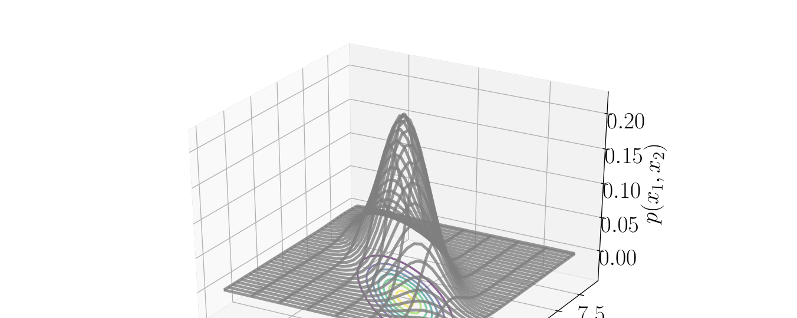
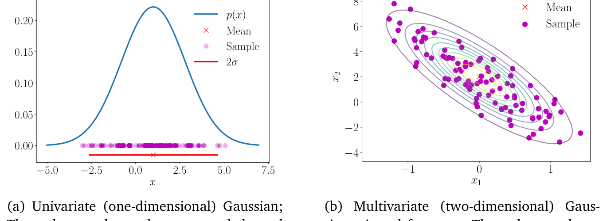
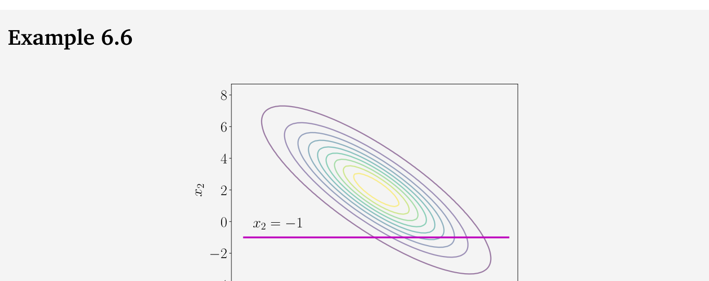

## 6.5 高斯分布

 _高斯分布（Gaussian distribution）_ 是连续型随机变量中研究得最为透彻的概率分布。它也被称为 _正态分布（normal distribution）_ 。（ _边注_ ：当我们考虑独立同分布随机变量的和时，高斯分布会自然出现。这被称为 _中心极限定理（central limit theorem）_ (Grinstead and Snell, 1997)。）高斯分布的重要性源于它具有许多计算上极为便利的性质，我们将在下文中对此进行讨论。具体而言，我们将利用它来定义线性回归的似然函数与先验分布（第 9 章），并考虑使用高斯混合模型来进行密度估计（第 11 章）。

机器学习中的许多其他领域也受益于使用高斯分布，例如高斯过程（Gaussian processes）、变分推断（variational inference）和强化学习（reinforcement learning）。它还在其他应用领域中得到广泛使用，例如信号处理（如卡尔曼滤波，Kalman filter）、控制理论（如线性二次调节器，linear quadratic regulator）以及统计学（如假设检验，hypothesis testing）。

对于单变量随机变量，高斯分布的概率密度由下式给出：
$$
p(x \mid \mu, \sigma^2) = \frac{1}{\sqrt{2\pi\sigma^2}} \exp\left( -\frac{(x - \mu)^2}{2\sigma^2} \right) .
\tag{6.62}
$$

 _多元高斯分布（multivariate Gaussian distribution）_ （亦称 _多元正态分布（multivariate normal distribution）_ ）完全由 _均值向量（mean vector）_ $ \boldsymbol \mu $ 和 _协方差矩阵（covariance matrix）_ $ \boldsymbol \Sigma $ 表征，其定义为：
$$
p(\boldsymbol x \mid \boldsymbol \mu, \boldsymbol \Sigma) = (2\pi)^{-\frac{D}{2}} |\boldsymbol \Sigma|^{-\frac{1}{2}} \exp\left( -\frac{1}{2}(\boldsymbol x - \boldsymbol \mu)^\top \boldsymbol \Sigma^{-1} (\boldsymbol x - \boldsymbol \mu) \right) ,
\tag{6.63}
$$
其中 $ \boldsymbol x \in \mathbb{R}^D $。我们记作 $ p(\boldsymbol x) = \mathcal{N}(\boldsymbol x \mid \boldsymbol \mu, \boldsymbol \Sigma) $ 或 $ \boldsymbol X \sim \mathcal{N}(\boldsymbol \mu, \boldsymbol \Sigma) $。图 6.7 展示了一个二元高斯分布（网格曲面）及其对应的等高线图。图 6.8 展示了一个单变量高斯分布和一个二元高斯分布以及相应的样本点。均值为零且协方差为单位矩阵的特殊高斯分布情形，即 $ \boldsymbol \mu = \boldsymbol 0 $ 且 $ \boldsymbol \Sigma = \boldsymbol I $，被称为 _标准正态分布（standard normal distribution）_ 。

   
  <b>图 6.7 两个随机变量 x₁ 和 x₂ 的高斯分布。</b> 

   
  <b>图 6.8 叠加了 100 个样本的高斯分布。(a) 一维（单变量）高斯分布，红十字表示均值，红线表示方差的范围；(b) 二维（多元）高斯分布的俯视图，红十字表示均值，彩色线条表示密度的等高线。</b> 

高斯分布在统计估计和机器学习中得到了极其广泛的应用，因为它们的边缘分布和条件分布都具有解析闭式表达式。在第 9 章中，我们将在线性回归中广泛使用这些闭式表达式。使用高斯随机变量进行建模的一个主要优势在于，通常不需要进行变量变换（第 6.7 节）。由于高斯分布完全由其均值和协方差决定，我们通常只需将变换直接应用于随机变量的均值和协方差，即可获得变换后的分布。

---

### 6.5.1 高斯分布的边缘分布与条件分布仍为高斯分布

下面，我们介绍多元随机变量在一般情形下的边缘化和条件化。如果在初次阅读时感到困惑，建议读者先考虑两个单变量随机变量的情形。设 $ \boldsymbol X $ 和 $ \boldsymbol Y $ 为两个多元随机变量，它们可能具有不同的维度。为了考虑应用概率加法法则的效果以及条件化的效果，我们将高斯分布显式地写为拼接状态 $ [\boldsymbol x, \boldsymbol y]^\top $ 的形式：
$$
p(\boldsymbol x, \boldsymbol y) = \mathcal{N}\left( \begin{bmatrix} \boldsymbol \mu_x \\ \boldsymbol \mu_y \end{bmatrix}, \begin{bmatrix} \boldsymbol \Sigma_{xx} & \boldsymbol \Sigma_{xy} \\ \boldsymbol \Sigma_{yx} & \boldsymbol \Sigma_{yy} \end{bmatrix} \right) ,
\tag{6.64}
$$
其中 $ \boldsymbol \Sigma_{xx} = \mathrm{Cov}[\boldsymbol x, \boldsymbol x] $ 和 $ \boldsymbol \Sigma_{yy} = \mathrm{Cov}[\boldsymbol y, \boldsymbol y] $ 分别是 $ \boldsymbol x $ 和 $ \boldsymbol y $ 的边缘协方差矩阵，而 $ \boldsymbol \Sigma_{xy} = \mathrm{Cov}[\boldsymbol x, \boldsymbol y] $ 是 $ \boldsymbol x $ 与 $ \boldsymbol y $ 之间的 _互协方差矩阵（cross-covariance matrix）_ （且 $ \boldsymbol \Sigma_{yx} = \boldsymbol \Sigma_{xy}^\top $）。

条件分布 $ p(\boldsymbol x \mid \boldsymbol y) $ 也是高斯分布（如图 6.9(c) 所示），由下式给出（推导参见 Bishop (2006) 第 2.3 节）：
$$
p(\boldsymbol x \mid \boldsymbol y) = \mathcal{N}(\boldsymbol \mu_{x \mid y}, \boldsymbol \Sigma_{x \mid y})
\tag{6.65}
$$
$$
\boldsymbol \mu_{x \mid y} = \boldsymbol \mu_x + \boldsymbol \Sigma_{xy}\boldsymbol \Sigma_{yy}^{-1}(\boldsymbol y - \boldsymbol \mu_y)
\tag{6.66}
$$
$$
\boldsymbol \Sigma_{x \mid y} = \boldsymbol \Sigma_{xx} - \boldsymbol \Sigma_{xy}\boldsymbol \Sigma_{yy}^{-1}\boldsymbol \Sigma_{yx} .
\tag{6.67}
$$
注意，在式 (6.66) 的均值计算中，$ \boldsymbol y $ 的值是一个观测值，不再是随机的。

_备注_ 。条件高斯分布在我们需要求后验分布的许多场景中都会出现：
- 卡尔曼滤波（Kalman filter, Kalman, 1960）：信号处理中状态估计最核心的算法之一，其本质就是在计算联合分布的高斯条件分布（Deisenroth and Ohlsson, 2011; Särkkä, 2013）。
- 高斯过程（Gaussian processes, Rasmussen and Williams, 2006）：函数空间分布的一种实际实现。在高斯过程中，我们假设随机变量服从联合高斯分布。通过对观测数据进行（高斯）条件化，我们可以确定函数空间上的后验分布。
- 隐线性高斯模型（latent linear Gaussian models, Roweis and Ghahramani, 1999; Murphy, 2012）：包括概率主成分分析（probabilistic principal component analysis, PPCA, Tipping and Bishop, 1999）。我们将在第 10.7 节更详细地探讨 PPCA。♦

联合高斯分布 $ p(\boldsymbol x, \boldsymbol y) $（参见式 (6.64)）的边缘分布 $ p(\boldsymbol x) $ 本身也是高斯分布，可以通过应用加法法则（式 (6.20)）计算得到：
$$
p(\boldsymbol x) = \int p(\boldsymbol x, \boldsymbol y) \mathrm{d}\boldsymbol y = \mathcal{N}(\boldsymbol x \mid \boldsymbol \mu_x, \boldsymbol \Sigma_{xx}) .
\tag{6.68}
$$
对 $ \boldsymbol x $ 进行边缘化可得到关于 $ p(\boldsymbol y) $ 的相应结论。直观地说，审视式 (6.64) 中的联合分布，我们忽略了（即积分积掉）我们不感兴趣的所有内容。这在图 6.9(b) 中进行了说明。

   
  <b>图 6.9 (a) 二元高斯分布；(b) 联合高斯分布的边缘分布是高斯分布；(c) 高斯分布的条件分布也是高斯分布。</b> 

> **例 6.6**
> 
> 考虑二元高斯分布（如图 6.9 所示）：
> $$
> p(x_1, x_2) = \mathcal{N}\left( \begin{bmatrix} 0 \\ 2 \end{bmatrix}, \begin{bmatrix} 0.3 & -1 \\ -1 & 5 \end{bmatrix} \right) .
> \tag{6.69}
> $$
> 我们可以通过应用式 (6.66) 和式 (6.67) 分别计算以 $ x_2 = -1 $ 为条件时的单变量高斯分布的均值和方差。数值计算如下：
> $$
> \mu_{x_1 \mid x_2 = -1} = 0 + (-1) \cdot 0.2 \cdot (-1 - 2) = 0.6
> \tag{6.70}
> $$
> 以及
> $$
> \sigma_{x_1 \mid x_2 = -1}^2 = 0.3 - (-1) \cdot 0.2 \cdot (-1) = 0.1 .
> \tag{6.71}
> $$
> 因此，条件高斯分布由下式给出：
> $$
> p(x_1 \mid x_2 = -1) = \mathcal{N}(0.6, 0.1) .
> \tag{6.72}
> $$
> 相比之下，边缘分布 $ p(x_1) $ 可以通过应用式 (6.68) 获得，这本质上是直接使用随机变量 $ x_1 $ 的均值和方差，得到：
> $$
> p(x_1) = \mathcal{N}(0, 0.3) .
> \tag{6.73}
> $$

---

### 6.5.2 高斯密度的乘积

在进行线性回归时（第 9 章），我们需要计算高斯似然。此外，我们可能还希望设定高斯先验（第 9.3 节）。我们应用贝叶斯定理来计算后验分布，这将导致似然与先验相乘，即两个高斯密度的乘积。两个高斯分布 $ \mathcal{N}(\boldsymbol x \mid \boldsymbol a, \boldsymbol A)\mathcal{N}(\boldsymbol x \mid \boldsymbol b, \boldsymbol B) $ 的乘积是一个乘以尺度因子 $ c \in \mathbb{R} $ 的高斯分布（ _边注_ ：该公式的推导见本章末尾的习题。），给出为 $ c \mathcal{N}(\boldsymbol x \mid \boldsymbol c, \boldsymbol C) $，其中：
$$
\boldsymbol C = (\boldsymbol A^{-1} + \boldsymbol B^{-1})^{-1}
\tag{6.74}
$$
$$
\boldsymbol c = \boldsymbol C(\boldsymbol A^{-1}\boldsymbol a + \boldsymbol B^{-1}\boldsymbol b)
\tag{6.75}
$$
$$
c = (2\pi)^{-\frac{D}{2}} |\boldsymbol A + \boldsymbol B|^{-\frac{1}{2}} \exp\left( -\frac{1}{2}(\boldsymbol a - \boldsymbol b)^\top(\boldsymbol A + \boldsymbol B)^{-1}(\boldsymbol a - \boldsymbol b) \right) .
\tag{6.76}
$$
尺度常数 $ c $ 本身也可以写成以 $ \boldsymbol a $ 或 $ \boldsymbol b $ 为自变量、协方差矩阵“膨胀”为 $ \boldsymbol A + \boldsymbol B $ 的高斯密度的形式，即 $ c = \mathcal{N}(\boldsymbol a \mid \boldsymbol b, \boldsymbol A + \boldsymbol B) = \mathcal{N}(\boldsymbol b \mid \boldsymbol a, \boldsymbol A + \boldsymbol B) $。

_备注_ 。为了符号上的便利，我们有时会使用 $ \mathcal{N}(\boldsymbol x \mid \boldsymbol m, \boldsymbol S) $ 来描述高斯密度的函数形式，即使 $ \boldsymbol x $ 并不是随机变量。我们在前面的展示中正是这样做的，当时我们写道：
$$
c = \mathcal{N}(\boldsymbol a \mid \boldsymbol b, \boldsymbol A + \boldsymbol B) = \mathcal{N}(\boldsymbol b \mid \boldsymbol a, \boldsymbol A + \boldsymbol B) .
\tag{6.77}
$$
在这里，$ \boldsymbol a $ 和 $ \boldsymbol b $ 都不是随机变量。然而，以这种方式书写 $ c $ 比式 (6.76) 更紧凑。♦

---

### 6.5.3 和与线性变换

如果 $ \boldsymbol X, \boldsymbol Y $ 是相互独立的高斯随机变量（即联合分布给出为 $ p(\boldsymbol x, \boldsymbol y) = p(\boldsymbol x)p(\boldsymbol y) $），且 $ p(\boldsymbol x) = \mathcal{N}(\boldsymbol x \mid \boldsymbol \mu_x, \boldsymbol \Sigma_x) $，$ p(\boldsymbol y) = \mathcal{N}(\boldsymbol y \mid \boldsymbol \mu_y, \boldsymbol \Sigma_y) $，那么 $ \boldsymbol x + \boldsymbol y $ 也服从高斯分布，并由下式给出：
$$
p(\boldsymbol x + \boldsymbol y) = \mathcal{N}(\boldsymbol \mu_x + \boldsymbol \mu_y, \boldsymbol \Sigma_x + \boldsymbol \Sigma_y) .
\tag{6.78}
$$
已知 $ p(\boldsymbol x + \boldsymbol y) $ 是高斯分布后，可以直接利用式 (6.46) 至式 (6.49) 的结果确定其均值和协方差矩阵。当我们考虑作用在随机变量上的独立同分布（i.i.d.）高斯噪声时，这一性质将非常重要，例如线性回归中的情形（第 9 章）。

> **例 6.7**
> 
> 由于期望是线性算子，我们可以得到独立高斯随机变量的加权和：
> $$
> p(a\boldsymbol x + b\boldsymbol y) = \mathcal{N}(a\boldsymbol \mu_x + b\boldsymbol \mu_y, a^2\boldsymbol \Sigma_x + b^2\boldsymbol \Sigma_y) .
> \tag{6.79}
> $$

_备注_ 。在第 11 章中非常有用的一个情形是高斯密度的加权和。这与高斯随机变量的加权和是截然不同的。♦

在定理 6.12 中，随机变量 $ x $ 来自由两个概率密度 $ p_1(x) $ 和 $ p_2(x) $ 以 $ \alpha $ 为权重混合而成的密度。由于期望的线性性质对多元随机变量同样成立，因此该定理可以推广到多元随机变量的情形。然而，随机变量平方的概念需要替换为 $ \boldsymbol x \boldsymbol x^\top $。

**定理 6.12**。考虑两个单变量高斯密度的混合：
$$
p(x) = \alpha p_1(x) + (1 - \alpha)p_2(x) ,
\tag{6.80}
$$
其中标量 $ 0 < \alpha < 1 $ 为混合权重，$ p_1(x) $ 和 $ p_2(x) $ 是具有不同参数的单变量高斯密度（式 (6.62)），即 $ (\mu_1, \sigma_1^2) \neq (\mu_2, \sigma_2^2) $。
则混合密度 $ p(x) $ 的均值由各个随机变量均值的加权和给出：
$$
\mathbb{E}[x] = \alpha \mu_1 + (1 - \alpha)\mu_2 .
\tag{6.81}
$$
混合密度 $ p(x) $ 的方差由下式给出：
$$
\mathbb{V}[x] = [\alpha\sigma_1^2 + (1 - \alpha)\sigma_2^2] + [\alpha\mu_1^2 + (1 - \alpha)\mu_2^2] - [\alpha\mu_1 + (1 - \alpha)\mu_2]^2 .
\tag{6.82}
$$

**证明**：
混合密度 $ p(x) $ 的均值由各个随机变量均值的加权和给出。我们应用均值的定义（定义 6.4），代入混合分布 (6.80)，得到：
$$
\mathbb{E}[x] = \int_{-\infty}^\infty x p(x) \mathrm{d}x
\tag{6.83a}
$$
$$
= \int_{-\infty}^\infty \left[\alpha x p_1(x) + (1 - \alpha) x p_2(x)\right] \mathrm{d}x
\tag{6.83b}
$$
$$
= \alpha \int_{-\infty}^\infty x p_1(x) \mathrm{d}x + (1 - \alpha) \int_{-\infty}^\infty x p_2(x) \mathrm{d}x
\tag{6.83c}
$$
$$
= \alpha \mu_1 + (1 - \alpha) \mu_2 .
\tag{6.83d}
$$
为了计算方差，我们可以使用式 (6.44) 中的原始得分版本（raw-score version）方差公式，这需要随机变量平方的期望表达式。这里我们使用随机变量函数（平方）期望的定义（定义 6.3）：
$$
\mathbb{E}[x^2] = \int_{-\infty}^\infty x^2 p(x) \mathrm{d}x
\tag{6.84a}
$$
$$
= \int_{-\infty}^\infty \left[\alpha x^2 p_1(x) + (1 - \alpha) x^2 p_2(x)\right] \mathrm{d}x
\tag{6.84b}
$$
$$
= \alpha \int_{-\infty}^\infty x^2 p_1(x) \mathrm{d}x + (1 - \alpha) \int_{-\infty}^\infty x^2 p_2(x) \mathrm{d}x
\tag{6.84c}
$$
$$
= \alpha(\mu_1^2 + \sigma_1^2) + (1 - \alpha)(\mu_2^2 + \sigma_2^2) ,
\tag{6.84d}
$$
其中在最后一个等号中，我们再次使用了式 (6.44) 的原始得分版本方差公式，即 $ \sigma^2 = \mathbb{E}[x^2] - \mu^2 $。将其重排可知，随机变量平方的期望等于平方均值与方差之和。
因此，方差通过从式 (6.84d) 中减去式 (6.83d) 的平方求得：
$$
\mathbb{V}[x] = \mathbb{E}[x^2] - (\mathbb{E}[x])^2
\tag{6.85a}
$$
$$
= \alpha(\mu_1^2 + \sigma_1^2) + (1 - \alpha)(\mu_2^2 + \sigma_2^2) - [\alpha \mu_1 + (1 - \alpha)\mu_2]^2
\tag{6.85b}
$$
$$
= [\alpha \sigma_1^2 + (1 - \alpha) \sigma_2^2] + [\alpha \mu_1^2 + (1 - \alpha) \mu_2^2] - [\alpha \mu_1 + (1 - \alpha)\mu_2]^2 .
\tag{6.85c}
$$

_备注_ 。上述推导对任意概率密度均成立，但由于高斯分布完全由均值和方差决定，混合密度的统计量可以求得解析闭式解。♦

对于混合密度，各个分量可以视为条件分布（以分量标识为条件）。式 (6.85c) 是条件方差公式的一个实例，该公式也称为 _全方差公式（law of total variance）_ ，其一般表述为：对于两个随机变量 $ X $ 和 $ Y $，恒有 $ \mathbb{V}_X[x] = \mathbb{E}_Y[\mathbb{V}_X[x \mid y]] + \mathbb{V}_Y[\mathbb{E}_X[x \mid y]] $，即 $ X $ 的（全）方差等于条件方差的期望加上条件均值的方差。

我们在例 6.17 中考虑了二元标准高斯随机变量 $ \boldsymbol X $，并对其执行了线性变换 $ \boldsymbol A \boldsymbol x $。其结果是均值为零、协方差为 $ \boldsymbol A \boldsymbol A^\top $ 的高斯随机变量。注意到加上一个常数向量会改变分布的均值，而不会影响其方差，也就是说，随机变量 $ \boldsymbol x + \boldsymbol \mu $ 是均值为 $ \boldsymbol \mu $、协方差为单位矩阵的高斯分布。（ _边注_ ：高斯随机变量的任意线性/仿射变换也服从高斯分布。）因此，高斯随机变量的任意线性/仿射变换都服从高斯分布。

考虑服从高斯分布的随机变量 $ \boldsymbol X \sim \mathcal{N}(\boldsymbol \mu, \boldsymbol \Sigma) $。对于给定的合适尺寸的矩阵 $ \boldsymbol A $，设 $ \boldsymbol Y $ 为随机变量，使得 $ \boldsymbol y = \boldsymbol A \boldsymbol x $ 是 $ \boldsymbol x $ 的变换形式。我们可以利用期望是线性算子这一性质（式 (6.50)）来计算 $ \boldsymbol y $ 的均值：
$$
\mathbb{E}[\boldsymbol y] = \mathbb{E}[\boldsymbol A \boldsymbol x] = \boldsymbol A \mathbb{E}[\boldsymbol x] = \boldsymbol A \boldsymbol \mu .
\tag{6.86}
$$
类似地，$ \boldsymbol y $ 的方差可以通过使用式 (6.51) 求得：
$$
\mathbb{V}[\boldsymbol y] = \mathbb{V}[\boldsymbol A \boldsymbol x] = \boldsymbol A \mathbb{V}[\boldsymbol x] \boldsymbol A^\top = \boldsymbol A \boldsymbol \Sigma \boldsymbol A^\top .
\tag{6.87}
$$
这意味着随机变量 $ \boldsymbol y $ 服从如下分布：
$$
p(\boldsymbol y) = \mathcal{N}(\boldsymbol y \mid \boldsymbol A \boldsymbol \mu, \boldsymbol A \boldsymbol \Sigma \boldsymbol A^\top) .
\tag{6.88}
$$

现在让我们考虑逆变换：当我们已知某个随机变量的均值是另一个随机变量的线性变换时。对于给定的列满秩矩阵 $ \boldsymbol A \in \mathbb{R}^{M \times N} $（其中 $ M \geqslant N $），设 $ \boldsymbol y \in \mathbb{R}^M $ 为均值为 $ \boldsymbol A \boldsymbol x $ 的高斯随机变量，即：
$$
p(\boldsymbol y) = \mathcal{N}(\boldsymbol y \mid \boldsymbol A \boldsymbol x, \boldsymbol \Sigma) .
\tag{6.89}
$$
对应的概率分布 $ p(\boldsymbol x) $ 是什么？如果 $ \boldsymbol A $ 可逆，那么我们可以写出 $ \boldsymbol x = \boldsymbol A^{-1} \boldsymbol y $ 并应用上一段中的变换。然而，通常情况下 $ \boldsymbol A $ 不可逆，我们采用类似于伪逆（式 (3.57)）的方法。也就是说，我们在两边左乘 $ \boldsymbol A^\top $，然后对对称正定矩阵 $ \boldsymbol A^\top \boldsymbol A $ 求逆，得到如下关系：
$$
\boldsymbol y = \boldsymbol A \boldsymbol x \iff (\boldsymbol A^\top \boldsymbol A)^{-1}\boldsymbol A^\top \boldsymbol y = \boldsymbol x .
\tag{6.90}
$$
因此，$ \boldsymbol x $ 是 $ \boldsymbol y $ 的线性变换，我们得到：
$$
p(\boldsymbol x) = \mathcal{N}\left( \boldsymbol x \mid (\boldsymbol A^\top \boldsymbol A)^{-1}\boldsymbol A^\top \boldsymbol y, (\boldsymbol A^\top \boldsymbol A)^{-1}\boldsymbol A^\top \boldsymbol \Sigma \boldsymbol A (\boldsymbol A^\top \boldsymbol A)^{-1} \right) .
\tag{6.91}
$$

---

### 6.5.4 从多元高斯分布中采样

我们在此不深入讨论在计算机上进行随机采样的精细细节，感兴趣的读者可参阅 Gentle (2004)。在多元高斯分布的情形下，该过程包含三个阶段：首先，我们需要一个伪随机数源，提供区间 $ [0, 1] $ 上的均匀分布样本；其次，我们使用非线性变换（例如 Box-Müller 变换 (Devroye, 1986)）来获得单变量高斯分布的样本；第三，我们将这些样本整理成向量，以获得来自多元标准正态分布 $ \mathcal{N}(\boldsymbol 0, \boldsymbol I) $ 的样本。

对于一般的多元高斯分布（即均值非零且协方差矩阵不是单位矩阵），我们利用高斯随机变量线性变换的性质。假设我们希望从均值为 $ \boldsymbol \mu $、协方差矩阵为 $ \boldsymbol \Sigma $ 的多元高斯分布中生成样本 $ \boldsymbol x_i $（$ i = 1, \ldots, n $）。我们希望借助能够提供多元标准正态分布 $ \mathcal{N}(\boldsymbol 0, \boldsymbol I) $ 样本的采样器来构造这些样本。

为了从多元正态分布 $ \mathcal{N}(\boldsymbol \mu, \boldsymbol \Sigma) $ 中获得样本，我们可以利用高斯随机变量线性变换的性质：如果 $ \boldsymbol x \sim \mathcal{N}(\boldsymbol 0, \boldsymbol I) $，那么 $ \boldsymbol y = \boldsymbol A \boldsymbol x + \boldsymbol \mu $（其中 $ \boldsymbol A \boldsymbol A^\top = \boldsymbol \Sigma $）服从均值为 $ \boldsymbol \mu $、协方差矩阵为 $ \boldsymbol \Sigma $ 的高斯分布。矩阵 $ \boldsymbol A $ 的一个便捷选择是使用协方差矩阵的 _乔莱斯基分解（Cholesky decomposition）_ （第 4.3 节），即 $ \boldsymbol \Sigma = \boldsymbol A \boldsymbol A^\top $。（ _边注_ ：计算矩阵的乔莱斯基分解要求该矩阵是对称正定的（第 3.2.3 节）。协方差矩阵具备这一性质。）乔莱斯基分解的优点在于 $ \boldsymbol A $ 是三角矩阵，这使得计算非常高效。
