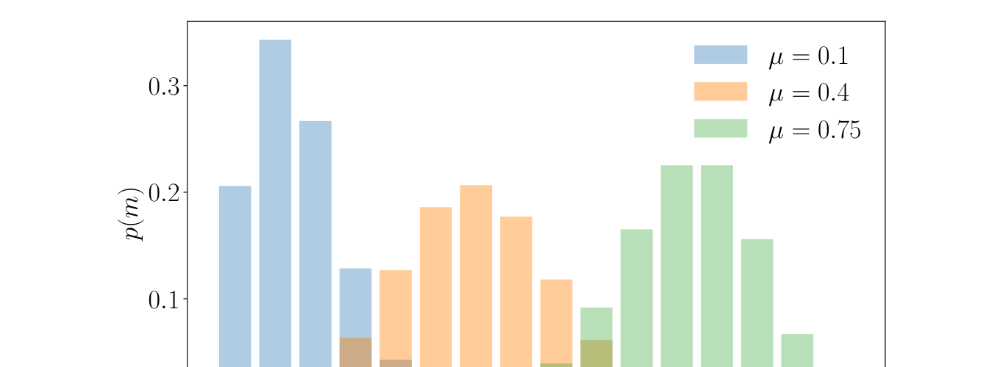
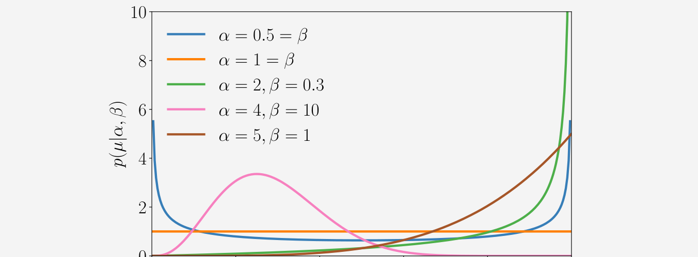

## 6.6 共轭与指数族

我们在统计学教科书中看到的许多“有名字的”概率分布，最初都是为了对特定类型的现象进行建模而发现的。例如，我们在第 6.5 节中已经见到了高斯分布。这些分布之间也存在着复杂的关联 (Leemis and McQueston, 2008)。对于该领域的初学者来说，弄清楚该使用哪种分布可能会令人不知所措。此外，这些分布中有许多是在统计与计算仍依靠纸和笔完成的时代被发现的（“计算机（Computers）”曾经是一种职业名称）。很自然地，我们会问在计算时代哪些概念是有意义的 (Efron and Hastie, 2016)。在上一节中，我们看到当分布为高斯分布时，推断所需的许多运算都可以方便地计算。此时值得回顾一下在机器学习背景下操作概率分布的期望准则：

1. 在应用概率法则（例如贝叶斯定理）时存在某种“封闭性（closure property）”。所谓封闭性，是指应用某种特定运算后返回的对象属于同一类型。
2. 随着我们收集更多数据，我们不需要更多的参数来描述该分布。
3. 由于我们对从数据中学习感兴趣，我们希望参数估计具有良好的性质。

事实证明，被称为 _指数族（exponential family）_ 的一类分布在保持有利的计算和推断性质的同时，提供了恰到好处的通用性平衡。在介绍指数族之前，让我们先了解“有名字的”概率分布中的另外三个成员：伯努利分布（例 6.8）、二项分布（例 6.9）和 Beta 分布（例 6.10）。

> **例 6.8（伯努利分布）**
> 
>  _伯努利分布（Bernoulli distribution）_ 是单个二元随机变量 $ X $（其状态 $ x \in \{0, 1\} $）的分布。它由单个连续参数 $ \mu \in [0, 1] $ 控制，该参数表示 $ X = 1 $ 的概率。伯努利分布 $ \mathrm{Ber}(\mu) $ 定义为：
> $$
> p(x \mid \mu) = \mu^x (1 - \mu)^{1-x}, \quad x \in \{0, 1\}
> \tag{6.92}
> $$
> $$
> \mathbb{E}[x] = \mu
> \tag{6.93}
> $$
> $$
> \mathbb{V}[x] = \mu(1 - \mu)
> \tag{6.94}
> $$
> 其中 $ \mathbb{E}[x] $ 和 $ \mathbb{V}[x] $ 分别是二元随机变量 $ X $ 的均值和方差。
> 
> 可以使用伯努利分布的一个例子是，我们对抛硬币时出现“正面”的概率进行建模。

_备注_ 。上述对伯努利分布的改写（将布尔变量作为数值 0 或 1 并在指数中表示）是机器学习教科书中经常使用的一个技巧。这种技巧的另一次出现是在表示多项分布时。♦

> **例 6.9（二项分布）**
> 
>  _二项分布（Binomial distribution）_ 是伯努利分布在整数分布上的推广（如图 6.10 所示）。具体而言，二项分布可用于描述在一组来自伯努利分布（其中 $ p(X = 1) = \mu \in [0, 1] $）的 $ N $ 个独立样本中观察到 $ m $ 次 $ X = 1 $ 的概率。二项分布 $ \mathrm{Bin}(N, \mu) $ 定义为：
> $$
> p(m \mid N, \mu) = \binom{N}{m} \mu^m (1 - \mu)^{N-m}
> \tag{6.95}
> $$
> $$
> \mathbb{E}[m] = N\mu
> \tag{6.96}
> $$
> $$
> \mathbb{V}[m] = N\mu(1 - \mu)
> \tag{6.97}
> $$
> 其中 $ \mathbb{E}[m] $ 和 $ \mathbb{V}[m] $ 分别是 $ m $ 的均值和方差。
> 
> 可以使用二项分布的一个例子是，如果单次实验中观察到正面的概率为 $ \mu $，我们希望描述在 $ N $ 次抛硬币实验中观察到 $ m $ 次“正面”的概率。

   
  <b>图 6.10 当 μ ∈ {0.1, 0.4, 0.75} 且 N = 15 时的二项分布示例。</b> 

> **例 6.10（Beta 分布）**
> 
> 我们可能希望对有限区间上的连续随机变量进行建模。 _Beta 分布（Beta distribution）_ 是连续随机变量 $ \mu \in [0, 1] $ 上的分布，常用于表示某种二元事件的概率（例如控制伯努利分布的参数）。Beta 分布 $ \mathrm{Beta}(\alpha, \beta) $ 本身（如图 6.11 所示）由两个参数 $ \alpha > 0, \beta > 0 $ 控制，定义为：
> $$
> p(\mu \mid \alpha, \beta) = \frac{\Gamma(\alpha + \beta)}{\Gamma(\alpha)\Gamma(\beta)} \mu^{\alpha-1} (1 - \mu)^{\beta-1}
> \tag{6.98}
> $$
> $$
> \mathbb{E}[\mu] = \frac{\alpha}{\alpha + \beta}, \quad \mathbb{V}[\mu] = \frac{\alpha\beta}{(\alpha + \beta)^2(\alpha + \beta + 1)}
> \tag{6.99}
> $$
> 其中 $ \Gamma(\cdot) $ 是 Gamma 函数，定义为：
> $$
> \Gamma(t) := \int_0^\infty x^{t-1} \exp(-x)\,\mathrm{d}x, \quad t > 0
> \tag{6.100}
> $$
> $$
> \Gamma(t + 1) = t\Gamma(t)
> \tag{6.101}
> $$
> 注意式 (6.98) 中的 Gamma 函数分式起到了对 Beta 分布进行归一化的作用。

   
  <b>图 6.11 α 和 β 取不同值时的 Beta 分布示例。</b> 

直观地说，$ \alpha $ 将概率质量推向 1，而 $ \beta $ 将概率质量推向 0。存在一些特殊情形 (Murphy, 2012)：
- 当 $ \alpha = 1 = \beta $ 时，我们得到均匀分布 $ \mathcal{U}[0, 1] $。
- 当 $ \alpha, \beta < 1 $ 时，我们得到在 0 和 1 处有尖峰的双峰分布。
- 当 $ \alpha, \beta > 1 $ 时，该分布是单峰的。
- 当 $ \alpha, \beta > 1 $ 且 $ \alpha = \beta $ 时，该分布是单峰且对称的，并集中在区间 $ [0, 1] $ 的中心，即众数/均值位于 $ \frac{1}{2} $。

_备注_ 。存在一整套“有名字的”分布族，它们以不同方式相互关联 (Leemis and McQueston, 2008)。值得铭记的是，每个有名字的分布都是为了特定原因而创建的，但可能有其他应用。了解特定分布创立背后的原因，往往能使我们深入理解如何最好地使用它。我们引入前面的三个分布，是为了能够说明共轭性（第 6.6.1 节）和指数族（第 6.6.3 节）的概念。♦

---

### 6.6.1 共轭性

根据贝叶斯定理 (6.23)，后验概率正比于先验概率与似然的乘积。先验的设定可能会很棘手，原因有二：首先，先验应当在我们看到任何数据之前概括我们对问题的先验知识，这往往难以描述；其次，通常不可能解析地计算后验分布。然而，存在一些在计算上十分方便的先验：共轭先验。

**定义 6.13**（共轭先验）。如果后验分布与先验分布具有相同的形式/类型，则称该先验分布关于似然函数是 _共轭的（conjugate）_ ，此时该先验称为 _共轭先验（conjugate prior）_ 。

共轭性特别方便，因为我们可以通过代数方式更新先验分布的参数来计算后验分布。

_备注_ 。当考虑概率分布的几何性质时，共轭先验保持了与似然相同的距离结构 (Agarwal and Daumé III, 2010)。♦

为了引入共轭先验的具体示例，我们在例 6.11 中描述了二项分布（定义在离散随机变量上）和 Beta 分布（定义在连续随机变量上）。

> **例 6.11（Beta-二项分布共轭性）**
> 
> 考虑二项随机变量 $ x \sim \mathrm{Bin}(N, \mu) $，其中
> $$
> p(x \mid N, \mu) = \binom{N}{x} \mu^x (1 - \mu)^{N-x}, \quad x = 0, 1, \ldots, N
> \tag{6.102}
> $$
> 是在 $ N $ 次抛硬币中出现 $ x $ 次“正面”的概率，其中 $ \mu $ 是出现“正面”的概率。我们在参数 $ \mu $ 上引入一个 Beta 先验，即 $ \mu \sim \mathrm{Beta}(\alpha, \beta) $，其中
> $$
> p(\mu \mid \alpha, \beta) = \frac{\Gamma(\alpha + \beta)}{\Gamma(\alpha)\Gamma(\beta)} \mu^{\alpha-1} (1 - \mu)^{\beta-1}
> \tag{6.103}
> $$
> 如果我们现在观测到某个结果 $ x = h $，即在 $ N $ 次抛硬币中看到 $ h $ 次正面，我们计算关于 $ \mu $ 的后验分布为：
> $$
> p(\mu \mid x = h, N, \alpha, \beta) \propto p(x \mid N, \mu) p(\mu \mid \alpha, \beta)
> \tag{6.104a}
> $$
> $$
> \propto \mu^h (1 - \mu)^{(N-h)} \mu^{\alpha-1} (1 - \mu)^{\beta-1}
> \tag{6.104b}
> $$
> $$
> = \mu^{h+\alpha-1} (1 - \mu)^{(N-h)+\beta-1}
> \tag{6.104c}
> $$
> $$
> \propto \mathrm{Beta}(h + \alpha, N - h + \beta)
> \tag{6.104d}
> $$
> 即后验分布与先验一样也是 Beta 分布，也就是说，Beta 先验对于二项似然函数中的参数 $ \mu $ 是共轭的。

在下面的例子中，我们将推导一个与 Beta-二项分布共轭性类似的结果。这里我们将展示 Beta 分布是伯努利分布的共轭先验。

> **例 6.12（Beta-伯努利分布共轭性）**
> 
> 设 $ x \in \{0, 1\} $ 服从参数为 $ \theta \in [0, 1] $ 的伯努利分布，即 $ p(x = 1 \mid \theta) = \theta $。这也可以表示为 $ p(x \mid \theta) = \theta^x (1 - \theta)^{1-x} $。设 $ \theta $ 服从参数为 $ \alpha, \beta $ 的 Beta 分布，即 $ p(\theta \mid \alpha, \beta) \propto \theta^{\alpha-1} (1 - \theta)^{\beta-1} $。
> 
> 将 Beta 分布与伯努利分布相乘，我们得到：
> $$
> p(\theta \mid x, \alpha, \beta) = p(x \mid \theta) p(\theta \mid \alpha, \beta)
> \tag{6.105a}
> $$
> $$
> \propto \theta^x (1 - \theta)^{1-x} \theta^{\alpha-1} (1 - \theta)^{\beta-1}
> \tag{6.105b}
> $$
> $$
> = \theta^{\alpha+x-1} (1 - \theta)^{\beta+(1-x)-1}
> \tag{6.105c}
> $$
> $$
> \propto p(\theta \mid \alpha + x, \beta + (1 - x))
> \tag{6.105d}
> $$
> 最后一行是参数为 $ (\alpha + x, \beta + (1 - x)) $ 的 Beta 分布。

表 6.2 列出了概率建模中常用的几种标准似然函数参数的共轭先验示例。诸如多项分布、逆 Gamma 分布、逆 Wishart 分布和 Dirichlet 分布等，均可在任何统计学教材中找到，并在 Bishop (2006) 等著作中有所描述。

| 似然 | 共轭先验 | 后验 |
| :--- | :--- | :--- |
| 伯努利分布 | Beta 分布 | Beta 分布 |
| 二项分布 | Beta 分布 | Beta 分布 |
| 高斯分布 | 高斯分布 / 逆 Gamma 分布 | 高斯分布 / 逆 Gamma 分布 |
| 高斯分布 | 高斯分布 / 逆 Wishart 分布 | 高斯分布 / 逆 Wishart 分布 |
| 多项分布 | Dirichlet 分布 | Dirichlet 分布 |

**表 6.2** 常见似然函数的共轭先验示例。

_旁注_ 。Gamma 先验是单变量高斯似然中精度（方差的倒数）的共轭先验，而 Wishart 先验是多元高斯似然中精度矩阵（协方差矩阵的逆）的共轭先验。

Beta 分布是二项似然和伯努利似然中参数 $ \mu $ 的共轭先验。对于高斯似然函数，我们可以在均值上放置共轭高斯先验。高斯似然在表中出现两次的原因是我们需要区分单变量和多元情形。在单变量（标量）情形下，逆 Gamma 分布是方差的共轭先验。在多元情形下，我们使用共轭逆 Wishart 分布作为协方差矩阵的先验。Dirichlet 分布是多项似然函数的共轭先验。更多详细信息请参阅 Bishop (2006)。

---

### 6.6.2 充分统计量

回顾一下，随机变量的统计量是该随机变量的确定性函数。例如，如果 $ \boldsymbol x = [x_1, \ldots, x_N]^\top $ 是单变量高斯随机变量构成的向量，即 $ x_n \sim \mathcal{N}(\mu, \sigma^2) $，那么样本均值 $ \hat{\mu} = \frac{1}{N}(x_1 + \cdots + x_N) $ 就是一个统计量。Ronald Fisher 爵士发现了 _充分统计量（sufficient statistics）_ 的概念：即存在某些统计量，它们包含了从所考虑分布对应的数据中可以推断出的所有可用信息。换言之，充分统计量携带了对总体进行推断所需的全部信息，也就是说，它们是足以代表该分布的统计量。

对于由 $ \boldsymbol \theta $ 参数化的一族分布，设 $ X $ 是在未知参数 $ \boldsymbol \theta_0 $ 下具有分布 $ p(x \mid \boldsymbol \theta_0) $ 的随机变量。如果统计量向量 $ \boldsymbol \phi(x) $ 包含了关于 $ \boldsymbol \theta_0 $ 的所有可能信息，则称其为 $ \boldsymbol \theta_0 $ 的充分统计量。更形式化地说明“包含所有可能信息”，这意味着给定 $ \boldsymbol \theta $ 时 $ x $ 的概率可以分解为一个不依赖于 $ \boldsymbol \theta $ 的部分，以及一个仅通过 $ \boldsymbol \phi(x) $ 依赖于 $ \boldsymbol \theta $ 的部分。Fisher-Neyman 分解定理形式化了这一概念，我们在定理 6.14 中给出其表述（不附证明）。

**定理 6.14**（Fisher-Neyman）。[Lehmann and Casella (1998) 中的定理 6.5] 设 $ X $ 具有概率密度函数 $ p(x \mid \boldsymbol \theta) $。则统计量 $ \boldsymbol \phi(x) $ 对于 $ \boldsymbol \theta $ 是充分的，当且仅当 $ p(x \mid \boldsymbol \theta) $ 可以写成如下形式：
$$
p(x \mid \boldsymbol \theta) = h(x) g_{\boldsymbol \theta}(\boldsymbol \phi(x))
\tag{6.106}
$$
其中 $ h(x) $ 是独立于 $ \boldsymbol \theta $ 的分布，$ g_{\boldsymbol \theta} $ 仅通过充分统计量 $ \boldsymbol \phi(x) $ 捕获对 $ \boldsymbol \theta $ 的所有依赖。

如果 $ p(x \mid \boldsymbol \theta) $ 不依赖于 $ \boldsymbol \theta $，那么对于任意函数 $ \boldsymbol \phi $，$ \boldsymbol \phi(x) $ 平凡地是一个充分统计量。更有趣的情形是 $ p(x \mid \boldsymbol \theta) $ 仅依赖于 $ \boldsymbol \phi(x) $ 而不依赖于 $ x $ 本身。在这种情形下，$ \boldsymbol \phi(x) $ 是 $ \boldsymbol \theta $ 的充分统计量。

在机器学习中，我们考虑来自某个分布的有限数量的样本。人们可以想象，对于简单的分布（例如例 6.8 中的伯努利分布），我们只需要少量的样本即可估计该分布的参数。我们也可以考虑相反的问题：如果我们有一组数据（来自未知分布的样本），哪种分布能给出最佳拟合？一个自然会问的问题是：随着我们观察到更多的数据，我们是否需要更多的参数 $ \boldsymbol \theta $ 来描述该分布？事实证明，通常情况下答案是肯定的，这在非参数统计学中得到了研究 (Wasserman, 2007)。相反的问题是考虑哪类分布具有有限维充分统计量，即描述它们所需的参数数量不会任意增加。答案就是指数族分布，将在下一节中进行介绍。

---

### 6.6.3 指数族

在考虑（离散或连续随机变量的）分布时，我们可以有三个可能的抽象层次。在第一层次（谱系中最具体的一端），我们有一个具有固定参数的特定具名分布，例如均值为零、方差为 1 的单变量高斯分布 $ \mathcal{N}(0, 1) $。在机器学习中，我们经常使用第二层次的抽象，即固定参数形式（单变量高斯分布）并从数据中推断参数。例如，我们假设一个具有未知均值 $ \mu $ 和未知方差 $ \sigma^2 $ 的单变量高斯分布 $ \mathcal{N}(\mu, \sigma^2) $，并使用极大似然拟合来确定最佳参数 $ (\mu, \sigma^2) $。在第 9 章考虑线性回归时，我们将看到这方面的一个示例。第三个抽象层次是考虑分布族，而在本书中，我们考虑指数族。单变量高斯分布是指数族成员的一个例子。许多广泛使用的统计模型（包括表 6.2 中的所有“具名”模型）都是指数族的成员。它们都可以统一为一个概念 (Brown, 1986)。

_备注_ 。简短的历史掌故：如同数学和科学中的许多概念一样，指数族是由不同的研究人员在同一时间独立发现的。在 1935–1936 年间，塔斯马尼亚的 Edwin Pitman、巴黎的 Georges Darmois 以及纽约的 Bernard Koopman 独立证明了：在重复独立抽样下，指数族是唯一享有有限维充分统计量的分布族 (Lehmann and Casella, 1998)。♦

由 $ \boldsymbol \theta \in \mathbb{R}^D $ 参数化的 _指数族（exponential family）_ 是一族具有如下形式的概率分布：
$$
p(\boldsymbol x \mid \boldsymbol \theta) = h(\boldsymbol x) \exp \left( \langle \boldsymbol \theta, \boldsymbol \phi(\boldsymbol x) \rangle - A(\boldsymbol \theta) \right)
\tag{6.107}
$$
其中 $ \boldsymbol \phi(\boldsymbol x) $ 是充分统计量向量。通常，式 (6.107) 中可以使用任意内积（第 3.2 节），为了具体起见，我们在此使用标准点积（$ \langle \boldsymbol \theta, \boldsymbol \phi(\boldsymbol x) \rangle = \boldsymbol \theta^\top \boldsymbol \phi(\boldsymbol x) $）。注意，指数族的形式本质上是 Fisher-Neyman 定理（定理 6.14）中 $ g_{\boldsymbol \theta}(\boldsymbol \phi(\boldsymbol x)) $ 的一种特定表达形式。

通过在充分统计量向量 $ \boldsymbol \phi(\boldsymbol x) $ 中添加另一项（$ \log h(\boldsymbol x) $），并约束对应的参数 $ \theta_0 = 1 $，因子 $ h(\boldsymbol x) $ 可以被吸收到点积项中。项 $ A(\boldsymbol \theta) $ 是确保分布求和或积分为 1 的归一化常数，称为 _对数配分函数（log-partition function）_ 。忽略这两项并将指数族视为具有如下形式的分布，可以获得对指数族良好的直观理解：
$$
p(\boldsymbol x \mid \boldsymbol \theta) \propto \exp \left( \boldsymbol \theta^\top \boldsymbol \phi(\boldsymbol x) \right)
\tag{6.108}
$$
对于这种参数化形式，参数 $ \boldsymbol \theta $ 称为 _自然参数（natural parameters）_ 。乍一看，指数族似乎只是在点积结果上加上指数函数的一种平淡无奇的变换。然而，基于我们可以将有关数据的信息捕获在 $ \boldsymbol \phi(\boldsymbol x) $ 中这一事实，它带来了许多便于建模和高效计算的深远意义。

> **例 6.13（作为指数族的高斯分布）**
> 
> 考虑单变量高斯分布 $ \mathcal{N}(\mu, \sigma^2) $。令 $ \boldsymbol \phi(x) = \begin{bmatrix} x \\ x^2 \end{bmatrix} $。利用指数族的定义，
> $$
> p(x \mid \boldsymbol \theta) \propto \exp(\theta_1 x + \theta_2 x^2)
> \tag{6.109}
> $$
> 令
> $$
> \boldsymbol \theta = \begin{bmatrix} \frac{\mu}{\sigma^2} \\ -\frac{1}{2\sigma^2} \end{bmatrix}
> \tag{6.110}
> $$
> 代入式 (6.109)，可得：
> $$
> p(x \mid \boldsymbol \theta) \propto \exp \left( \frac{\mu x}{\sigma^2} - \frac{x^2}{2\sigma^2} \right) \propto \exp \left( -\frac{1}{2\sigma^2} (x - \mu)^2 \right)
> \tag{6.111}
> $$
> 因此，单变量高斯分布是指数族的成员，其充分统计量为 $ \boldsymbol \phi(x) = \begin{bmatrix} x \\ x^2 \end{bmatrix} $，自然参数由式 (6.110) 中的 $ \boldsymbol \theta $ 给出。

> **例 6.14（作为指数族的伯努利分布）**
> 
> 回顾例 6.8 中的伯努利分布：
> $$
> p(x \mid \mu) = \mu^x (1 - \mu)^{1-x}, \quad x \in \{0, 1\}
> \tag{6.112}
> $$
> 这可以写成指数族形式：
> $$
> p(x \mid \mu) = \exp \left( \log \left( \mu^x (1 - \mu)^{1-x} \right) \right)
> \tag{6.113a}
> $$
> $$
> = \exp [x \log \mu + (1 - x) \log(1 - \mu)]
> \tag{6.113b}
> $$
> $$
> = \exp [x \log \mu - x \log(1 - \mu) + \log(1 - \mu)]
> \tag{6.113c}
> $$
> $$
> = \exp \left[ x \log \frac{\mu}{1 - \mu} + \log(1 - \mu) \right]
> \tag{6.113d}
> $$
> 通过观察以下对应关系，最后一行 (6.113d) 可以被识别为指数族形式 (6.107)：
> $$
> h(x) = 1
> \tag{6.114}
> $$
> $$
> \theta = \log \frac{\mu}{1 - \mu}
> \tag{6.115}
> $$
> $$
> \phi(x) = x
> \tag{6.116}
> $$
> $$
> A(\theta) = -\log(1 - \mu) = \log(1 + \exp(\theta))
> \tag{6.117}
> $$
> $ \theta $ 与 $ \mu $ 之间的关系是可逆的，使得：
> $$
> \mu = \frac{1}{1 + \exp(-\theta)}
> \tag{6.118}
> $$
> 式 (6.118) 的关系用于获得式 (6.117) 最右侧的等式。

_备注_ 。原始伯努利参数 $ \mu $ 与自然参数 $ \theta $ 之间的关系被称为 _Sigmoid 函数（sigmoid function）_ 或 _Logistic 函数（logistic function）_ 。观察到 $ \mu \in (0, 1) $ 但 $ \theta \in \mathbb{R} $，因此 Sigmoid 函数将实数值压缩到区间 $ (0, 1) $ 内。这一性质在机器学习中非常有用，例如它被用于 Logistic 回归（Bishop, 2006，第 4.3.2 节），以及作为神经网络中的非线性激活函数（Goodfellow et al., 2016，第 6 章）。♦

通常情况下，如何找到某个特定分布（例如表 6.2 中的分布）的共轭分布的参数形式并不显而易见。指数族提供了一种寻找共轭分布对的便捷途径。考虑随机变量 $ X $ 是指数族 (6.107) 的成员：
$$
p(x \mid \boldsymbol \theta) = h(x) \exp (\langle \boldsymbol \theta, \boldsymbol \phi(x) \rangle - A(\boldsymbol \theta))
\tag{6.119}
$$
指数族的每个成员都有一个共轭先验 (Brown, 1986)：
$$
p(\boldsymbol \theta \mid \boldsymbol \gamma) = h_c(\boldsymbol \theta) \exp \left( \left\langle \begin{bmatrix} \boldsymbol \gamma_1 \\ \gamma_2 \end{bmatrix}, \begin{bmatrix} \boldsymbol \theta \\ -A(\boldsymbol \theta) \end{bmatrix} \right\rangle - A_c(\boldsymbol \gamma) \right)
\tag{6.120}
$$
其中 $ \boldsymbol \gamma = \begin{bmatrix} \boldsymbol \gamma_1 \\ \gamma_2 \end{bmatrix} $ 的维度为 $ \mathrm{dim}(\boldsymbol \theta) + 1 $。共轭先验的充分统计量为 $ \begin{bmatrix} \boldsymbol \theta \\ -A(\boldsymbol \theta) \end{bmatrix} $。利用指数族共轭先验通用形式的知识，我们可以推导出对应于特定分布的共轭先验函数形式。

> **例 6.15**
> 
> 回顾伯努利分布的指数族形式 (6.113d)：
> $$
> p(x \mid \mu) = \exp \left( x \log \frac{\mu}{1 - \mu} + \log(1 - \mu) \right)
> \tag{6.121}
> $$
> 其标准共轭先验的形式为：
> $$
> p(\mu \mid \alpha, \beta) = \frac{\mu}{1 - \mu} \exp \left( \alpha \log \frac{\mu}{1 - \mu} + (\beta + \alpha) \log(1 - \mu) - A_c(\boldsymbol \gamma) \right)
> \tag{6.122}
> $$
> 其中我们定义了 $ \boldsymbol \gamma := [\alpha, \beta + \alpha]^\top $ 以及 $ h_c(\mu) := \mu / (1 - \mu) $。式 (6.122) 随后可化简为：
> $$
> p(\mu \mid \alpha, \beta) = \exp \left[ (\alpha - 1) \log \mu + (\beta - 1) \log(1 - \mu) - A_c(\alpha, \beta) \right]
> \tag{6.123}
> $$
> 将其转化为非指数族形式，得到：
> $$
> p(\mu \mid \alpha, \beta) \propto \mu^{\alpha - 1} (1 - \mu)^{\beta - 1}
> \tag{6.124}
> $$
> 我们可将其识别为 Beta 分布 (6.98)。在例 6.12 中，我们假设了 Beta 分布是伯努利分布的共轭先验，并证明了它确实是共轭先验。而在本例中，我们通过考察伯努利分布在指数族形式下的标准共轭先验，推导出了 Beta 分布的形式。

如前一节所述，引入指数族的主要动机在于它们拥有有限维的充分统计量。此外，共轭分布易于写出，且共轭分布同样来自指数族。从推断的角度来看，极大似然估计表现良好，因为充分统计量的经验估计正是充分统计量总体值的最优估计（回顾高斯分布的均值和协方差）。从优化的角度来看，对数似然函数是凹的，从而可以使用高效的优化方法（第 7 章）。
