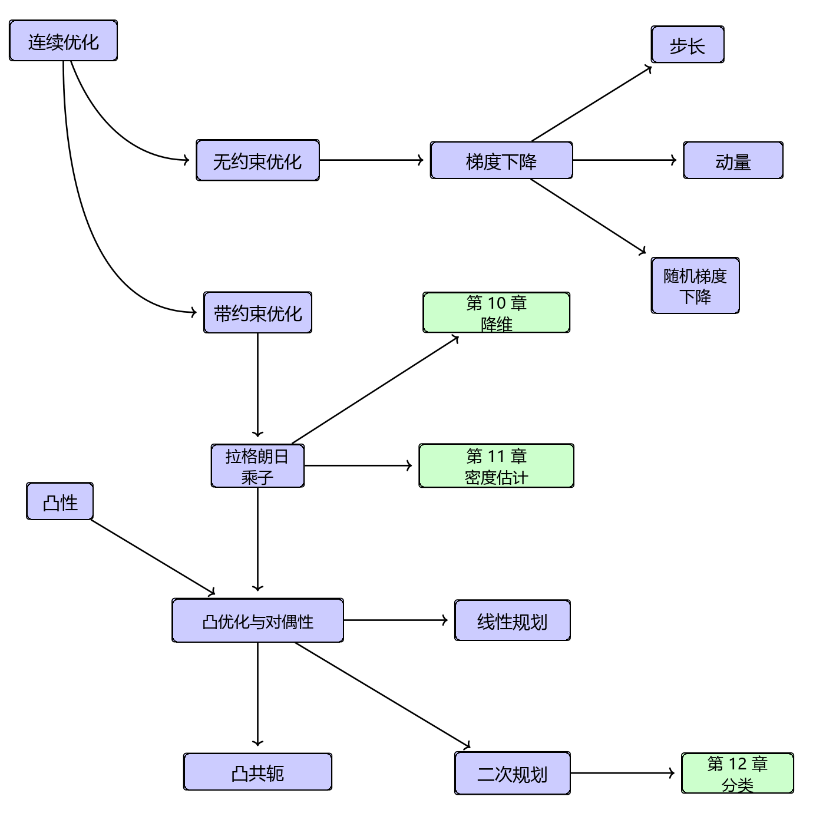
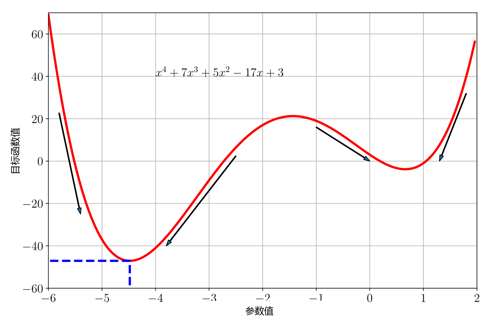

# 7 连续优化

由于机器学习算法最终在计算机上实现，其数学公式通常表示为数值优化方法。本章描述了用于训练机器学习模型的基本数值方法。训练机器学习模型往往归结为寻找一组良好的参数。“良好”的概念由目标函数或概率模型决定，我们将在本书第二部分看到相关示例。给定目标函数，寻找最优值是通过优化算法完成的。

由于我们考虑的数据和模型位于 $ \mathbb{R}^D $ 中，我们面对的优化问题是 _连续优化（continuous optimization）_ 问题，这与针对离散变量的组合优化问题截然不同。

本章涵盖连续优化的两个主要分支（图 7.1）：无约束优化与带约束优化。在本章中，我们将假定目标函数是可微的（参见第 5 章），因此我们在空间中的每个位置都可以利用梯度来帮助我们寻找最优值。按照惯例，机器学习中的大多数目标函数都是为了最小化而设计的，即最优值就是最小值。在几何直观上，寻找最优值就像寻找目标函数的山谷底，而梯度总是指向“上坡”方向。优化的基本思想是沿着“下坡”方向（即负梯度方向）移动，以期找到最深的点。对于无约束优化，这是我们唯一需要的核心概念，但涉及到若干设计选择，我们将在第 7.1 节中进行讨论。对于带约束优化，我们需要引入其他概念来处理约束（第 7.2 节）。我们还将介绍一类特殊的问题——凸优化问题（第 7.3 节），在凸优化中我们可以确切保证找到全局最优解。

   
  <b>图 7.1 本章介绍的与优化相关概念的思维导图。包含两大核心思想：梯度下降与凸优化。</b> 

考虑图 7.2 中所示的函数。该函数在 $ x \approx -4.5 $ 处具有一个全局最小值，函数值约为 $ -47 $。由于该函数是“平滑”的，梯度可以通过指明我们应该向右还是向左迈步来帮助寻找最小值。这假定我们处于正确的“碗”中，因为在 $ x \approx 0.7 $ 处还存在另一个局部最小值。回想一下，我们可以通过计算函数的导数并令其为零来求解函数的所有驻点。对于多项式函数：
$$ \ell(x) = x^4 + 7x^3 + 5x^2 - 17x + 3 \tag{7.1} $$
我们得到对应的梯度（一阶导数）为：
$$ \frac{\mathrm{d}\ell(x)}{\mathrm{d}x} = 4x^3 + 21x^2 + 10x - 17 \tag{7.2} $$

_提示_ ：驻点是导数的实根，即梯度为零的点。

   
  <b>图 7.2 目标函数示例。负梯度方向由箭头指示，全局最小值由蓝色虚线指示。</b> 

由于式 (7.2) 是一个三次方程，令其为零时通常具有三个解。在示例中，其中两个是极小值点，一个是极大值点（在 $ x \approx -1.4 $ 附近）。为了检验驻点是极小值还是极大值，我们需要求二阶导数，并检验驻点处的二阶导数是正还是负。在我们的情形中，二阶导数为：
$$ \frac{\mathrm{d}^2\ell(x)}{\mathrm{d}x^2} = 12x^2 + 42x + 10 \tag{7.3} $$
将目测估计值 $ x = -4.5, -1.4, 0.7 $ 代入，我们会观察到正如预期的那样，中间点对应于极大值（$ \frac{\mathrm{d}^2\ell(x)}{\mathrm{d}x^2} < 0 $），而其他两个驻点对应于极小值。

注意到在前面的讨论中我们避免了解析求解 $ x $ 的确切值，尽管对于这类低阶多项式我们确实能够做到这一点。但在一般情况下，根据阿贝尔-鲁菲尼定理（Abel–Ruffini theorem），对于 5 次或更高阶的多项式通常不存在代数解（Abel, 1826）。在一般高维问题中我们无法找到解析解，因此需要从某个初始值（例如 $ x_0 = -6 $）出发，沿着负梯度方向进行迭代。负梯度表明我们应该向右移动，但没有指明移动多远（这称为步长）。此外，如果从右侧开始（例如 $ x_0 = 0 $），负梯度将引导我们走向错误的局部极小值。图 7.2 说明了对于 $ x > -1 $ 的情况，负梯度指向右侧的极小值，其目标函数值明显更大。

在第 7.3 节中，我们将学习一类称为凸函数的函数，这类函数不会对优化算法的起始点产生这种棘手的敏感依赖性。对于凸函数，所有局部极小值都是全局最小值。事实证明，许多机器学习目标函数都被专门设计为凸函数，我们将在第 12 章中看到具体示例。

到目前为止本章的讨论主要围绕一维函数展开，借此我们能够直观可视化梯度、下降方向和最优值等概念。在接下来的小节中，我们将把相同的思想推广到高维情形。
