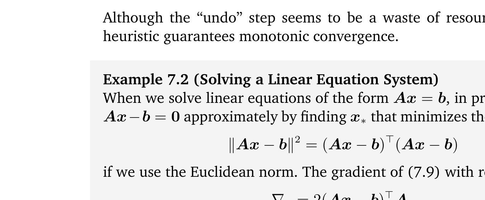

## 7.1 使用梯度下降的优化

我们现在考虑求解实值函数的极小值问题：
$$ \min_{\boldsymbol x} f(\boldsymbol x) \tag{7.4} $$
其中 $ f : \mathbb{R}^d \to \mathbb{R} $ 是刻画当前机器学习问题的目标函数。我们假定函数 $ f $ 是可微的，并且无法求出解析闭式解。

_梯度下降（gradient descent）_ 是一种一阶优化算法。为了使用梯度下降寻找函数的局部极小值，迭代步长与函数在当前点处的负梯度成比例。回想第 5.1 节，梯度指向最陡上升的方向。另一个有用的几何直觉是考虑函数的等值线集合（对于某个常数 $ c \in \mathbb{R} $ 满足 $ f(\boldsymbol x) = c $ 的曲线），称为等高线。梯度方向始终与目标函数的等高线正交。

让我们考虑多元函数。想象一个由函数 $ f(\boldsymbol x) $ 描述的曲面，一个球从特定位置 $ \boldsymbol x_0 $ 开始释放。当小球被释放时，它将沿着最陡下降的方向滚下山坡。梯度下降利用了这样一个性质：如果从 $ \boldsymbol x_0 $ 出发沿着 $ f $ 在 $ \boldsymbol x_0 $ 处的负梯度方向 $ -(\nabla f(\boldsymbol x_0))^\top $ 移动，函数值 $ f(\boldsymbol x_0) $ 下降最快。在本书中，我们假定函数是可微的。那么，对于较小的步长 $ \gamma \geqslant 0 $，若：
$$ \boldsymbol x_1 = \boldsymbol x_0 - \gamma (\nabla f(\boldsymbol x_0))^\top \tag{7.5} $$
则必有 $ f(\boldsymbol x_1) \leqslant f(\boldsymbol x_0) $。请注意，我们在梯度上使用了转置，因为根据本书的约定，梯度为行向量，转置后才能与列向量的维度相匹配。

这一观察使我们能够定义一个简单的梯度下降算法：如果我们希望寻找函数 $ f : \mathbb{R}^n \to \mathbb{R}, \boldsymbol x \mapsto f(\boldsymbol x) $ 的局部最优点 $ f(\boldsymbol x_*) $，我们从希望优化的参数的初始猜测 $ \boldsymbol x_0 $ 开始，然后按照如下规则迭代：
$$ \boldsymbol x_{i+1} = \boldsymbol x_i - \gamma_i (\nabla f(\boldsymbol x_i))^\top \tag{7.6} $$
对于合适的步长 $ \gamma_i $，序列 $ f(\boldsymbol x_0) \geqslant f(\boldsymbol x_1) \geqslant \cdots $ 收敛至局部极小值。

> **例 7.1**
> 
> 考虑二维二次函数：
> $$ f\left(\begin{bmatrix} x_1 \\ x_2 \end{bmatrix}\right) = \frac{1}{2} \begin{bmatrix} x_1 \\ x_2 \end{bmatrix}^\top \begin{bmatrix} 2 & 1 \\ 1 & 20 \end{bmatrix} \begin{bmatrix} x_1 \\ x_2 \end{bmatrix} - \begin{bmatrix} 5 \\ 3 \end{bmatrix}^\top \begin{bmatrix} x_1 \\ x_2 \end{bmatrix} \tag{7.7} $$
> 其梯度为：
> $$ \nabla f\left(\begin{bmatrix} x_1 \\ x_2 \end{bmatrix}\right) = \begin{bmatrix} x_1 \\ x_2 \end{bmatrix}^\top \begin{bmatrix} 2 & 1 \\ 1 & 20 \end{bmatrix} - \begin{bmatrix} 5 & 3 \end{bmatrix} \tag{7.8} $$
> 从初始位置 $ \boldsymbol x_0 = [-3, -1]^\top $ 开始，我们反复应用式 (7.6) 来获得收敛到极小值的一系列估计（如图 7.3 所示）。从图中以及将 $ \boldsymbol x_0 $ 代入式 (7.8)（取 $ \gamma = 0.085 $）都可以看出，在 $ \boldsymbol x_0 $ 处的负梯度指向东北方向，得到 $ \boldsymbol x_1 = [-1.98, 1.21]^\top $。重复这一迭代过程，我们得到 $ \boldsymbol x_2 = [-1.32, -0.42]^\top $，以此类推。

   
  <b>图 7.3 二维二次曲面上的梯度下降（以热图展示）。</b> 

_备注_ 。在接近极小值时，梯度下降的速度可能相对较慢：其渐近收敛速度逊色于许多其他优化方法。继续使用小球滚下山坡的比喻，当优化曲面是一个狭长的山谷时，该问题是病态的（ill-conditioned）（Trefethen and Bau III, 1997）。对于病态凸问题，随着梯度方向几乎与通往极小值点的最短路径正交，梯度下降会呈现越来越严重的“之字形”（zigzag）振荡震荡现象；参见图 7.3。♦

---

### 7.1.1 步长

如前所述，在梯度下降中选择合适的步长至关重要。步长通常也被称为 _学习率（learning rate）_ 。如果步长太小，梯度下降的进展可能极其缓慢；如果步长选得过大，梯度下降可能会发生超调（overshoot），导致算法无法收敛甚至发散。我们将在下一小节讨论动量（momentum）的使用，这是一种能够平滑梯度更新的不规则跳跃并抑制震荡的有效方法。

自适应梯度方法在每次迭代时根据函数的局部性质重新缩放步长。存在两个简单的启发式准则（Toussaint, 2012）：
- 当单步梯度更新后函数值增加时，说明步长过大：撤销该步更新并减小步长。
- 当函数值减少时，步长原本可以更大：尝试增加步长。

虽然“撤销”操作看似浪费了计算资源，但采用该启发式法则可以从理论上保证单调收敛。

> **例 7.2（求解线性方程组）**
> 
> 当我们求解形如 $ \boldsymbol A \boldsymbol x = \boldsymbol b $ 的线性方程组时，在实践中我们通过寻找使平方误差最小化的 $ \boldsymbol x_* $ 来近似求解：
> $$ \|\boldsymbol A \boldsymbol x - \boldsymbol b\|^2 = (\boldsymbol A \boldsymbol x - \boldsymbol b)^\top (\boldsymbol A \boldsymbol x - \boldsymbol b) \tag{7.9} $$
> 式 (7.9) 关于 $ \boldsymbol x $ 的梯度为：
> $$ \nabla_{\boldsymbol x} = 2(\boldsymbol A \boldsymbol x - \boldsymbol b)^\top \boldsymbol A \tag{7.10} $$
> 我们可以将此梯度直接应用于梯度下降算法中。然而，对于这个特殊的线性最小二乘情形，令梯度为零实际上可以直接解出解析闭式解。我们将在第 9 章深入讨论最小二乘问题的求解。

_备注_ 。当应用于线性方程组 $ \boldsymbol A \boldsymbol x = \boldsymbol b $ 时，梯度下降的收敛速度可能很慢。梯度下降的收敛速度取决于矩阵 $ \boldsymbol A $ 的 _条件数（condition number）_ ：
$$ \kappa = \frac{\sigma_{\max}(\boldsymbol A)}{\sigma_{\min}(\boldsymbol A)} $$
即 $ \boldsymbol A $ 的最大奇异值与最小奇异值之比（参见第 4.5 节）。条件数本质上度量了曲率最大方向与曲率最小方向的比率，这恰好对应于病态问题就像狭长山谷的比喻：它们在一个方向上高度弯曲，而在另一个方向上极其平坦。此时与其直接求解 $ \boldsymbol A \boldsymbol x = \boldsymbol b $，不如求解预条件方程 $ \boldsymbol P^{-1}(\boldsymbol A \boldsymbol x - \boldsymbol b) = \boldsymbol 0 $，其中 $ \boldsymbol P $ 称为 _预条件子（preconditioner）_ 。其目标是设计 $ \boldsymbol P^{-1} $ 使得 $ \boldsymbol P^{-1} \boldsymbol A $ 拥有显著改善的条件数，同时 $ \boldsymbol P^{-1} $ 易于计算。♦

---

### 7.1.2 带动量的梯度下降

如图 7.3 所示，如果优化曲面的曲率使得某些区域尺度极不均衡，梯度下降的收敛速度可能会非常缓慢。曲率导致梯度下降步在峡谷的两侧峭壁之间来回跳跃，仅以微小的步伐向极值点推进。改善收敛性的一种著名技巧是赋予梯度下降一定的“记忆能力”。

_带动量的梯度下降（gradient descent with momentum）_ （Rumelhart et al., 1986）引入了一个额外项来记忆前一次迭代发生的情况。这种记忆机制能够抑制振荡并平滑梯度更新轨迹。继续使用小球比喻，动量项模拟了具有较大质量的沉重铁球在滚动时不愿轻易改变行进方向的物理惯性。其思想是借助带有记忆的梯度更新来实现指数移动平均。基于动量的方法记录每次迭代 $ i $ 的更新量 $ \Delta \boldsymbol x_i $，并将下一次更新确定为当前梯度与先前梯度的线性组合：
$$ \boldsymbol x_{i+1} = \boldsymbol x_i - \gamma_i (\nabla f(\boldsymbol x_i))^\top + \alpha \Delta \boldsymbol x_i \tag{7.11} $$
$$ \Delta \boldsymbol x_i = \boldsymbol x_i - \boldsymbol x_{i-1} = \alpha \Delta \boldsymbol x_{i-1} - \gamma_{i-1} (\nabla f(\boldsymbol x_{i-1}))^\top \tag{7.12} $$
其中 $ \alpha \in [0, 1] $。有时我们仅能近似获知梯度，在这些情形下动量项非常有用，因为它能平均掉梯度的随机噪声估计。

---

### 7.1.3 随机梯度下降

精确计算整个数据集上的完整梯度可能极其耗时。然而，通常可以找到一种计算成本低廉的“廉价”梯度近似。只要近似梯度的大致方向与真实梯度一致，该近似仍然非常有效。

_随机梯度下降（stochastic gradient descent, SGD）_ 是一种针对表示为可微函数之和的目标函数进行最小化的随机近似优化算法。这里的“随机”是指我们承认无法精确获知真实梯度，而只掌握其带噪声的近似。通过对近似梯度的概率分布施加合理约束，我们在理论上仍然可以保证 SGD 能够收敛。

在机器学习中，给定 $ n = 1, \ldots, N $ 个数据点，我们通常考虑的目标函数是由每个样本 $ n $ 产生的损失 $ L_n $ 的累加和：
$$ L(\boldsymbol \theta) = \sum_{n=1}^N L_n(\boldsymbol \theta) \tag{7.13} $$
其中 $ \boldsymbol \theta $ 是我们感兴趣的参数矢量。回归问题（第 9 章）中的一个典型例子是负对数似然，它表示为各个单独样本对数似然的求和：
$$ L(\boldsymbol \theta) = -\sum_{n=1}^N \log p(y_n \mid \boldsymbol x_n, \boldsymbol \theta) \tag{7.14} $$
其中 $ \boldsymbol x_n \in \mathbb{R}^D $ 是训练输入，$ y_n $ 是训练目标，而 $ \boldsymbol \theta $ 是回归模型的参数。

前面介绍的标准梯度下降是一种“批量”（batch）优化方法，即每次更新都使用完整的训练集：
$$ \boldsymbol \theta_{i+1} = \boldsymbol \theta_i - \gamma_i (\nabla L(\boldsymbol \theta_i))^\top = \boldsymbol \theta_i - \gamma_i \sum_{n=1}^N (\nabla L_n(\boldsymbol \theta_i))^\top \tag{7.15} $$
当训练集极其庞大时，评估全梯度的求和计算开销极为高昂。

考察式 (7.15) 中的梯度和 $ \sum_{n=1}^N \nabla L_n(\boldsymbol \theta_i) $，我们可以通过在一个较小的 $ L_n $ 子集上求和来显著减少计算量。与使用全部 $ N $ 个样本的批量梯度下降不同，我们在 _小批量梯度下降（mini-batch gradient descent）_ 中随机选择一个子集；在极端情况下，我们甚至可以仅随机选择单个样本 $ L_n $ 来估计梯度。抽取数据子集之所以合理，其关键洞察在于：**为了使梯度下降收敛，我们仅要求近似梯度是真实梯度的无偏估计**。实际上，式 (7.15) 中的项正是梯度期望值（第 6.4.1 节）的经验估计；因此，基于任意数据随机子样本得到的任何其他无偏经验估计，都足以保证梯度下降的收敛性。

_备注_ 。在学习率以合适速率衰减且满足相对温和的假设条件下，随机梯度下降几乎必然收敛至局部极小值（Bottou, 1998）。♦

采用小批量的另一个核心原因是硬件实践约束，例如 CPU/GPU 内存大小或计算时间的限制。较大的小批量（batch size）能够提供更精确的梯度估计，减小参数更新的方差，并且能充分利用向量化运算中高度优化的矩阵乘法；而较小的小批量计算速度极快，且其梯度估计中固有的噪声往往有助于算法跳出不良局部极值点。在现代大规模机器学习中，随机梯度下降已被证明极为高效（Bottou et al., 2018），广泛应用于深度神经网络、主题模型、强化学习及大规模高斯过程模型的训练。
