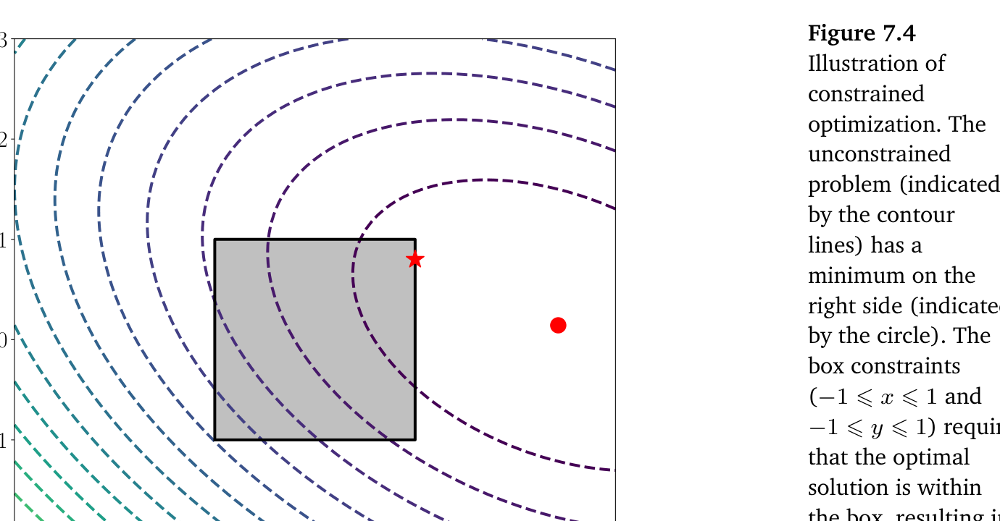

## 7.2 带约束优化与拉格朗日乘子

在上一节中，我们考虑了求解函数极小值的问题：
$$
\min_{\boldsymbol x} f(\boldsymbol x) , \tag{7.16}
$$
其中 $ f : \mathbb{R}^D \to \mathbb{R} $。

在本节中，我们增加了额外的约束。也就是说，对于实值函数 $ g_i : \mathbb{R}^D \to \mathbb{R} $（$ i = 1, \ldots, m $），我们考虑如下带约束优化问题（见图 7.4 示意）：
$$
\begin{aligned}
\min_{\boldsymbol x} & \quad f(\boldsymbol x) \\
\text{subject to} & \quad g_i(\boldsymbol x) \leqslant 0 \quad \text{对所有 } i = 1, \ldots, m 。
\end{aligned}
\tag{7.17}
$$

   
  <b>图 7.4 带约束优化示意图。</b> 

值得指出的是，在一般情况下，函数 $ f $ 和 $ g_i $ 可能是非凸的，我们将在下一节中讨论凸的情形。

将带约束问题 (7.17) 转化为无约束问题的一种显而易见但不太实用的方法是使用 _示性函数（indicator function）_ ：
$$
J(\boldsymbol x) = f(\boldsymbol x) + \sum_{i=1}^m \mathbf{1}(g_i(\boldsymbol x)) , \tag{7.18}
$$
其中 $ \mathbf{1}(z) $ 是一个无穷阶跃函数：
$$
\mathbf{1}(z) = \begin{cases} 0 & \text{若 } z \leqslant 0 \\ \infty & \text{其他} \end{cases} 。 \tag{7.19}
$$
当约束不满足时，该函数会施加无穷大的惩罚，因此能够提供与原问题相同的解。然而，这个无穷阶跃函数在优化上同样极其困难。我们可以通过引入 _拉格朗日乘子（Lagrange multiplier）_ 来克服这一困难。拉格朗日乘子的核心思想是用线性函数来替代该阶跃函数。

通过分别为每个不等式约束引入拉格朗日乘子 $ \lambda_i \geqslant 0 $（Boyd and Vandenberghe, 2004, chapter 4），我们将问题 (7.17) 与 _拉格朗日函数（Lagrangian）_ 联系起来，使得：
$$
\mathfrak{L}(\boldsymbol x, \boldsymbol \lambda) = f(\boldsymbol x) + \sum_{i=1}^m \lambda_i g_i(\boldsymbol x) \tag{7.20a}
$$
$$
= f(\boldsymbol x) + \boldsymbol \lambda^\top \boldsymbol g(\boldsymbol x) , \tag{7.20b}
$$
在最后一行中，我们将所有约束 $ g_i(\boldsymbol x) $ 拼接成向量 $ \boldsymbol g(\boldsymbol x) $，并将所有拉格朗日乘子拼接成向量 $ \boldsymbol \lambda \in \mathbb{R}^m $。

现在我们引入拉格朗日对偶的思想。一般而言，优化中的对偶性是指将一组变量 $ \boldsymbol x $（称为 _原变量（primal variables）_ ）的优化问题，转化为另一组不同变量 $ \boldsymbol \lambda $（称为 _对偶变量（dual variables）_ ）的优化问题。我们介绍两种不同的对偶途径：在本节中，我们讨论 _拉格朗日对偶（Lagrangian duality）_ ；在第 7.3.3 节中，我们将讨论 _勒让德-芬歇尔对偶（Legendre–Fenchel duality）_ 。

**定义 7.1**。式 (7.17) 中的问题：
$$
\begin{aligned}
\min_{\boldsymbol x} & \quad f(\boldsymbol x) \\
\text{subject to} & \quad g_i(\boldsymbol x) \leqslant 0 \quad \text{对所有 } i = 1, \ldots, m
\end{aligned}
\tag{7.21}
$$
被称为 _原问题（primal problem）_ ，对应于原变量 $ \boldsymbol x $。
其相应的 _拉格朗日对偶问题（Lagrangian dual problem）_ 由下式给出：
$$
\begin{aligned}
\max_{\boldsymbol \lambda \in \mathbb{R}^m} & \quad \mathfrak{D}(\boldsymbol \lambda) \\
\text{subject to} & \quad \boldsymbol \lambda \geqslant \boldsymbol 0 ,
\end{aligned}
\tag{7.22}
$$
其中 $ \boldsymbol \lambda $ 是对偶变量，且 $ \mathfrak{D}(\boldsymbol \lambda) = \min_{\boldsymbol x \in \mathbb{R}^d} \mathfrak{L}(\boldsymbol x, \boldsymbol \lambda) $。

_备注_ 。在定义 7.1 的讨论中，我们使用了两个同样具有独立重要意义的概念（Boyd and Vandenberghe, 2004）。

首先是 _极小极大不等式（minimax inequality）_ ，它指出对于任意具有两个参数的函数 $ \phi(\boldsymbol x, \boldsymbol y) $，先极小后极大（maximin）小于等于先极大后极小（minimax），即：
$$
\max_{\boldsymbol y} \min_{\boldsymbol x} \phi(\boldsymbol x, \boldsymbol y) \leqslant \min_{\boldsymbol x} \max_{\boldsymbol y} \phi(\boldsymbol x, \boldsymbol y) 。 \tag{7.23}
$$
该不等式可以通过考虑以下不等式来证明：
$$
\text{对所有 } \boldsymbol x, \boldsymbol y , \quad \min_{\boldsymbol x} \phi(\boldsymbol x, \boldsymbol y) \leqslant \max_{\boldsymbol y} \phi(\boldsymbol x, \boldsymbol y) 。 \tag{7.24}
$$
注意到对式 (7.24) 的左侧关于 $ \boldsymbol y $ 取极大值仍然保持不等式成立，因为该不等式对所有 $ \boldsymbol y $ 均成立。类似地，我们可以对式 (7.24) 的右侧关于 $ \boldsymbol x $ 取极小值，从而得到式 (7.23)。

第二个概念是 _弱对偶性（weak duality）_ ，它利用式 (7.23) 证明了原问题的值始终大于或等于对偶问题的值。这在式 (7.27) 中有更详细的描述。♦

回想一下，式 (7.18) 中的 $ J(\boldsymbol x) $ 与式 (7.20b) 中的拉格朗日函数之间的区别在于，我们将示性函数松弛为了线性函数。因此，当 $ \boldsymbol \lambda \geqslant \boldsymbol 0 $ 时，拉格朗日函数 $ \mathfrak{L}(\boldsymbol x, \boldsymbol \lambda) $ 是 $ J(\boldsymbol x) $ 的下界。因此，$ \mathfrak{L}(\boldsymbol x, \boldsymbol \lambda) $ 关于 $ \boldsymbol \lambda $ 的极大值为：
$$
J(\boldsymbol x) = \max_{\boldsymbol \lambda \geqslant \boldsymbol 0} \mathfrak{L}(\boldsymbol x, \boldsymbol \lambda) 。 \tag{7.25}
$$
回想一下，原始问题是极小化 $ J(\boldsymbol x) $：
$$
\min_{\boldsymbol x \in \mathbb{R}^d} \max_{\boldsymbol \lambda \geqslant \boldsymbol 0} \mathfrak{L}(\boldsymbol x, \boldsymbol \lambda) 。 \tag{7.26}
$$
根据极小极大不等式 (7.23)，交换极小与极大的顺序会产生一个较小的值，即：
$$
\min_{\boldsymbol x \in \mathbb{R}^d} \max_{\boldsymbol \lambda \geqslant \boldsymbol 0} \mathfrak{L}(\boldsymbol x, \boldsymbol \lambda) \geqslant \max_{\boldsymbol \lambda \geqslant \boldsymbol 0} \min_{\boldsymbol x \in \mathbb{R}^d} \mathfrak{L}(\boldsymbol x, \boldsymbol \lambda) 。 \tag{7.27}
$$
这也称为 _弱对偶性（weak duality）_ 。注意到右侧的内部部分正是 _对偶目标函数（dual objective function）_ $ \mathfrak{D}(\boldsymbol \lambda) $，定义由此自然得出。

与带有约束的原始优化问题相比，对于给定的 $ \boldsymbol \lambda $ 值，$ \min_{\boldsymbol x \in \mathbb{R}^d} \mathfrak{L}(\boldsymbol x, \boldsymbol \lambda) $ 是一个无约束优化问题。如果求解 $ \min_{\boldsymbol x \in \mathbb{R}^d} \mathfrak{L}(\boldsymbol x, \boldsymbol \lambda) $ 很简单，那么整个问题就容易求解。原因在于外层问题（关于 $ \boldsymbol \lambda $ 的极大化）是一组仿射函数的逐点极大值，因此即便 $ f(\cdot) $ 和 $ g_i(\cdot) $ 可能非凸，它也是一个凹函数。凹函数的极大值可以被高效地计算。

假定 $ f(\cdot) $ 和 $ g_i(\cdot) $ 是可微的，我们通过对拉格朗日函数关于 $ \boldsymbol x $ 求微分，令微分（导数）为零，并解出最优值，从而求得拉格朗日对偶问题。我们将在第 7.3.1 节和第 7.3.2 节中讨论两个具体示例，其中 $ f(\cdot) $ 和 $ g_i(\cdot) $ 均是凸的。

_备注_ （等式约束）。考虑式 (7.17) 带有额外等式约束的情形：
$$
\begin{aligned}
\min_{\boldsymbol x} & \quad f(\boldsymbol x) \\
\text{subject to} & \quad g_i(\boldsymbol x) \leqslant 0 \quad \text{对所有 } i = 1, \ldots, m \\
& \quad h_j(\boldsymbol x) = 0 \quad \text{对所有 } j = 1, \ldots, n 。
\end{aligned}
\tag{7.28}
$$
我们可以通过将等式约束替换为两个不等式约束来对其进行建模。也就是说，对于每个等式约束 $ h_j(\boldsymbol x) = 0 $，我们将其等价替换为两个约束 $ h_j(\boldsymbol x) \leqslant 0 $ 和 $ h_j(\boldsymbol x) \geqslant 0 $。事实证明，由此得到的拉格朗日乘子是不受约束的。

因此，我们对式 (7.28) 中对应于不等式约束的拉格朗日乘子施加非负约束，而对应于等式约束的拉格朗日乘子则不受约束。♦
