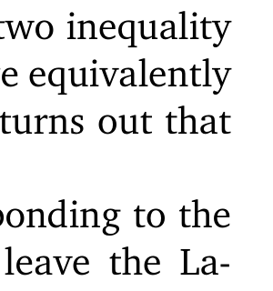
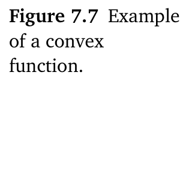
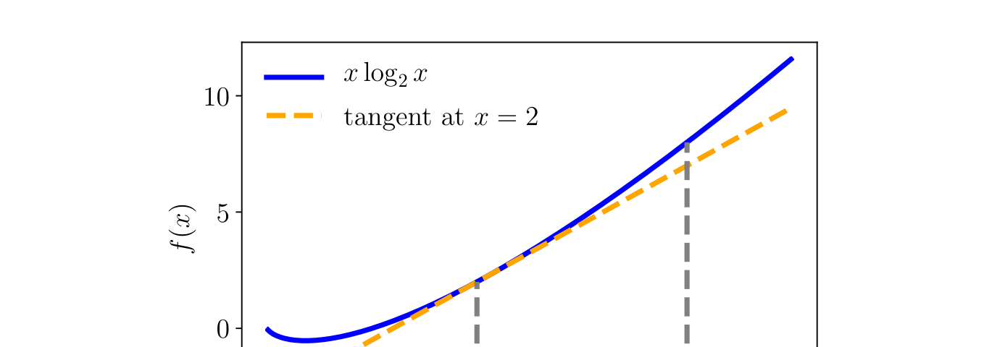
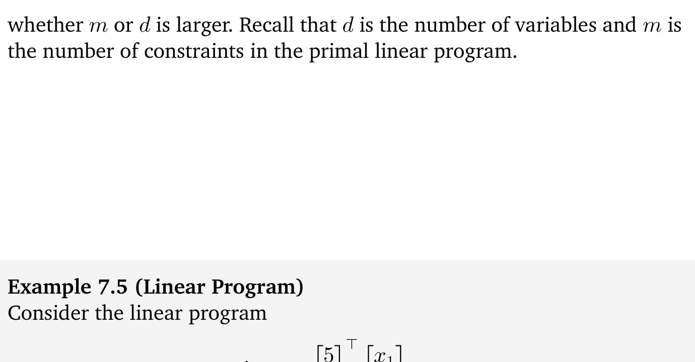

## 7.3 凸优化

我们将注意力集中在一类特别有用的优化问题上，在这些问题中我们可以保证全局最优性。当 $ f(\cdot) $ 是凸函数，且涉及 $ g(\cdot) $ 和 $ h(\cdot) $ 的约束是凸集时，这被称为 _凸优化问题（convex optimization problem）_ 。在此设定下，我们拥有 _强对偶性（strong duality）_ ：对偶问题的最优解与原问题的最优解相同。在机器学习文献中，凸函数与凸集之间的区别往往并未严格区分，但通常可以从上下文中推断出其隐含含义。

**定义 7.2**（凸集）。若对于任意 $ \boldsymbol x, \boldsymbol y \in C $ 以及任意满足 $ 0 \leqslant \theta \leqslant 1 $ 的标量 $ \theta $，均有：
$$
\theta \boldsymbol x + (1 - \theta)\boldsymbol y \in C \tag{7.29}
$$
则集合 $ C $ 是一个 _凸集（convex set）_ 。

   
  <b>图 7.5 凸集示例。</b> 

凸集是指连接集合中任意两点的线段完全位于集合内部的集合。图 7.5 和图 7.6 分别说明了凸集与非凸集。

   
  <b>图 7.6 非凸集示例。</b> 

凸函数是指连接函数图像上任意两点的线段位于函数图像上方的函数。图 7.2 展示了一个非凸函数，图 7.3 展示了一个凸函数。另一个凸函数如图 7.7 所示。

**定义 7.3**（凸函数）。设函数 $ f : \mathbb{R}^D \to \mathbb{R} $ 的定义域为凸集。若对于 $ f $ 定义域内的所有 $ \boldsymbol x, \boldsymbol y $ 以及任意满足 $ 0 \leqslant \theta \leqslant 1 $ 的标量 $ \theta $，均有：
$$
f(\theta \boldsymbol x + (1 - \theta)\boldsymbol y) \leqslant \theta f(\boldsymbol x) + (1 - \theta)f(\boldsymbol y) \tag{7.30}
$$
则函数 $ f $ 是一个 _凸函数（convex function）_ 。

_备注_ 。 _凹函数（concave function）_ 是凸函数的相反数。♦

式 (7.28) 中涉及 $ g(\cdot) $ 和 $ h(\cdot) $ 的约束将函数截断在某个标量值处，从而形成集合。凸函数与凸集之间的另一种联系是考虑通过“填满”一个凸函数所得到的集合。凸函数是一个碗状物体，我们可以想象向其中注水将其填满。所得到的这个填满的集合称为凸函数的 _上图（epigraph）_ ，它是一个凸集。

若函数 $ f : \mathbb{R}^n \to \mathbb{R} $ 是可微的，我们可以利用其梯度 $ \nabla_{\boldsymbol x} f(\boldsymbol x) $（第 5.2 节）来刻画凸性。函数 $ f(\boldsymbol x) $ 是凸函数当且仅当对于任意两点 $ \boldsymbol x, \boldsymbol y $，均满足：
$$
f(\boldsymbol y) \geqslant f(\boldsymbol x) + \nabla_{\boldsymbol x} f(\boldsymbol x)^\top (\boldsymbol y - \boldsymbol x) \tag{7.31}
$$
如果我们进一步知道函数 $ f(\boldsymbol x) $ 是二阶可微的，即对于 $ \boldsymbol x $ 定义域内的所有取值，Hessian 矩阵（式 (5.147)）均存在，那么函数 $ f(\boldsymbol x) $ 为凸函数当且仅当 $ \nabla_{\boldsymbol x}^2 f(\boldsymbol x) $ 是半正定的（Boyd and Vandenberghe, 2004）。

   
  <b>图 7.7 凸函数示例。</b> 

> **例 7.3**
> 
> 负熵函数 $ f(x) = x \log_2 x $ 在 $ x > 0 $ 时是凸函数。该函数的几何图像如图 7.8 所示，我们可以看出它是凸函数。为了说明前面的凸性定义，让我们用两点 $ x = 2 $ 和 $ x = 4 $ 来进行验算。请注意，要证明 $ f(x) $ 的凸性，我们需要检验定义域内所有的点 $ x \in \mathbb{R} $。
> 
> 回顾定义 7.3。考虑两点中点处的位置（即 $ \theta = 0.5 $），则左侧为 $ f(0.5 \cdot 2 + 0.5 \cdot 4) = 3 \log_2 3 \approx 4.75 $。右侧为 $ 0.5(2 \log_2 2) + 0.5(4 \log_2 4) = 1 + 4 = 5 $。因此满足定义。
> 
> 由于 $ f(x) $ 是可微的，我们也可以使用式 (7.31)。计算 $ f(x) $ 的导数，我们得到：
> $$
> \nabla_x (x \log_2 x) = 1 \cdot \log_2 x + x \cdot \frac{1}{x \log_e 2} = \log_2 x + \frac{1}{\log_e 2} \tag{7.32}
> $$
> 使用相同的两个测试点 $ x = 2 $ 和 $ x = 4 $，式 (7.31) 的左侧为 $ f(4) = 8 $。右侧为：
> $$
> f(x) + \nabla_x f(x)^\top (y - x) = f(2) + \nabla f(2) \cdot (4 - 2) \tag{7.33a}
> $$
> $$
> = 2 + \left( 1 + \frac{1}{\log_e 2} \right) \cdot 2 \approx 6.9 \tag{7.33b}
> $$

   
  <b>图 7.8 负熵函数（凸函数）及其在 x = 2 处的切线。</b> 

我们可以通过回顾定义，从第一性原理检验一个函数或集合是否为凸的。在实践中，我们通常依赖于保持凸性的运算来检验特定函数或集合的凸性。尽管细节大相径庭，但这再次体现了我们在第 2 章针对向量空间介绍的闭包思想。

> **例 7.4**
> 
> 凸函数的非负加权和是凸的。注意到若 $ f $ 是凸函数，且 $ \alpha \geqslant 0 $ 是非负标量，则函数 $ \alpha f $ 是凸的。我们可以通过在定义 7.3 的不等式两边乘以 $ \alpha $ 看出这一点，并回想乘以非负数不会改变不等号方向。
> 
> 若 $ f_1 $ 和 $ f_2 $ 是凸函数，则根据定义有：
> $$
> f_1(\theta \boldsymbol x + (1 - \theta)\boldsymbol y) \leqslant \theta f_1(\boldsymbol x) + (1 - \theta)f_1(\boldsymbol y) \tag{7.34}
> $$
> $$
> f_2(\theta \boldsymbol x + (1 - \theta)\boldsymbol y) \leqslant \theta f_2(\boldsymbol x) + (1 - \theta)f_2(\boldsymbol y) \tag{7.35}
> $$
> 两边相加得到：
> $$
> f_1(\theta \boldsymbol x + (1 - \theta)\boldsymbol y) + f_2(\theta \boldsymbol x + (1 - \theta)\boldsymbol y) \leqslant \theta f_1(\boldsymbol x) + (1 - \theta)f_1(\boldsymbol y) + \theta f_2(\boldsymbol x) + (1 - \theta)f_2(\boldsymbol y) \tag{7.36}
> $$
> 其中右侧可以重新整理为：
> $$
> \theta (f_1(\boldsymbol x) + f_2(\boldsymbol x)) + (1 - \theta)(f_1(\boldsymbol y) + f_2(\boldsymbol y)) \tag{7.37}
> $$
> 从而完成了两凸函数之和为凸函数的证明。
> 
> 结合上述两个事实，我们看到对于 $ \alpha, \beta \geqslant 0 $，$ \alpha f_1(\boldsymbol x) + \beta f_2(\boldsymbol x) $ 是凸函数。使用类似的论证，该闭包性质可以推广到两个以上凸函数的非负加权和。

_备注_ 。式 (7.30) 中的不等式有时被称为 _琴生不等式（Jensen's inequality）_ 。事实上，一整类关于取凸函数非负加权和的不等式都被称为琴生不等式。♦

总而言之，一个带约束优化问题若具有如下形式，则称为 _凸优化问题（convex optimization problem）_ ：
$$
\begin{aligned}
\min_{\boldsymbol x} \quad & f(\boldsymbol x) \\
\text{subject to} \quad & g_i(\boldsymbol x) \leqslant 0 \quad \text{对所有 } i = 1, \ldots, m \\
& h_j(\boldsymbol x) = 0 \quad \text{对所有 } j = 1, \ldots, n
\end{aligned} \tag{7.38}
$$
其中所有函数 $ f(\boldsymbol x) $ 和 $ g_i(\boldsymbol x) $ 均为凸函数，且所有 $ h_j(\boldsymbol x) = 0 $ 均为凸集。在下文中，我们将描述两类应用广泛且已被充分理解的凸优化问题。

### 7.3.1 线性规划

考虑上述所有函数均为线性的特殊情形，即：
$$
\begin{aligned}
\min_{\boldsymbol x \in \mathbb{R}^d} \quad & \boldsymbol c^\top \boldsymbol x \\
\text{subject to} \quad & \boldsymbol A \boldsymbol x \leqslant \boldsymbol b
\end{aligned} \tag{7.39}
$$
其中 $ \boldsymbol A \in \mathbb{R}^{m \times d} $ 且 $ \boldsymbol b \in \mathbb{R}^m $。这被称为 _线性规划（linear program）_ （ _边注_ ：线性规划是工业界应用最广泛的方法之一。）。它具有 $ d $ 个变量和 $ m $ 个线性约束。拉格朗日函数由下式给出：
$$
L(\boldsymbol x, \boldsymbol \lambda) = \boldsymbol c^\top \boldsymbol x + \boldsymbol \lambda^\top (\boldsymbol A \boldsymbol x - \boldsymbol b) \tag{7.40}
$$
其中 $ \boldsymbol \lambda \in \mathbb{R}^m $ 是非负拉格朗日乘子构成的向量。重排对应于 $ \boldsymbol x $ 的各项得到：
$$
L(\boldsymbol x, \boldsymbol \lambda) = (\boldsymbol c + \boldsymbol A^\top \boldsymbol \lambda)^\top \boldsymbol x - \boldsymbol \lambda^\top \boldsymbol b \tag{7.41}
$$
对 $ L(\boldsymbol x, \boldsymbol \lambda) $ 关于 $ \boldsymbol x $ 求导并令其为零，得到：
$$
\boldsymbol c + \boldsymbol A^\top \boldsymbol \lambda = \boldsymbol 0 \tag{7.42}
$$
因此，对偶拉格朗日函数为 $ D(\boldsymbol \lambda) = -\boldsymbol \lambda^\top \boldsymbol b $。回想一下，我们希望最大化 $ D(\boldsymbol \lambda) $。除了由 $ L(\boldsymbol x, \boldsymbol \lambda) $ 的导数为零所产生的约束外，我们还有 $ \boldsymbol \lambda \geqslant \boldsymbol 0 $ 这一事实，从而得到如下对偶优化问题（ _边注_ ：通常的约定是最小化原问题并最大化对偶问题。）：
$$
\begin{aligned}
\max_{\boldsymbol \lambda \in \mathbb{R}^m} \quad & -\boldsymbol b^\top \boldsymbol \lambda \\
\text{subject to} \quad & \boldsymbol c + \boldsymbol A^\top \boldsymbol \lambda = \boldsymbol 0 \\
& \boldsymbol \lambda \geqslant \boldsymbol 0
\end{aligned} \tag{7.43}
$$
这也是一个线性规划，但具有 $ m $ 个变量。根据 $ m $ 与 $ d $ 孰大孰小，我们可以灵活选择求解原问题 (7.39) 或对偶问题 (7.43)。回想一下，$ d $ 是原线性规划中的变量数，而 $ m $ 是约束数。

> **例 7.5（线性规划）**
> 
> 考虑包含两个变量的线性规划：
> $$
> \begin{aligned}
> \min_{\boldsymbol x \in \mathbb{R}^2} \quad & -\begin{bmatrix} 5 \\ 3 \end{bmatrix}^\top \begin{bmatrix} x_1 \\ x_2 \end{bmatrix} \\
> \text{subject to} \quad & \begin{bmatrix} 2 & 2 \\ 2 & -4 \\ -2 & 1 \\ 0 & -1 \\ 0 & 1 \end{bmatrix} \begin{bmatrix} x_1 \\ x_2 \end{bmatrix} \leqslant \begin{bmatrix} 33 \\ 8 \\ 5 \\ -1 \\ 8 \end{bmatrix}
> \end{aligned} \tag{7.44}
> $$
> 该规划也在图 7.9 中进行了展示。目标函数是线性的，因此等高线呈线性直线。标准形式的约束集被转化并标注在图例中。最优值必须位于阴影（可行）区域内，并由星号指示。

   
  <b>图 7.9 线性规划示意图。无约束问题（由等高线指示）在右侧具有极小值。满足约束条件的最优值由星号指示。</b> 

### 7.3.2 二次规划

考虑目标函数为凸二次函数、约束为仿射约束的情形，即：
$$
\begin{aligned}
\min_{\boldsymbol x \in \mathbb{R}^d} \quad & \frac{1}{2}\boldsymbol x^\top \boldsymbol Q \boldsymbol x + \boldsymbol c^\top \boldsymbol x \\
\text{subject to} \quad & \boldsymbol A \boldsymbol x \leqslant \boldsymbol b
\end{aligned} \tag{7.45}
$$
其中 $ \boldsymbol A \in \mathbb{R}^{m \times d} $，$ \boldsymbol b \in \mathbb{R}^m $，且 $ \boldsymbol c \in \mathbb{R}^d $。对称方阵 $ \boldsymbol Q \in \mathbb{R}^{d \times d} $ 是正定的，因此目标函数是凸函数。这被称为 _二次规划（quadratic program）_ 。容易看出，它具有 $ d $ 个变量和 $ m $ 个线性约束。

> **例 7.6（二次规划）**
> 
> 考虑包含两个变量的二次规划：
> $$
> \min_{\boldsymbol x \in \mathbb{R}^2} \quad \frac{1}{2} \begin{bmatrix} x_1 \\ x_2 \end{bmatrix}^\top \begin{bmatrix} 2 & 1 \\ 1 & 4 \end{bmatrix} \begin{bmatrix} x_1 \\ x_2 \end{bmatrix} + \begin{bmatrix} 5 \\ 3 \end{bmatrix}^\top \begin{bmatrix} x_1 \\ x_2 \end{bmatrix} \tag{7.46}
> $$
> $$
> \text{subject to} \quad \begin{bmatrix} 1 & 0 \\ -1 & 0 \\ 0 & 1 \\ 0 & -1 \end{bmatrix} \begin{bmatrix} x_1 \\ x_2 \end{bmatrix} \leqslant \begin{bmatrix} 1 \\ 1 \\ 1 \\ 1 \end{bmatrix} \tag{7.47}
> $$
> 该规划也在图 7.4 中进行了展示。目标函数是带有半正定矩阵 $ \boldsymbol Q $ 的二次函数，产生椭圆形的等高线。最优值必须位于阴影（可行）区域内，并由星号指示。

拉格朗日函数由下式给出：
$$
L(\boldsymbol x, \boldsymbol \lambda) = \frac{1}{2}\boldsymbol x^\top \boldsymbol Q \boldsymbol x + \boldsymbol c^\top \boldsymbol x + \boldsymbol \lambda^\top (\boldsymbol A \boldsymbol x - \boldsymbol b) \tag{7.48a}
$$
$$
= \frac{1}{2}\boldsymbol x^\top \boldsymbol Q \boldsymbol x + (\boldsymbol c + \boldsymbol A^\top \boldsymbol \lambda)^\top \boldsymbol x - \boldsymbol \lambda^\top \boldsymbol b \tag{7.48b}
$$
这里我们再次重排了各项。对 $ L(\boldsymbol x, \boldsymbol \lambda) $ 关于 $ \boldsymbol x $ 求导并令其为零，得到：
$$
\boldsymbol Q \boldsymbol x + (\boldsymbol c + \boldsymbol A^\top \boldsymbol \lambda) = \boldsymbol 0 \tag{7.49}
$$
假设 $ \boldsymbol Q $ 是可逆的，我们得到：
$$
\boldsymbol x = -\boldsymbol Q^{-1}(\boldsymbol c + \boldsymbol A^\top \boldsymbol \lambda) \tag{7.50}
$$
将式 (7.50) 代入原拉格朗日函数 $ L(\boldsymbol x, \boldsymbol \lambda) $，得到对偶拉格朗日函数：
$$
D(\boldsymbol \lambda) = -\frac{1}{2}(\boldsymbol c + \boldsymbol A^\top \boldsymbol \lambda)^\top \boldsymbol Q^{-1}(\boldsymbol c + \boldsymbol A^\top \boldsymbol \lambda) - \boldsymbol \lambda^\top \boldsymbol b \tag{7.51}
$$
因此，对偶优化问题由下式给出：
$$
\begin{aligned}
\max_{\boldsymbol \lambda \in \mathbb{R}^m} \quad & -\frac{1}{2}(\boldsymbol c + \boldsymbol A^\top \boldsymbol \lambda)^\top \boldsymbol Q^{-1}(\boldsymbol c + \boldsymbol A^\top \boldsymbol \lambda) - \boldsymbol \lambda^\top \boldsymbol b \\
\text{subject to} \quad & \boldsymbol \lambda \geqslant \boldsymbol 0
\end{aligned} \tag{7.52}
$$
我们将在第 12 章中看到二次规划在机器学习中的应用。

### 7.3.3 勒让德-芬彻尔变换与凸共轭

让我们在不考虑约束的情况下，重新审视第 7.2 节中的对偶思想。关于凸集的一个有用事实是，它可以等价地由其支撑超平面来描述。如果一个超平面与凸集相交，且凸集完全包含在该超平面的某一侧，则称该超平面为凸集的 _支撑超平面（supporting hyperplane）_ 。回想一下，我们可以填满一个凸函数以获得其上图，而上图是一个凸集。因此，我们也可以借助支撑超平面来描述凸函数。此外，观察到支撑超平面恰好与凸函数相切，事实上就是该点处函数的切线。并且回想一下，函数 $ f(x) $ 在给定点 $ x_0 $ 处的切线斜率是该函数在该点处的导数求值 $ \left.\frac{\mathrm{d}f(x)}{\mathrm{d}x}\right|_{x=x_0} $。

总而言之，因为凸集可以等价地由其支撑超平面描述，所以凸函数可以等价地由关于其梯度的函数来描述。 _勒让德变换（Legendre transform）_ 将这一概念形式化（ _边注_ ：物理系学生通常通过经典力学中连接拉格朗日量与哈密顿量的工具来初次接触勒让德变换。）。

我们首先给出最一般的定义（遗憾的是它的形式可能有些反直觉），然后通过特例将该定义与上一段所描述的直觉联系起来。 _勒让德-芬彻尔变换（Legendre–Fenchel transform）_ 是从凸可微函数 $ f(\boldsymbol x) $ 到依赖于切线斜率（梯度）$ \boldsymbol s(\boldsymbol x) = \nabla_{\boldsymbol x} f(\boldsymbol x) $ 的函数的变换（在类似于傅里叶变换的意义下）。值得强调的是，这是函数 $ f(\cdot) $ 本身的变换，而不是变量 $ \boldsymbol x $ 或在 $ \boldsymbol x $ 处求值的函数值的变换。勒让德-芬彻尔变换也被称为 _凸共轭（convex conjugate）_ （原因我们很快就会看到），并且与对偶性密切相关（Hiriart-Urruty and Lemaréchal, 2001，第 5 章）。

**定义 7.4**（凸共轭）。函数 $ f : \mathbb{R}^D \to \mathbb{R} $ 的 _凸共轭（convex conjugate）_ 是由下式定义的函数 $ f^* $：
$$
f^*(\boldsymbol s) = \sup_{\boldsymbol x \in \mathbb{R}^D} \left( \langle \boldsymbol s, \boldsymbol x \rangle - f(\boldsymbol x) \right) \tag{7.53}
$$

注意到上述凸共轭定义既不需要函数 $ f $ 是凸的，也不需要它是可微的。在定义 7.4 中，我们使用了广义内积（第 3.2 节），但在本节的其余部分中，我们将考虑有限维向量之间的标准点积（$ \langle \boldsymbol s, \boldsymbol x \rangle = \boldsymbol s^\top \boldsymbol x $），以避免过多的技术细节。

为了以几何方式理解定义 7.4，考虑一个简单易懂的一维凸且可微的函数，例如 $ f(x) = x^2 $（ _边注_ ：随着推导的进行边画图边理解，这种推导最容易掌握。）。请注意，由于我们考虑的是一维问题，超平面退化为一条直线。考虑一条直线 $ y = sx + c $。回想一下，我们可以用凸函数的支撑超平面来描述它，因此让我们尝试用支撑线来描述该函数 $ f(x) $。固定直线的斜率 $ s \in \mathbb{R} $，对于 $ f $ 图像上的每个点 $ (x_0, f(x_0)) $，寻找 $ c $ 的最小值使得该直线仍然与 $ (x_0, f(x_0)) $ 相交。注意到 $ c $ 的最小值对应于斜率为 $ s $ 的直线“恰好接触”函数 $ f(x) = x^2 $ 的位置。通过点 $ (x_0, f(x_0)) $ 且斜率为 $ s $ 的直线方程由下式给出：
$$
y - f(x_0) = s(x - x_0) \tag{7.54}
$$
该直线的 $ y $ 轴截距为 $ -sx_0 + f(x_0) $。因此，使得 $ y = sx + c $ 与 $ f $ 的图像相交的 $ c $ 的极小值（下确界）为：
$$
\inf_{x_0} \left( -sx_0 + f(x_0) \right) \tag{7.55}
$$
按照惯例，前面的凸共轭被定义为此值的相反数。本段的推导并不依赖于我们选取了一维凸且可微的函数这一事实，对于非凸且不可微的函数 $ f : \mathbb{R}^D \to \mathbb{R} $ 同样成立（ _边注_ ：经典的勒让德变换定义在 $ \mathbb{R}^D $ 中的凸可微函数上。）。

_备注_ 。像 $ f(x) = x^2 $ 这样的凸可微函数是一个很好的特例，在这里不需要取上确界，而且在函数与其勒让德变换之间存在一一对应关系。让我们从第一性原理推导这一点。对于凸可微函数，我们知道在 $ x_0 $ 处的切线与 $ f(x_0) $ 相接，使得：
$$
f(x_0) = sx_0 + c \tag{7.56}
$$
回想一下，我们希望利用梯度 $ \nabla_x f(x) $ 来描述凸函数 $ f(x) $，且 $ s = \nabla_x f(x_0) $。我们重新整理以得到 $ -c $ 的表达式：
$$
-c = sx_0 - f(x_0) \tag{7.57}
$$
注意 $ -c $ 随着 $ x_0 $ 的变化而变化，从而随着 $ s $ 的变化而变化，这就是为什么我们可以将其视为 $ s $ 的函数，记作：
$$
f^*(s) := sx_0 - f(x_0) \tag{7.58}
$$
将式 (7.58) 与定义 7.4 进行对比，我们看到式 (7.58) 是一个特例（不含上确界）。♦

共轭函数具有优良的性质；例如，对于凸函数，再次应用勒让德变换将使我们回到原函数。正如 $ f(x) $ 的斜率是 $ s $ 一样，$ f^*(s) $ 的斜率是 $ x $。以下两个例子展示了凸共轭在机器学习中的常见用法。

> **例 7.7（凸共轭）**
> 
> 为了说明凸共轭的应用，考虑基于正定矩阵 $ \boldsymbol K \in \mathbb{R}^{n \times n} $ 的二次函数：
> $$
> f(\boldsymbol y) = \frac{\lambda}{2} \boldsymbol y^\top \boldsymbol K^{-1} \boldsymbol y \tag{7.59}
> $$
> 我们将原变量记为 $ \boldsymbol y \in \mathbb{R}^n $，对偶变量记为 $ \boldsymbol \alpha \in \mathbb{R}^n $。
> 
> 应用定义 7.4，我们得到函数：
> $$
> f^*(\boldsymbol \alpha) = \sup_{\boldsymbol y \in \mathbb{R}^n} \left( \langle \boldsymbol y, \boldsymbol \alpha \rangle - \frac{\lambda}{2} \boldsymbol y^\top \boldsymbol K^{-1} \boldsymbol y \right) \tag{7.60}
> $$
> 由于该函数是可微的，我们可以通过关于 $ \boldsymbol y $ 求导并令导数为零来寻找最大值：
> $$
> \frac{\partial}{\partial \boldsymbol y}\left( \langle \boldsymbol y, \boldsymbol \alpha \rangle - \frac{\lambda}{2} \boldsymbol y^\top \boldsymbol K^{-1} \boldsymbol y \right) = (\boldsymbol \alpha - \lambda \boldsymbol K^{-1} \boldsymbol y)^\top \tag{7.61}
> $$
> 因此当梯度为零时，我们有 $ \boldsymbol y = \frac{1}{\lambda} \boldsymbol K \boldsymbol \alpha $。将其代入式 (7.60) 得到：
> $$
> \begin{aligned}
> f^*(\boldsymbol \alpha) &= \frac{1}{\lambda} \boldsymbol \alpha^\top \boldsymbol K \boldsymbol \alpha - \frac{\lambda}{2} \left( \frac{1}{\lambda} \boldsymbol K \boldsymbol \alpha \right)^\top \boldsymbol K^{-1} \left( \frac{1}{\lambda} \boldsymbol K \boldsymbol \alpha \right) \\
> &= \frac{1}{2\lambda} \boldsymbol \alpha^\top \boldsymbol K \boldsymbol \alpha
> </aligned} \tag{7.62}
> $$

> **例 7.8**
> 
> 在机器学习中，我们经常使用函数之和；例如，训练集上的目标函数包括训练集中每个样本的损失之和。在下文中，我们推导损失之和 $ \ell(t) $ 的凸共轭，其中 $ \ell : \mathbb{R} \to \mathbb{R} $。这也说明了凸共轭在向量情形下的应用。设 $ L(\boldsymbol t) = \sum_{i=1}^n \ell_i(t_i) $。那么：
> $$
> L^*(\boldsymbol z) = \sup_{\boldsymbol t \in \mathbb{R}^n} \left( \langle \boldsymbol z, \boldsymbol t \rangle - \sum_{i=1}^n \ell_i(t_i) \right) \tag{7.63a}
> $$
> $$
> = \sup_{\boldsymbol t \in \mathbb{R}^n} \sum_{i=1}^n \left( z_i t_i - \ell_i(t_i) \right) \qquad \text{点积的定义} \tag{7.63b}
> $$
> $$
> = \sum_{i=1}^n \sup_{\boldsymbol t \in \mathbb{R}^n} \left( z_i t_i - \ell_i(t_i) \right) \tag{7.63c}
> $$
> $$
> = \sum_{i=1}^n \ell_i^*(z_i) \qquad \text{共轭的定义} \tag{7.63d}
> $$

回想一下，在第 7.2 节中我们利用拉格朗日乘子推导了对偶优化问题。此外，对于凸优化问题，我们拥有强对偶性，即原问题与对偶问题的解是一致的。这里介绍的勒让德-芬彻尔变换同样可以用来推导对偶优化问题。此外，当函数是凸且可微时，其上确界是唯一的。为了进一步探究这两种方法之间的关系，让我们考虑一个带有线性等式约束的凸优化问题。

> **例 7.9**
> 
> 设 $ f(\boldsymbol y) $ 和 $ g(\boldsymbol x) $ 为凸函数，且 $ \boldsymbol A $ 为合适维度的实矩阵，使得 $ \boldsymbol A \boldsymbol x = \boldsymbol y $。那么：
> $$
> \min_{\boldsymbol x} f(\boldsymbol A \boldsymbol x) + g(\boldsymbol x) = \min_{\boldsymbol A \boldsymbol x = \boldsymbol y} f(\boldsymbol y) + g(\boldsymbol x) \tag{7.64}
> $$
> 通过为约束 $ \boldsymbol A \boldsymbol x = \boldsymbol y $ 引入拉格朗日乘子 $ \boldsymbol u $：
> $$
> \min_{\boldsymbol A \boldsymbol x = \boldsymbol y} f(\boldsymbol y) + g(\boldsymbol x) = \min_{\boldsymbol x, \boldsymbol y} \max_{\boldsymbol u} \left( f(\boldsymbol y) + g(\boldsymbol x) + (\boldsymbol A \boldsymbol x - \boldsymbol y)^\top \boldsymbol u \right) \tag{7.65a}
> $$
> $$
> = \max_{\boldsymbol u} \min_{\boldsymbol x, \boldsymbol y} \left( f(\boldsymbol y) + g(\boldsymbol x) + (\boldsymbol A \boldsymbol x - \boldsymbol y)^\top \boldsymbol u \right) \tag{7.65b}
> $$
> 其中最后一步交换 $ \max $ 与 $ \min $ 的顺序是由于 $ f(\boldsymbol y) $ 和 $ g(\boldsymbol x) $ 是凸函数这一事实。通过拆分点积项并分别合并关于 $ \boldsymbol x $ 和 $ \boldsymbol y $ 的项：
> $$
> \max_{\boldsymbol u} \min_{\boldsymbol x, \boldsymbol y} \left( f(\boldsymbol y) + g(\boldsymbol x) + (\boldsymbol A \boldsymbol x - \boldsymbol y)^\top \boldsymbol u \right) \tag{7.66a}
> $$
> $$
> = \max_{\boldsymbol u} \left[ \left( \min_{\boldsymbol y} -\boldsymbol y^\top \boldsymbol u + f(\boldsymbol y) \right) + \left( \min_{\boldsymbol x} (\boldsymbol A \boldsymbol x)^\top \boldsymbol u + g(\boldsymbol x) \right) \right] \tag{7.66b}
> $$
> $$
> = \max_{\boldsymbol u} \left[ \left( \min_{\boldsymbol y} -\boldsymbol y^\top \boldsymbol u + f(\boldsymbol y) \right) + \left( \min_{\boldsymbol x} \boldsymbol x^\top \boldsymbol A^\top \boldsymbol u + g(\boldsymbol x) \right) \right] \tag{7.66c}
> $$
> 回顾凸共轭（定义 7.4）以及点积具有对称性这一事实（ _边注_ ：对于广义内积，$ \boldsymbol A^\top $ 应替换为伴随算子 $ \boldsymbol A^* $。）：
> $$
> \max_{\boldsymbol u} \left[ \left( \min_{\boldsymbol y} -\boldsymbol y^\top \boldsymbol u + f(\boldsymbol y) \right) + \left( \min_{\boldsymbol x} \boldsymbol x^\top \boldsymbol A^\top \boldsymbol u + g(\boldsymbol x) \right) \right] \tag{7.67a}
> $$
> $$
> = \max_{\boldsymbol u} \left( -f^*(\boldsymbol u) - g^*(-\boldsymbol A^\top \boldsymbol u) \right) \tag{7.67b}
> $$
> 因此，我们证明了：
> $$
> \min_{\boldsymbol x} f(\boldsymbol A \boldsymbol x) + g(\boldsymbol x) = \max_{\boldsymbol u} \left( -f^*(\boldsymbol u) - g^*(-\boldsymbol A^\top \boldsymbol u) \right) \tag{7.68}
> $$

对于可表示为凸优化问题的机器学习问题，勒让德-芬彻尔共轭被证明是非常有用的。特别是，对于独立应用于每个样本的凸损失函数，共轭损失是推导对偶问题的一种极为便利的途径。
