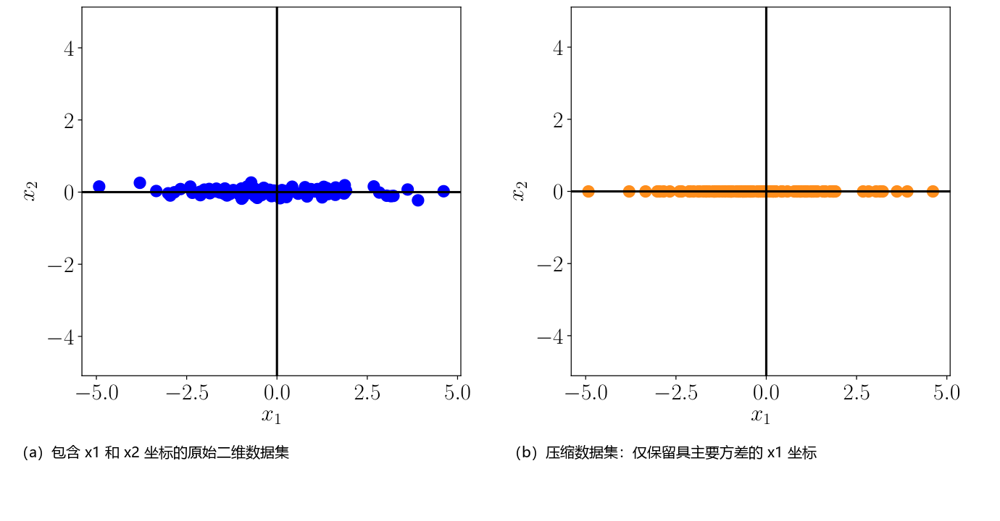

# 10 主成分分析降维

直接处理高维数据（例如图像）会面临诸多现实困难：高维数据极难分析，直观解释十分困难，几何可视化几乎不可能，而且从工程实践的角度来看，存储高维数据向量的开销非常高昂（例如，一张 $640 \times 480$ 像素的彩色图像就是近百万维空间中的一个数据点，因为每个像素对应红、绿、蓝三个颜色通道，即占用三个维度）。然而，高维数据通常具备许多我们可以利用的优良统计性质。例如，高维数据通常是 _过完备（overcomplete）_ 的，即许多维度是冗余的，可以由其他维度的某种组合来解释。此外，高维数据中各个维度之间往往存在显著的相关性，使得数据本身蕴含着内在的低维流形结构。 _ 降维（dimensionality reduction）_ 正是利用了这种内在结构与相关性，使我们能够使用更紧凑紧凑的数据表示，且理想情况下几乎不丢失关键信息。我们可以将降维视为一种数据压缩技术，类似于图像压缩领域的 JPEG 或音频压缩领域的 MP3。

在本章中，我们将深入讨论 _主成分分析（principal component analysis, PCA）_ ，这是一种用于线性降维的经典基础算法。PCA 最早由 Pearson (1901) 和 Hotelling (1933) 提出，距今已有百余年历史，至今仍是数据压缩与高维数据可视化中最常用的技术之一。它还被广泛用于发现高维数据中的简单模式、潜在因子（latent factors）和子空间结构。在信号处理领域，PCA 也被称为 _K-L 变换（Karhunen-Loève transform）_ 。在本章中，我们将从第一性原理出发推导 PCA，全面融合我们在本书第一部分掌握的基与基变换（2.6.1 和 2.7.2 节）、正交投影（3.8 节）、特征值与特征向量（4.2 节）、高斯分布（6.5 节）以及带约束连续优化（7.2 节）等数学概念。

降维通常利用了高维数据（如图像）的一个普遍特性：数据往往集中分布在一个低维子空间或其附近。图 10.1 给出了一个直观的二维示例。虽然图 10.1(a) 中的数据并没有严格落在一条直线上，但数据在 $x_2$ 方向上的方差非常微弱，因此我们可以将其近乎无损地表示为一条直线上的点；参见图 10.1(b)。为了描述图 10.1(b) 中的数据，仅需要单个 $x_1$ 坐标，此时数据实际上生活在 $\mathbb{R}^2$ 的一个一维子空间中。

  
  
<b>图 10.1</b> 降维示意图。(a) 原始数据集在 x₂ 方向上的变化微弱；(b) 仅使用 x₁ 坐标即可近乎无损地表示 (a) 中的数据。

在本章的后续部分：
- 10.1 节介绍降维的数学问题设置；
- 10.2 节从“最大化投影方差”的经典视角推导 PCA；
- 10.3 节从“最小化投影重构误差”的几何视角推导 PCA，并证明其与最大方差视角的严格等价性；
- 10.4 节讨论特征向量计算与协方差矩阵的低秩近似；
- 10.5 节讨论样本数小于数据维数时的高维 PCA 高效算法；
- 10.6 节总结在实践中应用 PCA 的标准算法流程；
- 10.7 节从概率图模型和高斯隐变量模型的视角探讨概率 PCA（PPCA）；
- 10.8 节提供延伸阅读。
