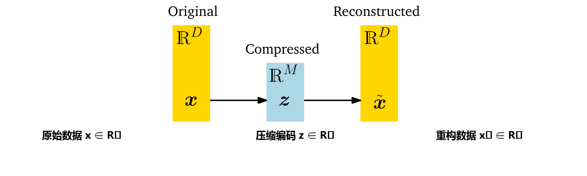

## 10.1 问题设置

在 PCA 中，我们的目标是为高维数据点 $\boldsymbol{x}_n$ 寻找投影点 $\tilde{\boldsymbol{x}}_n$，使得这些投影点尽可能与原始数据点相似，但其内在维度显著降低。图 10.1 直观展示了这种降维效果。

更具体地说，我们考虑一个均值为零的独立同分布（i.i.d.）数据集 $\mathcal{X} = \{\boldsymbol{x}_1, \ldots, \boldsymbol{x}_N\}$（$\boldsymbol{x}_n \in \mathbb{R}^D$），其样本协方差矩阵（式 (6.42)）为：

$$
\boldsymbol{S} = \frac{1}{N}\sum_{n=1}^N \boldsymbol{x}_n \boldsymbol{x}_n^\top .
\tag{10.1}
$$

此外，我们假设存在 $\boldsymbol{x}_n$ 的低维压缩表示（称为 _编码（code）_）：

$$
\boldsymbol{z}_n = \boldsymbol{B}^\top \boldsymbol{x}_n \in \mathbb{R}^M ,
\tag{10.2}
$$

其中我们将投影矩阵定义为：

$$
\boldsymbol{B} := [\boldsymbol{b}_1, \ldots, \boldsymbol{b}_M] \in \mathbb{R}^{D \times M} .
\tag{10.3}
$$

我们假设矩阵 $\boldsymbol{B}$ 的列向量是标准正交的（定义 3.7），即当且仅当 $i = j$ 时 $\boldsymbol{b}_i^\top \boldsymbol{b}_j = 1$，而当 $i \neq j$ 时 $\boldsymbol{b}_i^\top \boldsymbol{b}_j = 0$。我们寻求一个 $M$ 维子空间 $U \subseteq \mathbb{R}^D$（$\dim(U) = M < D$），并将数据投影到该子空间上。我们将投影后的数据记为 $\tilde{\boldsymbol{x}}_n \in U$，其关于子空间 $U$ 的基向量 $\boldsymbol{b}_1, \ldots, \boldsymbol{b}_M$ 的坐标由 $\boldsymbol{z}_n$ 给出。我们的目标是寻找投影点 $\tilde{\boldsymbol{x}}_n \in \mathbb{R}^D$（或等价地寻找编码 $\boldsymbol{z}_n$ 和基向量 $\boldsymbol{b}_1, \ldots, \boldsymbol{b}_M$），使它们尽可能与原始数据 $\boldsymbol{x}_n$ 相似，并最小化由压缩引起的信息损失。

> **例 10.1（坐标表示与编码）**
>
> 考虑具有标准正交基 $\boldsymbol{e}_1 = [1, 0]^\top, \boldsymbol{e}_2 = [0, 1]^\top$ 的向量空间 $\mathbb{R}^2$。由第 2 章可知，任意向量 $\boldsymbol{x} \in \mathbb{R}^2$ 均可表示为这些基向量的线性组合，例如：
>
> $$
> \begin{bmatrix} 5 \\ 3 \end{bmatrix} = 5\boldsymbol{e}_1 + 3\boldsymbol{e}_2 .
> \tag{10.4}
> $$
>
> 然而，当我们考虑形如
>
> $$
> \tilde{\boldsymbol{x}} = \begin{bmatrix} 0 \\ z \end{bmatrix} \in \mathbb{R}^2 , \quad z \in \mathbb{R}
> \tag{10.5}
> $$
>
> 的向量时，它们总是可以写为 $0\boldsymbol{e}_1 + z\boldsymbol{e}_2$。为了完整表示这类向量，我们只需记录/存储 $\tilde{\boldsymbol{x}}$ 关于基向量 $\boldsymbol{e}_2$ 的单个坐标（编码）$z$ 即可。更准确地说，由所有这类 $\tilde{\boldsymbol{x}}$ 构成的集合构成了 $\mathbb{R}^2$ 的一个向量子空间 $U = \text{span}[\boldsymbol{e}_2]$，其维度为 $\dim(U) = 1$。

在 10.2 节中，我们将通过寻找能够保留尽可能多信息并最小化压缩损失的低维表示来推导 PCA。10.3 节给出了 PCA 的另一种等价几何推导视角，我们在其中最小化原始数据 $\boldsymbol{x}_n$ 与其投影 $\tilde{\boldsymbol{x}}_n$ 之间的平方重构误差 $\|\boldsymbol{x}_n - \tilde{\boldsymbol{x}}_n\|^2$。

  
  
<b>图 10.2</b> PCA 的图解示意。在 PCA 中，我们寻找原始数据 x 的低维压缩版本 z；压缩数据可以被重构为 x̃，它生活在原始数据空间中，但其内在维度显著低于 x。

图 10.2 展示了我们在 PCA 中考虑的系统架构：其中 $\boldsymbol{z}$ 代表压缩数据 $\tilde{\boldsymbol{x}}$ 的低维表示，起到了“信息瓶颈”（bottleneck）的作用，控制着 $\boldsymbol{x}$ 与 $\tilde{\boldsymbol{x}}$ 之间能够流动的信息量。在 PCA 中，我们考虑原始数据 $\boldsymbol{x}$ 与其低维编码 $\boldsymbol{z}$ 之间的线性关系，即对于适当的矩阵 $\boldsymbol{B}$，有 $\boldsymbol{z} = \boldsymbol{B}^\top \boldsymbol{x}$ 且 $\tilde{\boldsymbol{x}} = \boldsymbol{B}\boldsymbol{z}$。基于将 PCA 视为数据压缩技术的直觉，我们可以将图 10.2 中的箭头解释为一对编码器（encoder）与解码器（decoder）操作：
- 由矩阵 $\boldsymbol{B}$ 表示的线性映射可以被视为解码器，它将低维编码 $\boldsymbol{z} \in \mathbb{R}^M$ 映射回原始数据空间 $\mathbb{R}^D$；
- 类似地，由矩阵 $\boldsymbol{B}^\top$ 表示的线性映射可以被视为编码器，它将原始高维数据 $\boldsymbol{x}$ 压缩编码为低维表示 $\boldsymbol{z}$。

在贯穿本章的示例中，我们将使用 MNIST 手写数字数据集作为典型案例。该数据集包含 60,000 个手写数字 0 到 9 的样本。每个数字是一张 $28 \times 28$ 像素的灰度图像，即包含 784 个像素点，因此我们可以将该数据集中的每张图像解释为一个高维向量 $\boldsymbol{x} \in \mathbb{R}^{784}$。图 10.3 展示了该数据集中的部分手写数字图像。

  
  
<b>图 10.3</b> 来自 MNIST 数据集的手写数字样本。

