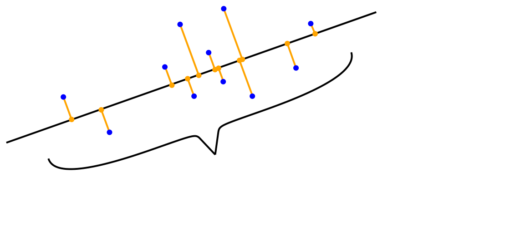
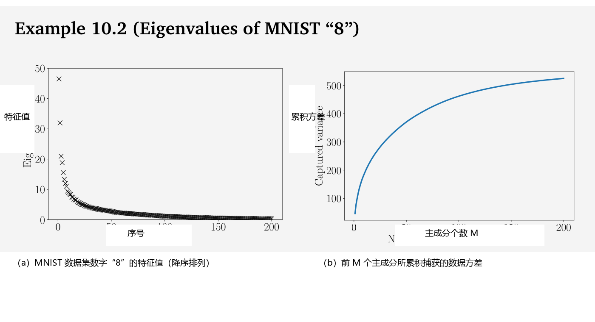

## 10.2 最大方差视角

图 10.1 展示了如何使用单个坐标来表示一个二维数据集。在图 10.1(b) 中，我们之所以选择忽略数据的 $x_2$ 坐标，是因为它包含的信息量很少，从而压缩后的数据与图 10.1(a) 中的原始数据非常相似。如果我们反过来选择忽略 $x_1$ 坐标，那么压缩后的数据将与原始数据大相径庭，数据中的大量关键信息都将丢失。

如果我们将数据中的“信息量”解释为数据集在空间中的“充盈程度”（space filling），那么我们可以通过考察数据的离散程度（分散程度）来量化数据所包含的信息。由 6.4.1 节可知， _方差（variance）_ 是衡量数据分散程度的绝佳指标，因此我们可以将 PCA 推导为一种通过最大化投影空间中低维数据方差来尽可能多地保留原始信息的降维算法。图 10.4 直观地说明了这一点。

  
  
<b>图 10.4</b> 当数据（蓝色）投影到低维子空间（直线，橙色）时，PCA 寻找能够尽可能多地保持数据方差（分散程度）的子空间。

结合 10.1 节讨论的问题设定，我们的目标是寻找一个矩阵 $\boldsymbol{B}$（式 (10.3)），使得当我们将数据投影到由 $\boldsymbol{B}$ 的列向量 $\boldsymbol{b}_1, \ldots, \boldsymbol{b}_M$ 所张成的子空间时，能够保留尽可能多的信息。在数据压缩后保留最多信息，在统计学上等价于使低维编码捕获最大量的方差（Hotelling, 1933）。

_备注（中心化数据）_ 。对于式 (10.1) 中的样本协方差矩阵，我们假定数据是中心化的（均值为零）。我们可以不失一般性地做出这一假设：假设数据的真实样本均值为 $\boldsymbol{\mu}$。利用我们在 6.4.4 节讨论的方差性质，我们有：

$$
\mathbb{V}_{\boldsymbol{z}}[\boldsymbol{z}] = \mathbb{V}_{\boldsymbol{x}}\left[\boldsymbol{B}^\top(\boldsymbol{x} - \boldsymbol{\mu})\right] = \mathbb{V}_{\boldsymbol{x}}\left[\boldsymbol{B}^\top\boldsymbol{x} - \boldsymbol{B}^\top\boldsymbol{\mu}\right] = \mathbb{V}_{\boldsymbol{x}}\left[\boldsymbol{B}^\top\boldsymbol{x}\right] ,
\tag{10.6}
$$

即低维编码的方差与原始数据的均值完全无关。因此，在本节的其余部分，我们不失一般性地假设数据的均值为 $\boldsymbol{0}$。在此假设下，低维编码的均值同样为 $\boldsymbol{0}$，因为 $\mathbb{E}_{\boldsymbol{z}}[\boldsymbol{z}] = \mathbb{E}_{\boldsymbol{x}}[\boldsymbol{B}^\top\boldsymbol{x}] = \boldsymbol{B}^\top\mathbb{E}_{\boldsymbol{x}}[\boldsymbol{x}] = \boldsymbol{0}$。

---

### 10.2.1 最大方差方向

我们采用由浅入深的循序渐进法来最大化低维编码的方差。首先，我们寻求一个单一方向向量 $\boldsymbol{b}_1 \in \mathbb{R}^D$，使得投影数据的方差最大化。这等价于最大化编码 $\boldsymbol{z} \in \mathbb{R}^M$ 的第一个坐标 $z_1$ 的方差，即使得

$$
V_1 := \mathbb{V}[z_1] = \frac{1}{N}\sum_{n=1}^N z_{1n}^2
\tag{10.7}
$$

最大化。这里我们利用了数据的独立同分布假设，并将 $z_{1n}$ 定义为 $\boldsymbol{x}_n \in \mathbb{R}^D$ 的低维表示 $\boldsymbol{z}_n \in \mathbb{R}^M$ 的第一个分量。注意，$\boldsymbol{z}_n$ 的第一个分量由下式给出：

$$
z_{1n} = \boldsymbol{b}_1^\top \boldsymbol{x}_n ,
\tag{10.8}
$$

即它是 $\boldsymbol{x}_n$ 在由 $\boldsymbol{b}_1$ 张成的一维子空间上的正交投影坐标（第 3.8 节）。将式 (10.8) 代入式 (10.7) 中，得到：

$$
V_1 = \frac{1}{N}\sum_{n=1}^N \left(\boldsymbol{b}_1^\top \boldsymbol{x}_n\right)^2 = \frac{1}{N}\sum_{n=1}^N \boldsymbol{b}_1^\top \boldsymbol{x}_n \boldsymbol{x}_n^\top \boldsymbol{b}_1
\tag{10.9a}
$$

$$
= \boldsymbol{b}_1^\top \left( \frac{1}{N}\sum_{n=1}^N \boldsymbol{x}_n \boldsymbol{x}_n^\top \right) \boldsymbol{b}_1 = \boldsymbol{b}_1^\top \boldsymbol{S}\boldsymbol{b}_1 ,
\tag{10.9b}
$$

其中 $\boldsymbol{S}$ 是式 (10.1) 中定义的样本协方差矩阵。在式 (10.9a) 中，我们利用了向量内积是对称的这一事实，即 $\boldsymbol{b}_1^\top \boldsymbol{x}_n = \boldsymbol{x}_n^\top \boldsymbol{b}_1$。

显然，若任意增大向量 $\boldsymbol{b}_1$ 的模长，方差 $V_1$ 也会随之增大（将 $\boldsymbol{b}_1$ 放大两倍将导致 $V_1$ 变为原来的四倍）。因此，为了使优化问题有意义，我们必须将解约束在单位球面 $\|\boldsymbol{b}_1\|^2 = 1$ 上。这导出了一个带约束的连续优化问题，我们在其中寻找数据方差最大的方向：

$$
\max_{\boldsymbol{b}_1} \boldsymbol{b}_1^\top \boldsymbol{S}\boldsymbol{b}_1 \quad \text{subject to} \quad \|\boldsymbol{b}_1\|^2 = 1 .
\tag{10.10}
$$

遵循 7.2 节的拉格朗日乘子法，我们构建拉格朗日函数：

$$
\mathcal{L}(\boldsymbol{b}_1, \lambda_1) = \boldsymbol{b}_1^\top \boldsymbol{S}\boldsymbol{b}_1 + \lambda_1\left(1 - \boldsymbol{b}_1^\top \boldsymbol{b}_1\right) .
\tag{10.11}
$$

$\mathcal{L}$ 分别关于 $\boldsymbol{b}_1$ 和 $\lambda_1$ 的偏导数为：

$$
\frac{\partial \mathcal{L}}{\partial \boldsymbol{b}_1} = 2\boldsymbol{b}_1^\top \boldsymbol{S} - 2\lambda_1\boldsymbol{b}_1^\top ,
\tag{10.12a}
$$

$$
\frac{\partial \mathcal{L}}{\partial \lambda_1} = 1 - \boldsymbol{b}_1^\top \boldsymbol{b}_1 .
\tag{10.12b}
$$

令这些偏导数为零，我们得到：

$$
\boldsymbol{S}\boldsymbol{b}_1 = \lambda_1\boldsymbol{b}_1 ,
\tag{10.13}
$$

$$
\boldsymbol{b}_1^\top \boldsymbol{b}_1 = 1 .
\tag{10.14}
$$

与特征值分解的定义（4.4 节）对比，我们惊喜地发现：$\boldsymbol{b}_1$ 正是样本协方差矩阵 $\boldsymbol{S}$ 的特征向量，而拉格朗日乘子 $\lambda_1$ 恰好扮演了对应特征值的角色！这一特征向量性质使我们能够重写方差目标函数：

$$
V_1 = \boldsymbol{b}_1^\top \boldsymbol{S}\boldsymbol{b}_1 = \lambda_1 \boldsymbol{b}_1^\top \boldsymbol{b}_1 = \lambda_1 ,
\tag{10.15}
$$

即数据投影到一维子空间后的方差，精确等于张成该子空间的基向量 $\boldsymbol{b}_1$ 所对应的特征值。因此，为了使投影后的方差最大化，我们应当选择对应于协方差矩阵 **最大特征值** 的特征向量。该特征向量被称为 _第一主成分（first principal component）_。数量 $\sqrt{\lambda_1}$ 也被称为单位向量 $\boldsymbol{b}_1$ 的载荷（loading），表示主子空间 $\text{span}[\boldsymbol{b}_1]$ 所解释的数据标准差。

我们可以通过将坐标 $z_{1n}$ 映射回原始数据空间来确定主成分 $\boldsymbol{b}_1$ 的投影贡献，从而得到原始空间中的投影点：

$$
\tilde{\boldsymbol{x}}_n = \boldsymbol{b}_1 z_{1n} = \boldsymbol{b}_1 \boldsymbol{b}_1^\top \boldsymbol{x}_n \in \mathbb{R}^D .
\tag{10.16}
$$

_备注_ 。尽管 $\tilde{\boldsymbol{x}}_n$ 是一个 $D$ 维向量，但它关于基向量 $\boldsymbol{b}_1 \in \mathbb{R}^D$ 仅需要单个标量坐标 $z_{1n}$ 即可完整表示。

---

### 10.2.2 最大方差的 $M$ 维子空间

假设我们已经求得了前 $m-1$ 个主成分，它们对应于协方差矩阵 $\boldsymbol{S}$ 的前 $m-1$ 个最大特征值对应的特征向量 $\boldsymbol{b}_1, \ldots, \boldsymbol{b}_{m-1}$。由于 $\boldsymbol{S}$ 是对称矩阵，谱定理（定理 4.15）保证了我们可以利用这些特征向量构造 $\mathbb{R}^D$ 的一个 $(m-1)$ 维子空间的一组标准正交基。

一般地，第 $m$ 个主成分可以通过从数据中剔除前 $m-1$ 个主成分的影响来寻找，从而尝试捕获剩余未被压缩的信息。由此我们构造剔除残差后的新数据矩阵：

$$
\hat{\boldsymbol{X}} := \boldsymbol{X} - \sum_{i=1}^{m-1}\boldsymbol{b}_i \boldsymbol{b}_i^\top \boldsymbol{X} = \boldsymbol{X} - \boldsymbol{B}_{m-1}\boldsymbol{X} ,
\tag{10.17}
$$

其中 $\boldsymbol{X} = [\boldsymbol{x}_1, \ldots, \boldsymbol{x}_N] \in \mathbb{R}^{D \times N}$ 将各个数据点作为列向量包含在内，$\boldsymbol{B}_{m-1} := \sum_{i=1}^{m-1}\boldsymbol{b}_i \boldsymbol{b}_i^\top$ 是向由 $\boldsymbol{b}_1, \ldots, \boldsymbol{b}_{m-1}$ 张成的子空间进行正交投影的投影矩阵。式 (10.17) 中的矩阵 $\hat{\boldsymbol{X}} = [\hat{\boldsymbol{x}}_1, \ldots, \hat{\boldsymbol{x}}_N] \in \mathbb{R}^{D \times N}$ 包含了数据中尚未被前 $m-1$ 个主成分解释的信息。

_备注（符号约定）_ 。在本章中，我们不遵循将数据点 $\boldsymbol{x}_1, \ldots, \boldsymbol{x}_N$ 作为数据矩阵各行的传统数据库习惯，而是将它们定义为 $\boldsymbol{X}$ 的列向量。这意味着我们此处的数据矩阵 $\boldsymbol{X}$ 是一个 $D \times N$ 维矩阵，而非传统的 $N \times D$ 矩阵。这一选择的原因在于，它能使代数运算极为流畅，无需反复转置矩阵或将向量重定义为左乘矩阵的行向量。

为了寻找第 $m$ 个主成分，我们在约束条件 $\|\boldsymbol{b}_m\|^2 = 1$ 下最大化方差：

$$
V_m = \mathbb{V}[z_m] = \frac{1}{N}\sum_{n=1}^N z_{mn}^2 = \frac{1}{N}\sum_{n=1}^N (\boldsymbol{b}_m^\top \hat{\boldsymbol{x}}_n)^2 = \boldsymbol{b}_m^\top \hat{\boldsymbol{S}}\boldsymbol{b}_m ,
\tag{10.18}
$$

其中 $\hat{\boldsymbol{S}}$ 为变换后数据集 $\hat{\boldsymbol{X}}$ 的样本协方差矩阵。与求解第一主成分类似，该带约束优化问题的最优解 $\boldsymbol{b}_m$ 是 $\hat{\boldsymbol{S}}$ 对应于其最大特征值的特征向量。

事实上，$\boldsymbol{b}_m$ 同时也是原始协方差矩阵 $\boldsymbol{S}$ 的特征向量！更一般地，$\boldsymbol{S}$ 与 $\hat{\boldsymbol{S}}$ 的特征向量集合是完全相同的。由于两者均为对称矩阵，由谱定理可知它们拥有共同的标准正交特征基。对于 $\boldsymbol{S}$ 的任意特征向量 $\boldsymbol{b}_i$（即 $\boldsymbol{S}\boldsymbol{b}_i = \lambda_i \boldsymbol{b}_i$），我们有：

$$
\hat{\boldsymbol{S}}\boldsymbol{b}_i = \frac{1}{N}\hat{\boldsymbol{X}}\hat{\boldsymbol{X}}^\top \boldsymbol{b}_i = \frac{1}{N}(\boldsymbol{X} - \boldsymbol{B}_{m-1}\boldsymbol{X})(\boldsymbol{X} - \boldsymbol{B}_{m-1}\boldsymbol{X})^\top \boldsymbol{b}_i
\tag{10.19a}
$$

$$
= \left(\boldsymbol{S} - \boldsymbol{S}\boldsymbol{B}_{m-1} - \boldsymbol{B}_{m-1}\boldsymbol{S} + \boldsymbol{B}_{m-1}\boldsymbol{S}\boldsymbol{B}_{m-1}\right)\boldsymbol{b}_i .
\tag{10.19b}
$$

我们分两种情形进行讨论：
1. 若 $i \geqslant m$（即 $\boldsymbol{b}_i$ 不在前 $m-1$ 个主成分中），则 $\boldsymbol{b}_i$ 正交于前 $m-1$ 个主成分，故 $\boldsymbol{B}_{m-1}\boldsymbol{b}_i = \boldsymbol{0}$；
2. 若 $i < m$（即 $\boldsymbol{b}_i$ 属于前 $m-1$ 个主成分之一），则 $\boldsymbol{b}_i$ 属于投影子空间的基向量，故 $\boldsymbol{B}_{m-1}\boldsymbol{b}_i = \boldsymbol{b}_i$。

总结如下：

$$
\boldsymbol{B}_{m-1}\boldsymbol{b}_i = \begin{cases} \boldsymbol{b}_i , & \text{若 } i < m , \\ \boldsymbol{0} , & \text{若 } i \geqslant m . \end{cases}
\tag{10.20}
$$

当 $i \geqslant m$ 时，将式 (10.20) 代入式 (10.19b) 中，得到：

$$
\hat{\boldsymbol{S}}\boldsymbol{b}_i = (\boldsymbol{S} - \boldsymbol{B}_{m-1}\boldsymbol{S})\boldsymbol{b}_i = \boldsymbol{S}\boldsymbol{b}_i = \lambda_i \boldsymbol{b}_i ,
$$

即 $\boldsymbol{b}_i$ 也是 $\hat{\boldsymbol{S}}$ 的特征值为 $\lambda_i$ 的特征向量。特别地，对于 $i = m$：

$$
\hat{\boldsymbol{S}}\boldsymbol{b}_m = \boldsymbol{S}\boldsymbol{b}_m = \lambda_m \boldsymbol{b}_m .
\tag{10.21}
$$

式 (10.21) 揭示出：$\lambda_m$ 既是 $\hat{\boldsymbol{S}}$ 的最大特征值，也是 $\boldsymbol{S}$ 的第 $m$ 大特征值，两者的对应特征向量均为 $\boldsymbol{b}_m$。

当 $i < m$ 时，代入式 (10.19b) 得到：

$$
\hat{\boldsymbol{S}}\boldsymbol{b}_i = (\boldsymbol{S} - \boldsymbol{S} - \boldsymbol{S} + \boldsymbol{S})\boldsymbol{b}_i = \boldsymbol{0} = 0\boldsymbol{b}_i .
\tag{10.22}
$$

这意味着 $\boldsymbol{b}_1, \ldots, \boldsymbol{b}_{m-1}$ 也是 $\hat{\boldsymbol{S}}$ 的特征向量，但对应的特征值退化为 0，即它们张成了 $\hat{\boldsymbol{S}}$ 的零空间（null space）。

综上所述，$\boldsymbol{S}$ 的每一个特征向量同样也是 $\hat{\boldsymbol{S}}$ 的特征向量。由式 (10.21) 和 $\boldsymbol{b}_m^\top \boldsymbol{b}_m = 1$，数据投影到第 $m$ 个主成分上的方差为：

$$
V_m = \boldsymbol{b}_m^\top \boldsymbol{S}\boldsymbol{b}_m = \lambda_m \boldsymbol{b}_m^\top \boldsymbol{b}_m = \lambda_m .
\tag{10.23}
$$

这意味着：当数据投影到一个 $M$ 维子空间时，所捕获的数据总方差恰好等于协方差矩阵对应的前 $M$ 个特征向量的特征值之和！

> **例 10.2（MNIST 数字“8”的特征值）**
>
> 取 MNIST 训练集中所有的手写数字“8”，计算其数据协方差矩阵的特征值。图 10.5(a) 展示了协方差矩阵中最大的 200 个特征值。我们清晰地看到，只有少数特征值显著大于零，其余特征值均迅速衰减趋向于零。因此，如图 10.5(b) 所示，当把数据投影到对应特征向量所张成的子空间时，绝大部分的数据方差仅由前少数几个主成分就足以充分捕获。

  
  
<b>图 10.5</b> MNIST 数字“8”训练数据的统计特性。(a) 样本协方差矩阵按降序排列的特征值；(b) 对应最大特征值的主成分所累积捕获的方差。

总而言之，为了在 $\mathbb{R}^D$ 中寻找一个保留尽可能多信息的 $M$ 维子空间，PCA 明确告诉我们：**应当将投影矩阵 $\boldsymbol{B}$（式 (10.3)）的列向量选取为数据协方差矩阵 $\boldsymbol{S}$ 对应于 $M$ 个最大特征值的特征向量**。

前 $M$ 个主成分所能捕获的最大方差总量为：

$$
V_M = \sum_{m=1}^M \lambda_m ,
\tag{10.24}
$$

其中 $\lambda_m$ 为 $\boldsymbol{S}$ 的前 $M$ 个最大特征值。相应地，通过 PCA 压缩数据所损失的方差为剩余特征值的和：

$$
J_M := \sum_{j=M+1}^D \lambda_j = V_D - V_M .
\tag{10.25}
$$

除了绝对方差指标，我们还常常定义相对捕获方差比率 $\frac{V_M}{V_D}$（常称为 _解释方差比（explained variance ratio）_），以及由压缩造成的相对方差损失率 $1 - \frac{V_M}{V_D}$。
