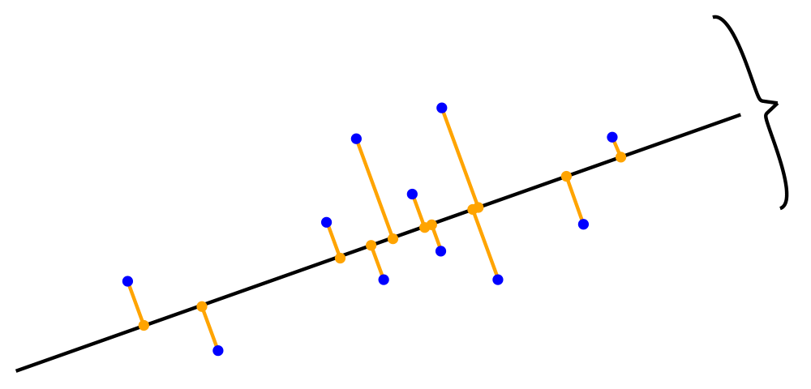
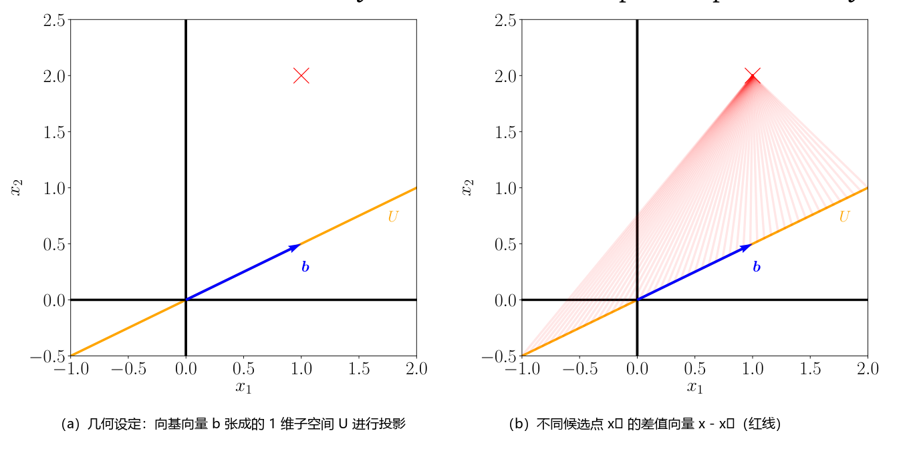
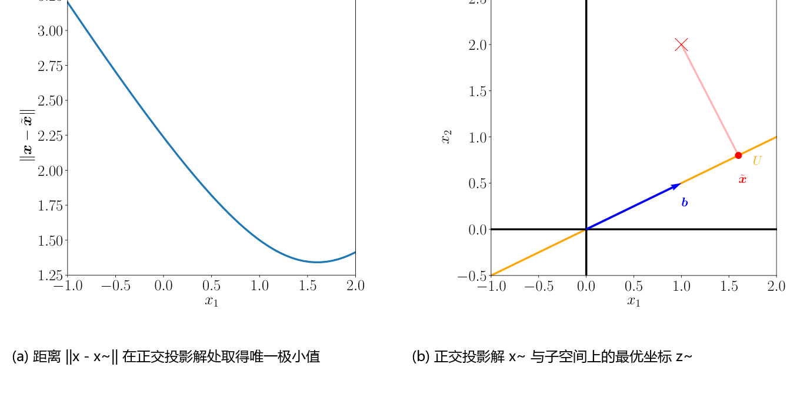
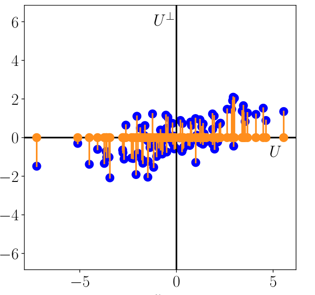
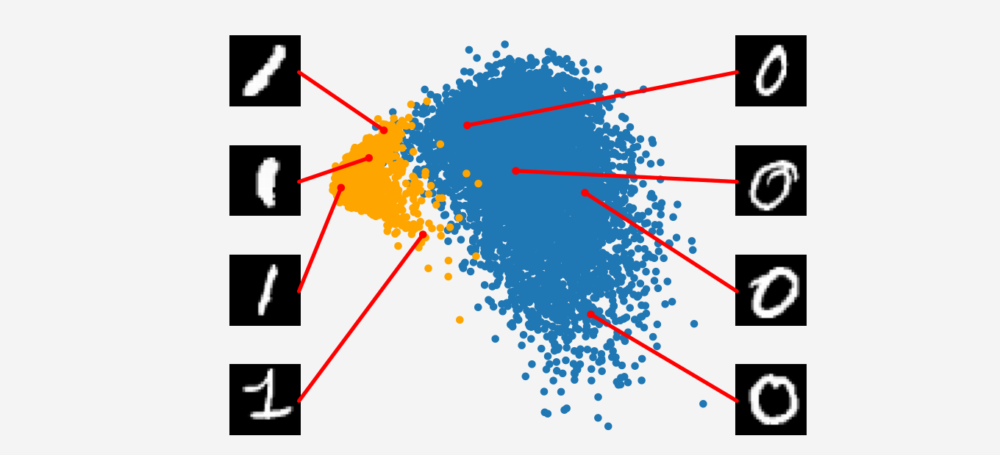

## 10.3 投影视角

在下文中，我们将把 PCA 推导为一种直接最小化平均重构误差的算法。这一视角使我们能够将 PCA 解释为实现了一个最优的线性自动编码器（linear auto-encoder）。在推导过程中，我们将深度运用第 2 章与第 3 章的几何工具。

在上一节中，我们通过最大化投影空间中的方差来保留尽可能多的信息，从而推导了 PCA。接下来，我们将考察原始数据点 $\boldsymbol{x}_n$ 与其重构点 $\tilde{\boldsymbol{x}}_n$ 之间的差值向量（位移向量），并通过最小化这一几何距离使得 $\boldsymbol{x}_n$ 与 $\tilde{\boldsymbol{x}}_n$ 尽可能接近。图 10.6 直观地展示了这一几何设定。

  
  
<b>图 10.6</b> 投影视角示意图：寻找一个子空间（直线），使得投影数据点（橙色）与原始数据点（蓝色）之间的差值向量长度（平方和）最小。

---

### 10.3.1 设定与目标

假定 $\mathcal{B} = (\boldsymbol{b}_1, \ldots, \boldsymbol{b}_D)$ 是 $\mathbb{R}^D$ 的一组（有序）标准正交基（ONB），即当且仅当 $i = j$ 时 $\boldsymbol{b}_i^\top \boldsymbol{b}_j = 1$，否则为 $0$。

由 2.5 节可知，对于 $\mathbb{R}^D$ 的任意基向量组 $(\boldsymbol{b}_1, \ldots, \boldsymbol{b}_D)$，任意向量 $\boldsymbol{x} \in \mathbb{R}^D$ 均可唯一表示为这些基向量的线性组合：

$$
\boldsymbol{x} = \sum_{d=1}^D \zeta_d \boldsymbol{b}_d = \sum_{m=1}^M \zeta_m \boldsymbol{b}_m + \sum_{j=M+1}^D \zeta_j \boldsymbol{b}_j ,
\tag{10.26}
$$

其中 $\zeta_d \in \mathbb{R}$ 为对应基向量下的坐标。

我们感兴趣的是在低维子空间 $U \subseteq \mathbb{R}^D$（$\dim(U) = M$）中寻找向量 $\tilde{\boldsymbol{x}} \in \mathbb{R}^D$，使得

$$
\tilde{\boldsymbol{x}} = \sum_{m=1}^M z_m \boldsymbol{b}_m \in U \subseteq \mathbb{R}^D
\tag{10.27}
$$

与 $\boldsymbol{x}$ 尽可能相似。请注意，在此处我们暂且假设 $\tilde{\boldsymbol{x}}$ 的坐标 $z_m$ 与 $\boldsymbol{x}$ 的坐标 $\zeta_m$ 是未知的，不必事先假定它们完全相同。

接下来，我们正是利用 $\tilde{\boldsymbol{x}}$ 的这种表示形式来求解最优坐标 $\boldsymbol{z}$ 以及最优基向量 $\boldsymbol{b}_1, \ldots, \boldsymbol{b}_M$，使得 $\tilde{\boldsymbol{x}}$ 与原始数据点 $\boldsymbol{x}$ 尽可能接近，即最小化欧几里得距离 $\|\boldsymbol{x} - \tilde{\boldsymbol{x}}\|$。图 10.7 对这种几何配置进行了直观图解。

  
  
<b>图 10.7</b> 简化的投影设定。(a) 向量 x ∈ R²（红叉）将被投影到由基向量 b 张成的一维子空间 U ⊆ R² 上；(b) 展示了 x 与若干候选重构点 x̃ 之间的差值向量 x - x̃（红线）。

不失一般性，我们假设数据集 $\mathcal{X} = \{\boldsymbol{x}_1, \ldots, \boldsymbol{x}_N\}$（$\boldsymbol{x}_n \in \mathbb{R}^D$）是中心化的，即样本均值为零 $\mathbb{E}[\mathcal{X}] = \boldsymbol{0}$。若不假设零均值，推导出的数学结论完全一致，但公式符号会繁琐得多。

我们希望寻找 $\mathcal{X}$ 向 $\mathbb{R}^D$ 的 $M$ 维低维子空间 $U$（具有标准正交基 $\boldsymbol{b}_1, \ldots, \boldsymbol{b}_M$）的最佳线性投影。我们称该子空间 $U$ 为 _主子空间（principal subspace）_ 。数据点的投影点记为：

$$
\tilde{\boldsymbol{x}}_n := \sum_{m=1}^M z_{mn} \boldsymbol{b}_m = \boldsymbol{B}\boldsymbol{z}_n \in \mathbb{R}^D ,
\tag{10.28}
$$

其中 $\boldsymbol{z}_n := [z_{1n}, \ldots, z_{Mn}]^\top \in \mathbb{R}^M$ 是 $\tilde{\boldsymbol{x}}_n$ 关于基 $(\boldsymbol{b}_1, \ldots, \boldsymbol{b}_M)$ 的坐标向量。更具体地说，我们希望 $\tilde{\boldsymbol{x}}_n$ 与 $\boldsymbol{x}_n$ 尽可能接近。

我们采用欧几里得距离平方 $\|\boldsymbol{x}_n - \tilde{\boldsymbol{x}}_n\|^2$ 作为衡量两点差异的指标。因此，我们将目标函数定义为最小化平均平方欧几里得距离（即 _重构误差（reconstruction error）_ ，Pearson, 1901）：

$$
J_M := \frac{1}{N}\sum_{n=1}^N \|\boldsymbol{x}_n - \tilde{\boldsymbol{x}}_n\|^2 ,
\tag{10.29}
$$

其中下标 $M$ 显式标明了数据所投影到的子空间维度。为了寻找最优线性投影，我们需要确定两组未知量：
1. 主子空间的一组标准正交基向量 $\boldsymbol{b}_1, \ldots, \boldsymbol{b}_M$；
2. 投影点关于该组基的坐标 $\boldsymbol{z}_n \in \mathbb{R}^M$（$n = 1, \ldots, N$）。

为此，我们采取两步优化策略：首先，在给定任意标准正交基 $(\boldsymbol{b}_1, \ldots, \boldsymbol{b}_M)$ 的条件下优化坐标 $\boldsymbol{z}_n$；其次，求解最优的标准正交基。

---

### 10.3.2 寻找最优坐标

让我们首先固定一组标准正交基 $(\boldsymbol{b}_1, \ldots, \boldsymbol{b}_M)$，求解使重构误差最小的最优坐标 $z_{1n}, \ldots, z_{Mn}$（$n = 1, \ldots, N$）。审视图 10.7(b)，当主子空间由单一向量 $\boldsymbol{b}$ 张成时，从几何直观上寻找最优坐标 $z$ 等价于在由 $\boldsymbol{b}$ 张成的直线上寻找与 $\boldsymbol{x}$ 距离最近的投影点 $\tilde{\boldsymbol{x}}$。显然，这一最近点必然是 $\boldsymbol{x}$ 在该直线上的 **正交投影点**。下面我们进行严谨证明。

利用链式求导法则，目标函数 $J_M$ 关于坐标分量 $z_{in}$（$i = 1, \ldots, M$）的偏导数为：

$$
\frac{\partial J_M}{\partial z_{in}} = \frac{\partial J_M}{\partial \tilde{\boldsymbol{x}}_n}\frac{\partial \tilde{\boldsymbol{x}}_n}{\partial z_{in}} ,
\tag{10.30a}
$$

其中

$$
\frac{\partial J_M}{\partial \tilde{\boldsymbol{x}}_n} = -\frac{2}{N}(\boldsymbol{x}_n - \tilde{\boldsymbol{x}}_n)^\top \in \mathbb{R}^{1 \times D} ,
\tag{10.30b}
$$

以及由式 (10.28)：

$$
\frac{\partial \tilde{\boldsymbol{x}}_n}{\partial z_{in}} = \frac{\partial}{\partial z_{in}}\left[ \sum_{m=1}^M z_{mn} \boldsymbol{b}_m \right] = \boldsymbol{b}_i .
\tag{10.30c}
$$

将式 (10.30b) 和 (10.30c) 结合：

$$
\frac{\partial J_M}{\partial z_{in}} = -\frac{2}{N}(\boldsymbol{x}_n - \tilde{\boldsymbol{x}}_n)^\top \boldsymbol{b}_i = -\frac{2}{N}\left( \boldsymbol{x}_n - \sum_{m=1}^M z_{mn} \boldsymbol{b}_m \right)^\top \boldsymbol{b}_i
\tag{10.31a}
$$

$$
\overset{\text{ONB}}{=} -\frac{2}{N}\left(\boldsymbol{x}_n^\top \boldsymbol{b}_i - z_{in}\boldsymbol{b}_i^\top \boldsymbol{b}_i\right) = -\frac{2}{N}\left(\boldsymbol{x}_n^\top \boldsymbol{b}_i - z_{in}\right) ,
\tag{10.31b}
$$

这里我们利用了基向量的标准正交性（$\boldsymbol{b}_m^\top \boldsymbol{b}_i = 0$ 当 $m \neq i$，以及 $\boldsymbol{b}_i^\top \boldsymbol{b}_i = 1$）。令该偏导数为 0，我们立即解得最优坐标：

$$
z_{in} = \boldsymbol{x}_n^\top \boldsymbol{b}_i = \boldsymbol{b}_i^\top \boldsymbol{x}_n , \quad i = 1, \ldots, M , \quad n = 1, \ldots, N .
\tag{10.32}
$$

这意味着：投影点 $\tilde{\boldsymbol{x}}_n$ 的最优坐标 $z_{in}$ 恰好是原始数据点 $\boldsymbol{x}_n$ 在由基向量 $\boldsymbol{b}_i$ 张成的一维子空间上的正交投影坐标（参见第 3.8 节）。由此得出三条极其重要的核心结论：
1. **数据点 $\boldsymbol{x}_n$ 的最优线性投影 $\tilde{\boldsymbol{x}}_n$ 必然是正交投影**；
2. **$\tilde{\boldsymbol{x}}_n$ 关于基 $(\boldsymbol{b}_1, \ldots, \boldsymbol{b}_M)$ 的坐标，正是 $\boldsymbol{x}_n$ 向主子空间作正交投影所得的坐标**；
3. **在均方误差目标 (10.29) 下，正交投影是数学上最优的线性降维映射**。

图 10.8 展示了这一正交投影性质与距离极小值的几何对应关系。

  
  
<b>图 10.8</b> 向量 x ∈ R² 向一维子空间的最佳投影。(a) 不同候选点 x̃ 的距离 ∥x - x̃∥，在正交投影点处取得极小值；(b) 正交投影解 x̃ 与基向量 b 上的投影坐标 z₁。

_备注_ （标准正交基下的正交投影） 。简要回顾 3.8 节的正交投影理论：若 $(\boldsymbol{b}_1, \ldots, \boldsymbol{b}_D)$ 为 $\mathbb{R}^D$ 的标准正交基，则向由单个基向量 $\boldsymbol{b}_j$ 张成的一维子空间的正交投影为：

$$
\tilde{\boldsymbol{x}} = \boldsymbol{b}_j (\boldsymbol{b}_j^\top \boldsymbol{b}_j)^{-1}\boldsymbol{b}_j^\top \boldsymbol{x} = \boldsymbol{b}_j \boldsymbol{b}_j^\top \boldsymbol{x} \in \mathbb{R}^D ,
\tag{10.33}
$$

对应的坐标为标量 $z_j = \boldsymbol{b}_j^\top \boldsymbol{x}$。更一般地，若向由标准正交基 $\boldsymbol{b}_1, \ldots, \boldsymbol{b}_M$ 张成的 $M$ 维子空间进行正交投影，投影点为：

$$
\tilde{\boldsymbol{x}} = \boldsymbol{B}(\boldsymbol{B}^\top \boldsymbol{B})^{-1}\boldsymbol{B}^\top \boldsymbol{x} = \boldsymbol{B}\boldsymbol{B}^\top \boldsymbol{x} ,
\tag{10.34}
$$

其中利用了 $\boldsymbol{B}^\top \boldsymbol{B} = \boldsymbol{I}_M$。该投影在有序基 $(\boldsymbol{b}_1, \ldots, \boldsymbol{b}_M)$ 下的坐标向量为 $\boldsymbol{z} := \boldsymbol{B}^\top \boldsymbol{x} \in \mathbb{R}^M$。

---

### 10.3.3 寻找主子空间的基

确定了给定基下的最优坐标后，接下来的核心任务是寻找最优的标准正交基向量 $\boldsymbol{b}_1, \ldots, \boldsymbol{b}_M$。我们将已求得的最优坐标结果代入损失函数 (10.29) 中对其进行等价重构：

$$
\tilde{\boldsymbol{x}}_n = \sum_{m=1}^M z_{mn}\boldsymbol{b}_m \overset{(10.32)}{=} \sum_{m=1}^M (\boldsymbol{x}_n^\top \boldsymbol{b}_m)\boldsymbol{b}_m = \left( \sum_{m=1}^M \boldsymbol{b}_m \boldsymbol{b}_m^\top \right) \boldsymbol{x}_n .
\tag{10.35}
$$

由于完整的原始数据点 $\boldsymbol{x}_n$ 可以按全部 $D$ 个基向量精确展开：

$$
\boldsymbol{x}_n = \sum_{d=1}^D z_{dn}\boldsymbol{b}_d = \left( \sum_{d=1}^D \boldsymbol{b}_d \boldsymbol{b}_d^\top \right) \boldsymbol{x}_n = \left( \sum_{m=1}^M \boldsymbol{b}_m \boldsymbol{b}_m^\top \right) \boldsymbol{x}_n + \left( \sum_{j=M+1}^D \boldsymbol{b}_j \boldsymbol{b}_j^\top \right) \boldsymbol{x}_n ,
\tag{10.36}
$$

我们将包含 $D$ 项的求和拆分为前 $M$ 项与后 $D-M$ 项。据此，原始数据点与重构点之间的差值向量（位移向量）精确为：

$$
\boldsymbol{x}_n - \tilde{\boldsymbol{x}}_n = \left( \sum_{j=M+1}^D \boldsymbol{b}_j \boldsymbol{b}_j^\top \right) \boldsymbol{x}_n = \sum_{j=M+1}^D (\boldsymbol{x}_n^\top \boldsymbol{b}_j)\boldsymbol{b}_j .
\tag{10.37}
$$

这表明：**重构误差向量 $\boldsymbol{x}_n - \tilde{\boldsymbol{x}}_n$ 恰好是数据点 $\boldsymbol{x}_n$ 在主子空间的正交补空间 $U^\perp$ 上的正交投影**！如图 10.9 所示，矩阵 $\sum_{j=M+1}^D \boldsymbol{b}_j \boldsymbol{b}_j^\top$ 正是向正交补空间 $U^\perp$ 投影的投影矩阵。

  
  
<b>图 10.9</b> 正交投影与位移向量。当把数据点 xₙ（蓝色）投影到子空间 U 上得到 x̃ₙ（橙色）时，位移向量 x̃ₙ - xₙ 完全落在 U 的正交补子空间 U^⊥ 中。

_备注_ （低秩矩阵近似） 。向主子空间投影的投影矩阵由下式给出：

$$
\sum_{m=1}^M \boldsymbol{b}_m \boldsymbol{b}_m^\top = \boldsymbol{B}\boldsymbol{B}^\top .
\tag{10.38}
$$

作为 $M$ 个秩一外积矩阵的和，对称矩阵 $\boldsymbol{B}\boldsymbol{B}^\top$ 的秩恰好为 $M$。因此，平均平方重构误差可以等价写为：

$$
\frac{1}{N}\sum_{n=1}^N \|\boldsymbol{x}_n - \tilde{\boldsymbol{x}}_n\|^2 = \frac{1}{N}\sum_{n=1}^N \|\boldsymbol{x}_n - \boldsymbol{B}\boldsymbol{B}^\top \boldsymbol{x}_n\|^2 = \frac{1}{N}\sum_{n=1}^N \|(\boldsymbol{I} - \boldsymbol{B}\boldsymbol{B}^\top)\boldsymbol{x}_n\|^2 .
\tag{10.39}
$$

寻找最小化重构误差的标准正交基向量 $\boldsymbol{b}_1, \ldots, \boldsymbol{b}_M$，等价于寻找单位矩阵 $\boldsymbol{I}$ 的最佳秩 $M$ 近似矩阵 $\boldsymbol{B}\boldsymbol{B}^\top$（见 4.6 节）。

现在我们将式 (10.37) 代入重构误差函数 (10.29)：

$$
J_M = \frac{1}{N}\sum_{n=1}^N \|\boldsymbol{x}_n - \tilde{\boldsymbol{x}}_n\|^2 = \frac{1}{N}\sum_{n=1}^N \left\| \sum_{j=M+1}^D (\boldsymbol{b}_j^\top \boldsymbol{x}_n)\boldsymbol{b}_j \right\|^2 .
\tag{10.40}
$$

由于基向量 $\boldsymbol{b}_j$ 相互正交且模长为 1，展开范数平方可得：

$$
J_M = \frac{1}{N}\sum_{n=1}^N \sum_{j=M+1}^D (\boldsymbol{b}_j^\top \boldsymbol{x}_n)^2 = \frac{1}{N}\sum_{n=1}^N \sum_{j=M+1}^D \boldsymbol{b}_j^\top \boldsymbol{x}_n \boldsymbol{x}_n^\top \boldsymbol{b}_j .
\tag{10.41}
$$

交换求和次序，我们得到极为优雅的代数结果：

$$
J_M = \sum_{j=M+1}^D \boldsymbol{b}_j^\top \left( \frac{1}{N}\sum_{n=1}^N \boldsymbol{x}_n \boldsymbol{x}_n^\top \right) \boldsymbol{b}_j = \sum_{j=M+1}^D \boldsymbol{b}_j^\top \boldsymbol{S}\boldsymbol{b}_j
\tag{10.42a}
$$

$$
= \sum_{j=M+1}^D \text{tr}\left(\boldsymbol{b}_j^\top \boldsymbol{S}\boldsymbol{b}_j\right) = \sum_{j=M+1}^D \text{tr}\left(\boldsymbol{S}\boldsymbol{b}_j \boldsymbol{b}_j^\top\right) = \text{tr}\left( \left( \sum_{j=M+1}^D \boldsymbol{b}_j \boldsymbol{b}_j^\top \right) \boldsymbol{S} \right) ,
\tag{10.42b}
$$

其中我们利用了迹算子 $\text{tr}(\cdot)$ 的线性性质和循环置换不变性（式 (4.18)）。

式 (10.42a) 揭示了一个深刻的对偶事实：**平均平方重构误差等价于数据投影到主子空间的正交补空间后所保留的方差**！因此：
- **最小化平均平方重构误差**，等价于 **最小化被我们丢弃的子空间（正交补空间）中的数据方差**；
- 等价地，这也等价于 **最大化保留在主子空间中的数据投影方差**！

这直接建立了投影视角与 10.2 节最大方差视角之间的严格数学等价性。根据 10.2 节的结论，在正交约束下，当选取的基向量为数据协方差矩阵的特征向量时，$J_M$ 达到极值：

$$
J_M = \sum_{j=M+1}^D \lambda_j .
\tag{10.43}
$$

为了使重构误差 $J_M$ 达到全局最小，我们必须挑选数据协方差矩阵 **最小的 $D-M$ 个特征值** 对应的特征向量作为正交补空间的基向量。这意味着：**主子空间的基向量 $\boldsymbol{b}_1, \ldots, \boldsymbol{b}_M$ 必须精准选取为数据协方差矩阵对应于最大的 $M$ 个特征值的特征向量**！

> **例 10.3（MNIST 数字低维嵌入）**
>
> 图 10.10 可视化了 MNIST 数据集中手写数字“0”（蓝点）和“1”（橙点）嵌入到前两个主成分张成的二维主子空间中的结果。我们在图上高亮标出了部分数据点及其原始图像。该图揭示出：“0”与“1”在低维主子空间中展现出极其清晰的聚类分离界面，且数字“0”内部的形态方差显著大于数字“1”的内部方差。

  
  
<b>图 10.10</b> 使用 PCA 将 MNIST 数字 0（蓝色）与 1（橙色）嵌入到二维主子空间中。四个高亮红点展示了对应的原始数字图像。

