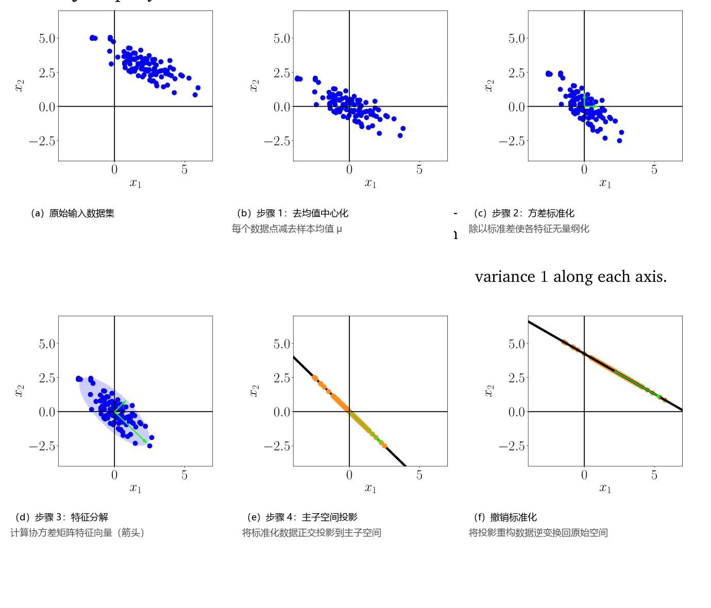
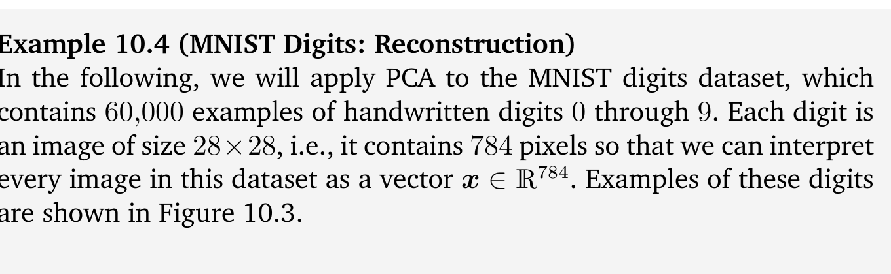
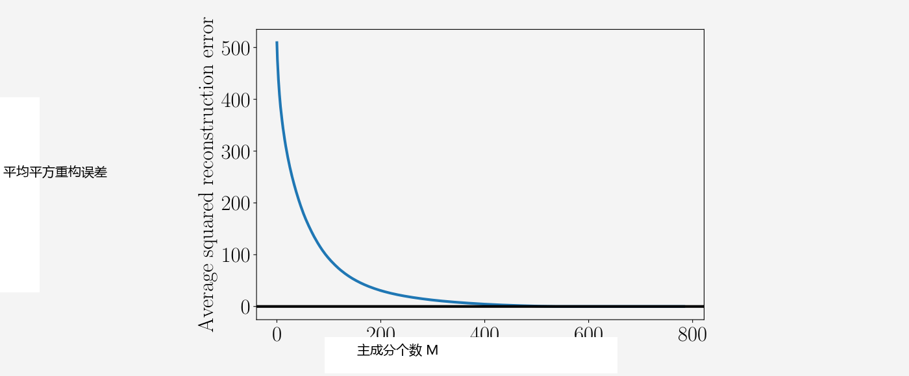

## 10.6 实践中 PCA 的关键步骤

在下文中，我们将通过一个贯穿始终的典型示例详细剖析在实际工程应用中执行 PCA 的标准具体步骤。该流程完整总结在图 10.11 中。我们给定一个二维数据集（图 10.11(a)），并希望使用 PCA 将其正交投影到一个一维主子空间上。

  
  
<b>图 10.11</b> PCA 的实践步骤。(a) 原始数据集；(b) 去均值中心化；(c) 除以标准差进行方差标准化；(d) 协方差矩阵特征分解；(e) 向主子空间投影；(f) 撤销标准化并映射回原始数据空间。

1. **去均值中心化（Mean Subtraction）**：我们首先计算数据集的样本均值向量 $\boldsymbol{\mu}$，并从每一个数据点中减去该均值。这确保了中心化后的数据集样本均值严格为 $\boldsymbol{0}$（图 10.11(b)）。去均值操作虽然并非在所有理论定义中都不可或缺，但它能显著降低数值病态和精度下溢的风险。
2. **方差标准化（Standardization）**：对于每个维度 $d = 1, \ldots, D$，将数据除以该维度上的样本标准差 $\sigma_d$。经过此步骤，数据变得无量纲化，且沿各个坐标轴的方差均为 1，如图 10.11(c) 中的两个等长箭头所示。该步骤完成了数据的标准化预处理。
3. **协方差矩阵的特征分解（Eigendecomposition of the Covariance Matrix）**：计算标准化数据的样本协方差矩阵及其对应的特征值与特征向量。由于协方差矩阵是对称矩阵，谱定理（定理 4.15）保证我们可以找到一组标准正交特征基。在图 10.11(d) 中，特征向量按对应特征值的大小进行了尺度缩放。较长的特征向量张成了主子空间 $U$。协方差矩阵的等高线由椭圆直观呈现。
4. **正交投影（Projection）**：现在我们可以将任意新数据点 $\boldsymbol{x}_* \in \mathbb{R}^D$ 投影到主子空间上。为了保证量纲与训练阶段完全一致，我们需要首先使用训练数据的均值 $\mu_d$ 和标准差 $\sigma_d$ 对 $\boldsymbol{x}_*$ 进行标准化：
   
$$
x_*^{(d)} \leftarrow \frac{x_*^{(d)} - \mu_d}{\sigma_d} , \quad d = 1, \ldots, D ,
\tag{10.58}
$$

其中 $x_*^{(d)}$ 是 $\boldsymbol{x}_*$ 的第 $d$ 个分量。标准化后，我们在主子空间上的正交投影点为：

$$
\tilde{\boldsymbol{x}}_* = \boldsymbol{B}\boldsymbol{B}^\top \boldsymbol{x}_* ,
\tag{10.59}
$$

其关于主子空间基向量的低维坐标向量为：

$$
\boldsymbol{z}_* = \boldsymbol{B}^\top \boldsymbol{x}_* .
\tag{10.60}
$$

在此，矩阵 $\boldsymbol{B}$ 的列向量包含协方差矩阵对应于最大特征值的特征向量。PCA 最终输出的是紧凑的低维坐标编码 (10.60)，而非高维重构点 $\tilde{\boldsymbol{x}}_*$。

由于我们的模型建立在标准化数据集之上，式 (10.59) 给出的仅是标准化空间中的投影。若要在原始物理数据空间（即标准化之前）中获得重构点，我们需要撤销标准化操作 (10.58)：先乘以标准差，再加上均值：

$$
\tilde{x}_*^{(d)} \leftarrow \tilde{x}_*^{(d)}\sigma_d + \mu_d , \quad d = 1, \ldots, D .
\tag{10.61}
$$

图 10.11(f) 展示了映射回原始数据空间后的最终投影重构结果。

> **例 10.4（MNIST 数字：图像重构）**
>
> 接下来，我们将 PCA 应用于 MNIST 手写数字数据集。该数据集包含 60,000 个手写数字 0 到 9 的图像，每个图像大小为 $28 \times 28$（共 784 个像素），因此可视为高维向量 $\boldsymbol{x} \in \mathbb{R}^{784}$。
>
> 出于演示目的，我们选取数字“8”的 5,389 张训练图像，按照前述步骤确定主子空间，并使用学习到的投影矩阵重构一组测试图像，如图 10.12 所示。

  
  
<b>图 10.12</b> 增加主成分个数对图像重构质量的影响。第一行为原始图像，随后各行分别对应使用 1、10、100 和 500 个主成分的重构图像。

图 10.12 的第一行展示了测试集中的 4 个原始数字图像。随后各行分别展示了使用 1、10、100 和 500 个主成分的重构结果。我们清晰地看到：即便仅使用单一的一维主子空间，我们也能获得原始数字轮廓的一个粗略但可辨识的重构（略显模糊和泛化）；随着主成分数量的增加，重构图像迅速变得锐利，笔画细节被完整保留；当增加至 500 个主成分时，重构效果几乎与原始图像无异。若选用全部 784 个主成分，则重构误差为零，实现 100% 无损复原。

图 10.13 展示了平均平方重构误差随主成分个数 $M$ 的变化曲线：

$$
\frac{1}{N}\sum_{n=1}^N \|\boldsymbol{x}_n - \tilde{\boldsymbol{x}}_n\|^2 = \sum_{i=M+1}^D \lambda_i .
\tag{10.62}
$$

  
  
<b>图 10.13</b> 平均平方重构误差随主成分个数 M 的变化曲线。平均平方重构误差精确等于主子空间正交补空间中所有特征值的总和。

我们可以发现，主成分的重要性呈现出指数级骤降，在达到一定数量后，继续增加主成分所带来的信息增益极其微小。这与我们在图 10.5 中的发现完全契合——绝大部分数据方差仅由少数前列的主成分所主导。在选用约 550 个主成分时，重构误差已基本归零（数字边缘周围的像素在整个数据集中始终为黑色，方差本就为 0）。
