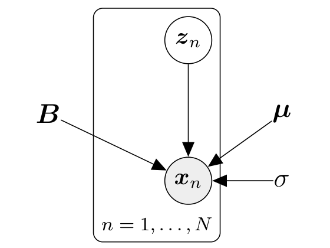
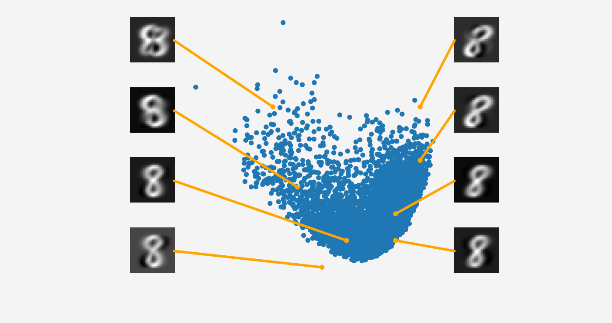

## 10.7 隐变量视角

在前面的小节中，我们从最大方差和投影几何两个视角推导了 PCA，这两个视角完全没有引入任何概率模型的概念。一方面，这种确定性的几何推导非常吸引人，因为它绕开了概率论中复杂的积分与推断运算；但另一方面，构建一个显式的概率模型将为我们提供更强大的建模灵活性以及深刻的理论洞见。具体而言，概率模型能够：
1. 提供显式的似然函数，从而能够原则性地处理带噪声观测（我们在之前的几何推导中甚至未讨论噪声建模）；
2. 借助 8.6 节讨论的边缘似然执行严格的贝叶斯模型选择与维度比较；
3. 将 PCA 解释为一种 _生成模型（generative model）_，使我们能够自主采样并模拟合成全新的数据样本；
4. 建立与因子分析（Factor Analysis）等密切相关经典模型的直接数学桥梁；
5. 借助贝叶斯定理自然处理随机缺失某些维度特征的不完整数据；
6. 量化测试数据点的新颖度（用于异常检测与离群点识别）；
7. 提供原则性的模型拓展框架（例如高斯混合 PCA 模型）；
8. 将经典 PCA 作为零噪声极限下的一个特例完美涵盖；
9. 允许通过对模型参数进行边缘化积分开展全贝叶斯推断。

通过引入一个连续型 _隐变量（latent variable）_ $\boldsymbol{z} \in \mathbb{R}^M$，我们可以将 PCA 严谨表述为一个概率隐变量模型。Tipping and Bishop (1999) 提出了这一框架，称之为 _概率主成分分析（probabilistic PCA, PPCA）_。PPCA 完美解决了上述所有理论问题，我们在前文中通过最大化投影方差或最小化重构误差所得的传统 PCA 解，正是 PPCA 在无噪声极限下的极大似然估计特例。

---

### 10.7.1 生成过程与概率模型

在 PPCA 中，我们显式构建用于线性降维的概率模型。为此，我们假设一个连续隐变量 $\boldsymbol{z} \in \mathbb{R}^M$，其先验分布为标准多元正态分布 $p(\boldsymbol{z}) = \mathcal{N}(\boldsymbol{0}, \boldsymbol{I})$，并且隐变量与观测数据 $\boldsymbol{x} \in \mathbb{R}^D$ 之间满足如下仿射生成关系：

$$
\boldsymbol{x} = \boldsymbol{B}\boldsymbol{z} + \boldsymbol{\mu} + \boldsymbol{\epsilon} \in \mathbb{R}^D ,
\tag{10.63}
$$

其中 $\boldsymbol{\epsilon} \sim \mathcal{N}(\boldsymbol{0}, \sigma^2\boldsymbol{I})$ 是各向同性高斯测量噪声，$\boldsymbol{B} \in \mathbb{R}^{D \times M}$ 与 $\boldsymbol{\mu} \in \mathbb{R}^D$ 描述了从低维隐空间到高维观测空间的线性/仿射映射。因此，PPCA 通过如下条件似然将隐变量与观测变量联系起来：

$$
p(\boldsymbol{x} \mid \boldsymbol{z}, \boldsymbol{B}, \boldsymbol{\mu}, \sigma^2) = \mathcal{N}\left(\boldsymbol{x} \mid \boldsymbol{B}\boldsymbol{z} + \boldsymbol{\mu}, \sigma^2\boldsymbol{I}\right) .
\tag{10.64}
$$

PPCA 诱导了如下清晰的先祖数据生成机制（ancestral sampling）：

$$
\boldsymbol{z}_n \sim \mathcal{N}(\boldsymbol{z} \mid \boldsymbol{0}, \boldsymbol{I}) ,
\tag{10.65}
$$

$$
\boldsymbol{x}_n \mid \boldsymbol{z}_n \sim \mathcal{N}\left(\boldsymbol{x} \mid \boldsymbol{B}\boldsymbol{z}_n + \boldsymbol{\mu}, \sigma^2\boldsymbol{I}\right) .
\tag{10.66}
$$

为了生成符合模型参数的数据样本，我们遵循先祖采样：首先从先验 $p(\boldsymbol{z})$ 中采样一个隐变量 $\boldsymbol{z}_n$，然后以采样出的 $\boldsymbol{z}_n$ 为条件，利用式 (10.64) 采样观测数据点 $\boldsymbol{x}_n$。

该生成过程构成了完整的联合概率分布：

$$
p(\boldsymbol{x}, \boldsymbol{z} \mid \boldsymbol{B}, \boldsymbol{\mu}, \sigma^2) = p(\boldsymbol{x} \mid \boldsymbol{z}, \boldsymbol{B}, \boldsymbol{\mu}, \sigma^2)p(\boldsymbol{z}) ,
\tag{10.67}
$$

对应于图 10.14 所示的概率有向图模型。

  
  
<b>图 10.14</b> 概率 PCA 的图模型。观测变量 xₙ 显式依赖于对应的隐变量 zₙ；模型参数 B、μ 以及噪声参数 σ 在所有样本点之间共享。

_备注（箭头的因果方向）_ 。请特别注意连接隐变量 $\boldsymbol{z}$ 与观测数据 $\boldsymbol{x}$ 的箭头方向：箭头由 $\boldsymbol{z}$ 指向 $\boldsymbol{x}$，这意味着 PPCA 模型假设低维隐变量 $\boldsymbol{z}$ 是产生高维复杂观测 $\boldsymbol{x}$ 的“潜在诱因”（latent cause）。而在降维任务中，我们显然希望在给定观测 $\boldsymbol{x}$ 的前提下反推 $\boldsymbol{z}$。为了达成这一目的，我们将运用贝叶斯推断隐式地“翻转”箭头，实现从观测到潜在编码的逆向推断。

> **例 10.5（利用隐变量生成新数据）**
>
> 图 10.15 展示了利用二维主子空间（蓝点）获得的 MNIST 数字“8”的隐空间二维坐标。我们可以在该隐空间中任意指定一个向量 $\boldsymbol{z}_*$，并通过 $\tilde{\boldsymbol{x}}_* = \boldsymbol{B}\boldsymbol{z}_*$ 生成一张形似数字“8”的全新图像。
>
> 我们展示了 8 张根据隐空间采样生成的数字图像及其对应的潜在坐标。随着我们在隐空间中移动采样位置，生成的图像平滑展现出形态、旋转角度与笔画粗细的连续演变。如果我们远离训练数据密集的区域进行外推采样，图像中便会出现明显的瑕疵和伪影。需要强调的是，这些生成图像的内在自由度严格只有 2 维。

  
  
<b>图 10.15</b> 生成全新的 MNIST 手写数字图像。隐变量 z 可用于生成新数据 x̃ = Bz，离训练数据分布越近，生成的数据越逼真自然。

---

### 10.7.2 似然与联合分布

利用第 6 章的结果，我们通过边缘化积分离出隐变量 $\boldsymbol{z}$ 来获得该概率模型的边际似然函数（见 8.4.3 节）：

$$
p(\boldsymbol{x} \mid \boldsymbol{B}, \boldsymbol{\mu}, \sigma^2) = \int p(\boldsymbol{x} \mid \boldsymbol{z}, \boldsymbol{\mu}, \sigma^2)p(\boldsymbol{z}) \mathrm{d}\boldsymbol{z}
\tag{10.68a}
$$

$$
= \int \mathcal{N}\left(\boldsymbol{x} \mid \boldsymbol{B}\boldsymbol{z} + \boldsymbol{\mu}, \sigma^2\boldsymbol{I}\right) \mathcal{N}(\boldsymbol{z} \mid \boldsymbol{0}, \boldsymbol{I}) \mathrm{d}\boldsymbol{z} .
\tag{10.68b}
$$

由 6.5 节可知，该积分是一个高斯分布，其期望均值为：

$$
\mathbb{E}_{\boldsymbol{x}}[\boldsymbol{x}] = \mathbb{E}_{\boldsymbol{z}}[\boldsymbol{B}\boldsymbol{z} + \boldsymbol{\mu}] + \mathbb{E}_{\boldsymbol{\epsilon}}[\boldsymbol{\epsilon}] = \boldsymbol{\mu} ,
\tag{10.69}
$$

其协方差矩阵为：

$$
\mathbb{V}[\boldsymbol{x}] = \mathbb{V}_{\boldsymbol{z}}[\boldsymbol{B}\boldsymbol{z} + \boldsymbol{\mu}] + \mathbb{V}_{\boldsymbol{\epsilon}}[\boldsymbol{\epsilon}] = \boldsymbol{B}\mathbb{V}_{\boldsymbol{z}}[\boldsymbol{z}]\boldsymbol{B}^\top + \sigma^2\boldsymbol{I} = \boldsymbol{B}\boldsymbol{B}^\top + \sigma^2\boldsymbol{I} .
\tag{10.70}
$$

式 (10.68b) 中的边际似然函数可用于模型参数的极大似然或 MAP 估计。

_备注_ 。我们不能直接使用式 (10.64) 的条件似然来进行参数估计，因为它仍然显式包含未知的隐变量。极大似然估计所要求的似然函数必须仅是观测数据 $\boldsymbol{x}$ 与模型参数的函数，必须通过积分消除对隐变量的依赖。

高斯随机变量 $\boldsymbol{z}$ 及其仿射变换 $\boldsymbol{x} = \boldsymbol{B}\boldsymbol{z} + \boldsymbol{\mu} + \boldsymbol{\epsilon}$ 服从联合高斯分布。其互协方差为：

$$
\text{Cov}[\boldsymbol{x}, \boldsymbol{z}] = \text{Cov}_{\boldsymbol{z}}[\boldsymbol{B}\boldsymbol{z} + \boldsymbol{\mu}, \boldsymbol{z}] = \boldsymbol{B}\text{Cov}[\boldsymbol{z}, \boldsymbol{z}] = \boldsymbol{B} .
\tag{10.71}
$$

因此，PPCA 的联合高斯概率分布显式表示为：

$$
p(\boldsymbol{x}, \boldsymbol{z} \mid \boldsymbol{B}, \boldsymbol{\mu}, \sigma^2) = \mathcal{N}\left( \begin{bmatrix} \boldsymbol{x} \\ \boldsymbol{z} \end{bmatrix} \;\middle|\; \begin{bmatrix} \boldsymbol{\mu} \\ \boldsymbol{0} \end{bmatrix} , \begin{bmatrix} \boldsymbol{B}\boldsymbol{B}^\top + \sigma^2\boldsymbol{I} & \boldsymbol{B} \\ \boldsymbol{B}^\top & \boldsymbol{I} \end{bmatrix} \right) .
\tag{10.72}
$$

---

### 10.7.3 后验分布

借助式 (10.72) 中的联合高斯分布，我们利用 6.5.1 节的高斯条件分布公式，可以立即求得在给定观测 $\boldsymbol{x}$ 时隐变量的后验概率分布：

$$
p(\boldsymbol{z} \mid \boldsymbol{x}) = \mathcal{N}\left(\boldsymbol{z} \mid \boldsymbol{m}, \boldsymbol{C}\right) ,
\tag{10.73}
$$

其中后验均值与后验协方差矩阵分别为：

$$
\boldsymbol{m} = \boldsymbol{B}^\top\left(\boldsymbol{B}\boldsymbol{B}^\top + \sigma^2\boldsymbol{I}\right)^{-1}(\boldsymbol{x} - \boldsymbol{\mu}) ,
\tag{10.74}
$$

$$
\boldsymbol{C} = \boldsymbol{I} - \boldsymbol{B}^\top\left(\boldsymbol{B}\boldsymbol{B}^\top + \sigma^2\boldsymbol{I}\right)^{-1}\boldsymbol{B} .
\tag{10.75}
$$

值得注意的是，后验协方差矩阵 $\boldsymbol{C}$ 完全独立于具体的观测数据 $\boldsymbol{x}$。对于数据空间中的任意新观测 $\boldsymbol{x}_*$，我们利用式 (10.73) 即可求得对应低维隐编码 $\boldsymbol{z}_*$ 的后验分布。后验协方差矩阵 $\boldsymbol{C}$ 允许我们定量评估低维嵌入的置信程度：行列式 $\det(\boldsymbol{C})$ 越小，说明隐变量嵌入的不确定性越小、确定度越高；若某个样本导出了极高方差的后验分布，则该点很可能是数据空间中的异常离群点。

更进一步，我们可以利用 PPCA 的生成机制探索隐变量后验分布的物理含义，即假想并生成在该后验下所有合理的数据形态：
1. 从隐变量后验分布 (10.73) 中采样潜在编码 $\boldsymbol{z}_* \sim p(\boldsymbol{z} \mid \boldsymbol{x}_*)$；
2. 利用式 (10.64) 采样重构的高维向量 $\tilde{\boldsymbol{x}}_* \sim p(\boldsymbol{x} \mid \boldsymbol{z}_*, \boldsymbol{B}, \boldsymbol{\mu}, \sigma^2)$。

反复重复此采样过程，便可在数据空间中完整生成符合后验置信假设的所有可能高维数据形态。
