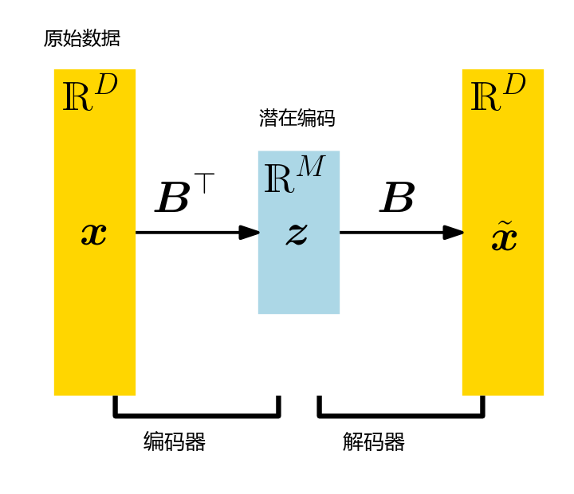

## 10.8 延伸阅读

我们在本章中从两个主要几何视角推导了 PCA：(a) 最大化投影空间中的方差；(b) 最小化平均重构误差。然而，PCA 还可以从许多其他重要学科的视角进行阐释与拓展。

### 作为线性自动编码器的 PCA

如图 10.16 所示，我们可以将 PCA 视为一个 _线性自动编码器（linear auto-encoder）_ 。自动编码器首先通过编码器将高维数据 $\boldsymbol{x}_n \in \mathbb{R}^D$ 编码为低维编码 $\boldsymbol{z}_n \in \mathbb{R}^M$，然后通过解码器将其解算回与 $\boldsymbol{x}_n$ 相似的重构数据 $\tilde{\boldsymbol{x}}_n$。

  
  
<b>图 10.16</b> PCA 可被视为线性自动编码器：它将高维数据 x 编码为低维编码 z ∈ Rᴹ，并使用解码器将其重构成 x̃，解码向量即原始数据在 M 维主子空间上的正交投影。

当我们考虑线性编码映射 $\boldsymbol{z}_n = \boldsymbol{B}^\top \boldsymbol{x}_n$ 与线性解码映射 $\tilde{\boldsymbol{x}}_n = \boldsymbol{B}\boldsymbol{z}_n$，并优化最小化平均平方重构误差：

$$
\frac{1}{N}\sum_{n=1}^N \|\boldsymbol{x}_n - \tilde{\boldsymbol{x}}_n\|^2 = \frac{1}{N}\sum_{n=1}^N \|\boldsymbol{x}_n - \boldsymbol{B}\boldsymbol{B}^\top \boldsymbol{x}_n\|^2 ,
\tag{10.76}
$$

该目标函数与我们在 10.3 节讨论的式 (10.29) 完全相同。因此，最小化线性自动编码器的平方重构损失直接导出了 PCA 解。若将线性映射替换为非线性映射（例如多层前馈深度神经网络），便自然得到了 _深度自动编码器（deep auto-encoder）_ 。在深度学习语境中，编码器通常被称为识别网络（recognition network）或推断网络（inference network），而解码器则被称为生成器（generator）。

### 信息论视角

另一种解释来源于信息论。我们可以将编码视为原始数据的有损压缩版本。直观上，为了在压缩后保留最多的信息，我们希望最大化原始高维数据与低维编码之间的 _互信息（mutual information）_ 。信息论证明，在特定高斯假设下，最大化互信息所求得的最优线性映射与 PCA 解完全一致（MacKay, 2003）。

### 概率 PCA 的参数估计与零噪声极限

在 10.7 节对 PPCA 的讨论中，我们假设参数 $\boldsymbol{B}、\boldsymbol{\mu}$ 及噪声参数 $\sigma^2$ 是已知的。Tipping and Bishop (1999) 给出了在 PPCA 框架下这些参数的极大似然解析闭式解：

$$
\boldsymbol{\mu}_{\text{ML}} = \frac{1}{N}\sum_{n=1}^N \boldsymbol{x}_n ,
\tag{10.77}
$$

$$
\boldsymbol{B}_{\text{ML}} = \boldsymbol{T}\left(\boldsymbol{\Lambda} - \sigma^2\boldsymbol{I}\right)^{\frac{1}{2}}\boldsymbol{R} ,
\tag{10.78}
$$

$$
\sigma_{\text{ML}}^2 = \frac{1}{D - M}\sum_{j=M+1}^D \lambda_j ,
\tag{10.79}
$$

其中 $\boldsymbol{T} \in \mathbb{R}^{D \times M}$ 包含数据协方差矩阵的 $M$ 个主特征向量，$\boldsymbol{\Lambda} = \text{diag}(\lambda_1, \ldots, \lambda_M) \in \mathbb{R}^{M \times M}$ 是对角线上排列着主特征值的对角矩阵，$\boldsymbol{R} \in \mathbb{R}^{M \times M}$ 是任意的正交旋转矩阵。极大似然解 $\boldsymbol{B}_{\text{ML}}$ 在旋转意义下是唯一的（右乘任意旋转矩阵 $\boldsymbol{R}$ 依然成立），这直接对应了奇异值分解的结构。式 (10.79) 揭示出：观测噪声方差的极大似然估计，恰好等于主子空间正交补空间中所有被丢弃特征值的算术平均值！即 PCA 无法捕获的剩余方差在概率模型中被统统视为各向同性白噪声。

在无噪声极限（$\sigma \to 0$）下，PPCA 与传统 PCA 完全重合：数据协方差矩阵为 $\boldsymbol{S} = \boldsymbol{T}\boldsymbol{\Lambda}\boldsymbol{T}^{-1}$，而 PPCA 的模型协方差在 $\sigma \to 0$ 时变为 $\boldsymbol{B}\boldsymbol{B}^\top$，直接导出 $\boldsymbol{B} = \boldsymbol{T}\boldsymbol{\Lambda}^{\frac{1}{2}}\boldsymbol{R}$。对于在线流式数据，可采用 EM 期望最大化算法进行迭代参数估计（Roweis, 1998）。

关于内在维度 $M$ 的确定，Gavish and Donoho (2014) 提出了基于噪声估计的截断启发式规则：若已知数据噪声标准差 $\sigma$，应丢弃所有小于 $4\sigma\sqrt{D}/\sqrt{3}$ 的奇异值。此外，嵌套交叉验证（8.6.1 节）与贝叶斯模型证据准则（8.6.2 节）也是估计数据内在维度的有力工具（Minka, 2001b）。

### 贝叶斯 PCA 与因子分析、独立成分分析

进一步地，我们可以在模型参数上引入先验分布并将其边缘化积分离出，从而得到 _贝叶斯 PCA（Bayesian PCA）_ （Bishop, 1999）。该方法避免了点估计引起的过拟合，并能自动通过贝叶斯奥卡姆剃刀剪枝冗余的主成分，实现内在维度 $M$ 的自动学习。

如果我们在 PPCA 的观测模型 $\boldsymbol{x}_n \mid \boldsymbol{z}_n \sim \mathcal{N}(\boldsymbol{B}\boldsymbol{z}_n + \boldsymbol{\mu}, \boldsymbol{\Sigma})$ 中，允许各个观测维度拥有不同的噪声方差（即对角噪声协方差矩阵 $\boldsymbol{\Sigma} = \text{diag}(\sigma_1^2, \ldots, \sigma_D^2)$），我们便得到了经典的 _因子分析（factor analysis, FA）_ （Spearman, 1904; Bartholomew et al., 2011）。与 PPCA 相比，因子分析具有尺度不变性，但在正交旋转下不再具有旋转不变性。

若将隐变量的先验分布由高斯分布改为非高斯分布，则导出了 _独立成分分析（independent component analysis, ICA）_ （Hyvarinen et al., 2001）。ICA 广泛应用于盲源分离（blind-source separation，如经典的“鸡尾酒会问题”），能够打破 PCA 的正交旋转不确定性，分离出独立的真实信号源。关于线性降维模型的更全面综述，可参阅 Cunningham and Ghahramani (2015)。

### 核 PCA 与高斯过程隐变量模型（GP-LVM）

借助核技巧（kernel trick），我们可以将特征内积推广至无限维希尔伯特空间，从而得到 _核主成分分析（Kernel PCA）_ （Schölkopf et al., 1998; Schölkopf and Smola, 2002），能够挖掘出高度复杂的非线性流形结构（Burges, 2010）。

另一条强大的非线性降维路线是 Lawrence (2005) 提出的 _高斯过程隐变量模型（Gaussian process latent variable model, GP-LVM）_ 。GP-LVM 从 PPCA 的隐变量视角出发，将隐变量 $\boldsymbol{z}$ 到观测 $\boldsymbol{x}$ 之间的线性映射替换为非参数高斯过程（GP）。随后，Titsias and Lawrence (2010) 提出了贝叶斯 GP-LVM，在隐变量上保持概率分布并使用变分推断将其积分离出，代表了现代非参数贝叶斯降维技术的前沿。
