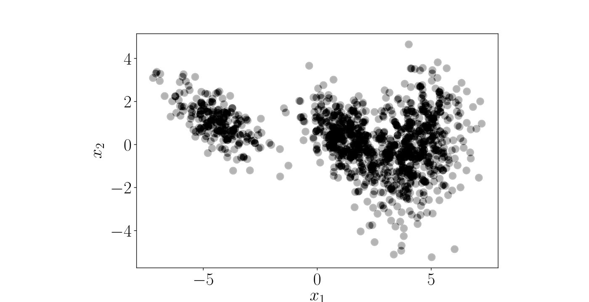

# 11 使用高斯混合模型进行密度估计

在前面的章节中，我们已经探讨了机器学习中两个基础的核心支柱问题：回归（第 9 章）与降维（第 10 章）。在本章中，我们将考察机器学习的第三大支柱： _密度估计（density estimation）_。在此过程中，我们将引入极其重要的核心概念，例如 _期望最大化（expectation maximization, EM）_ 算法以及基于混合模型的隐变量视角。

当我们对数据应用机器学习时，通常旨在以某种数学形式来表示数据。最直接的方法是将数据点本身作为数据的离散表示；图 11.1 给出了一个具体示例。然而，如果数据集极其庞大，或者我们感兴趣的是抽象提炼出数据的生成统计特征，这种离散罗列的方法便无能为力。在密度估计中，我们使用来自参数化概率分布族（如高斯分布、Beta 分布等）的概率密度函数来紧凑地表示数据。例如，我们可能寻求数据集的均值与方差，以便使用高斯分布来紧凑表示数据。均值与方差可以通过我们在 8.3 节讨论的极大似然估计或最大后验估计来求解。随后，我们可以使用该高斯分布的均值与方差来代表生成数据的底层分布，即认为该数据集是从该连续分布中随机抽样所得到的典型实现。

  
  
<b>图 11.1</b> 无法用单一高斯分布进行合理解释的复杂二维数据集。

然而在实践中，单一高斯分布（以及我们迄今为止见过的所有其他简单单峰分布）的建模表达能力非常有限。例如，若用单一高斯分布来近似生成图 11.1 数据的底层密度，拟合效果将会极其糟糕。为了解决这一局限性，在下文中我们将考察一类表达能力强得多的概率分布族： _混合模型（mixture models）_。

混合模型通过对 $K$ 个简单的基分布（base distributions）进行凸组合（convex combination）来描述复杂概率分布 $p(\boldsymbol{x})$：

$$
p(\boldsymbol{x}) = \sum_{k=1}^K \pi_k p_k(\boldsymbol{x}) ,
\tag{11.1}
$$

$$
0 \leqslant \pi_k \leqslant 1 , \quad \sum_{k=1}^K \pi_k = 1 ,
\tag{11.2}
$$

其中分量 $p_k$ 属于某种基础分布族（例如高斯分布、伯努利分布或 Gamma 分布），$\pi_k$ 被称为 _混合权重（mixture weights）_。混合模型比对应的单个基分布表达能力丰富得多，因为它们能够表示 _多峰数据（multimodal data）_，即能够描述包含多个“簇”（clusters）的复杂数据集，如图 11.1 所示。

在本章中，我们将重点关注基分布为高斯分布的 _高斯混合模型（Gaussian mixture models, GMM）_。对于给定的数据集，我们的目标是最大化模型参数的似然函数来训练 GMM。为此，我们将系统运用第 5 章的微积分、第 6 章的概率论以及 7.2 节的带约束优化工具。然而，与我们之前讨论的其他模型（线性回归或 PCA）截然不同的是，**高斯混合模型的极大似然估计不存在解析闭式解**！相反，求导将导出一组相互耦合的联立非线性方程组，我们只能通过迭代算法（即 EM 算法）对其进行数值求解。

在本章的后续部分：
- 11.1 节形式化高斯混合模型；
- 11.2 节详细推导通过极大似然原理估计 GMM 均值、协方差和混合权重的梯度方程与联立自洽方程；
- 11.3 节正式给出并剖析 EM 算法的完整执行流程及数值表现；
- 11.4 节从隐变量模型和 Jensen 不等式的更广义视角深入阐释 EM 算法的理论下界保障；
- 11.5 节提供延伸阅读。
