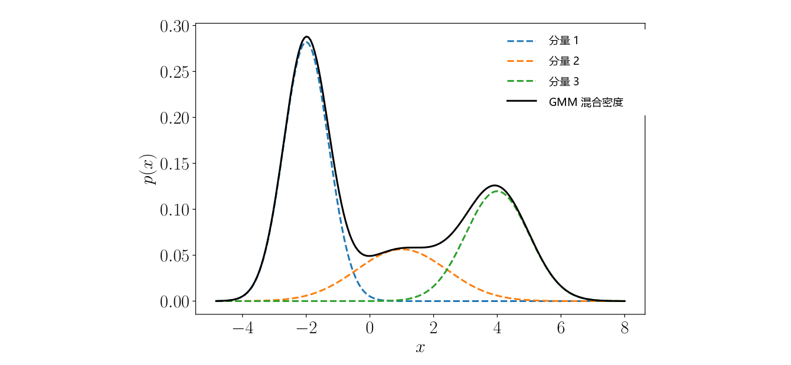

## 11.1 高斯混合模型

_高斯混合模型（Gaussian mixture model, GMM）_ 是一种将有限数量（$K$ 个）高斯分布 $\mathcal{N}(\boldsymbol{x} \mid \boldsymbol{\mu}_k, \boldsymbol{\Sigma}_k)$ 进行凸组合的概率密度模型：

$$
p(\boldsymbol{x} \mid \boldsymbol{\theta}) = \sum_{k=1}^K \pi_k \mathcal{N}\left(\boldsymbol{x} \mid \boldsymbol{\mu}_k, \boldsymbol{\Sigma}_k\right) ,
\tag{11.3}
$$

$$
0 \leqslant \pi_k \leqslant 1 , \quad \sum_{k=1}^K \pi_k = 1 ,
\tag{11.4}
$$

其中我们将 $\boldsymbol{\theta} := \{\boldsymbol{\mu}_k, \boldsymbol{\Sigma}_k, \pi_k : k = 1, \ldots, K\}$ 定义为模型所有待估计参数的集合。与简单的单高斯分布（当 $K = 1$ 时从式 (11.3) 退化恢复得到）相比，高斯分布的这种凸组合赋予了模型表征高度复杂的多峰连续概率密度的强大灵活性。

  
  
<b>图 11.2</b> 高斯混合模型。整体混合分布（黑色实线）由三个加权高斯分量（彩色虚线）叠加构成。

图 11.2 直观图解了式 (11.3) 的 GMM 结构，展示了加权的高斯分量与总体的混合密度分布。在该一维示例中，混合密度显式表达为：

$$
p(x \mid \boldsymbol{\theta}) = 0.5\mathcal{N}(x \mid -2, 1) + 0.2\mathcal{N}(x \mid 1, 2) + 0.3\mathcal{N}(x \mid 4, 1) .
\tag{11.5}
$$

在接下来的内容中，我们将探讨如何为给定的无监督观测数据集拟合高斯混合模型的参数。
