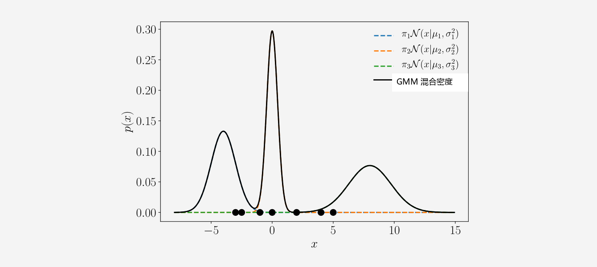
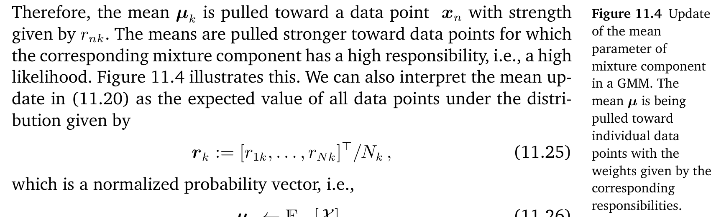
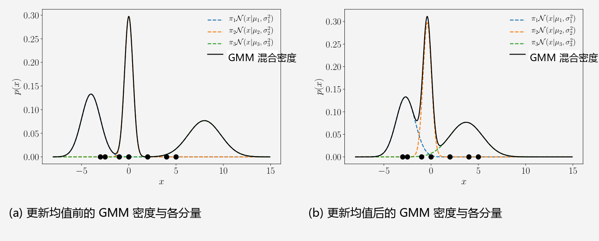
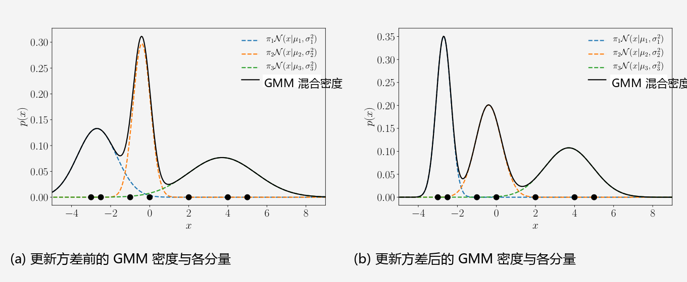
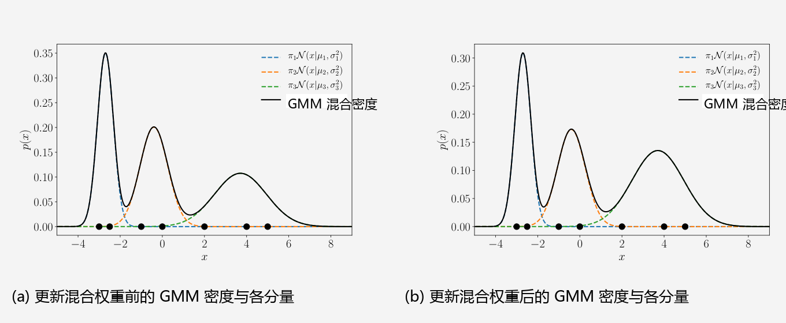

## 11.2 通过极大似然进行参数学习

我们考虑一个由 7 个数据点组成的一维数据集 $\mathcal{X} = \{-3, -2.5, -1, 0, 2, 4, 5\}$，并希望寻找一个包含 $K = 3$ 个分量的高斯混合模型来拟合该数据的概率密度。我们将各个混合分量初始化为：

$$
p_1(x) = \mathcal{N}(x \mid -4, 1) ,
\tag{11.6}
$$

$$
p_2(x) = \mathcal{N}(x \mid 0, 0.2) ,
\tag{11.7}
$$

$$
p_3(x) = \mathcal{N}(x \mid 8, 3) ,
\tag{11.8}
$$

并赋予它们相等的初始混合权重 $\pi_1 = \pi_2 = \pi_3 = \frac{1}{3}$。对应的模型分布以及数据点在图 11.3 中展示。

  
  
<b>图 11.3</b> 初始设定：包含三个高斯混合分量（彩色虚线）与七个数据点（黑色圆盘）的高斯混合模型（黑色实线）。

在下文中，我们将详细阐述如何求解模型参数 $\boldsymbol{\theta}$ 的极大似然估计 $\boldsymbol{\theta}_{\text{ML}}$。我们首先写出似然函数，即在给定模型参数的条件下训练数据的联合概率密度。利用独立同分布（i.i.d.）假设，似然函数因式分解为：

$$
p(\mathcal{X} \mid \boldsymbol{\theta}) = \prod_{n=1}^N p(\boldsymbol{x}_n \mid \boldsymbol{\theta}) , \quad p(\boldsymbol{x}_n \mid \boldsymbol{\theta}) = \sum_{k=1}^K \pi_k \mathcal{N}\left(\boldsymbol{x}_n \mid \boldsymbol{\mu}_k, \boldsymbol{\Sigma}_k\right) ,
\tag{11.9}
$$

其中每一个样本点的似然项 $p(\boldsymbol{x}_n \mid \boldsymbol{\theta})$ 都是一个高斯混合密度。据此，对数似然函数表示为：

$$
\log p(\mathcal{X} \mid \boldsymbol{\theta}) = \sum_{n=1}^N \log p(\boldsymbol{x}_n \mid \boldsymbol{\theta}) = \underbrace{\sum_{n=1}^N \log \left( \sum_{k=1}^K \pi_k \mathcal{N}\left(\boldsymbol{x}_n \mid \boldsymbol{\mu}_k, \boldsymbol{\Sigma}_k\right) \right)}_{=: \mathcal{L}} .
\tag{11.10}
$$

我们的目标是寻找参数 $\boldsymbol{\theta}_{\text{ML}}^*$ 以最大化式 (11.10) 中定义的对数似然 $\mathcal{L}$。我们的“常规”解题套路是对模型参数 $\boldsymbol{\theta}$ 计算对数似然的梯度 $\frac{\mathrm{d}\mathcal{L}}{\mathrm{d}\boldsymbol{\theta}}$，令其为 $\boldsymbol{0}$ 并解析求解 $\boldsymbol{\theta}$。然而，与我们之前讨论的极大似然估计（例如 9.2 节的线性回归）不同，此处我们无法求得闭式解。幸运的是，我们可以利用迭代优化方案来求解优良的参数 $\boldsymbol{\theta}_{\text{ML}}$，这正是 GMM 中的 EM 算法。其核心思想是：每次固定其他参数并更新单个模型参数。

_备注_ 。若我们考虑使用单一高斯分布作为目标密度，式 (11.10) 中关于 $k$ 的求和符号便不复存在，对数可以直接作用在单个高斯密度上：

$$
\log \mathcal{N}(\boldsymbol{x} \mid \boldsymbol{\mu}, \boldsymbol{\Sigma}) = -\frac{D}{2}\log(2\pi) - \frac{1}{2}\log \det(\boldsymbol{\Sigma}) - \frac{1}{2}(\boldsymbol{x} - \boldsymbol{\mu})^\top \boldsymbol{\Sigma}^{-1}(\boldsymbol{x} - \boldsymbol{\mu}) .
\tag{11.11}
$$

这一简洁的二次形式允许我们解析求解 $\boldsymbol{\mu}$ 与 $\boldsymbol{\Sigma}$ 的闭式极大似然估计（如第 8 章所述）。而在式 (11.10) 中，对数符号位于关于分量 $k$ 的求和号之外，对数无法穿透求和号，导致我们无法直接获得闭式解析解。

函数的任何局部极值点都满足梯度必须为零的必要一阶最优性条件（参见第 7 章）。在我们的场景下，当关于 GMM 参数 $\boldsymbol{\mu}_k, \boldsymbol{\Sigma}_k, \pi_k$ 优化对数似然 (11.10) 时，得到如下一阶必要条件：

$$
\frac{\partial \mathcal{L}}{\partial \boldsymbol{\mu}_k} = \boldsymbol{0}^\top \iff \sum_{n=1}^N \frac{\partial \log p(\boldsymbol{x}_n \mid \boldsymbol{\theta})}{\partial \boldsymbol{\mu}_k} = \boldsymbol{0}^\top ,
\tag{11.12}
$$

$$
\frac{\partial \mathcal{L}}{\partial \boldsymbol{\Sigma}_k} = \boldsymbol{0} \iff \sum_{n=1}^N \frac{\partial \log p(\boldsymbol{x}_n \mid \boldsymbol{\theta})}{\partial \boldsymbol{\Sigma}_k} = \boldsymbol{0} ,
\tag{11.13}
$$

$$
\frac{\partial \mathcal{L}}{\partial \pi_k} = 0 \iff \sum_{n=1}^N \frac{\partial \log p(\boldsymbol{x}_n \mid \boldsymbol{\theta})}{\partial \pi_k} = 0 .
\tag{11.14}
$$

对于这三个必要条件，应用多元复合求导链式法则（见 5.2.2 节），均需要计算形如下式的偏导数：

$$
\frac{\partial \log p(\boldsymbol{x}_n \mid \boldsymbol{\theta})}{\partial \boldsymbol{\theta}} = \frac{1}{p(\boldsymbol{x}_n \mid \boldsymbol{\theta})}\frac{\partial p(\boldsymbol{x}_n \mid \boldsymbol{\theta})}{\partial \boldsymbol{\theta}} ,
\tag{11.15}
$$

其中 $\boldsymbol{\theta} = \{\boldsymbol{\mu}_k, \boldsymbol{\Sigma}_k, \pi_k : k = 1, \ldots, K\}$ 为模型参数，且

$$
\frac{1}{p(\boldsymbol{x}_n \mid \boldsymbol{\theta})} = \frac{1}{\sum_{j=1}^K \pi_j \mathcal{N}\left(\boldsymbol{x}_n \mid \boldsymbol{\mu}_j, \boldsymbol{\Sigma}_j\right)} .
\tag{11.16}
$$

在计算偏导数 (11.12)–(11.14) 之前，我们首先引入一个在本章后续内容中扮演核心支柱角色的重要物理量：责任度。

---

### 11.2.1 责任度

我们定义如下量：

$$
r_{nk} := \frac{\pi_k \mathcal{N}\left(\boldsymbol{x}_n \mid \boldsymbol{\mu}_k, \boldsymbol{\Sigma}_k\right)}{\sum_{j=1}^K \pi_j \mathcal{N}\left(\boldsymbol{x}_n \mid \boldsymbol{\mu}_j, \boldsymbol{\Sigma}_j\right)}
\tag{11.17}
$$

为第 $k$ 个混合分量对第 $n$ 个数据点所承担的 _责任度（responsibility）_ 。第 $k$ 个分量对数据点 $\boldsymbol{x}_n$ 的责任度 $r_{nk}$ 正比于该分量生成该数据点的联合似然值：

$$
p(\boldsymbol{x}_n \mid \pi_k, \boldsymbol{\mu}_k, \boldsymbol{\Sigma}_k) = \pi_k \mathcal{N}\left(\boldsymbol{x}_n \mid \boldsymbol{\mu}_k, \boldsymbol{\Sigma}_k\right) .
\tag{11.18}
$$

因此，当某个数据点极有可能是从第 $k$ 个分量中抽取出的样本时，该分量对该数据点承担很高的责任度。请注意，向量 $\boldsymbol{r}_n := [r_{n1}, \ldots, r_{nK}]^\top \in \mathbb{R}^K$ 是一个归一化的概率向量，满足 $\sum_{k=1}^K r_{nk} = 1$ 且 $r_{nk} \geqslant 0$。该概率向量在 $K$ 个混合分量之间分配概率质量，我们可以将 $\boldsymbol{r}_n$ 视为数据点 $\boldsymbol{x}_n$ 对这 $K$ 个分量的“软归属”（soft assignment）。因此，式 (11.17) 中的责任度 $r_{nk}$ 在统计意义上代表了在已知观测 $\boldsymbol{x}_n$ 的条件下，该样本点由第 $k$ 个分量生成的后验概率。

> **例 11.2（责任度计算）**
>
> 针对图 11.3 中的示例，我们计算 7 个数据点关于 3 个混合分量的责任度矩阵：
>
> $$
> \boldsymbol{R} = \begin{bmatrix}
> 1.0 & 0.0 & 0.0 \\
> 1.0 & 0.0 & 0.0 \\
> 0.057 & 0.943 & 0.0 \\
> 0.001 & 0.999 & 0.0 \\
> 0.0 & 0.066 & 0.934 \\
> 0.0 & 0.0 & 1.0 \\
> 0.0 & 0.0 & 1.0
> \end{bmatrix} \in \mathbb{R}^{N \times K} .
> \tag{11.19}
> $$
>
> 这里的每一行给出了全部混合分量对特定数据点 $\boldsymbol{x}_n$ 的责任度，每一行的行和严格为 1。第 $k$ 列反映了第 $k$ 个分量的责任度分布。我们可以看到，第三个分量对前四个数据点的责任度几乎为 0，但对后三个数据点承担了极高的责任度。每一列的列求和给出了 $N_k$，即第 $k$ 个混合分量在整个数据集上承担的有效总责任度（亦称有效样本容量）。在本例中，计算得 $N_1 = 2.058, N_2 = 2.008, N_3 = 2.934$。

在下文中，我们将推导在给定责任度的条件下，模型参数 $\boldsymbol{\mu}_k, \boldsymbol{\Sigma}_k, \pi_k$ 的更新法则。

---

### 11.2.2 更新均值

**定理 11.1（GMM 均值更新法则）**。高斯混合模型均值参数 $\boldsymbol{\mu}_k$（$k = 1, \ldots, K$）的极大似然更新公式为：

$$
\boldsymbol{\mu}_k^{\text{new}} = \frac{\sum_{n=1}^N r_{nk}\boldsymbol{x}_n}{\sum_{n=1}^N r_{nk}} = \frac{1}{N_k}\sum_{n=1}^N r_{nk}\boldsymbol{x}_n ,
\tag{11.20}
$$

其中责任度 $r_{nk}$ 由式 (11.17) 定义。

_备注_ 。式 (11.20) 中单个分量均值 $\boldsymbol{\mu}_k$ 的更新通过 $r_{nk}$ 隐式依赖于所有分量的均值、协方差矩阵以及权重。因此，我们无法一次性求出所有 $\boldsymbol{\mu}_k$ 的解析闭式解。

*证明*。
根据式 (11.15)，对数似然关于均值向量 $\boldsymbol{\mu}_k$ 的梯度要求我们首先计算分量对数密度的偏导数。只有第 $k$ 个分量依赖于 $\boldsymbol{\mu}_k$：

$$
\frac{\partial p(\boldsymbol{x}_n \mid \boldsymbol{\theta})}{\partial \boldsymbol{\mu}_k} = \sum_{j=1}^K \pi_j \frac{\partial \mathcal{N}\left(\boldsymbol{x}_n \mid \boldsymbol{\mu}_j, \boldsymbol{\Sigma}_j\right)}{\partial \boldsymbol{\mu}_k} = \pi_k \frac{\partial \mathcal{N}\left(\boldsymbol{x}_n \mid \boldsymbol{\mu}_k, \boldsymbol{\Sigma}_k\right)}{\partial \boldsymbol{\mu}_k}
\tag{11.21a}
$$

$$
= \pi_k (\boldsymbol{x}_n - \boldsymbol{\mu}_k)^\top \boldsymbol{\Sigma}_k^{-1} \mathcal{N}\left(\boldsymbol{x}_n \mid \boldsymbol{\mu}_k, \boldsymbol{\Sigma}_k\right) .
\tag{11.21b}
$$

将式 (11.21b) 代入式 (11.15) 中，对数似然 $\mathcal{L}$ 关于 $\boldsymbol{\mu}_k$ 的偏导数为：

$$
\frac{\partial \mathcal{L}}{\partial \boldsymbol{\mu}_k} = \sum_{n=1}^N \frac{1}{p(\boldsymbol{x}_n \mid \boldsymbol{\theta})}\frac{\partial p(\boldsymbol{x}_n \mid \boldsymbol{\theta})}{\partial \boldsymbol{\mu}_k}
\tag{11.22a}
$$

$$
= \sum_{n=1}^N (\boldsymbol{x}_n - \boldsymbol{\mu}_k)^\top \boldsymbol{\Sigma}_k^{-1} \underbrace{\frac{\pi_k \mathcal{N}\left(\boldsymbol{x}_n \mid \boldsymbol{\mu}_k, \boldsymbol{\Sigma}_k\right)}{\sum_{j=1}^K \pi_j \mathcal{N}\left(\boldsymbol{x}_n \mid \boldsymbol{\mu}_j, \boldsymbol{\Sigma}_j\right)}}_{= r_{nk}}
\tag{11.22b}
$$

$$
= \sum_{n=1}^N r_{nk}(\boldsymbol{x}_n - \boldsymbol{\mu}_k)^\top \boldsymbol{\Sigma}_k^{-1} .
\tag{11.22c}
$$

令该偏导数为 $\boldsymbol{0}^\top$，右乘 $\boldsymbol{\Sigma}_k$ 并移项：

$$
\sum_{n=1}^N r_{nk}\boldsymbol{x}_n^\top = \left( \sum_{n=1}^N r_{nk} \right) \boldsymbol{\mu}_k^{\top} \iff \boldsymbol{\mu}_k^{\text{new}} = \frac{\sum_{n=1}^N r_{nk}\boldsymbol{x}_n}{\sum_{n=1}^N r_{nk}} = \frac{1}{N_k}\sum_{n=1}^N r_{nk}\boldsymbol{x}_n ,
\tag{11.23}
$$

其中我们将

$$
N_k := \sum_{n=1}^N r_{nk}
\tag{11.24}
$$

定义为第 $k$ 个混合分量在整个数据集上承担的总责任度。证毕。

直观上，式 (11.20) 是均值的一个重要性加权估计（加权算术平均）：每个数据点 $\boldsymbol{x}_n$ 被第 $k$ 个簇的中心吸引，其吸引力强弱恰好等于该簇对该数据点的后验责任度 $r_{nk}$。图 11.4 直观图解了这一受力牵引过程。

  
  
<b>图 11.4</b> GMM 中混合分量均值参数的更新。均值 μₖ 被各个数据点拉拽，拉力大小由对应的责任度决定。

直观上，均值 $\boldsymbol{\mu}_k$ 会被数据点 $\boldsymbol{x}_n$ 拉向责任度较高的方向。将第 $k$ 个分量的责任度归一化为概率向量：

$$
\boldsymbol{r}_k := [r_{1k}, \ldots, r_{Nk}]^\top / N_k .
\tag{11.25}
$$

则均值更新也可以写成在该责任度分布下对数据的期望：

$$
\boldsymbol{\mu}_k \leftarrow \mathbb{E}_{\boldsymbol{r}_k}[\boldsymbol{X}] .
\tag{11.26}
$$

> **例 11.3（均值参数更新）**
>
> 图 11.5 展示了在图 11.3 的初始设定下，仅执行一次均值更新（保持方差和混合权重不变）的前后对比。我们看到，分量 1 和分量 3 的中心迅速朝向数据密集区域移动。

  
  
<b>图 11.5</b> 在 GMM 中更新均值参数的效果对比。(a) 更新均值前的 GMM 密度与各分量；(b) 保持方差和权重不变、更新均值 μₖ 后的 GMM 密度与各分量。

在图 11.3 的示例中，均值更新如下：

$$
\mu_1: -4 \to -2.7 .
\tag{11.27}
$$

$$
\mu_2: 0 \to -0.4 .
\tag{11.28}
$$

$$
\mu_3: 8 \to 3.7 .
\tag{11.29}
$$

可以看到，第一个和第三个混合分量的均值向数据所在区域移动，而第二个分量的均值变化并不明显。

---

### 11.2.3 更新协方差矩阵

**定理 11.2（GMM 协方差更新法则）**。高斯混合模型协方差矩阵参数 $\boldsymbol{\Sigma}_k$（$k = 1, \ldots, K$）的更新公式为：

$$
\boldsymbol{\Sigma}_k^{\text{new}} = \frac{1}{N_k}\sum_{n=1}^N r_{nk}(\boldsymbol{x}_n - \boldsymbol{\mu}_k)(\boldsymbol{x}_n - \boldsymbol{\mu}_k)^\top .
\tag{11.30}
$$

*证明*。
根据多元求导法则计算 $\mathcal{L}$ 关于矩阵 $\boldsymbol{\Sigma}_k$ 的偏导数：

$$
\frac{\partial \mathcal{L}}{\partial \boldsymbol{\Sigma}_k} = \sum_{n=1}^N \frac{1}{p(\boldsymbol{x}_n \mid \boldsymbol{\theta})}\frac{\partial p(\boldsymbol{x}_n \mid \boldsymbol{\theta})}{\partial \boldsymbol{\Sigma}_k} .
\tag{11.31}
$$

由高斯分布关于协方差矩阵的求导公式（式 (5.101) 与 (5.106)）：

只保留混合密度中依赖于第 $k$ 个协方差矩阵的项，可得：

$$
\frac{\partial p(\boldsymbol{x}_n \mid \boldsymbol{\theta})}{\partial \boldsymbol{\Sigma}_k} = \frac{\partial}{\partial \boldsymbol{\Sigma}_k} \left[ \pi_k (2\pi)^{-\frac{D}{2}} \det(\boldsymbol{\Sigma}_k)^{-\frac{1}{2}} \exp\left( -\frac{1}{2}(\boldsymbol{x}_n - \boldsymbol{\mu}_k)^\top \boldsymbol{\Sigma}_k^{-1}(\boldsymbol{x}_n - \boldsymbol{\mu}_k) \right) \right] .
\tag{11.32a}
$$

$$
= \pi_k (2\pi)^{-\frac{D}{2}} \left[ \frac{\partial}{\partial \boldsymbol{\Sigma}_k}\det(\boldsymbol{\Sigma}_k)^{-\frac{1}{2}} \exp\left( -\frac{1}{2}(\boldsymbol{x}_n - \boldsymbol{\mu}_k)^\top \boldsymbol{\Sigma}_k^{-1}(\boldsymbol{x}_n - \boldsymbol{\mu}_k) \right)
\tag{11.32b}
$$

$$
\qquad + \det(\boldsymbol{\Sigma}_k)^{-\frac{1}{2}} \frac{\partial}{\partial \boldsymbol{\Sigma}_k} \exp\left( -\frac{1}{2}(\boldsymbol{x}_n - \boldsymbol{\mu}_k)^\top \boldsymbol{\Sigma}_k^{-1}(\boldsymbol{x}_n - \boldsymbol{\mu}_k) \right) \right] .
\tag{11.32c}
$$

现在使用以下两个矩阵求导恒等式：

$$
\frac{\partial}{\partial \boldsymbol{\Sigma}_k}\det(\boldsymbol{\Sigma}_k)^{-\frac{1}{2}} = -\frac{1}{2}\det(\boldsymbol{\Sigma}_k)^{-\frac{1}{2}}\boldsymbol{\Sigma}_k^{-1} ,
\tag{11.33}
$$

$$
\frac{\partial}{\partial \boldsymbol{\Sigma}_k}\left[ (\boldsymbol{x}_n - \boldsymbol{\mu}_k)^\top \boldsymbol{\Sigma}_k^{-1}(\boldsymbol{x}_n - \boldsymbol{\mu}_k) \right] = -\boldsymbol{\Sigma}_k^{-1}(\boldsymbol{x}_n - \boldsymbol{\mu}_k)(\boldsymbol{x}_n - \boldsymbol{\mu}_k)^\top \boldsymbol{\Sigma}_k^{-1} .
\tag{11.34}
$$

整理后可得：

$$
\frac{\partial p(\boldsymbol{x}_n \mid \boldsymbol{\theta})}{\partial \boldsymbol{\Sigma}_k} = \pi_k \mathcal{N}\left(\boldsymbol{x}_n \mid \boldsymbol{\mu}_k, \boldsymbol{\Sigma}_k\right) \left[ -\frac{1}{2}\left( \boldsymbol{\Sigma}_k^{-1} - \boldsymbol{\Sigma}_k^{-1}(\boldsymbol{x}_n - \boldsymbol{\mu}_k)(\boldsymbol{x}_n - \boldsymbol{\mu}_k)^\top \boldsymbol{\Sigma}_k^{-1} \right) \right] .
\tag{11.35}
$$

将式 (11.35) 代入式 (11.31) 中并利用责任度 $r_{nk}$ 的定义：

$$
\frac{\partial \mathcal{L}}{\partial \boldsymbol{\Sigma}_k} = \sum_{n=1}^N \frac{\partial \log p(\boldsymbol{x}_n \mid \boldsymbol{\theta})}{\partial \boldsymbol{\Sigma}_k} = \sum_{n=1}^N \frac{1}{p(\boldsymbol{x}_n \mid \boldsymbol{\theta})}\frac{\partial p(\boldsymbol{x}_n \mid \boldsymbol{\theta})}{\partial \boldsymbol{\Sigma}_k} .
\tag{11.36a}
$$

$$
= \sum_{n=1}^N \underbrace{\frac{\pi_k \mathcal{N}(\boldsymbol{x}_n \mid \boldsymbol{\mu}_k, \boldsymbol{\Sigma}_k)}{\sum_{j=1}^K \pi_j \mathcal{N}(\boldsymbol{x}_n \mid \boldsymbol{\mu}_j, \boldsymbol{\Sigma}_j)}}_{= r_{nk}} \left[-\frac{1}{2}\left(\boldsymbol{\Sigma}_k^{-1} - \boldsymbol{\Sigma}_k^{-1}(\boldsymbol{x}_n - \boldsymbol{\mu}_k)(\boldsymbol{x}_n - \boldsymbol{\mu}_k)^\top \boldsymbol{\Sigma}_k^{-1}\right)\right] .
\tag{11.36b}
$$

$$
= -\frac{1}{2}\sum_{n=1}^N r_{nk}\left(\boldsymbol{\Sigma}_k^{-1} - \boldsymbol{\Sigma}_k^{-1}(\boldsymbol{x}_n - \boldsymbol{\mu}_k)(\boldsymbol{x}_n - \boldsymbol{\mu}_k)^\top \boldsymbol{\Sigma}_k^{-1}\right)
\tag{11.36c}
$$

$$
= -\frac{1}{2}\boldsymbol{\Sigma}_k^{-1}\sum_{n=1}^N r_{nk} + \frac{1}{2}\boldsymbol{\Sigma}_k^{-1}\left( \sum_{n=1}^N r_{nk}(\boldsymbol{x}_n - \boldsymbol{\mu}_k)(\boldsymbol{x}_n - \boldsymbol{\mu}_k)^\top \right)\boldsymbol{\Sigma}_k^{-1} .
\tag{11.36d}
$$

令该偏导数为 $\boldsymbol{0}$，得到如下必要最优性条件：

$$
N_k\boldsymbol{\Sigma}_k^{-1} = \boldsymbol{\Sigma}_k^{-1}\left(\sum_{n=1}^N r_{nk}(\boldsymbol{x}_n - \boldsymbol{\mu}_k)(\boldsymbol{x}_n - \boldsymbol{\mu}_k)^\top\right)\boldsymbol{\Sigma}_k^{-1}
\tag{11.37a}
$$

$$
N_k\boldsymbol{I} = \left(\sum_{n=1}^N r_{nk}(\boldsymbol{x}_n - \boldsymbol{\mu}_k)(\boldsymbol{x}_n - \boldsymbol{\mu}_k)^\top\right)\boldsymbol{\Sigma}_k^{-1} .
\tag{11.37b}
$$

解出 $\boldsymbol{\Sigma}_k$，即得定理 11.2 的更新公式：

$$
\boldsymbol{\Sigma}_k^{\text{new}} = \frac{1}{N_k}\sum_{n=1}^N r_{nk}(\boldsymbol{x}_n - \boldsymbol{\mu}_k)(\boldsymbol{x}_n - \boldsymbol{\mu}_k)^\top .
\tag{11.38}
$$

证毕。

类似于均值更新，协方差矩阵的更新同样是基于中心化残差平方外积的重要性加权估计。

> **例 11.4（方差参数更新）**
>
> 在图 11.3 的示例中，执行方差更新后，三个分量的方差分别更新为：
>
> $$
> \sigma_1^2: 1 \to 0.14 .
> \tag{11.39}
> $$
>
> $$
> \sigma_2^2: 0.2 \to 0.44 .
> \tag{11.40}
> $$
>
> $$
> \sigma_3^2: 3 \to 1.53 .
> \tag{11.41}
> $$
>
> 图 11.6 对比了更新方差前后的 GMM 密度变化。我们发现分量 1 和分量 3 的方差显著收缩，使得概率峰值更加锐利地吻合局部数据簇。

  
  
<b>图 11.6</b> 在 GMM 中更新方差参数的效果对比。(a) 更新方差前；(b) 保持均值与权重不变、更新方差后的 GMM 密度与各分量。

---

### 11.2.4 更新混合权重

**定理 11.3（GMM 权重更新法则）**。高斯混合模型权重参数 $\pi_k$（$k = 1, \ldots, K$）的更新公式为：

$$
\pi_k^{\text{new}} = \frac{N_k}{N} ,
\tag{11.42}
$$

其中 $N$ 为总数据点数量，$N_k$ 为式 (11.24) 定义的总责任度。

*证明*。
由于混合权重必须满足等式约束 $\sum_{k=1}^K \pi_k = 1$，我们利用拉格朗日乘子法构建拉格朗日函数：

$$
\mathcal{L}_{\pi} = \mathcal{L} + \lambda \left( \sum_{k=1}^K \pi_k - 1 \right) .
\tag{11.43a}
$$

$$
= \sum_{n=1}^N \log \left( \sum_{k=1}^K \pi_k \mathcal{N}\left(\boldsymbol{x}_n \mid \boldsymbol{\mu}_k, \boldsymbol{\Sigma}_k\right) \right) + \lambda \left( \sum_{k=1}^K \pi_k - 1 \right) .
\tag{11.43b}
$$

关于 $\pi_k$ 求偏导数：

$$
\frac{\partial \mathcal{L}_{\pi}}{\partial \pi_k} = \sum_{n=1}^N \frac{\mathcal{N}\left(\boldsymbol{x}_n \mid \boldsymbol{\mu}_k, \boldsymbol{\Sigma}_k\right)}{\sum_{j=1}^K \pi_j \mathcal{N}\left(\boldsymbol{x}_n \mid \boldsymbol{\mu}_j, \boldsymbol{\Sigma}_j\right)} + \lambda .
\tag{11.44a}
$$

$$
= \frac{1}{\pi_k}\sum_{n=1}^N \underbrace{\frac{\pi_k \mathcal{N}\left(\boldsymbol{x}_n \mid \boldsymbol{\mu}_k, \boldsymbol{\Sigma}_k\right)}{\sum_{j=1}^K \pi_j \mathcal{N}\left(\boldsymbol{x}_n \mid \boldsymbol{\mu}_j, \boldsymbol{\Sigma}_j\right)}}_{=r_{nk}} + \lambda = \frac{N_k}{\pi_k} + \lambda .
\tag{11.44b}
$$

此外，关于拉格朗日乘子 $\lambda$ 的偏导数为：

$$
\frac{\partial \mathcal{L}_{\pi}}{\partial \lambda} = \sum_{k=1}^K \pi_k - 1 .
\tag{11.45}
$$

令这两个偏导数为 0，得到方程组：

$$
\pi_k = -\frac{N_k}{\lambda} .
\tag{11.46}
$$

$$
\sum_{k=1}^K \pi_k = 1 .
\tag{11.47}
$$

将式 (11.46) 代入式 (11.47) 并求解 $\lambda$：

$$
\sum_{k=1}^K \pi_k = -\frac{1}{\lambda}\sum_{k=1}^K N_k = -\frac{N}{\lambda} = 1 \iff \lambda = -N .
\tag{11.48}
$$

将 $\lambda = -N$ 带回，立即得出：

$$
\pi_k^{\text{new}} = \frac{N_k}{N} .
\tag{11.49}
$$

证毕。

式 (11.42) 直观地将混合权重解释为第 $k$ 个簇的总责任度占全部数据点总容量的比例，即第 $k$ 个分量对整个数据集的相对重要性。

> **例 11.5（混合权重更新）**
>
> 在我们的示例中，混合权重从均匀分布 $\pi_k = \frac{1}{3} \approx 0.33$ 更新为：
>
> $$
> \pi_1: \frac{1}{3} \to 0.29 .
> \tag{11.50}
> $$
>
> $$
> \pi_2: \frac{1}{3} \to 0.29 .
> \tag{11.51}
> $$
>
> $$
> \pi_3: \frac{1}{3} \to 0.42 .
> \tag{11.52}
> $$
>
> 图 11.7 展示了更新混合权重前后的 GMM 密度变化。

  
  
<b>图 11.7</b> 在 GMM 中更新混合权重的效果对比。(a) 更新权重前；(b) 保持均值与方差不变、更新权重后的 GMM 密度与各分量。

