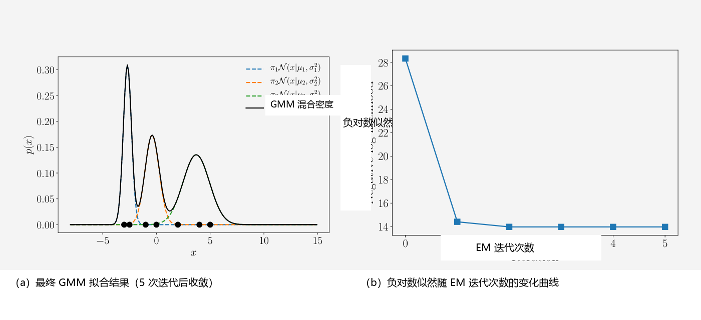
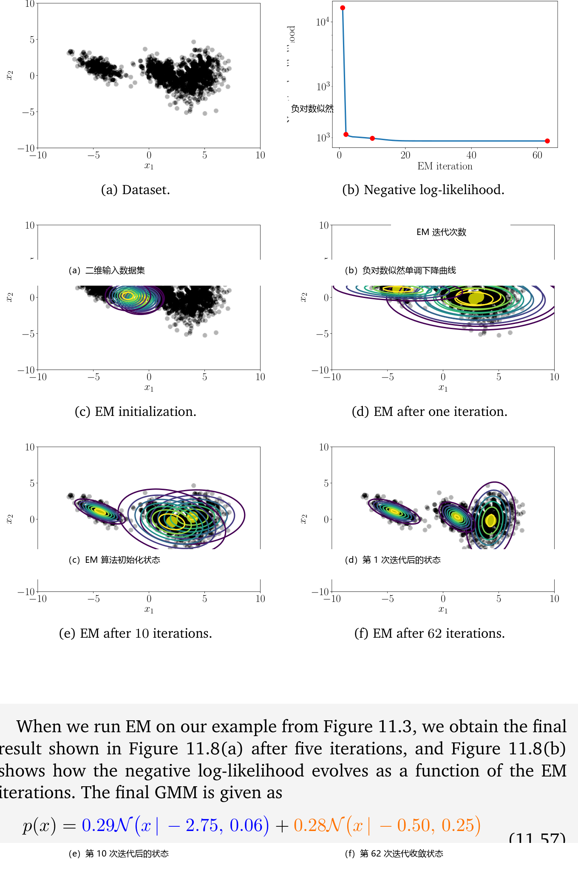
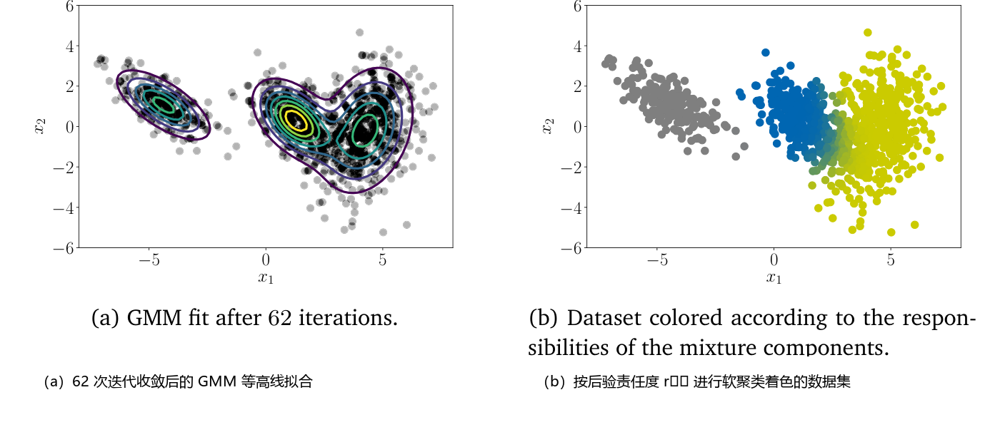

## 11.3 期望最大化算法

_期望最大化（expectation maximization, EM）_ 算法由 Dempster et al. (1977) 提出，是一种用于在混合模型以及更一般的含有不可观测隐变量的模型中学习参数（极大似然或 MAP 估计）的通用迭代优化框架。

在我们考虑的高斯混合模型中，我们首先为模型参数 $\boldsymbol{\mu}_k, \boldsymbol{\Sigma}_k, \pi_k$ 设定初始值，并在以下两个步骤之间交替迭代直至收敛：
- **E 步（期望步，Expectation step）**：利用当前参数评估所有数据点关于各个混合分量的后验责任度 $r_{nk}$（即第 $n$ 个数据点属于第 $k$ 个混合分量的后验概率）；
- **M 步（最大化步，Maximization step）**：利用最新计算的责任度重新估计并更新模型参数 $\boldsymbol{\mu}_k, \boldsymbol{\Sigma}_k, \pi_k$。

Neal and Hinton (1999) 证明，EM 算法的每一次迭代都保证能使对数似然函数单调非递减。在实际工程实现中，我们可以通过监测对数似然的增量或参数矢量的改变量来判断算法是否收敛。

用于估计 GMM 参数的 EM 算法标准具体执行流程如下：
1. **初始化**：初始化均值 $\boldsymbol{\mu}_k$、协方差矩阵 $\boldsymbol{\Sigma}_k$ 和混合权重 $\pi_k$（例如利用 $K$-means 聚类中心初始化均值，样本全局协方差初始化 $\boldsymbol{\Sigma}_k$，均匀分布初始化 $\pi_k = \frac{1}{K}$）；
2. **E 步**：利用当前参数值 $\pi_k, \boldsymbol{\mu}_k, \boldsymbol{\Sigma}_k$，为每个数据点 $\boldsymbol{x}_n$ 评估其关于各个分量的责任度 $r_{nk}$：
   
$$
r_{nk} = \frac{\pi_k \mathcal{N}\left(\boldsymbol{x}_n \mid \boldsymbol{\mu}_k, \boldsymbol{\Sigma}_k\right)}{\sum_{j=1}^K \pi_j \mathcal{N}\left(\boldsymbol{x}_n \mid \boldsymbol{\mu}_j, \boldsymbol{\Sigma}_j\right)} ;
\tag{11.53}
$$

3. **M 步**：利用 E 步求得的最新责任度 $r_{nk}$，重新估计并更新模型参数：
   
$$
\boldsymbol{\mu}_k = \frac{1}{N_k}\sum_{n=1}^N r_{nk}\boldsymbol{x}_n ,
\tag{11.54}
$$

$$
\boldsymbol{\Sigma}_k = \frac{1}{N_k}\sum_{n=1}^N r_{nk}(\boldsymbol{x}_n - \boldsymbol{\mu}_k)(\boldsymbol{x}_n - \boldsymbol{\mu}_k)^\top ,
\tag{11.55}
$$

$$
\pi_k = \frac{N_k}{N} ,
\tag{11.56}
$$

其中 $N_k := \sum_{n=1}^N r_{nk}$ 为第 $k$ 个分量的有效总责任度；
4. **收敛检验**：评估对数似然 $\mathcal{L}$，若对数似然的变化量小于预设容差或达到最大迭代轮数，则终止算法；否则返回第 2 步继续迭代。

> **例 11.6（GMM 拟合实例）**
>
> 将 EM 算法应用于图 11.3 中的一维数据集。在经历了仅仅 5 轮迭代后，EM 算法便完全收敛。图 11.8(a) 展示了最终收敛的 GMM 拟合分布，图 11.8(b) 展示了负对数似然随 EM 迭代轮数单调下降的平滑曲线。最终求得的 GMM 参数分布为：
>
> $$
> p(x) = 0.29\mathcal{N}(x \mid -2.75, 0.06) + 0.28\mathcal{N}(x \mid -0.50, 0.25) + 0.43\mathcal{N}(x \mid 3.64, 1.63) .
> \tag{11.57}
> $$

  
  
<b>图 11.8</b> EM 算法拟合高斯混合模型。(a) 最终 GMM 拟合结果（5 次迭代收敛）；(b) 负对数似然随 EM 迭代轮数的变化曲线。

接下来，我们将 EM 算法应用于图 11.1 所示的复杂二维非高斯数据集，设定混合分量个数 $K = 3$。图 11.9 完整可视化了 EM 算法的迭代演进历程：
- 图 11.9(a) 为原始输入数据；
- 图 11.9(b) 展示了负对数似然随迭代轮数的急剧下降；
- 图 11.9(c)–(f) 分别展示了算法在初始化、第 1 轮、第 10 轮以及第 62 轮迭代收敛时的各个高斯椭圆等高线与均值中心（黄色实心圆）。

  
  
<b>图 11.9</b> EM 算法在二维数据集上拟合三成分 GMM 的演化过程。(a) 数据集；(b) 负对数似然下降曲线；(c) 随机初始化；(d) 第 1 次迭代；(e) 第 10 次迭代；(f) 第 62 次迭代收敛。

图 11.10(a) 展示了最终收敛的 GMM 密度等高线；图 11.10(b) 根据收敛后各个混合分量对数据点的后验责任度 $r_{nk}$ 对数据点进行了软聚类着色。左侧独立簇被单一分量以几乎 100% 的确定性清晰覆盖；而右侧相互重叠交织的两个数据簇则处于中间模糊地带，交界处的样本点无法被非黑即白地硬划分给某一个簇，其责任度平滑分布在 0.5 左右，完美展现了概率软聚类的优势。

  
  
<b>图 11.10</b> EM 收敛时的 GMM 拟合与后验责任度。(a) 收敛时的 GMM 等高线；(b) 根据责任度软聚类着色的数据集。

