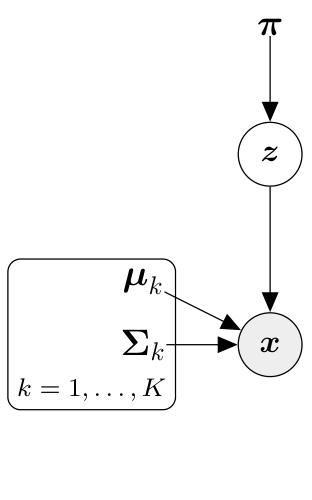
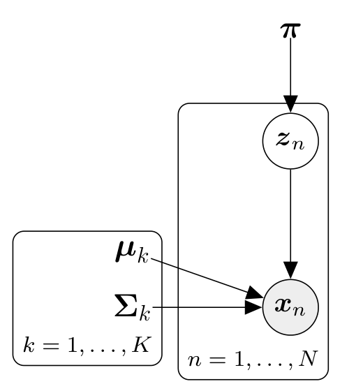

## 11.4 隐变量视角

我们可以从离散 _隐变量模型（latent-variable model）_ 的视角来重新审视高斯混合模型，即隐变量 $\boldsymbol{z}$ 仅能在一组离散的可能取值中选择其一。这与第 10 章的 PCA 形成了鲜明的对比——在 PCA 中，隐变量是生活在 $\mathbb{R}^M$ 中的连续型数值向量。

采用概率隐变量视角具有如下显著优势：
1. 它为我们在前面小节中做出的启发式直觉决定提供了坚实严谨的数学辩护；
2. 它允许将“责任度”严格且具体地解释为隐变量状态的后验概率分布；
3. 更新模型参数的迭代算法可以被完全原则性地推导为隐变量模型极大似然估计的标准 EM 算法。

---

### 11.4.1 生成过程与概率模型

为了推导 GMM 的概率图模型，思考基于概率模型的数据生成过程是非常有启发性的。

我们假设一个包含 $K$ 个分量的混合模型，并且每一个具体的观测数据点 $\boldsymbol{x}$ 都是由其中恰好一个混合分量生成的。我们引入一个二元指示变量 $z_k \in \{0, 1\}$（具有两个状态，见 6.2 节），用以指示第 $k$ 个混合分量是否生成了该数据点，即：

$$
p(\boldsymbol{x} \mid z_k = 1) = \mathcal{N}\left(\boldsymbol{x} \mid \boldsymbol{\mu}_k, \boldsymbol{\Sigma}_k\right) .
\tag{11.58}
$$

我们将 $\boldsymbol{z} := [z_1, \ldots, z_K]^\top \in \{0, 1\}^K$ 定义为一个状态向量，其中包含 $K-1$ 个 0 和恰好一个 1。例如，当 $K = 3$ 时，一个合法的 $\boldsymbol{z}$ 可以是 $\boldsymbol{z} = [0, 1, 0]^\top$，由于 $z_2 = 1$，这代表选中了第二个混合分量。

_备注_ 。这类概率分布有时被称为“多元伯努利分布”（Multinoulli），它是伯努利分布在二元以上分类变量上的自然推广（Murphy, 2012）。

指示向量 $\boldsymbol{z}$ 的性质意味着 $\sum_{k=1}^K z_k = 1$。因此，$\boldsymbol{z}$ 是一个 _独热编码（one-hot encoding）_ （亦称 1-of-$K$ 表示）。

到目前为止，我们假设指示变量 $z_k$ 是已知的。然而在无监督学习实践中，真实生成类别是完全不可见的隐变量。因此，我们在隐变量 $\boldsymbol{z}$ 上引入一个先验分布：

$$
p(\boldsymbol{z}) = \boldsymbol{\pi} = [\pi_1, \ldots, \pi_K]^\top , \quad \sum_{k=1}^K \pi_k = 1 ,
\tag{11.59}
$$

该概率向量的第 $k$ 个分量

$$
\pi_k = p(z_k = 1)
\tag{11.60}
$$

精确描述了第 $k$ 个混合分量生成任意数据点 $\boldsymbol{x}$ 的先验概率。

  
  
<b>图 11.11</b> 单个数据点的高斯混合模型概率图模型。

_备注_ （从 GMM 中采样数据） 。该隐变量模型的结构（对应图 11.11 的概率图模型）支持一种极其自然的先祖采样（ancestral sampling）数据生成流程：
1. 采样潜在类别：$\boldsymbol{z}^{(i)} \sim p(\boldsymbol{z})$；
2. 采样连续观测：$\boldsymbol{x}^{(i)} \sim p(\boldsymbol{x} \mid \boldsymbol{z}^{(i)} = 1)$。

第一步，我们依据先验概率向量 $\boldsymbol{\pi}$ 随机抽取一个分量索引 $k$（通过独热编码 $\boldsymbol{z}$ 表示）；第二步，从对应的第 $k$ 个高斯分量中抽取高斯连续样本。当我们随后丢弃不可见的隐变量标签时，所留下的 $\{\boldsymbol{x}^{(i)}\}$ 便是来自 GMM 的纯正无偏样本。

一般而言，概率模型由观测数据与隐变量的联合分布唯一定义（见 8.4 节）。利用式 (11.59)–(11.60) 中的先验 $p(\boldsymbol{z})$ 以及式 (11.58) 中的条件分布 $p(\boldsymbol{x} \mid \boldsymbol{z})$，该联合分布的全部 $K$ 个离散分量由下式给出：

$$
p(\boldsymbol{x}, z_k = 1) = p(\boldsymbol{x} \mid z_k = 1)p(z_k = 1) = \pi_k \mathcal{N}\left(\boldsymbol{x} \mid \boldsymbol{\mu}_k, \boldsymbol{\Sigma}_k\right) ,
\tag{11.61}
$$

由此完全确定了 GMM 的完整概率联合分布：

$$
p(\boldsymbol{x}, \boldsymbol{z}) = \begin{bmatrix} p(\boldsymbol{x}, z_1 = 1) \\ \vdots \\ p(\boldsymbol{x}, z_K = 1) \end{bmatrix} = \begin{bmatrix} \pi_1 \mathcal{N}(\boldsymbol{x} \mid \boldsymbol{\mu}_1, \boldsymbol{\Sigma}_1) \\ \vdots \\ \pi_K \mathcal{N}(\boldsymbol{x} \mid \boldsymbol{\mu}_K, \boldsymbol{\Sigma}_K) \end{bmatrix} .
\tag{11.62}
$$

---

### 11.4.2 似然函数

为了在隐变量模型中获得边际似然 $p(\boldsymbol{x} \mid \boldsymbol{\theta})$，我们需要将不可观测的隐变量 $\boldsymbol{z}$ 边缘化消去（见 8.4.3 节）。在我们的离散设定下，这通过对联合分布 (11.62) 关于 $\boldsymbol{z}$ 的所有可能状态求和来实现：

$$
p(\boldsymbol{x} \mid \boldsymbol{\theta}) = \sum_{\boldsymbol{z}} p(\boldsymbol{x} \mid \boldsymbol{\theta}, \boldsymbol{z})p(\boldsymbol{z} \mid \boldsymbol{\theta}) ,
\tag{11.63}
$$

其中 $\boldsymbol{\theta} := \{\boldsymbol{\mu}_k, \boldsymbol{\Sigma}_k, \pi_k : k = 1, \ldots, K\}$。由于每个独热向量 $\boldsymbol{z}$ 中只有一个非零分量 1，$\boldsymbol{z}$ 一共只有 $K$ 种可能的状态配置。因此，关于所有可能独热配置的求和等价于关于分量索引 $k$ 的有限求和：

例如，当 $K = 3$ 时，$\boldsymbol{z}$ 的三种可能配置为：

$$
\begin{bmatrix} 1 \\ 0 \\ 0 \end{bmatrix}, \quad
\begin{bmatrix} 0 \\ 1 \\ 0 \end{bmatrix}, \quad
\begin{bmatrix} 0 \\ 0 \\ 1 \end{bmatrix} .
\tag{11.64}
$$

将所有可能配置代入式 (11.63)，可得：

$$
p(\boldsymbol{x} \mid \boldsymbol{\theta}) = \sum_{\boldsymbol{z}} p(\boldsymbol{x} \mid \boldsymbol{\theta}, \boldsymbol{z})p(\boldsymbol{z} \mid \boldsymbol{\theta}) .
\tag{11.65a}
$$

$$
= \sum_{k=1}^K p(\boldsymbol{x} \mid \boldsymbol{\theta}, z_k = 1)p(z_k = 1 \mid \boldsymbol{\theta}) .
\tag{11.65b}
$$

$$
p(\boldsymbol{x} \mid \boldsymbol{\theta}) = \sum_{k=1}^K p(\boldsymbol{x} \mid \boldsymbol{\theta}, z_k = 1)p(z_k = 1 \mid \boldsymbol{\theta}) .
\tag{11.66a}
$$

$$
= \sum_{k=1}^K \pi_k \mathcal{N}\left(\boldsymbol{x} \mid \boldsymbol{\mu}_k, \boldsymbol{\Sigma}_k\right) .
\tag{11.66b}
$$

这精确复现了式 (11.3) 中的经典 GMM 密度公式！对于包含 $N$ 个样本的数据集 $\mathcal{X}$，完整似然函数为：

$$
p(\mathcal{X} \mid \boldsymbol{\theta}) = \prod_{n=1}^N p(\boldsymbol{x}_n \mid \boldsymbol{\theta}) = \prod_{n=1}^N \sum_{k=1}^K \pi_k \mathcal{N}\left(\boldsymbol{x}_n \mid \boldsymbol{\mu}_k, \boldsymbol{\Sigma}_k\right) ,
\tag{11.67}
$$

这完全等价于我们在 11.2 节式 (11.9) 中直接写出的似然函数。因此，带有离散潜指示变量的模型是思考高斯混合模型的一种严格等价且更加强大的统一视角。

---

### 11.4.3 后验分布

现在让我们审视在给定观测 $\boldsymbol{x}$ 时隐变量 $\boldsymbol{z}$ 的后验概率分布。根据贝叶斯定理，第 $k$ 个混合分量生成数据点 $\boldsymbol{x}$ 的后验概率为：

$$
p(z_k = 1 \mid \boldsymbol{x}) = \frac{p(z_k = 1)p(\boldsymbol{x} \mid z_k = 1)}{p(\boldsymbol{x})} ,
\tag{11.68}
$$

其中边际似然 $p(\boldsymbol{x})$ 由式 (11.66) 给出。这导出：

$$
p(z_k = 1 \mid \boldsymbol{x}) = \frac{\pi_k \mathcal{N}\left(\boldsymbol{x} \mid \boldsymbol{\mu}_k, \boldsymbol{\Sigma}_k\right)}{\sum_{j=1}^K \pi_j \mathcal{N}\left(\boldsymbol{x} \mid \boldsymbol{\mu}_j, \boldsymbol{\Sigma}_j\right)} ,
\tag{11.69}
$$

对比式 (11.17)，我们发现该式与我们在 11.2.1 节定义的第 $k$ 个混合分量对数据点 $\boldsymbol{x}$ 的责任度在数学形式上完全相同！这赋予了责任度不仅是直观的启发式重要性加权，更是一个具有坚实测度论基础的 **贝叶斯后验概率** 解释。

---

### 11.4.4 扩展到完整数据集

在完整数据集 $\mathcal{X} := \{\boldsymbol{x}_1, \ldots, \boldsymbol{x}_N\}$ 的情景下，每个数据点 $\boldsymbol{x}_n$ 都拥有专属的离散独热隐变量：

$$
\boldsymbol{z}_n = [z_{n1}, \ldots, z_{nK}]^\top \in \{0, 1\}^K .
\tag{11.70}
$$

所有隐变量 $\boldsymbol{z}_n$ 共享相同的先验类别分布 $\boldsymbol{\pi}$。对应的图模型如图 11.12 所示（采用板块表示法 plate notation）。

  
  
<b>图 11.12</b> 包含 N 个数据点的高斯混合模型概率图模型（板块表示法）。

条件分布关于各个数据点分解为：

$$
p(\boldsymbol{x}_1, \ldots, \boldsymbol{x}_N \mid \boldsymbol{z}_1, \ldots, \boldsymbol{z}_N) = \prod_{n=1}^N p(\boldsymbol{x}_n \mid \boldsymbol{z}_n) .
\tag{11.71}
$$

根据贝叶斯定理，后验概率分布自然扩展为：

$$
p(z_{nk} = 1 \mid \boldsymbol{x}_n) = \frac{p(\boldsymbol{x}_n \mid z_{nk} = 1)p(z_{nk} = 1)}{\sum_{j=1}^K p(\boldsymbol{x}_n \mid z_{nj} = 1)p(z_{nj} = 1)} .
\tag{11.72a}
$$

$$
= \frac{\pi_k \mathcal{N}\left(\boldsymbol{x}_n \mid \boldsymbol{\mu}_k, \boldsymbol{\Sigma}_k\right)}{\sum_{j=1}^K \pi_j \mathcal{N}\left(\boldsymbol{x}_n \mid \boldsymbol{\mu}_j, \boldsymbol{\Sigma}_j\right)} = r_{nk} .
\tag{11.72b}
$$

这从第一性原理证明了：责任度 $r_{nk}$ 精确等于在观测到数据点 $\boldsymbol{x}_n$ 的条件下，其隐变量由第 $k$ 个高斯分量生成的真实后验概率！

---

### 11.4.5 重访 EM 算法

在隐变量视角下，EM 算法具有极为优美的理论解释。给定当前的参数设定 $\boldsymbol{\theta}^{(t)}$：
- **E 步**：计算完整数据对数似然关于隐变量后验分布 $p(\boldsymbol{z} \mid \boldsymbol{x}, \boldsymbol{\theta}^{(t)})$ 的条件数学期望：
  
$$
Q(\boldsymbol{\theta} \mid \boldsymbol{\theta}^{(t)}) = \mathbb{E}_{\boldsymbol{z} \mid \boldsymbol{x}, \boldsymbol{\theta}^{(t)}}\left[ \log p(\boldsymbol{x}, \boldsymbol{z} \mid \boldsymbol{\theta}) \right]
\tag{11.73a}
$$

$$
= \sum_{\boldsymbol{z}} p(\boldsymbol{z} \mid \boldsymbol{x}, \boldsymbol{\theta}^{(t)}) \log p(\boldsymbol{x}, \boldsymbol{z} \mid \boldsymbol{\theta}) .
\tag{11.73b}
$$

- **M 步**：通过最大化该期望目标函数来选取更新后的模型参数：
  
$$
\boldsymbol{\theta}^{(t+1)} = \arg\max_{\boldsymbol{\theta}} Q(\boldsymbol{\theta} \mid \boldsymbol{\theta}^{(t)}) .
\tag{11.74}
$$

通过展开 $Q$ 函数并对其求导，能够以纯粹变分推断的严格范式无缝推导得出我们在 11.2 节求得的均值、协方差和混合权重的三大更新公式。

虽然 EM 迭代能确保对数似然单调不减，但它并不保证收敛到全局最大值，容易陷入次优的局部极大值点。在实际应用中，通常建议执行多次采用不同随机初始化的 EM 运行，以遴选具有最高最终对数似然的最优模型（Bishop, 2006; Rogers and Girolami, 2016）。
