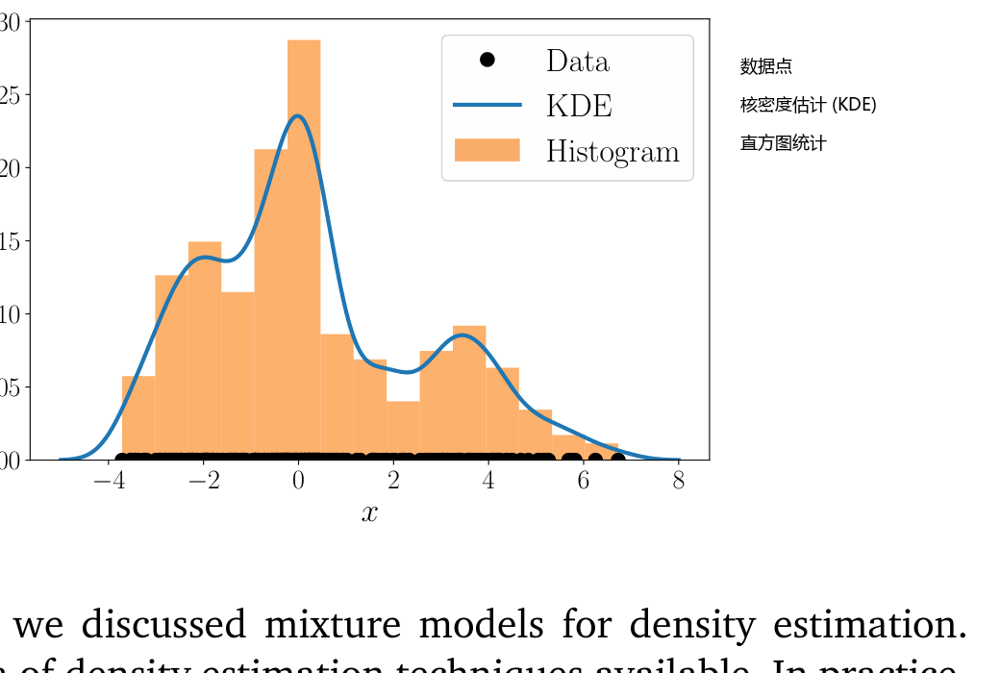

## 11.5 延伸阅读

在本章中，我们重点讨论了用于概率密度估计的混合模型。在统计学与机器学习中，存在着极为丰富的密度估计技术体系。在实际工程与数据分析中，人们除了参数化混合模型外，还广泛使用非参数化的直方图与核密度估计方法。

### 直方图

_直方图（histogram）_ 提供了表示连续概率密度的一种经典非参数方法，最早由 Pearson (1895) 提出。直方图的构建过程非常直观：将数据空间离散化划分为若干“区间箱”（bins），统计落入每个箱内的数据点数量；然后在每个区间的中心绘制一个矩形条，条柱的高度正比于该箱内的数据点频数。区间箱的宽度（bin size）是一个至关重要的超参数，选取过大容易导致欠拟合（过度平滑，抹杀局部细节），选取过小则极易导致过拟合（呈现杂乱的阶梯尖刺）。我们在 8.2.4 节讨论的交叉验证技术可用于在实践中自适应选择最优的箱宽。

### 核密度估计

_核密度估计（kernel density estimation, KDE）_ 由 Rosenblatt (1956) 与 Parzen (1962) 独立提出，是一种基于样本点的非参数光滑密度估计技术。给定 $N$ 个独立同分布样本点，核密度估计量将潜在的数据生成概率分布表示为：

$$
p(x) = \frac{1}{Nh}\sum_{n=1}^N k\left( \frac{x - x_n}{h} \right) ,
\tag{11.74}
$$

其中 $k(\cdot)$ 是一个核函数（即在实数域全域积分为 1 的非负光滑函数），$h > 0$ 是平滑带宽（bandwidth）超参数，其作用类似于直方图中的箱宽。

需要特别指出的是，与 GMM 将固定的 $K$ 个高斯分量赋予可学习的均值和权重不同，核密度估计直接在数据集中的 **每一个具体样本点** $x_n$ 处都放置一个固定形状的核基元函数。常用的核函数包括均匀分布核、Epanechnikov 核以及高斯核。核密度估计与直方图密切相关，但通过选用光滑可导的核函数（如高斯核），KDE 能够严格保证所得整体密度估计曲线的光滑性与连续可微性。

  
  
<b>图 11.13</b> 直方图统计（橙色条柱）与高斯核密度估计（蓝色平滑曲线）的对比。KDE 生成了对潜在底层密度的光滑估计，而直方图则是对落入单箱内数据点数量（黑色散点）的非光滑离散计数。

图 11.13 直观对比了针对 250 个观测数据点，采用直方图与采用高斯核密度估计所得出的拟合分布。
