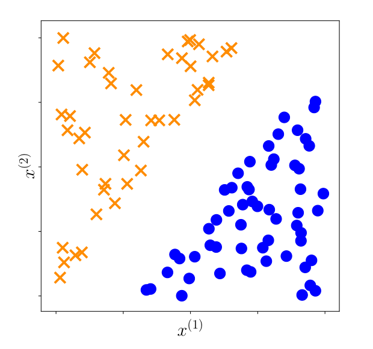

# 12 使用支持向量机分类

在许多实际场景中，我们希望机器学习算法能够预测若干个（离散）结果之一。例如，电子邮件客户端将邮件分类为个人邮件和垃圾邮件，这对应着两种离散结果。另一个例子是天文望远镜识别夜空中的天体是星系、恒星还是行星。这类任务的结果数量通常较少，更重要的是，这些离散结果之间通常不存在额外的数学结构（例如大小顺序等；相比之下，T 恤的小号、中号和大号则是有序结构的离散结果）。在本章中，我们重点考虑输出为二元值的预测器，即只有两种可能结果的情形。这一机器学习任务被称为 **二元分类（binary classification）**。这与第 9 章讨论的连续值输出预测问题（回归）形成了鲜明对比。

在二元分类中，标签/输出能够取得的可能取值集合是二元的，在本章中我们统一用 $\{+1, -1\}$ 来表示它们。换句话说，我们考虑如下形式的预测器：

$$
f : \mathbb{R}^D \to \{+1, -1\} .
\tag{12.1}
$$

回顾第 8 章，我们将每个样本（数据点）$\boldsymbol{x}_n$ 表示为一个由 $D$ 个实数构成的特征向量。标签通常分别称为 **正类（positive class）** 和 **负类（negative class）**。读者应当注意，切勿主观地给 $+1$ 类赋予直觉上的“积极/褒义”属性。例如在癌症检测任务中，患有癌症的患者通常会被赋予 $+1$ 的标签。原则上，任何两个互异的值都可以用于表示类别，例如 $\{\text{True}, \text{False}\}$、$\{0, 1\}$ 或 $\{\text{红}, \text{蓝}\}$。二元分类问题已经得到了广泛深入的研究，我们在 12.6 节中将对其他分类方法进行综述（对于概率模型而言，在数学上使用 $\{0, 1\}$ 作为二元表示往往更为便利，参见例 6.12 后的说明）。

在本章中，我们将介绍一种用于解决二元分类任务的经典且强大的方法——**支持向量机（Support Vector Machine, SVM）**。与回归类似，分类同样属于监督学习任务：我们拥有一组样本 $\boldsymbol{x}_n \in \mathbb{R}^D$ 及其对应的（二元）标签 $y_n \in \{+1, -1\}$。给定一个由样本-标签对组成的训练数据集 $\{(\boldsymbol{x}_1, y_1), \ldots, (\boldsymbol{x}_N, y_N)\}$，我们希望估计模型的参数，以获得最小的分类误差。类似于第 9 章，我们首先考虑线性模型，并通过对样本应用非线性特征变换 $\boldsymbol{\phi}$（式 (9.13)）来处理非线性问题。我们将在 12.4 节深入重新审视特征变换 $\boldsymbol{\phi}$ 与核方法。

支持向量机在众多应用领域中均能提供顶尖（state-of-the-art）的性能，并且具有坚实的统计学习理论保障（Steinwart and Christmann, 2008）。我们选择使用支持向量机来阐释二元分类主要基于以下两个重要原因：

1. **几何直观的机器学习视角**：SVM 为监督机器学习提供了一种非常优美而直观的几何思考方式。在第 9 章中，我们从概率模型的角度审视机器学习问题，并借助极大似然估计和贝叶斯推断来求解；而在本章中，我们将考虑一种替代路径——从几何角度推演机器学习任务。它高度依赖于我们在第 3 章中讨论的内积和正交投影等几何核心概念。
2. **带约束优化的综合实践**：与第 9 章不同，SVM 的优化目标函数不存在解析闭式解，因此我们必须借助第 7 章引入的拉格朗日乘子法、对偶理论等优化工具来进行求解。

  
  
<b>图 12.1</b> 二维数据示例，直观展示了能够通过线性分类器将红色十字与蓝色圆点完全分开的线性可分数据。

支持向量机对待机器学习的视角与第 9 章的极大似然视角存在微妙而根本的差异。极大似然视角基于对数据分布的概率假设提出生成模型，并由此导出对应的优化目标；相比之下，SVM 视角则直接基于几何直观来构建训练时需要优化的特定目标函数。我们在第 10 章中已经见到过类似的思想——当时我们完全基于几何投影原则导出了主成分分析（PCA）。在 SVM 中，我们遵循经验风险最小化原则（8.2 节），直接设计一个在训练数据上最小化的目标函数，这也可以等价地理解为设计一种特殊的损失函数（合页损失）。

现在让我们来推导在样本-标签对上训练 SVM 所对应的优化问题。直观上，我们可以想象二元分类数据可以通过一个超平面进行完全分隔，如图 12.1 所示。在此图中，每个样本 $\boldsymbol{x}_n$（二维向量）对应平面上的一个二维坐标点 $(x_n^{(1)}, x_n^{(2)})$，对应的二元标签 $y_n$ 对应两种不同的标记符号（红色十字或蓝色实心圆）。“超平面（hyperplane）”是机器学习中的常用术语，我们在 2.8 节中已经详细讨论过。在 $D$ 维向量空间中，超平面是维度为 $D-1$ 的仿射子空间。数据样本包含两个类别（有两种可能的标签），其特征（向量各分量）在空间中的几何分布允许我们通过绘制一条直线（二维平面中的超平面）将它们完全分开并正确分类。

在本章的后续部分：
- **12.1 节** 形式化两类数据的线性分隔超平面概念；
- **12.2 节** 引入间隔（margin）的概念，推导原生支持向量机（Primal SVM），包括几何视角与损失函数视角，并拓展到允许分类错误的软间隔 SVM；
- **12.3 节** 利用拉格朗日乘子法推导对偶支持向量机（Dual SVM），并展示其在样本凸包（convex hull）最近距离视角下的等价几何诠释；
- **12.4 节** 介绍核方法（Kernels），展示如何将线性 SVM 推广为强大的非线性分类器；
- **12.5 节** 讨论核化 SVM 凸二次规划问题的数值求解方法；
- **12.6 节** 提供相关分类文献与理论拓展的延伸阅读。
