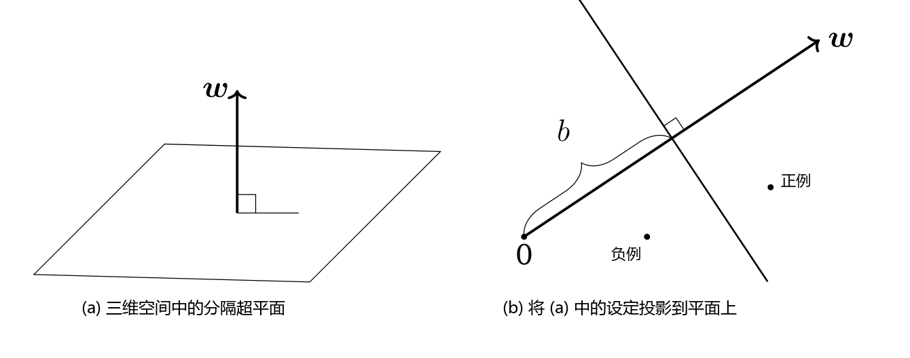

# 12.1 分隔超平面

给定表示为向量的两个样本 $\boldsymbol{x}_i$ 和 $\boldsymbol{x}_j$，计算它们之间相似度的一种经典方法是计算内积 $\langle \boldsymbol{x}_i, \boldsymbol{x}_j \rangle$。回顾 3.2 节，内积与两个向量之间的夹角密切相关。两个向量之间的内积大小取决于各个向量的长度（范数）。此外，内积使我们能够严格定义正交性和投影等核心几何概念。

许多分类算法背后的核心思想，是将数据表示在空间 $\mathbb{R}^D$ 中，然后对该空间进行划分——理想情况下，划分应使得具有相同标签的样本（且没有其他类别的样本）位于同一划分区域中。在二元分类的情形下，空间将被划分为分别对应于正类和负类的两个部分。我们考虑一种特别便利且基础的划分方式，即使用一个超平面将空间（线性地）切分为两半。设样本 $\boldsymbol{x} \in \mathbb{R}^D$ 为数据空间中的一个元素。考虑由参数 $\boldsymbol{w} \in \mathbb{R}^D$ 和标量截距 $b \in \mathbb{R}$ 参数化的仿射函数：

$$
f : \mathbb{R}^D \to \mathbb{R}
\tag{12.2a}
$$

$$
\boldsymbol{x} \mapsto \langle \boldsymbol{w}, \boldsymbol{x} \rangle + b .
\tag{12.2b}
$$

回顾 2.8 节，超平面是仿射子空间。因此，在我们的二元分类问题中，我们将分隔两个类别的 **超平面（hyperplane）** 定义为函数 $f(\boldsymbol{x}) = 0$ 的水平集：

$$
\{ \boldsymbol{x} \in \mathbb{R}^D : f(\boldsymbol{x}) = 0 \} .
\tag{12.3}
$$

  
  
<b>图 12.2</b> 分隔超平面方程 (12.3)。(a) 三维空间中表示超平面的标准几何形式；(b) 为便于图示与推导，我们从侧面视角沿超平面边缘观察其在垂直平面上的二维正交截面投影。

图 12.2 给出了该超平面的几何示意图，其中向量 $\boldsymbol{w}$ 是超平面的法向量（normal vector），$b$ 是截距（intercept）。我们可以通过在超平面上任取两个样本点 $\boldsymbol{x}_a$ 和 $\boldsymbol{x}_b$，并证明它们之间的差值向量与 $\boldsymbol{w}$ 正交，从而严格推导出 $\boldsymbol{w}$ 确实是超平面 (12.3) 的法向量。以等式形式写出：

$$
f(\boldsymbol{x}_a) - f(\boldsymbol{x}_b) = \langle \boldsymbol{w}, \boldsymbol{x}_a \rangle + b - (\langle \boldsymbol{w}, \boldsymbol{x}_b \rangle + b)
\tag{12.4a}
$$

$$
= \langle \boldsymbol{w}, \boldsymbol{x}_a - \boldsymbol{x}_b \rangle ,
\tag{12.4b}
$$

其中第二行是由内积的双线性（3.2 节）直接得到的。由于我们选择的 $\boldsymbol{x}_a$ 和 $\boldsymbol{x}_b$ 都位于超平面上，根据定义必然有 $f(\boldsymbol{x}_a) = 0$ 且 $f(\boldsymbol{x}_b) = 0$，由此可得：

$$
\langle \boldsymbol{w}, \boldsymbol{x}_a - \boldsymbol{x}_b \rangle = 0 .
$$

回顾可知，当两个向量的内积为零时，它们相互正交。因此，我们严格证明了向量 $\boldsymbol{w}$ 与超平面上的任意位移向量均正交，即 $\boldsymbol{w}$ 是超平面的法向量。

---

**说明（关于向量的双重理解）**  
回顾第 2 章，我们指出在不同情境下可以以不同的方式理解“向量”。在本章中：
- 我们将参数向量 $\boldsymbol{w}$ 视作一个指示几何方向的箭头，即将其视为**几何向量**；
- 相比之下，我们将样本向量 $\boldsymbol{x}$ 视作数据点（由其坐标值确定），即将其视为标准基下的**坐标向量**。  
♦

---

当给定一个新的测试样本 $\boldsymbol{x}_{\text{test}}$ 时，我们根据该样本落在超平面的哪一侧将其分类为正类或负类。需要特别注意的是，方程 (12.3) 不仅定义了一个超平面，还附带定义了一个朝向——也就是说，它明确划分了超平面的正侧（positive side）与负侧（negative side）。因此，为了对测试样本 $\boldsymbol{x}_{\text{test}}$ 进行分类，我们只需计算函数值 $f(\boldsymbol{x}_{\text{test}})$，并在满足以下规则时进行判定：

$$
\hat{y} = \begin{cases} +1, & \text{若 } f(\boldsymbol{x}_{\text{test}}) \geqslant 0 \\ -1, & \text{若 } f(\boldsymbol{x}_{\text{test}}) < 0 \end{cases} .
$$

从几何直观上讲，正样本位于超平面的“上方”，而负样本位于超平面的“下方”。

在训练分类器时，我们希望确保带有正标签的样本都落在超平面的正侧，即：

$$
\langle \boldsymbol{w}, \boldsymbol{x}_n \rangle + b \geqslant 0 \quad \text{当 } y_n = +1 时 ,
\tag{12.5}
$$

同时确保带有负标签的样本都落在超平面的负侧，即：

$$
\langle \boldsymbol{w}, \boldsymbol{x}_n \rangle + b < 0 \quad \text{当 } y_n = -1 时 .
\tag{12.6}
$$

读者可参考图 12.2(b) 获得正负样本几何分布的直观感受。在数学上，这两个条件通常可以合并为一个极为紧凑的唯一样本判别约束不等式：

$$
y_n (\langle \boldsymbol{w}, \boldsymbol{x}_n \rangle + b) \geqslant 0 .
\tag{12.7}
$$

当我们将式 (12.5) 和式 (12.6) 的两端分别乘以对应的标签取值 $y_n = 1$ 和 $y_n = -1$ 时，即可立即验证式 (12.7) 与式 (12.5) 及 (12.6) 是完全等价的。
