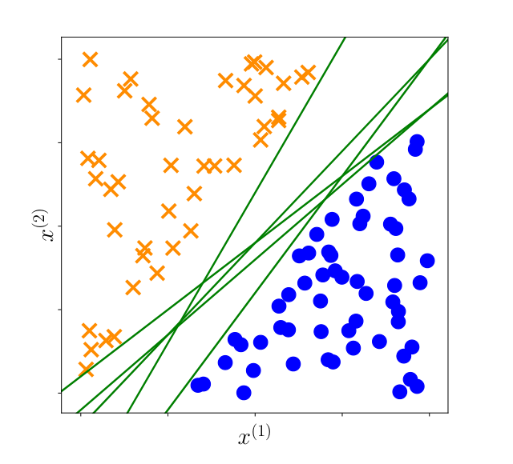
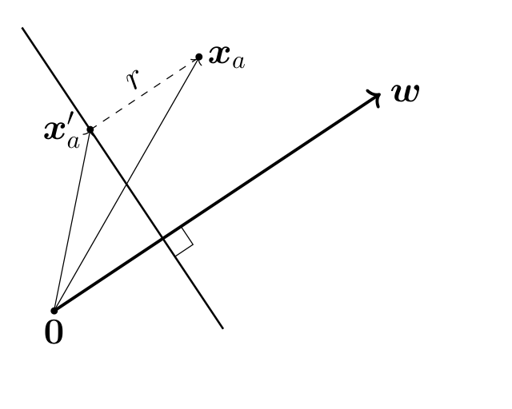
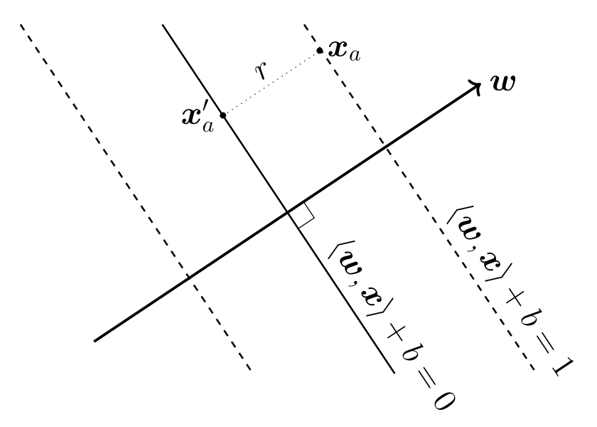
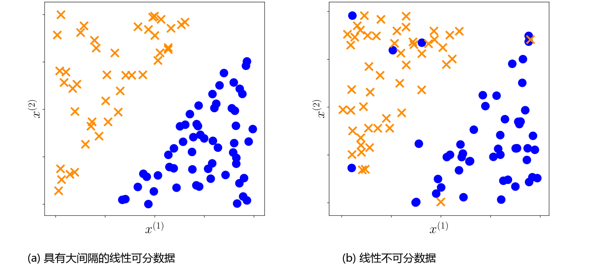
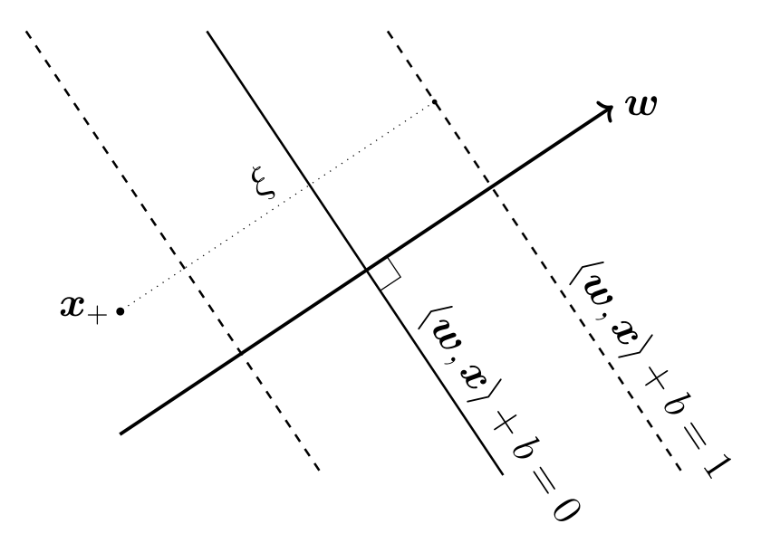
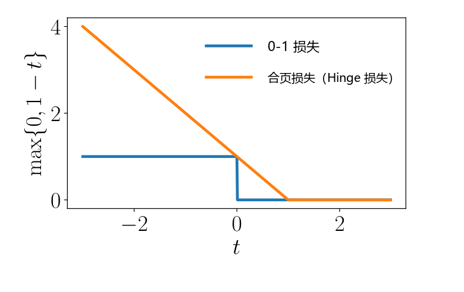

# 12.2 原生支持向量机

基于点到超平面的距离概念，我们现在可以正式讨论支持向量机（Support Vector Machine, SVM）。对于一个线性可分的数据集 $\{(\boldsymbol{x}_1, y_1), \ldots, (\boldsymbol{x}_N, y_N)\}$，存在无穷多个候选分隔超平面（参见图 12.3），从而对应着无穷多个能够在训练集上实现零误差分类的线性分类器。

  
  
<b>图 12.3</b> 候选分隔超平面示例。存在很多条可以将红色十字与蓝色圆点完全分开的线性分类器边界（绿线）。

为了找到唯一确定的最优解，一个核心思想是选择能够使正负样本之间 **间隔（margin）** 最大化的分隔超平面。换句话说，我们希望正例和负例被一个尽可能大的间隔所分隔开（12.2.1 节）。理论表明，具有较大间隔的分类器往往具有极佳的泛化性能（Steinwart and Christmann, 2008）。在接下来的内容中，我们通过计算样本点到超平面的距离来正式推导间隔。回顾 3.8 节，给定一个样本点 $\boldsymbol{x}_n$，超平面上距离该点最近的点可以通过 **正交投影（orthogonal projection）** 获得。

---

## 12.2.1 间隔的概念

“间隔”的概念在直观上十分简单：假设数据集是线性可分的，那么间隔就是分隔超平面到数据集中 **距离其最近的样本点** 的垂直几何距离（到超平面距离最近的样本点可能有两个或更多）。然而，在尝试严格形式化这一距离时，会出现一个容易引起混淆的技术细节——我们必须明确度量该距离的 **尺度（scale）**。

一个潜在的尺度是直接考虑数据本身的尺度，即 $\boldsymbol{x}_n$ 的原始数值大小。但这种做法存在严重问题：如果我们改变 $\boldsymbol{x}_n$ 的度量单位（例如从米转换为毫米），$\boldsymbol{x}_n$ 中的数值就会改变，从而导致计算出的距离数值发生改变。正如我们稍后所见，我们依据超平面方程 (12.3) 本身来定义度量尺度。

  
  
<b>图 12.4</b> 利用向量加法表达样本点到超平面的几何距离：xₐ = x'ₐ + r (w / ‖w‖)。

考虑超平面 $\langle \boldsymbol{w}, \boldsymbol{x} \rangle + b = 0$ 和一个样本点 $\boldsymbol{x}_a$，如图 12.4 所示。不失一般性，我们可以假设样本 $\boldsymbol{x}_a$ 位于超平面的正侧，即 $\langle \boldsymbol{w}, \boldsymbol{x}_a \rangle + b > 0$。我们希望计算 $\boldsymbol{x}_a$ 到超平面的垂直几何距离 $r > 0$。为此，我们考虑 $\boldsymbol{x}_a$ 在超平面上的正交投影（3.8 节），记作 $\boldsymbol{x}'_a$。

由于法向量 $\boldsymbol{w}$ 与超平面正交，我们知道从 $\boldsymbol{x}'_a$ 到 $\boldsymbol{x}_a$ 的位移向量正好沿着 $\boldsymbol{w}$ 的方向，因此该位移就是向量 $\boldsymbol{w}$ 的某种缩放。为了方便，我们选择使用长度为 1 的单位法向量 $\frac{\boldsymbol{w}}{\|\boldsymbol{w}\|}$。利用向量加法（2.4 节），我们可以将 $\boldsymbol{x}_a$ 严格表示为：

$$
\boldsymbol{x}_a = \boldsymbol{x}'_a + r \frac{\boldsymbol{w}}{\|\boldsymbol{w}\|} .
\tag{12.8}
$$

理解标量距离 $r$ 的另一种方式是：它是向量 $\boldsymbol{x}_a - \boldsymbol{x}'_a$ 在由单位向量 $\frac{\boldsymbol{w}}{\|\boldsymbol{w}\|}$ 张成的一维子空间中的坐标。此时，我们已将 $\boldsymbol{x}_a$ 到超平面的距离精确表示为 $r$。如果我们将 $\boldsymbol{x}_a$ 取为整个数据集中距离超平面最近的样本点，那么该距离 $r$ 即为分类器的 **间隔（margin）**。

回顾前文，我们希望所有正样本到超平面的距离都大于等于 $r$，且所有负样本（在负方向上）到超平面的距离也至少为 $r$。类似于将式 (12.5) 与 (12.6) 合并为式 (12.7)，我们可以将这一几何要求统一表述为：

$$
y_n (\langle \boldsymbol{w}, \boldsymbol{x}_n \rangle + b) \geqslant r .
\tag{12.9}
$$

换句话说，我们将“所有正负样本距离超平面至少为 $r$”的要求合并成了一个单一的不等式。

由于此时超平面的朝向仅由 $\boldsymbol{w}$ 的方向决定，我们在模型中引入假设：参数向量 $\boldsymbol{w}$ 的长度被归一化为单位长度，即 $\|\boldsymbol{w}\| = 1$（这里采用欧几里得范数 $\|\boldsymbol{w}\| = \sqrt{\boldsymbol{w}^\top \boldsymbol{w}}$，3.1 节）。这一归一化假设使得距离 $r$ 在式 (12.8) 中具有极其直观的几何意义——它就是单位长度向量的实际缩放系数。

---

**说明（关于间隔的不同形式化表述）**  
熟悉支持向量机其他教材阐述的读者可能会注意到，我们在此处引入的 $\|\boldsymbol{w}\| = 1$ 约束不同于标准的经典表述（例如 Schölkopf and Smola, 2002 中直接固定函数间隔为 1 的推导）。在 12.2.3 节中，我们将严格证明这两种表述途径是完全等价的。  
♦

---

将上述要求综合为一个带约束的优化问题，我们得到：

$$
\max_{\boldsymbol{w}, b, r} \underbrace{r}_{\text{间隔}}
\tag{12.10}
$$

$$
\text{subject to } \underbrace{y_n (\langle \boldsymbol{w}, \boldsymbol{x}_n \rangle + b) \geqslant r}_{\text{数据拟合约束}} , \quad \underbrace{\|\boldsymbol{w}\| = 1}_{\text{法向量归一化}} , \quad r > 0 ,
$$

式 (12.10) 的含义非常纯粹：我们希望在保证所有数据点都位于超平面正确一侧的前提下，使几何间隔 $r$ 最大化。

---

**说明（间隔在机器学习理论中的深远意义）**  
“间隔”的概念在统计机器学习中具有基础性的广泛意义。Vladimir Vapnik 和 Alexey Chervonenkis 正是通过利用间隔证明了：当分类间隔较大时，分类函数族的“容量（capacity）/复杂度”较低，从而保证了学习的泛化能力（Vapnik, 2000）。事实证明，这一概念在现代统计学习理论中分析泛化误差边界时不可或缺（Steinwart and Christmann, 2008; Shalev-Shwartz and Ben-David, 2014）。  
♦

---

## 12.2.2 间隔的传统推导

在上一小节中，我们基于“仅关心 $\boldsymbol{w}$ 的方向而非其长度”的观察推导出了式 (12.10)，从而引入了 $\|\boldsymbol{w}\| = 1$ 的假设。在本小节中，我们通过引入另一种不同的视角来推导间隔最大化问题。

我们不再约束参数向量的长度归一化，而是选择对**数据预测输出的尺度**进行规范。具体而言，我们设定度量尺度，使得预测器 $\langle \boldsymbol{w}, \boldsymbol{x} \rangle + b$ 在距离超平面最近的样本点处的取值恰好为 $1$。设数据集中距离超平面最近的样本点为 $\boldsymbol{x}_a$（当前仍假定数据线性可分）。

  
  
<b>图 12.5</b> 传统间隔推导：通过重新缩放轴使得边界上的样本满足 ⟨w, xₐ⟩ + b = 1，推导得出几何间隔 r = 1 / ‖w‖。

图 12.5 与图 12.4 在几何结构上完全相同，唯一的区别在于我们重新对预测输出的尺度进行了缩放，使得样本 $\boldsymbol{x}_a$ 恰好落在正间隔边界超平面上，即：

$$
\langle \boldsymbol{w}, \boldsymbol{x}_a \rangle + b = 1 .
$$

由于 $\boldsymbol{x}'_a$ 是 $\boldsymbol{x}_a$ 在超平面上的正交投影，根据定义它必然严格落在超平面上，即：

$$
\langle \boldsymbol{w}, \boldsymbol{x}'_a \rangle + b = 0 .
\tag{12.11}
$$

将式 (12.8) 的几何向量分解式 $\boldsymbol{x}'_a = \boldsymbol{x}_a - r \frac{\boldsymbol{w}}{\|\boldsymbol{w}\|}$ 代入式 (12.11)，我们得到：

$$
\left\langle \boldsymbol{w}, \boldsymbol{x}_a - r \frac{\boldsymbol{w}}{\|\boldsymbol{w}\|} \right\rangle + b = 0 .
\tag{12.12}
$$

利用内积的双线性性质（3.2 节），展开上式：

$$
\langle \boldsymbol{w}, \boldsymbol{x}_a \rangle + b - r \frac{\langle \boldsymbol{w}, \boldsymbol{w} \rangle}{\|\boldsymbol{w}\|} = 0 .
\tag{12.13}
$$

注意到前两项根据我们对尺度的设定恰好等于 $1$，即 $\langle \boldsymbol{w}, \boldsymbol{x}_a \rangle + b = 1$。又根据式 (3.16)，内积 $\langle \boldsymbol{w}, \boldsymbol{w} \rangle = \|\boldsymbol{w}\|^2$。因此第三项化简为：

$$
r \frac{\|\boldsymbol{w}\|^2}{\|\boldsymbol{w}\|} = r \|\boldsymbol{w}\| .
$$

代入式 (12.13) 即得：

$$
1 - r \|\boldsymbol{w}\| = 0 \implies r = \frac{1}{\|\boldsymbol{w}\|} .
\tag{12.14}
$$

这是一个极为优美且关键的结论：**几何间隔 $r$ 恰好等于超平面法向量模长的倒数 $\frac{1}{\|\boldsymbol{w}\|}$**！

初看起来，这个等式可能略显反直觉：我们似乎用一个尚未确定的向量 $\boldsymbol{w}$ 的模长来表达了几何距离 $r$。理解这一点的一种有效视角是将距离 $r$ 视为推导过程中的一个辅助变量。因此，在本节的后续讨论中，我们统一使用 $\frac{1}{\|\boldsymbol{w}\|}$ 来表示到超平面的几何距离。在 12.2.3 节中，我们将严格证明选择间隔为 $1$ 与 12.2.1 节中假设 $\|\boldsymbol{w}\| = 1$ 在数学上完全等价。

类似于得出式 (12.9) 的推导，我们要求所有的正负样本点到超平面的函数间隔至少为 $1$：

$$
y_n (\langle \boldsymbol{w}, \boldsymbol{x}_n \rangle + b) \geqslant 1 .
\tag{12.15}
$$

将最大化间隔 $r = \frac{1}{\|\boldsymbol{w}\|}$ 与分类正确性约束相结合，我们得到优化问题：

$$
\max_{\boldsymbol{w}, b} \frac{1}{\|\boldsymbol{w}\|}
\tag{12.16}
$$

$$
\text{subject to } y_n (\langle \boldsymbol{w}, \boldsymbol{x}_n \rangle + b) \geqslant 1, \quad \forall n = 1, \ldots, N .
\tag{12.17}
$$

在优化理论与实际计算中，相比于直接最大化范数的倒数，最大化 $\frac{1}{\|\boldsymbol{w}\|}$ 等价于最小化范数 $\|\boldsymbol{w}\|$，进而等价于最小化范数的平方 $\frac{1}{2}\|\boldsymbol{w}\|^2$（引入系数 $\frac{1}{2}$ 不改变最优点位置，但可以在求导时消去平方项产生的系数 2，带来更整洁的梯度形式）。于是，优化目标转化为标准的凸二次规划形式：

$$
\min_{\boldsymbol{w}, b} \frac{1}{2} \|\boldsymbol{w}\|^2
\tag{12.18}
$$

$$
\text{subject to } y_n (\langle \boldsymbol{w}, \boldsymbol{x}_n \rangle + b) \geqslant 1, \quad \forall n = 1, \ldots, N .
\tag{12.19}
$$

式 (12.18) 被称为 **硬间隔支持向量机（Hard Margin SVM）**。之所以称为“硬（hard）”，是因为该公式具有严格的约束，不允许任何样本点侵入间隔边界内部或落在错误的一侧。在 12.2.4 节中，我们将放宽这一硬性约束，以优雅地应对非线性可分的数据集。

---

## 12.2.3 为什么可以将间隔设为 1

在 12.2.1 节中，我们旨在最大化表示最近样本点到超平面几何距离的变量 $r$；而在 12.2.2 节中，我们直接对数据尺度进行了缩放，使得最近样本点处的预测值为 1。在本小节中，我们通过一个严格的数学定理说明这两种推导完全等价。

---

**定理 12.1**  
在权重归一化假定下最大化几何间隔 $r$ 的优化问题 (12.10)：

$$
\max_{\boldsymbol{w}, b, r} \underbrace{r}_{\text{间隔}} \quad \text{subject to } y_n (\langle \boldsymbol{w}, \boldsymbol{x}_n \rangle + b) \geqslant r, \quad \|\boldsymbol{w}\| = 1, \quad r > 0 ,
\tag{12.20}
$$

与将最近样本处的函数间隔固定为 1 后的优化问题：

$$
\min_{\boldsymbol{w}, b} \underbrace{\frac{1}{2} \|\boldsymbol{w}\|^2}_{\text{间隔项}} \quad \text{subject to } \underbrace{y_n (\langle \boldsymbol{w}, \boldsymbol{x}_n \rangle + b) \geqslant 1}_{\text{数据拟合约束}} ,
\tag{12.21}
$$

在几何上是完全等价的。

---

**证明**  
考虑优化问题 (12.20)。由于平方变换在非负实数区间上是严格单调递增的，因此将目标函数替换为 $r^2$ 不会改变最优解。由于 $\|\boldsymbol{w}\| = 1$，我们可以引入一个未归一化的新权重向量 $\boldsymbol{w}'$，并通过显式使用单位向量 $\frac{\boldsymbol{w}'}{\|\boldsymbol{w}'\|}$ 来重新参数化目标：

$$
\max_{\boldsymbol{w}', b, r} r^2 \quad \text{subject to } y_n \left( \left\langle \frac{\boldsymbol{w}'}{\|\boldsymbol{w}'\|}, \boldsymbol{x}_n \right\rangle + b \right) \geqslant r, \quad r > 0 .
\tag{12.22}
$$

由于式 (12.22) 显式声明了几何距离 $r > 0$（由线性可分假设保证），我们可以将第一个约束不等式的两端同时除以 $r$：

$$
\max_{\boldsymbol{w}', b, r} r^2 \quad \text{subject to } y_n \left( \left\langle \underbrace{\frac{\boldsymbol{w}'}{\|\boldsymbol{w}'\| r}}_{\boldsymbol{w}''}, \boldsymbol{x}_n \right\rangle + \underbrace{\frac{b}{r}}_{b''} \right) \geqslant 1, \quad r > 0 .
\tag{12.23}
$$

定义新参数 $\boldsymbol{w}'' = \frac{\boldsymbol{w}'}{\|\boldsymbol{w}'\| r}$ 和 $b'' = \frac{b}{r}$。对 $\boldsymbol{w}''$ 两端取范数：

$$
\|\boldsymbol{w}''\| = \left\| \frac{\boldsymbol{w}'}{\|\boldsymbol{w}'\| r} \right\| = \frac{1}{r} \left\| \frac{\boldsymbol{w}'}{\|\boldsymbol{w}'\|} \right\| = \frac{1}{r} \implies r = \frac{1}{\|\boldsymbol{w}''\|} .
\tag{12.24}
$$

将 $r^2 = \frac{1}{\|\boldsymbol{w}''\|^2}$ 代入式 (12.23) 的目标函数中，优化问题重写为：

$$
\max_{\boldsymbol{w}'', b''} \frac{1}{\|\boldsymbol{w}''\|^2} \quad \text{subject to } y_n (\langle \boldsymbol{w}'', \boldsymbol{x}_n \rangle + b'') \geqslant 1 .
\tag{12.25}
$$

最后一步注意到，最大化 $\frac{1}{\|\boldsymbol{w}''\|^2}$ 与最小化 $\frac{1}{2} \|\boldsymbol{w}''\|^2$ 具有完全相同的最优解。由此定理 12.1 得证。  
$\blacksquare$

---

## 12.2.4 软间隔 SVM：几何视角

在实际应用中，数据通常不是线性可分的。此时，我们必须允许某些样本点落入间隔区域内部，甚至落在超平面的错误一侧，如图 12.6 所示。

  
  
<b>图 12.6</b> (a) 具有大间隔的线性可分数据；(b) 现实中常见的线性不可分数据，两类样本点相互交叠渗透。

允许一定分类错误的模型被称为 **软间隔支持向量机（Soft Margin SVM）**。在本节中，我们首先使用直观的几何推导来导出其优化问题；在 12.2.5 节中，我们将利用损失函数的思想导出等价的目标；在 12.3 节中，我们将借助拉格朗日乘子法导出对偶优化问题，并由此揭示软间隔 SVM 的第三种等价诠释——基于样本凸包最近距离的几何对偶图景（12.3.2 节）。

解决线性不可分问题的关键几何构想，是为每个样本-标签对 $(\boldsymbol{x}_n, y_n)$ 引入一个 **松弛变量（slack variable）** $\xi_n \geqslant 0$。松弛变量允许特定样本侵入间隔区域甚至越过分隔超平面（参见图 12.7）。

  
  
<b>图 12.7</b> 软间隔 SVM 允许样本落在间隔内或落在超平面的错误一侧。松弛变量 ξ 衡量了越界正样本 x₊ 距离其正间隔超平面 ⟨w, x⟩ + b = 1 的违背距离。

如图 12.7 所示，对于正样本 $\boldsymbol{x}_+$，当其未能达到正边界 $\langle \boldsymbol{w}, \boldsymbol{x}_+ \rangle + b = 1$ 时，其到该边界的垂直偏移量即为 $\xi_+$。因此，我们从间隔边界中减去松弛量 $\xi_n$，同时约束 $\xi_n \geqslant 0$。为了促使分类器尽可能正确分类更多样本，我们在最小化目标中对所有松弛变量之和进行惩罚：

$$
\min_{\boldsymbol{w}, b, \boldsymbol{\xi}} \frac{1}{2} \|\boldsymbol{w}\|^2 + C \sum_{n=1}^N \xi_n
\tag{12.26a}
$$

$$
\text{subject to } y_n (\langle \boldsymbol{w}, \boldsymbol{x}_n \rangle + b) \geqslant 1 - \xi_n ,
\tag{12.26b}
$$

$$
\xi_n \geqslant 0 , \quad \forall n = 1, \ldots, N .
\tag{12.26c}
$$

与硬间隔 SVM (12.18) 相比，这一带有松弛变量的问题正是著名的 **软间隔 SVM**（因其参数形式通常亦称为 **$C$-SVM**）。

超参数 $C > 0$ 在 **最大化间隔** 与 **最小化总松弛违背量** 之间进行权衡。该参数被称为 **正则化参数（regularization parameter）**：
- 当 $C$ 很大时，意味着对松弛违背的惩罚极重，分类器将极力避免任何样本侵入间隔，逼近硬间隔 SVM；
- 当 $C$ 较小时，分类器更看重间隔项 $\frac{1}{2}\|\boldsymbol{w}\|^2$ 的最小化，从而容忍更多样本落入间隔或被轻微误分，以此换取更大的几何间隔和更好的泛化抗噪能力。

---

**说明（未受正则化的截距 $b$）**  
在软间隔 SVM (12.26a) 的公式表述中，权重向量 $\boldsymbol{w}$ 受到了范数惩罚（即被正则化），但截距项 $b$ **未受正则化**（目标函数中不包含 $b^2$ 项）。未正则化的截距项 $b$ 在理论分析上引入了额外的复杂性（Steinwart and Christmann, 2008, 第 1 章），并且会在一定程度上增加数值求解的算法开销（Fan et al., 2008）。  
♦

---

## 12.2.5 软间隔 SVM：损失函数视角

现在让我们遵循经验风险最小化原则（8.2 节），从一个截然不同但完全等价的视角——损失函数的角度重新审视 SVM。

在支持向量机中，我们选择超平面作为假设类（hypothesis class）：

$$
f(\boldsymbol{x}) = \langle \boldsymbol{w}, \boldsymbol{x} \rangle + b .
\tag{12.27}
$$

我们将会看到，几何间隔最大化直接对应于目标函数中的正则化项。接下来的核心问题是：**对应的损失函数究竟是什么？**

与第 9 章讨论的连续值回归问题不同，二元分类的输出标签属于离散集合 $\{+1, -1\}$。因此，用于衡量预测偏差的损失函数必须专门适配二元分类任务。例如，回归中广泛使用的平方损失（式 (9.10b)）并不适合二元分类。

---

**说明（0-1 损失与组合优化的困境）**  
在二元分类中，最符合直觉的理想损失函数是直接统计预测标签与真实标签之间的不匹配次数：如果预测类别与真实标签一致，损失为 0；如果两者不一致，损失为 1。这一损失函数记作 $\mathbf{1}(f(\boldsymbol{x}_n) \neq y_n)$，称为 **0-1 损失（zero-one loss）**。  
不幸的是，0-1 损失是非连续、非凸且阶跃跳变的，直接最小化 0-1 损失将导出一个极其困难的 **组合优化问题（combinatorial optimization problem）**，这在计算复杂度上属于 NP-难问题。  
♦

---

支持向量机所对应的凸替代损失函数是什么？考虑预测器输出 $f(\boldsymbol{x}_n)$ 与真实标签 $y_n$ 之间的乘积。导出软间隔 SVM (12.26a) 的等价途径是引入著名的 **合页损失（hinge loss）**：

$$
\ell(t) = \max\{0, 1 - t\} , \quad \text{其中 } t = y f(\boldsymbol{x}) = y (\langle \boldsymbol{w}, \boldsymbol{x} \rangle + b) .
\tag{12.28}
$$

让我们考察合页损失在不同预测状态下的取值规律：
1. 若样本被正确分类且距离超平面大于等于 1（即 $t \geqslant 1$），样本落在正规间隔之外，合页损失为 $0$；
2. 若样本被正确分类但距离超平面过近（即 $0 < t < 1$），样本侵入了间隔区域内部，此时虽然预测方向正确，但仍会承受 $1 - t > 0$ 的线性惩罚；
3. 若样本落在超平面的错误一侧（即 $t \leqslant 0$），样本被错误分类，此时合页损失将承受更大的线性增长惩罚。

换言之，**一旦样本距离超平面的距离小于间隔，即使分类正确，我们也要对其施加线性惩罚**！

  
  
<b>图 12.8</b> 合页损失（Hinge loss）是 0-1 损失的凸上界，在保证凸可微优化的同时对边界侵入施加合理的线性惩罚。

如图 12.8 所示，合页损失可以分段表示为两个线性部分：

$$
\ell(t) = \begin{cases} 0, & \text{若 } t \geqslant 1 \\ 1 - t, & \text{若 } t < 1 \end{cases} .
\tag{12.29}
$$

相比之下，硬间隔 SVM (12.18) 对应的等价损失函数形式为：

$$
\ell_{\text{hard}}(t) = \begin{cases} 0, & \text{若 } t \geqslant 1 \\ \infty, & \text{若 } t < 1 \end{cases} .
\tag{12.30}
$$

这生动地表明硬间隔 SVM 绝不允许任何样本进入间隔边界内部。

对于给定的训练数据集 $\{(\boldsymbol{x}_1, y_1), \ldots, (\boldsymbol{x}_N, y_N)\}$，我们在最小化经验风险总损失的同时引入 $\ell_2$ 正则化（8.2.3 节）。使用合页损失 (12.28)，我们立即得到如下无约束经验风险最小化优化问题：

$$
\min_{\boldsymbol{w}, b} \underbrace{\frac{1}{2} \|\boldsymbol{w}\|^2}_{\text{正则化项}} + C \sum_{n=1}^N \underbrace{\max\{0, 1 - y_n (\langle \boldsymbol{w}, \boldsymbol{x}_n \rangle + b)\}}_{\text{误差项 / 损失项}} .
\tag{12.31}
$$

式 (12.31) 中的第一项正是正则化项（参见 9.2.3 节），第二项正是经验合页损失误差项。回顾 12.2.4 节可知，$\frac{1}{2}\|\boldsymbol{w}\|^2$ 直接源自几何间隔的倒数。换句话说，**最大化分类间隔等价于在目标函数中施加 $\ell_2$ 权重正则化**！

原则上，式 (12.31) 的无约束凸优化问题可以直接采用次梯度下降法（sub-gradient descent，7.1 节）求解。为了严格证明式 (12.31) 与几何软间隔 SVM (12.26a) 的等价性，注意到合页损失对单个样本的最小化：

$$
\min_t \max\{0, 1 - t\}
\tag{12.32}
$$

可以通过引入一个辅助松弛标量 $\xi$ 严格等价地重写为带约束的线性形式：

$$
\min_{\xi, t} \xi \quad \text{subject to } \xi \geqslant 0, \quad \xi \geqslant 1 - t .
\tag{12.33}
$$

将这一等价变换代入式 (12.31)，令 $t_n = y_n (\langle \boldsymbol{w}, \boldsymbol{x}_n \rangle + b)$ 并移项整理不等式约束，我们便精确复原出了软间隔 SVM 的原生优化问题 (12.26a)！

---

**说明（对比线性回归的损失函数视角）**  
让我们将本节中支持向量机对损失函数的选取与第 9 章线性回归的损失函数做一对比。回顾 9.2.1 节，在线性高斯假设下寻找极大似然估计时，我们通常最小化负对数似然。对于带有高斯噪声的线性回归，每个样本的负对数似然恰好是平方误差函数。因此，平方误差是极大似然解自然推导出的对应损失函数。而在 SVM 中，合页损失直接由追求大间隔与鲁棒分类的几何目标驱动而生。  
♦
