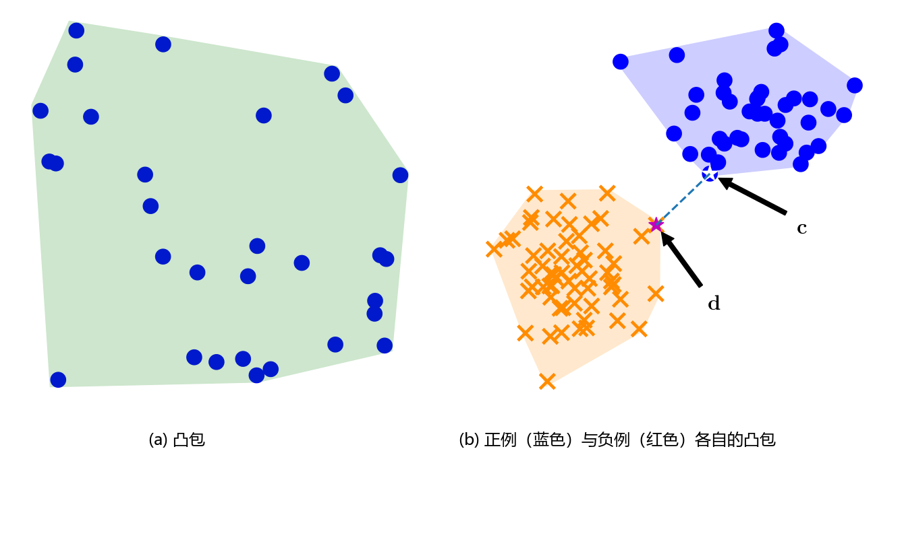

# 12.3 对偶支持向量机

在前几节中，我们以变量 $\boldsymbol{w}$ 和 $b$ 为核心所展开的描述被称为 **原生支持向量机（Primal SVM）**。回顾前文，我们考虑具有 $D$ 个特征的输入向量 $\boldsymbol{x} \in \mathbb{R}^D$。由于法向量 $\boldsymbol{w}$ 与样本 $\boldsymbol{x}$ 具有相同的维度，这意味着原生优化问题中的待估参数数量（$\boldsymbol{w}$ 的维度）随特征维度 $D$ 线性增长。

在接下来的内容中，我们考察一个完全等价的优化问题（即所谓的 **对偶视角（dual view）**），该问题的参数数量与特征维度完全解耦，转而随训练集中的 **样本数量 $N$** 增长。我们在第 10 章中已经见到过类似的思想——当时我们以一种不随特征维度膨胀的方式重新表述了学习问题（10.5 节高维 PCA）。对于特征维度远大于样本数量（即 $D \gg N$）的高维问题，这一对偶视角极其有效。此外，对偶 SVM 还有一个极为强大的额外优势：它允许极其自然且模块化地引入核方法（Kernel Methods），正如我们在本章末尾将看到的那样。“对偶（dual）”一词在数学文献中频繁出现，在当前上下文中，它特指 **凸对偶（convex duality）**。本节的核心推导本质上是我们在 7.2 节中系统讨论的凸对偶理论的经典范例。

---

## 12.3.1 通过拉格朗日乘子法推导凸对偶

回顾软间隔 SVM 的原生优化问题 (12.26a)。我们将对应于原生 SVM 的变量 $\boldsymbol{w}, b, \boldsymbol{\xi}$ 统称为 **原生变量（primal variables）**。我们引入拉格朗日乘子向量：
- 用 $\alpha_n \geqslant 0$ 作为对应于正确分类不等式约束式 (12.26b) 的拉格朗日乘子；
- 用 $\gamma_n \geqslant 0$ 作为对应于松弛变量非负约束式 (12.26c) 的拉格朗日乘子。

在第 7 章中，我们使用 $\lambda$ 作为通用的拉格朗日乘子记号；而在本节中，我们遵循 SVM 领域的经典文献规范，采用 $\alpha$ 和 $\gamma$。由此构建的拉格朗日函数（Lagrangian）为：

$$
L(\boldsymbol{w}, b, \boldsymbol{\xi}, \boldsymbol{\alpha}, \boldsymbol{\gamma}) = \frac{1}{2} \|\boldsymbol{w}\|^2 + C \sum_{n=1}^N \xi_n - \sum_{n=1}^N \alpha_n \left( y_n (\langle \boldsymbol{w}, \boldsymbol{x}_n \rangle + b) - 1 + \xi_n \right) - \sum_{n=1}^N \gamma_n \xi_n .
\tag{12.34}
$$

为了获得对偶函数，我们分别对三个原生变量 $\boldsymbol{w}, b$ 以及松弛分量 $\xi_n$ 求偏导数：

$$
\frac{\partial L}{\partial \boldsymbol{w}} = \boldsymbol{w}^\top - \sum_{n=1}^N \alpha_n y_n \boldsymbol{x}_n^\top ,
\tag{12.35}
$$

$$
\frac{\partial L}{\partial b} = - \sum_{n=1}^N \alpha_n y_n ,
\tag{12.36}
$$

$$
\frac{\partial L}{\partial \xi_n} = C - \alpha_n - \gamma_n .
\tag{12.37}
$$

我们通过令这三个偏导数分别等于零来求解拉格朗日函数关于原生变量的无约束极小值。首先，令式 (12.35) 为零，我们得到最优权重向量的解析表达式：

$$
\boldsymbol{w} = \sum_{n=1}^N \alpha_n y_n \boldsymbol{x}_n ,
\tag{12.38}
$$

这一重要结论是现代统计学习理论中著名 **表示定理（Representer Theorem）**（Kimeldorf and Wahba, 1970）的一个具体实例。式 (12.38) 深刻表明：**原生的最优法向量 $\boldsymbol{w}$ 可以完全由训练样本 $\boldsymbol{x}_n$ 的线性组合来表示**。回顾 2.6.1 节，这意味着优化问题的解必然严格落入训练数据所张成的子空间（span）内。表示定理在经验风险最小化与核学习的一般理论框架下普遍成立（Hofmann et al., 2008; Argyriou and Dinuzzo, 2014）。

---

**说明（“支持向量机”名称的由来）**  
表示定理式 (12.38) 同时也为“支持向量机（Support Vector Machine）”这一名称提供了最本质的几何解释：那些对应拉格朗日乘子 $\alpha_n = 0$ 的数据样本，对最终的法向量解 $\boldsymbol{w}$ 完全没有产生任何贡献；而那些满足 $\alpha_n > 0$ 的非零样本点，则直接决定并支撑着最终的分隔超平面，因此被称为 **支持向量（support vectors）**！  
♦

---

接下来，将 $\boldsymbol{w}$ 的表示式 (12.38) 代回到拉格朗日函数 (12.34) 中：

$$
D(\boldsymbol{\xi}, \boldsymbol{\alpha}, \boldsymbol{\gamma}) = \frac{1}{2} \sum_{i=1}^N \sum_{j=1}^N y_i y_j \alpha_i \alpha_j \langle \boldsymbol{x}_i, \boldsymbol{x}_j \rangle - \sum_{i=1}^N y_i \alpha_i \left\langle \sum_{j=1}^N y_j \alpha_j \boldsymbol{x}_j, \boldsymbol{x}_i \right\rangle + C \sum_{i=1}^N \xi_i - b \sum_{i=1}^N y_i \alpha_i + \sum_{i=1}^N \alpha_i - \sum_{i=1}^N \alpha_i \xi_i - \sum_{i=1}^N \gamma_i \xi_i .
\tag{12.39}
$$

仔细观察式 (12.39)：
1. 包含原生变量 $\boldsymbol{w}$ 的项已经完全消除；
2. 令偏导数式 (12.36) 为零得到等式约束：
   $$
   \sum_{n=1}^N y_n \alpha_n = 0 ,
   $$
   因此包含截距 $b$ 的项 $b \sum_{i=1}^N y_i \alpha_i$ 恰好为 0，彻底消失；
3. 回顾 3.2 节，内积具有对称性与双线性。因此前两项展开后是对完全相同的几何对象求和，前两项合并化简为：
   $$
   \frac{1}{2} \sum_{i=1}^N \sum_{j=1}^N y_i y_j \alpha_i \alpha_j \langle \boldsymbol{x}_i, \boldsymbol{x}_j \rangle - \sum_{i=1}^N \sum_{j=1}^N y_i y_j \alpha_i \alpha_j \langle \boldsymbol{x}_i, \boldsymbol{x}_j \rangle = - \frac{1}{2} \sum_{i=1}^N \sum_{j=1}^N y_i y_j \alpha_i \alpha_j \langle \boldsymbol{x}_i, \boldsymbol{x}_j \rangle .
   $$

由此，拉格朗日函数整理为：

$$
D(\boldsymbol{\xi}, \boldsymbol{\alpha}, \boldsymbol{\gamma}) = - \frac{1}{2} \sum_{i=1}^N \sum_{j=1}^N y_i y_j \alpha_i \alpha_j \langle \boldsymbol{x}_i, \boldsymbol{x}_j \rangle + \sum_{i=1}^N \alpha_i + \sum_{i=1}^N (C - \alpha_i - \gamma_i) \xi_i .
\tag{12.40}
$$

式 (12.40) 的最后一项汇总了所有包含松弛变量 $\xi_i$ 的项。根据对 $\xi_i$ 偏导置零的条件式 (12.37)，有 $C - \alpha_i - \gamma_i = 0$，因此最后一项恒为零！此外，由于乘子 $\gamma_i \geqslant 0$，结合 $C - \alpha_i - \gamma_i = 0$ 立即导出上界约束 $\alpha_i \leqslant C$。

至此，我们成功消去了所有原生变量，导出了仅依赖于拉格朗日乘子 $\boldsymbol{\alpha}$ 的对偶问题。回顾拉格朗日对偶性（定义 7.1），求解对偶问题对应于最大化对偶目标；这在数学上等价于最小化负的对偶函数。于是，我们得到了标准的 **对偶支持向量机（Dual SVM）** 凸二次规划问题：

$$
\min_{\boldsymbol{\alpha}} \frac{1}{2} \sum_{i=1}^N \sum_{j=1}^N y_i y_j \alpha_i \alpha_j \langle \boldsymbol{x}_i, \boldsymbol{x}_j \rangle - \sum_{i=1}^N \alpha_i
\tag{12.41}
$$

$$
\text{subject to } \sum_{i=1}^N y_i \alpha_i = 0 ,
$$

$$
0 \leqslant \alpha_i \leqslant C , \quad \forall i = 1, \ldots, N .
$$

在式 (12.41) 中：
- 等式约束 $\sum_{i=1}^N y_i \alpha_i = 0$ 源自关于截距 $b$ 的一阶最优性条件；
- 不等式下界 $\alpha_i \geqslant 0$ 源自不等式约束的拉格朗日乘子非负性（7.2 节）；
- 不等式上界 $\alpha_i \leqslant C$ 源自松弛变量乘子 $\gamma_i \geqslant 0$ 的非负性约束。

在支持向量机文献中，约束条件 $0 \leqslant \alpha_i \leqslant C$ 被称为 **盒约束（box constraints）**，因为它将拉格朗日乘子向量 $\boldsymbol{\alpha} = [\alpha_1, \ldots, \alpha_N]^\top \in \mathbb{R}^N$ 限制在每个坐标轴上均介于 $0$ 与 $C$ 之间的超立方体（盒子）内部。这种坐标轴对齐的盒约束在现代凸优化数值求解器中可以被极其高效地处理（Dostál, 2009, 第 5 章）。

根据 Karush-Kuhn-Tucker (KKT) 互补松弛条件（Schölkopf and Smola, 2002）：
- 对于落在正确分类且在间隔边界外部的普通样本，有 $\alpha_i = 0$；
- 对于恰好落在间隔超平面边界上的自由支持向量，其对偶变量严格落在盒子内部，即 $0 < \alpha_i < C$；
- 对于侵入间隔内部或分类错误的受罚样本，其对偶变量达到上界，即 $\alpha_i = C$。

一旦通过数值求解器计算出最优对偶参数 $\boldsymbol{\alpha}^*$，我们便可利用表示定理式 (12.38) 立即恢复出原生法向量解：

$$
\boldsymbol{w}^* = \sum_{n=1}^N \alpha_n^* y_n \boldsymbol{x}_n .
$$

那么，最优截距参数 $b^*$ 该如何求解？考虑一个严格落在间隔边界上的自由支持向量样本 $\boldsymbol{x}_n$（即满足 $0 < \alpha_n^* < C$ 的样本），根据定义它必然严格满足 $\langle \boldsymbol{w}^*, \boldsymbol{x}_n \rangle + b^* = y_n$。由于 $y_n \in \{+1, -1\}$，上式中唯一的未知数便是截距 $b^*$，因此可直接通过下式求得：

$$
b^* = y_n - \langle \boldsymbol{w}^*, \boldsymbol{x}_n \rangle .
\tag{12.42}
$$

---

**说明（稳健计算截距 $b^*$ 的数值技巧）**  
在实际数值计算中，为了避免由于数值舍入误差带来的波动，通常会对所有满足 $0 < \alpha_n^* < C$ 的边界支持向量分别计算对应的 $b$，然后取其平均值或中位数作为最终的 $b^*$，以保证数值稳定性。  
♦

---

## 12.3.2 对偶 SVM：凸包视角

推导对偶支持向量机的另一种极具启发性的途径，是考察一个基于集合几何学的替代论证。考虑具有相同标签的样本点集，我们希望构建一个包含该类别所有样本点的 **最小凸集**。这个最小凸集被称为该点集的 **凸包（convex hull）**，如图 12.9 所示。

  
  
<b>图 12.9</b> 凸包几何结构。(a) 点集的凸包，位于边界内部的样本点不会影响凸包的形状；(b) 正例（蓝色）与负例（红色）各自的凸包。两个互不重叠凸集之间的欧几里得最短距离等于连线向量 c - d 的长度。

让我们首先建立关于点集凸组合（convex combination）的直观理解：
- 考虑两个点 $\boldsymbol{x}_1$ 和 $\boldsymbol{x}_2$ 以及非负权重 $\alpha_1, \alpha_2 \geqslant 0$，且满足 $\alpha_1 + \alpha_2 = 1$。方程 $\alpha_1 \boldsymbol{x}_1 + \alpha_2 \boldsymbol{x}_2$ 精确描述了连接 $\boldsymbol{x}_1$ 与 $\boldsymbol{x}_2$ 的线段上的所有点；
- 当我们加入第三个点 $\boldsymbol{x}_3$ 以及满足 $\sum_{n=1}^3 \alpha_n = 1$ 的非负权重 $\alpha_3 \geqslant 0$ 时，这三个点的凸组合张成了一个二维平面区域，其对应的凸包就是由各对顶点连接而成的三角形区域；
- 随着我们加入更多样本点，当点的数量超过空间维度时，一部分样本点将会自然落在凸包的几何内部，如图 12.9(a) 所示。

一般地，通过为每个样本点 $\boldsymbol{x}_n$ 引入非负权重 $\alpha_n \geqslant 0$，有限样本集合 $\mathcal{X} = \{\boldsymbol{x}_1, \ldots, \boldsymbol{x}_N\}$ 的凸包可以严格定义为：

$$
\operatorname{conv}(\mathcal{X}) = \left\{ \sum_{n=1}^N \alpha_n \boldsymbol{x}_n \ \middle|\ \sum_{n=1}^N \alpha_n = 1, \ \alpha_n \geqslant 0, \ \forall n = 1, \ldots, N \right\} .
\tag{12.43}
$$

如果对应于正类和负类的两个点云在空间中是线性可分的，那么它们各自对应的凸包 **互不重叠（do not overlap）**！

给定训练数据集 $\{(\boldsymbol{x}_1, y_1), \ldots, (\boldsymbol{x}_N, y_N)\}$，我们分别构建正类凸包 $\operatorname{conv}(\mathcal{X}_+)$ 和负类凸包 $\operatorname{conv}(\mathcal{X}_-)$。现在，我们在正类凸包中选取一个点 $\boldsymbol{c}$，在负类凸包中选取一个点 $\boldsymbol{d}$，使得两点之间的欧几里得距离最近（参见图 12.9(b)）。我们定义两点之间的差值向量为：

$$
\boldsymbol{w} := \boldsymbol{c} - \boldsymbol{d} .
\tag{12.44}
$$

要求点 $\boldsymbol{c}$ 和 $\boldsymbol{d}$ 之间的距离最近，完全等价于最小化差向量 $\boldsymbol{w}$ 的长度（范数）：

$$
\arg\min_{\boldsymbol{w}} \|\boldsymbol{w}\| = \arg\min_{\boldsymbol{w}} \frac{1}{2} \|\boldsymbol{w}\|^2 .
\tag{12.45}
$$

由于点 $\boldsymbol{c}$ 属于正类凸包，它可以表示为正类样本的凸组合：

$$
\boldsymbol{c} = \sum_{n: y_n = +1} \alpha_n^+ \boldsymbol{x}_n ,
\tag{12.46}
$$

其中 $\alpha_n^+ \geqslant 0$ 且 $\sum_{n: y_n = +1} \alpha_n^+ = 1$。类似地，负类凸包中的点 $\boldsymbol{d}$ 可以表示为负类样本的凸组合：

$$
\boldsymbol{d} = \sum_{n: y_n = -1} \alpha_n^- \boldsymbol{x}_n ,
\tag{12.47}
$$

其中 $\alpha_n^- \geqslant 0$ 且 $\sum_{n: y_n = -1} \alpha_n^- = 1$。将式 (12.44)、(12.46) 和 (12.47) 代入优化目标 (12.45)，我们得到：

$$
\min_{\boldsymbol{\alpha}} \frac{1}{2} \left\| \sum_{n: y_n = +1} \alpha_n^+ \boldsymbol{x}_n - \sum_{n: y_n = -1} \alpha_n^- \boldsymbol{x}_n \right\|^2 .
\tag{12.48}
$$

令 $\boldsymbol{\alpha}$ 为所有系数的拼接向量。由于两个凸包各自的系数和均为 1：

$$
\sum_{n: y_n = +1} \alpha_n^+ = 1 \quad \text{且} \quad \sum_{n: y_n = -1} \alpha_n^- = 1 .
\tag{12.49}
$$

展开全数据集加权和：

$$
\sum_{n=1}^N y_n \alpha_n = \sum_{n: y_n = +1} (+1) \alpha_n^+ + \sum_{n: y_n = -1} (-1) \alpha_n^-
\tag{12.51a}
$$

$$
= \sum_{n: y_n = +1} \alpha_n^+ - \sum_{n: y_n = -1} \alpha_n^- = 1 - 1 = 0 .
\tag{12.51b}
$$

这自然导出了与对偶 SVM 完全相同的核心约束：

$$
\sum_{n=1}^N y_n \alpha_n = 0 .
\tag{12.50}
$$

将目标函数 (12.48) 展开为关于内积的二次型，并结合约束条件 (12.50) 以及非负条件 $\boldsymbol{\alpha} \geqslant \mathbf{0}$，我们便精确得到了与硬间隔对偶 SVM 完全等价的凸优化问题（Bennett and Bredensteiner, 2000a）！

---

**说明（软间隔与约化凸包）**  
对于线性不可分数据，正负两类的普通凸包会发生重叠。为了获得软间隔 SVM 的几何对偶图景，数学上引入了 **约化凸包（reduced hull）** 的概念。约化凸包在凸组合系数上增加了严格的上限约束 $\alpha_n \leqslant C$。由于对每个顶点的最大权重进行了限制，点集无法过于集中在某些极端离群点上，从而将凸包收缩为一个体积更小、更紧凑的子凸集（Bennett and Bredensteiner, 2000b）。当两个收缩后的约化凸包不再重叠时，寻找它们之间的最近距离便精确对应于软间隔 SVM 的对偶求解！  
♦
